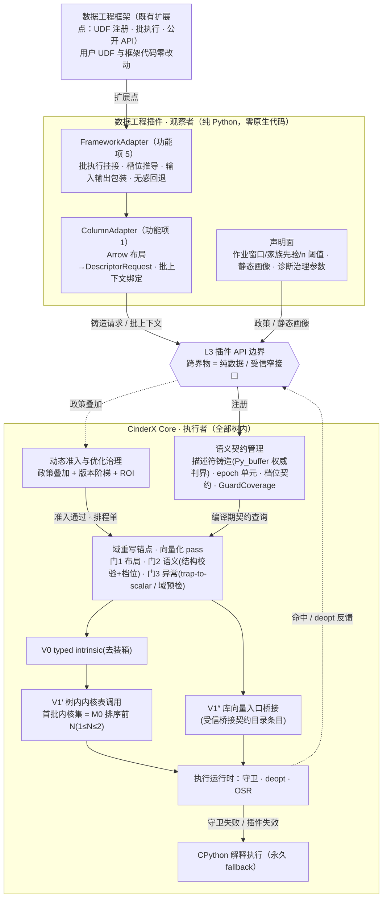
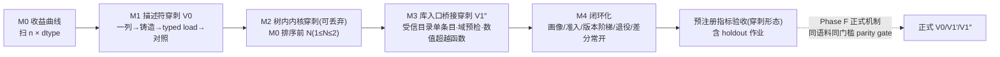

# 功能设计说明书 — CinderX 支持数据工程领域插件

## 产品版本&密级

| 项目 | 内容 |
| --- | --- |
| 产品/方案 | CinderX Runtime Core / 数据工程领域插件（L4 首个领域插件） |
| 文档版本 | 1.7 |
| 方案阶段 | 目标架构迁移路线 Phase C（垂直切片证伪）的领域侧承载 |
| 密级 | 内部技术设计 |
| 适用范围 | 数据工程领域插件的供给面（描述符铸造请求、schema epoch、政策与种子）与消费面切片（V0/V1′/V1″）及验收 |
| 事实基线 | CinderX 主线 `ba5ecb4d`（本文全部 file:line 锚点按该版本） |
| 上游文档 | 《【架构设计】CinderX 增强运行时》；《【功能设计】CinderX 支持插件化》（`docs/design/plugin-framework/`） |

## 拟制信息

| 项目 | 内容 |
| --- | --- |
| 拟制日期 | 2026-08-23 |
| 拟制方式 | 基于上游架构设计、插件化功能设计与 CinderX 主线代码形成 |
| 文档状态 | 待评审 |

## 修订记录

| 日期 | 版本 | 修改描述 |
|------|------|---------|
| 2026-08-23 | V1.0 | 初始版本 |
| 2026-08-24 | V1.1 | 同步插件化功能设计 V1.1：卸载语义改为停用分级（运行期停用 + 重启边界完整卸载）、wrap_entry 返回可撤销句柄；仓库路径前缀统一 |
| 2026-08-24 | V1.2 | 审校修复：DescriptorRequest 增补变长 utf8 offsets 双缓冲与绑定段（权威来源 = Core 自取 Py_buffer 元数据）；别名检测升级为跨视图指针区间重叠检测；V1″ 增加输入域写前预检（保持 Python 异常语义）；M2 改为可丢弃内核穿刺（正式 V1′ 随 Phase F parity gate 验收）；修正版本阶梯与 FunctionEntryCache 表述；定义批生命周期与参数绑定；首发列存引擎定为 Arrow；运行时目标收敛为 CPython 3.14；补齐预注册（热点占比/可服务覆盖率/数据安全）要求 |
| 2026-08-24 | V1.3 | 复审修复：描述符 schema 与上游架构文档同版冻结（utf8_layout/布局（含 bitpacked bool）/显式 null 极性二值——Arrow 为 0_is_null/非负下界/Arrow 逻辑 offset 换算/变长切片判界）；绑定权威分两层（Core 可验证层 + 受信供给差分兜底，不再宣称缓冲协议可证明列归属）；批级 handle 改为批上下文运行期绑定（编译期仅登记槽位 schema，产物不捕获 handle）；M2 内核集改为 M0 排序前 N、穿刺代码计入 B2 预算（消除与"Core 正式机制零改动"的矛盾）；预注册冻结时点提前至 M0 之前；穿刺收益标注为正式机制上界、Phase F parity 失败判定为假设被否决；ROI 退避表述对齐 code-object 级 uncompile/freeze；Arrow 不可变模型改用批绑定签名失效（非原地变异包装）并定义输出列"预分配缓冲→构造发布"写协议；种子遥测回路移出 Phase C；排除清单措辞消除"不降级"歧义 |
| 2026-08-24 | V1.4 | 终审修复：变长 offsets 增加首项非负（杜绝负地址通过判界）；位偏移与绝对行号绑定（data/validity 位偏移 = base_bit + element_offset 恒等式，防非零 slice 读错行）；BatchContext 定义为 Core 窄接口与传递 ABI（线程局部上下文栈：多线程隔离、递归/嵌套压栈弹栈）；Arrow 失效改为批绑定结构签名（不含对象身份与 generation，流式新批对象同结构不误判）；输出协议 deopt 分级（普通 deopt 跨恢复点写同一缓冲、仅异常逃逸作废发布）并增加发布门禁（全部槽位初始化 + 最终结构复核）；摘要/规格表极性残留清除（统一显式二值）；ChunkedArray/Table 按 chunk 拆分批窗口（适配器职责）；M0 增加进入 M1 的早期退出门；Phase C→G 门径明确以 Phase F parity 通过为前置；ROI 补充 FROZEN 后不自动重编译；SR 与图示同步范围收缩 |
| 2026-08-24 | V1.5 | 收口修复：BatchContext 同步进插件化 SPI 合同（铸造请求族三形态，随 SPI 版本化/命名空间归属/停用拒载）；release_batch 校验（线程一致/LIFO 栈顶/active/重复释放，不符拒绝弹栈）；发布门禁复用完整判界不变量组（含 offsets[last] 与位偏移绑定）；失败缓冲归还内存池前清零；Table 级共同窗口规划（多列 chunk 边界取交集）；M0 早退门覆盖零内核达标（V1′ 路径终止）；内核集上限 1 ≤ N ≤ 2；Phase F 增设正式化损耗余量门槛与第二阶段独立验证集；功能项 2 收敛为首版 Arrow 结构签名模式（可变引擎定义保留非首版，SR 标注）；摘要/概述/图示/影响点同步 |
| 2026-08-24 | V1.6 | 通过前修正：Table 级共同窗口算法更正为**累计 chunk 边界的有序并集**（等价实现：每轮取各列当前 chunk 终点最小值）——交集表述会遗漏单列边界使窗口跨 chunk；release 校验失败补栈恢复机制（失败不消耗栈、finally 重试、泄漏经生命周期表强制退役兜底）；发布缓冲可观察残留清零扩展到成功发布（padding/bitpacked 尾位/可观察尾部）；Phase F parity 明确绝对收益门槛与损耗比例门槛**双满足**；第二阶段 holdout 改为 M0 前与 Phase C holdout 同时选择封存；V1′ 零内核达标分支显式收缩 Phase F/G 产品承诺；总体方案图 V1′ 节点同步前 N 内核集 |
| 2026-08-24 | V1.7 | 补充 Framework Adapter：新增功能项 5（数据工程框架无感接入——三形态挂接合同：注册式装饰器/执行器/公开 API 包装，UDF 与框架代码零改动，fail-closed 回退与未安装插件等价；框架适配集随负载清单 M0 前冻结）；新增"注册内容与接入点清单"节——对上游架构与插件化文档预留接入点（L3 四类注册入口、适配面窄接口族、Core 消费机制）逐项实例化，含显式空注册与暂不调用项；总体方案图拆分框架适配/列翻译两层并同步签名模式标签 |

## Keywords 关键词

数据工程、UDF、列存、中立描述符、DescriptorRequest、validity 位图、null 语义、描述符铸造、typed intrinsic、树内内核表、utf8-classify、filter-mask、prefix-compare、向量化三道门、trap-to-scalar、档位契约、库向量入口桥接、schema epoch、构造式不变量、政策叠加、画像种子、版本阶梯

## Abstract 摘要

本文档设计 CinderX 的首个领域垂直插件——数据工程领域插件。数据工程作业（ETL/批处理）中的 UDF 以纯 Python 标量循环处理列存数据，每次迭代付下标装箱、null 判定与标量派发开销。本插件的供给分两通道：适配面把列存布局（数据缓冲 + 可选变长 offsets 索引 + null 位图）翻译成 `DescriptorRequest` 提交 Core 铸造中立描述符——容量权威来自 `Py_buffer`，以 checked arithmetic 按布局分组判界（data/validity/offsets 三视图分别判界，含位偏移—行偏移绑定），越界 fail-closed；批级 handle 经 BatchContext（Core 窄接口，线程局部上下文栈）运行期绑定；声明面供给准入政策（作业窗口、NumericLoop/字符串循环先验、n 阈值偏置）、静态画像数据与诊断治理参数。Core 侧消费全部树内：V0 阶段描述符 + typed 标量访问 intrinsic 去装箱；V1′ 阶段向量化 pass 在域重写锚点过三道门后把循环改写为树内内核调用（首批内核集按 M0 收益排序取前 N，1 ≤ N ≤ 2）；V1″ 阶段把数值列超越函数标量循环桥接到受信桥接契约目录条目的库公开向量入口（输入域写前预检保持异常语义）；归约默认保持顺序标量循环（Tier 3 不重排）；守卫失败 deopt 回原循环，schema 变更经批绑定结构签名（Arrow，首版）或 epoch 构造式失效（可变引擎，定义保留非首版）。功能域拆为五个功能项：① 列存布局翻译与描述符铸造请求；② schema 失效与作业窗口；③ UDF 标量循环向量化切片与验收（M0-M4，按预注册指标收口）；④ 准入政策与画像种子供给；⑤ Framework Adapter（数据工程框架无感接入——经框架既有扩展点挂接批执行与 UDF 注册，槽位 schema 从框架元数据推导，用户 UDF 与框架代码零改动，fail-closed 回退后与未安装插件等价）。插件实现为纯 Python 包、零原生代码；首发适配列存引擎为 Apache Arrow（pyarrow），目标运行时为 CPython 3.14（当前主线产品与 CI 支持集；3.12/3.15/3.11 待对应 co-build 线就绪后经 `runtime_abi` 协商开放）。

## List of abbreviations 缩略语清单

| 缩略语 | 英文全称 | 中文名 |
|--------|---------|--------|
| AutoJIT | Automatic JIT Admission | 动态准入 |
| DFX | Design for Excellence | 卓越设计（可靠性/性能/安全等） |
| dtype | Data Type | 数据类型（缓冲元素类型） |
| ETL | Extract-Transform-Load | 抽取-转换-加载 |
| FMEA | Failure Mode and Effects Analysis | 失效模式与影响分析 |
| HIR | High-level Intermediate Representation | 高层中间表示 |
| IC | Inline Cache | 内联缓存 |
| JIT | Just-in-Time Compilation | 即时编译 |
| LSB0 | Least Significant Bit 0 | 位序从最低有效位开始 |
| OSR | On-Stack Replacement | 栈上替换 |
| ROI | Return on Investment | 投入产出比 |
| SIMD | Single Instruction Multiple Data | 单指令多数据 |
| SR | Software Requirement | 软件（增量）需求 |
| TCB | Trusted Computing Base | 可信计算基 |
| UAF | Use-After-Free | 释放后使用（内存安全缺陷） |
| UDF | User-Defined Function | 用户自定义函数 |
| ulp | Unit in the Last Place | 末位单位（浮点误差度量） |

## 前言

本文档为 CinderX "支持数据工程领域插件"功能设计说明书，定义功能域划分、功能项实现方案、逻辑接口与 DFX 分析。

**设计文档层级说明**：本文档为功能设计（非详细设计），实现方案以伪代码、schema 与流程描述为主；逐行实现指导属于详细设计文档范畴。

**与上游文档的关系**：《【架构设计】CinderX 增强运行时》定义中立描述符（`Py_buffer` 容量权威与判界不变量）、向量化三道门、档位契约、V0/V1′/V1″/V2 四阶段、树内注册表与受信桥接契约目录等 Core 侧机制；《【功能设计】CinderX 支持插件化》定义本插件依赖的注册与编排接口（四类注册入口、三类窄接口、排程单、安全退役）。本文档定义**数据工程这一具体领域**如何使用这些机制：列存布局的描述符翻译、schema epoch 的构造式不变量、本域的守卫清单、模式集与落地切片（M0-M4）及验收口径。Core 侧机制不由本文修改。

**范围**：数据工程场景（列存引擎上的 UDF 标量循环；首发适配 Apache Arrow）的插件供给面与消费面切片；首版目标运行时 CPython 3.14（当前主线产品与 CI 支持集；其余版本待 co-build 线就绪后经 `runtime_abi` 协商开放）。

**非目标**：通用向量化引擎与 V2 向量晚 lower（按 V1′/V1″ 命中率与收益证据另行启动）；树内内核的 SIMD 实现细节（`cinderx/Jit/codegen/arch`，随 Core 数据面阶段交付）；受信桥接契约目录的签发与密钥管理；Arrow 之外列存引擎的适配（ColumnAdapter 扩展面，非首版范围）；Python list 输入（无缓冲协议，首版 fail-closed）。

---

# 功能域：CinderX 支持数据工程领域插件

## 功能域概述

### 问题：UDF 列存标量循环的逐元素装箱税

数据工程作业的标准形态是列存数据上的 UDF：清洗、分类、过滤、派生列、聚合。作业框架把列交给用户的 Python 函数逐元素处理：

```python
# 典型 ETL UDF：列存表上的标量循环
def tag_orders(status, note, amount, out_tag, out_mask):
    # status/note/amount 为列存引擎的列；out_tag/out_mask 为输出列
    for i in range(len(status)):
        if status[i] is None or note[i] is None:   # null 判定
            out_mask[i] = False
            continue
        out_tag[i] = classify_prefix(status[i])    # 前缀分类（utf8）
        out_mask[i] = amount[i] > 0                # 过滤掩码
```

每次迭代付出：下标访问的装箱/拆箱、`is None` 判定、标量函数派发、输出装箱。元素级开销在数百 ns 量级，而其中真正的计算（字节比较、数值比较）只占个位数 ns。现有解法要么要求用户改写代码（手写向量化、迁移到专用执行引擎），要么引入整条引擎链路。

### 解决方案：观察者化接入——列布局翻译 + 树内向量化

本插件不携带任何执行机制，只做两件事：

1. **适配面**：把框架私有列存布局（数据缓冲 + null 位图 + 列元数据）翻译成 `DescriptorRequest` 提交 Core 铸造中立描述符；把表结构变异路径包装到 epoch 上。
2. **声明面**：供给准入政策（作业窗口、循环家族先验、n 阈值偏置）、画像种子与诊断治理参数。

Core 侧消费全部树内：前端把描述符访问发射为 typed intrinsic（V0 去装箱），向量化 pass 在域重写锚点过三道门后改写为树内内核调用（V1′）或库公开向量入口调用（V1″，限受信桥接契约目录条目）；守卫失败 deopt 回原循环。**插件全程不供给变换代码、不携带原生二进制。**

### 目标形态

```python
# 原代码（见上）在域重写锚点改写后的语义（V1′，树内内核；null 语义由 validity 位图承载）
kinds  = utf8_classify(note)        # 树内内核：utf8 字节流分类
tags   = prefix_compare(status)     # 树内内核：前缀比较分类
mask0  = filter_mask(amount, gt0)   # 树内内核：数值比较→掩码
out_tag, out_mask = combine(tags, kinds, mask0,
                            validity_and(status, note))
# 归约类 UDF（sum/count）保持顺序标量循环（Tier 3 默认不重排）
```

改写由 Core 的树内规则在锚点完成，插件不可见；上图仅示意目标形态。null 语义（`is None` 短路）在向量化版本中由 validity 位图与掩码组合表达，输出列 null 极性与原循环一致。

### 核心概念

| 概念 | 本域实例化 |
|------|-----------|
| FrameworkAdapter | 框架适配层（插件包内纯 Python 模块）：挂接目标数据工程框架的 UDF 执行扩展点，负责批执行时机、槽位 schema 推导、输入输出包装与无感回退；每框架一个实现 |
| ColumnAdapter | 列翻译层：框架/Arrow 列对象 → `DescriptorRequest`（三视图定位、dtype/布局/极性映射、Table 级共同窗口规划）；每引擎一个实现（首发 Arrow） |
| 列（Column） | 列存引擎的列对象：数据缓冲 exporter（支持缓冲协议）+ 独立 null 位图 exporter + 列元数据（dtype/长度/列身份） |
| DescriptorRequest | {data exporter、element offset/count（非负、绝对行号）、dtype、utf8_layout、布局（byte/bitpacked）、访问模式、可选 offsets exporter、可选 data bit offset、可选 validity exporter + bit offset + LSB0、null 极性（显式二值）、绑定段}；offset/count 是不可信请求范围，容量权威是 `Py_buffer` |
| 有效性（validity） | 独立 exporter 的位图：LSB0 位序、null 极性为显式二值声明（1_is_null | 0_is_null，Arrow 为 0_is_null） |
| schema epoch | 表结构（列增删/类型变更/重绑）的失效时钟：变异路径引流过包装入口 → epoch 递增 → 关联产物 deopt |
| 作业窗口 | 框架初始化期不编译的准入窗口（政策叠加供给） |
| 版本阶梯 | 同一 UDF 的解释器版 → JIT 标量版（V0 生效）→ JIT+向量化版（V1′/V1″ 生效），逐级晋升由动态准入依据画像与 ROI 决定 |

### 能力范围与功能项划分

| 功能项 | 一句话边界 |
|--------|-----------|
| 功能项 1：列存布局翻译与描述符铸造请求 | 从框架列对象到通过 Core 判界的描述符 handle |
| 功能项 2：schema 失效与作业窗口 | 表结构失效双模式（首版 Arrow：批绑定结构签名；可变引擎：变异入口包装，定义保留非首版）与作业窗口 |
| 功能项 3：UDF 标量循环向量化切片与验收 | M0-M4 切片、守卫清单、差分对照与预注册指标收口 |
| 功能项 4：准入政策与画像种子供给 | 政策叠加与种子的本域取值（声明面） |
| 功能项 5：Framework Adapter（框架无感接入） | 从数据工程框架的既有扩展点到插件批执行闭环，UDF 与框架代码零改动 |

**首版排除清单**（命中即 fail-closed 拒绝该形态的加速，函数按原语义路径继续执行——解释器或未改写的原 HIR 编译；"不降级"指不再尝试其他加速形态，不是拒绝执行）：object/dictionary/decimal 等白名单外 dtype 列；列对象被子类覆写访问语义；非 C-contiguous 布局（strided/负 stride/间接视图）；可调整 exporter（pin 期间可 resize/搬迁内存的对象）；不支持缓冲协议的输入（如 Python list）；`utf8_layout` 与 offsets 携带情况不一致的请求（变长缺 offsets、bytestream 带 offsets）；循环体含副作用调用、对象身份比较、早退/break、跨迭代依赖；归约重排（Tier 3）。

## 功能域总体方案



**四个环节的现成支撑**（本域新增工作集中在契约内容与切片，机制全部复用基线与插件化功能项）：

| 环节 | 需要什么 | 基线已有 |
|------|---------|---------|
| 模式识别 | 循环携带 Phi 依赖分析、纯循环体判定 | FloatAccumulatorPromotion（同族 Phi 模式识别先例，fork `3018ab4c`）、TreeIterStateMachinePass（整段 HIR 重写先例，`b37aaaf8`→`f0c0e4d0`）、behavior_classifier 的 `Family::NumericLoop`（`cinderx/Jit/behavior_classifier.h:15`，数组/数值类循环准入信号） |
| 身份/类型保障 | 列对象身份、exact dtype、null 策略 | `LoadModuleAttrCache`/`GlobalCache`（属性身份缓存）、`GuardIs`/`GuardType`、UseType |
| 兜底 | 守卫失败/异常回原语义 | 三层 deopt 漏斗 + DeoptPatchpoint；守卫失败重执行当前指令的恢复点语义 |
| 治理 | 变换错了自动退避 | ROI backoff 直接复用（`config.h` `roi_backoff_*`：预算翻倍、max_rounds、rewarm、FROZEN）——dtype 在 float32/64 间摇摆导致守卫频繁失败 → deopt 计数超预算 → uncompile → 重编译 → 冻结 |
| 编译期约束 | 解析列元数据不乱跑 Python | preload 契约（编译期唯一可执行 Python 的阶段，`Preloader::make`） |

另：`FunctionEntryCache`（间接入口指针，重编译后自动切换，`cinderx/Jit/context.cpp:190-226`）是**单入口间接切换层**——为"重编译完成后新产物原子生效"提供机制；同一 UDF 的版本阶梯在本切片中实现为"同一时刻仅一个激活产物，级间迁移经 deopt/重编译闭环完成"，多产物并存属 Core 编译产物管理的目标态演进（架构 Guarded Multi-versioning 模式），不在本切片承诺。

### 注册内容与接入点清单（对上游合同的实例化）

上游架构设计与插件化功能设计预留的接入点，由本插件按下表实例化——"注册了什么、调用了什么"逐项可对账；显式列出**空注册**与**暂不调用**项，避免实现者自行猜测。

**声明面注册（L3 四类注册入口）**：

| 上游接入点 | 本插件登记内容 | 备注 |
|-----------|--------------|------|
| 插件描述（Manifest） | `id`（cinderx-plugin-dataeng）、`spi_version`、`runtime_abi`（CPython 3.14 + SOABI + Core build-id + CPU 能力）、`target_capabilities`（dataplane-v0 等原子能力组）、`adapter` 入口声明（FrameworkAdapter/ColumnAdapter 模块） | 阶段一登记，零代码执行 |
| 契约（provides.contracts） | ① 槽位 schema 声明（UDF 形参序号、dtype、布局、访问模式——由 FrameworkAdapter 从框架注册元数据推导后登记）；② 结构签名假设（Arrow 模式的列集/类型/布局/极性）；③ 档位请求（Tier 1 默认；Tier 2 引用部署方授权，只请求不授权）；④ V1″ 运行时绑定对（入口身份 + 制品指纹 → 受信桥接契约目录条目 id，纯数据） | GuardCoverage 记账，发布门禁 |
| 准入策略（provides.policies + seeds + diagnostics） | NumericLoop/字符串家族先验、作业窗口（框架初始化期不编译）、n 阈值偏置（M0 标定静态值）、命名空间配额；静态画像数据（部署方提供）；诊断治理参数（按命名空间计数开关） | 只偏置不裁定 |
| Pass（provides.pass） | **空注册**——数据面改写由 Core 树内规则与向量化 pass 承担，本域无 pass 启用/配置条目 | 显式空，合同的一部分 |

**适配面调用（窄接口族，按调用频次）**：

| 上游接口 | 本插件调用点 | 频次/时机 |
|---------|------------|----------|
| `request_descriptor(DescriptorRequest)` | ColumnAdapter 每批每列铸造（三视图原子提交，含绑定段） | 每批 × 每参与列 |
| `bind_batch(slots, handles)` / `release_batch(ctx)` | FrameworkAdapter 批钩子的进入/退出（finally） | 每批各一次（嵌套压栈） |
| `register_epoch(key)` / `bump(epoch)` | **首版不调用**（Arrow 结构签名模式不需要） | 可变引擎接入时启用 |
| `wrap_entry(obj, attr, on_change)` | **首版不调用**（Arrow 无原地变异路径） | 可变引擎接入时启用 |
| 适配器生命周期 `activate(ctx)` / `deactivate()` | 框架适配模块导入后由 Core 调用；activate 内完成槽位 schema/结构签名/政策登记 | 每进程一次（幂等） |

**消费的 Core 机制（插件被作用，不注册不调用）**：域重写锚点与三道门、档位契约（部署方授权面）、受信桥接契约目录（条目引用）、GuardCoverage 发布门禁、AutoJIT/ROI 闭环、安全退役状态机、诊断旁路。

**框架侧扩展点（非 Core 接入点，FrameworkAdapter 挂接对象）**：UDF 注册/装饰器入口、批执行/执行器扩展点、公开 map/apply 类 API——三形态挂接合同见功能项 5。

## 功能域规格设计

| 规格项 | 规格 |
|--------|------|
| 模式集（首版） | 连续列缓冲上的 map（数值/utf8 变换）、filter 掩码、classify 分类、前缀比较；条件映射（掩码选择）；归约（sum/count/max/min）的逐元素部分向量化、归约保持顺序标量循环 |
| null 语义 | validity 位图 LSB0；null 极性按请求显式声明（1_is_null | 0_is_null，Arrow 为 0_is_null）；向量化版本与标量循环的 null 传播、输出 null 极性一致；trap-to-scalar 重放含 null 语义 |
| 档位默认 | Tier 1（位精确算术）默认允许；Tier 2（超越函数末位误差）需部署方档位契约显式开启；Tier 3（归约重排）默认不向量化归约 |
| 排除清单 | 见"能力范围"节首版排除清单，命中即 fail-closed 不向量化（函数按原 HIR 继续编译） |
| 失效 | schema epoch 递增 / 列重绑 generation 变化 → 关联产物 deopt；插件停用走安全退役（运行期停用，完整卸载在重启边界，见插件化功能设计） |
| 验收口径 | 预注册指标（功能项 3）；差分对照 0 失败为一票否决项 |
| 运行时 | CPython 3.14（当前主线产品与 CI 支持集）；3.12/3.15/3.11 待对应 co-build 线就绪后经 `runtime_abi` 协商开放 |

## 核心契约：描述符请求与失效

本节定义全部功能项共享的请求字段与判界/失效语义（架构文档"中立描述符"节的本域实例化），各功能项引用本节。

### DescriptorRequest（冻结，与上游架构文档"中立描述符"节同版定义）

```text
DescriptorRequest {
  data_exporter        # 列数据缓冲对象（支持缓冲协议）
  element_offset       # 子区间起始元素，>= 0（不可信请求范围；为缓冲内绝对行号，
                       #   适配器负责换算源对象自身逻辑 offset，如 Arrow Array.offset）
  element_count        # 元素数，>= 0（不可信请求范围）
  dtype                # 白名单：utf8 / f8 / i8 / i4 / bool（首版集合）
  utf8_layout          # varlen（变长，须携带 offsets）| bytestream（单字节流）；
                       #   显式字段，仅 dtype=utf8 时有效
  layout               # byte（定宽字节 / 字节流）| bitpacked（bool 按位打包）
  data_bit_offset?     # bitpacked 布局的位内起始偏移，>= 0（须满足位偏移—行偏移绑定不变量）
  data_base_bit?       # bitpacked 位图在绑定快照中的缓冲内起始位（Arrow 恒 0）
  access               # read | write（write 追加 PyBUF_WRITABLE）
  offsets_exporter?    # varlen 的元素偏移索引缓冲（i4/i8；视图须覆盖
                       #   [element_offset, element_offset+count] 共 count+1 项，全项非负）
  validity_exporter?   # 独立 null 位图对象（同样走缓冲协议；全有效列可缺省）
  validity_bit_offset? # 位图内起始位，>= 0（须满足位偏移—行偏移绑定不变量）
  validity_base_bit?   # validity 位图在绑定快照中的缓冲内起始位（Arrow 恒 0）
  bit_order            # LSB0（首版冻结）
  null_polarity        # 显式二值：1_is_null | 0_is_null——适配器按源引擎极性声明，
                       #   Core 按声明解释位图（Arrow 为 0_is_null：1=有效、0=null）
  binding{             # 绑定段：三视图与列对象的一次受检快照（见"语义绑定校验"）
    column_snapshot    #   列对象自身只读属性快照（type/length/offset/null_count）
    expected{dtype, length, column_identity}
  }
}
```

铸造 API 不接受裸指针；不支持缓冲协议的对象 fail-closed（无指针兜底路径）；dtype `format` 解析失败或不在白名单即拒绝。三视图（data/offsets/validity）必须在同一次请求中**原子提交**，不允许分次拼装。变长 utf8 列的唯一表达方式是 `utf8_layout=varlen` + offsets（元素 = `data[offsets[i] : offsets[i+1]]`），不允许定长近似；bool 列按 Arrow 物理布局以 `layout=bitpacked` 表达。

### 判界与所有权不变量（Core 铸造侧，与上游架构文档同版）

```text
# 定宽（layout=byte，itemsize = dtype 宽度；offset_bytes = element_offset × itemsize）
offset_bytes + element_count * itemsize <= data_view.len
# 按位打包（layout=bitpacked）
data_bit_offset + element_count <= data_view.len * 8
# 变长 utf8（utf8_layout=varlen，o_itemsize = offsets 元素宽度）
element_offset + element_count + 1 <= offsets_view.len / o_itemsize
offsets[element_offset] >= 0
offsets[element_offset + element_count] <= data_view.len
# validity
validity_bit_offset + element_count <= validity_view.len * 8
# 位偏移—行偏移绑定（bitpacked 与 validity）
data_bit_offset == data_base_bit + element_offset
validity_bit_offset == validity_base_bit + element_offset
```

全部下界非负（`element_offset/element_count/validity_bit_offset/data_bit_offset/data_base_bit/validity_base_bit >= 0`）；varlen 的切片段 `[element_offset, element_offset+element_count]` 单调非减且**首项非负**——首项非负 + 单调 ⇒ 全段非负，杜绝 `[-8, -4, 0]` 类负地址通过判界；乘加全程溢出检查；容量权威为 `PyObject_GetBuffer` 取得的 `Py_buffer.len`，buffer flags 读访问 `PyBUF_FORMAT | PyBUF_C_CONTIGUOUS`、写访问追加 `PyBUF_WRITABLE`；data/validity/offsets 三视图分别判界，任一失败 fail-closed。

**位偏移不是独立自由值**：bitpacked 与 validity 的位偏移必须与同一绝对行号一致平移——`data_base_bit/validity_base_bit` 为位图缓冲在绑定快照中声明的起始位（Arrow 恒 0：位图缓冲不因 slice 搬移，逻辑位移由 `element_offset` 承载）。绑定恒等式不成立按 `binding` 拒绝——防止非零 slice 判界通过却读取另一行的 bool 值或 null 状态。

**别名不变量**：Core 记录每个 pin 视图的指针区间 `[base, base+len)`（data/validity/offsets 全部）。同一执行作用域内，访问模式不相容（read↔write、write↔write）的两个视图指针区间重叠 → fail-closed 拒绝向量化——不同对象可对应重叠缓冲区，Python 层 `is not` 身份比较不是别名充分条件，重叠检测只能在 Core 侧基于指针区间完成。

handle 持有 `Py_buffer`（最终释放即 `PyBuffer_Release`）引用保活；**可调整 exporter（pin 期间可 resize/搬迁内存的对象）一律排除**。handle 带 generation；exporter 结构变更（重绑/列删除）递增 generation 使旧 handle 失效。铸造期全部验证记录进入 GuardCoverage，是向量化产物发布的硬门禁。

### 语义绑定校验

缓冲协议只暴露指针与长度（PyArrow Buffer 即如此），既不能证明"三个缓冲属于同一列"，也不能证明列的逻辑属性（dtype、列位置）。绑定正确性分两层处理：

- **Core 可独立验证层（铸造期硬门禁）**：三视图同次原子提交，Core 记录统一绑定 id 与 generation；请求携带的列对象只读属性快照（type/length/offset/null_count）与 Core 自行取得的各视图 `Py_buffer` 元数据（format/itemsize/len）交叉一致——由快照 length/offset 与 element_offset/count 推出的各视图需求长度必须 ≤ 实际视图长度，dtype 声明与 format 一致；任一不符按 `binding` 拒绝。
- **不可独立验证层（受信供给 + 差分兜底）**：三缓冲与列对象的归属关系、属性快照的真实性，超出缓冲协议可验证范围——由适配器受信地位承载（同进程进程 TCB，供应链经插件化功能项 1 双闭包管理），并以 oracle 差分对照兜底：首批绑定全量对照，此后按差分 harness 常态抽样；差分失败即永久禁用该绑定形态并审计上报。

### 批上下文与运行期绑定（BatchContext ABI）

批级 handle 不进入任何静态契约：编译期只登记**槽位 schema**（形参序号、dtype、布局、访问模式）与结构假设，JIT 产物按"形参 → 槽位"编译，**不捕获任何 handle**。运行期传递 ABI：

- **Core 侧对象**：`bind_batch` 是 Core 提供的窄接口（铸造请求族的运行期形态），返回 opaque `BatchContext` 并登记"槽位 → handle"映射；**何时调用**（批执行钩子，由 FrameworkAdapter 挂接框架扩展点，见功能项 5）是插件侧职责，上下文本身由 Core 创建、持有、释放。
- **传递与隔离**：Core 维护**线程局部批上下文栈**——每线程独立（多线程 worker 各自绑定，互不可见）；UDF 内递归/嵌套调用再次 `bind_batch` 时压栈、`release_batch` 弹栈，内层调用读内层上下文、外层不受影响；JIT 入口守卫与 typed intrinsic 一律读**当前线程栈顶**上下文完成槽位校验与访问。
- **入口校验**：JIT 入口守卫逐槽校验栈顶上下文的 dtype/布局/结构签名与编译假设一致，不符 deopt 回解释器（原语义）。
- **释放校验与栈恢复**：`release_batch` 校验调用线程 == `bind_batch` 线程、ctx 为当前线程**栈顶**（LIFO）、状态 active 且未重复释放——任一不符**拒绝弹栈**并审计（不释放仍在执行的 handle；错误弹栈的缓冲随真实栈顶上下文正常释放）。**栈恢复机制**：校验失败的 release 不消耗栈；批钩子的 finally 对目标 ctx 重试释放直至成功；适配器缺陷导致的连续失败由生命周期表兜底——泄漏的 active 上下文经批超时/泄漏检测强制退役并审计（有界，不永久滞留）。插件停用后 `bind_batch` 拒载返回错误（不创建上下文），栈内存量上下文按停用流程失效。
- **生命周期**：handle 生命周期 = 批上下文；`release_batch`（finally 语义）统一经退役路径释放；批上下文跨普通 deopt 保活至批结束（见输出列写协议），无跨批捕获、无每批重编译。

---

## 功能项 1：列存布局翻译与描述符铸造请求

### 功能概述

**目标用户/系统**：数据工程平台集成者（把本插件适配到具体列存引擎）与 Core 数据面铸造 API。

**输入/输出**：输入 = 框架列对象（数据缓冲 + null 位图 + 列元数据）；输出 = 通过 Core 判界与绑定校验的中立描述符 handle（typed intrinsic 可消费）。

**核心能力**：列对象到 `DescriptorRequest` 的翻译规则、批次切片（element offset/count）、dtype 白名单映射、validity 位图绑定。

**约束**：请求字段按"核心契约"节冻结；适配器属进程 TCB，只经 `request_descriptor` 窄接口进入。

**收益**：框架私有布局的翻译留在插件侧，Core 不认识任何框架私有布局。

**主要风险**：错列绑定（稳定地错）——由语义绑定校验 + oracle 抽查封堵。

### 实现思路

适配器为每类列存引擎实现一个 ColumnAdapter：从列对象定位数据缓冲 exporter、变长列的 offsets exporter 与 null 位图 exporter（框架结构性保证的字段/属性），映射 dtype（框架类型 → 白名单五类），按批处理窗口切片（element_offset/element_count），构造 `DescriptorRequest` 提交 Core。Core 侧完成判界、别名检测、pin、generation 分配与语义绑定交叉校验（机制属 Core 数据面，随架构 Phase F/B2 交付；本功能项定义插件侧契约与翻译规则）。

**首发适配对象定为 Apache Arrow（pyarrow，钉大版本）**：列存中立事实标准、原生暴露缓冲协议、内置 validity 位图与变长列 offsets 布局（与冻结请求字段一一对应）、被主流数据工程框架作为底层格式——描述符契约、真实作业语料与性能目标以此为共同锚点。

### 模块调用关系

```text
UDF 批处理钩子（适配器胶水，挂在框架自身的批执行扩展点；每批）
  → ColumnAdapter.translate(column, batch_window)（逐参与列）
      → 定位 data/offsets/validity 三视图（一次受检快照，随请求原子提交）
      → dtype/布局/极性映射（白名单外 → 拒绝翻译，不铸造）
      → 构造 DescriptorRequest（含绑定段；element_offset 含 Arrow 逻辑 offset 换算）
  → request_descriptor(req)（逐列）
  → Core 铸造：GetBuffer → 分布局判界 → 别名检测 → 绑定校验（快照 × 自取元数据）
      → pin → generation → NeutralDescriptor handle（失败 MintError，fail-closed）
  → bind_batch(slot_schema, handles)：槽位 → handle 压入线程局部批上下文栈
  → 调用 UDF（JIT 入口守卫读栈顶逐槽校验 dtype/布局/结构签名，不符 deopt 回解释器；
    递归/嵌套调用压内层栈，多线程各持独立栈）
  → 批结束（正常或异常，finally）→ release_batch(ctx)（弹栈并统一经退役路径释放）
```

### 实现设计

#### 翻译规则表（首发对象：Apache Arrow / pyarrow，钉大版本）

| Arrow 列类型 | dtype / 布局映射 | offsets 来源 | validity 来源 | null 极性声明 |
|-----------|-----------|-------------|--------------|--------------|
| string/large_string（utf8 变长） | utf8 / varlen | value_offsets 缓冲（i4/i8） | validity 位图（全有效可缺省） | 0_is_null（Arrow 规范 1=有效、0=null） |
| binary / 单字节流 | utf8 / bytestream | — | — | — |
| float64 列 | f8 / byte | — | validity 位图（全有效可缺省） | 0_is_null |
| int64/int32 列 | i8 / i4，byte | — | validity 位图（全有效可缺省） | 0_is_null |
| bool 列 | bool / **bitpacked**（Arrow 按位打包，字节 itemsize 判界不适用） | — | validity 位图 | 0_is_null |
| null/object/dictionary/decimal 等其他类型 | — | — | — | 拒绝翻译（fail-closed，不铸造） |

Arrow 换算规则：`element_offset` = Arrow Array 自身逻辑 `offset` + 批内起始行（绝对行号，适配器负责换算）；validity 位图可整体缺省（Arrow 全有效数组省略位图），缺省即全有效，不要求补造。

#### 批生命周期与运行期绑定

- **编译期（静态契约）**：只登记槽位 schema（形参序号、dtype、布局、访问模式）与 schema 假设（epoch）；JIT 产物按"形参 → 槽位"编译，不捕获任何 handle（见"核心契约"节"批上下文与运行期绑定"）。
- **调用时机**：FrameworkAdapter（功能项 5）把铸造/绑定/释放挂在目标框架的批执行扩展点上；窗口按框架批大小切分为 `[offset, offset+count)`，`element_offset` 含 Arrow Array 逻辑 offset 换算（绝对行号）。
- **ChunkedArray/Table 拆分**：Table 列为一个或多个 chunk（ChunkedArray）——多列 UDF 的各列 chunk 边界可能不同，适配器做 **Table 级共同窗口规划**：以全部参与列累计 chunk 边界的**有序并集**切分共同窗口（等价实现：每轮窗口终点 = 各列当前 chunk 终点的最小值），保证每个窗口在每一列上都完整落在单一 chunk 内；单列 UDF 退化为该列自身 chunk 边界。窗口规划是适配器职责，Core 不认识 chunk。
- **运行期绑定**：每批 `bind_batch` 将"槽位 → handle"映射压入线程局部批上下文栈；JIT 入口守卫逐槽校验栈顶上下文的 dtype/布局/结构签名，不符 deopt——无跨批捕获、无每批重编译，递归/嵌套与多线程按栈隔离。
- **释放**：批结束（正常返回**或异常路径**）在 finally 语义下 `release_batch` 统一经退役路径释放，释放不依赖 UDF 正常返回。
- **空批**：element_count=0 直接跳过铸造与执行。

#### 语义绑定

绑定段（列对象属性快照 + expected）随请求原子提交三视图；权威分层与差分兜底见"核心契约"节——Core 可验证层交叉一致方可铸造，归属关系由适配器受信地位与 oracle 差分兜底。

#### 输出列写协议（Arrow Array 不可变）

不存在对既有 Array 的原地写。协议：适配器预分配可写缓冲（`pa.allocate_buffer` 族）→ write handle 指向该缓冲，批内写入 → 批成功后适配器从缓冲构造 Array 发布（`pa.Array.from_buffers` 族）。缓冲经适配器的**输出包装对象**暴露给框架与 UDF（`__setitem__` 路由到缓冲），因此输出目标跨执行形态稳定。

**缓冲生命周期与 deopt 分级**：输出缓冲由批上下文持有，**跨普通 deopt 保活**——守卫/档位类 deopt 从恢复点继续执行，解释器续跑经输出包装对象仍写入**同一缓冲**，批末统一过发布门禁；**异常逃逸**判批失败，缓冲保活至批末 `release_batch` 后丢弃。即"丢弃"的是发布行为而非提前释放——不存在悬挂句柄路径。失败缓冲归还内存池前须**清零（或标记敏感不可复用）**——输出可能承载业务敏感数据，清零成本计入批失败路径预算。

**发布门禁**：仅当①整批完成且**全部输出槽位已初始化**（无未写区）②**最终结构复核**通过才构造 Array 发布；结构复核**复用完整描述符判界不变量组对输出缓冲按发布形态重验**——含 varlen `offsets[last] <= data_view.len` 与首项非负、位偏移—行偏移绑定恒等式、各视图长度一致、validity 覆盖完整；③发布前对**可观察残留清零**——padding 字节、bitpacked 尾部位与缓冲可观察尾部（成功发布的缓冲同样清零，防止跨批信息残留）。任一不满足按批失败处理（缓冲清零丢弃、诊断上报）。别名检测覆盖"输出缓冲与输入视图指针区间重叠"。

### 增量 SR 清单

| SR 编号 | 描述 |
|---------|------|
| SR-DE-001 | 适配器应按冻结的 DescriptorRequest 字段（含 utf8_layout、布局（byte/bitpacked）、显式 null 极性二值、绑定段）构造铸造请求，且不接受裸指针路径 |
| SR-DE-002 | dtype 白名单外的列应拒绝翻译（fail-closed），不进入铸造；varlen utf8 必须携带 offsets，bool 必须按 bitpacked 布局声明 |
| SR-DE-003 | 应按布局分别判界（定宽/bitpacked/varlen/validity 四组不等式，含非负下界、Arrow 逻辑 offset 换算与切片内 offsets 单调性），任一失败拒绝该描述符并降级为不向量化 |
| SR-DE-004 | handle 应 pin 所有者并排除可调整 exporter；访问模式不相容的视图指针区间重叠应被检测并拒绝向量化 |
| SR-DE-005 | 三视图应同次原子提交；Core 可验证层（属性快照 × 自取 Py_buffer 元数据交叉）不一致应拒绝；不可验证层（缓冲归属）应以首批全量 + 常态抽样 oracle 差分兜底，差分失败永久禁用该绑定形态 |
| SR-DE-006 | 编译期只应登记槽位 schema 且产物不捕获 handle；批级 handle 应经批上下文运行期绑定（入口守卫逐槽校验），批结束（正常或异常路径）统一经退役路径释放 |
| SR-DE-007 | 输出列应按"预分配可写缓冲 → 批内写入 → 成功后构造发布、失败丢弃"协议写入，不得对不可变 Array 原地写 |

### 实现接口设计

#### 实现接口定义

```python
# 插件侧：ColumnAdapter（每引擎一个实现，首发 Apache Arrow）
class ColumnAdapter:
    def translate(self, column, window: BatchWindow) -> DescriptorRequest | Skip: ...

# 批上下文（Core 窄接口，铸造请求族的运行期形态；见"核心契约"节 BatchContext ABI）
def bind_batch(slots: SlotSchema, handles: dict[slot, NeutralDescriptor]) -> BatchContext: ...
    # 压入线程局部批上下文栈（嵌套/递归压栈，多线程隔离）；
    # JIT 入口守卫读栈顶逐槽校验 dtype/布局/结构签名
def release_batch(ctx: BatchContext) -> None:
    """弹栈并统一释放（finally 语义，经退役路径）。"""

# Core 侧窄接口（插件化功能设计"核心契约"节）
def request_descriptor(req: DescriptorRequest) -> NeutralDescriptor | MintError: ...
```

### 功能规格设计

| 规格项 | 规格 |
|--------|------|
| 字段冻结 | 请求字段（含 offsets/绑定段）/位序/null 极性/白名单按核心契约节；扩展需 schema 版本演进 |
| 失败语义 | MintError 携带原因枚举（`bounds`/`offsets`/`format`/`contiguity`/`alias`/`resizable`/`binding`），该描述符降级不向量化，进程继续 |
| 生命周期 | handle 生命周期 = 批生命周期；释放走安全退役（不直接 free） |
| 确定性 | 同一列对象 + 同一窗口的请求字段确定（可重放） |

### DFX 分析

#### 可靠性分析

##### FMEA 分析

| 失效模式 | 影响 | 原因 | 检测手段 | 补偿措施 |
|---------|------|------|---------|---------|
| 请求范围越界 | 原生越界访问 | 适配器 offset/count 错或漏算 Arrow 逻辑 offset | 分布局判界 + 绝对行号约定 | fail-closed 拒绝铸造（发布硬门禁） |
| offsets 非单调/终项越界 | 变长元素切分越界 | offsets 缓冲翻译错 | 切片段单调性与终项判界 | fail-closed 拒绝铸造 |
| 极性声明与源引擎相反 | null 语义反转 | 极性字段声明错 | 显式二值声明（Arrow=0_is_null）+ 差分 null 用例 | 差分 0 失败验收 |
| 错列/错 null 策略稳定错 | 静默数据错误 | 绑定段错或缓冲归属错 | 可验证层交叉 + 首批全量/常态抽样差分 | 拒绝铸造 / 永久禁用该绑定形态 |
| 不同对象对应重叠缓冲 | "先算后写"与逐元素读写结果分叉 | Python 身份比较不充分 | 跨视图指针区间重叠检测 | fail-closed 拒绝向量化（回标量路径） |
| validity 位图位序错 | null 语义反转 | 翻译错 | 首版冻结 LSB0 + 差分对照含 null 用例 | 差分 0 失败验收 |
| pin 期间缓冲搬迁 | UAF | 可调整 exporter | exporter 能力探测 | 可调整 exporter 一律排除 |
| 跨批悬挂 handle | UAF/过期访问 | handle 被静态契约捕获 | 产物不捕获 handle 的设计断言 | 批上下文运行期绑定 + 入口守卫 |
| 批内异常后 handle 滞留 | 内存增长/泄漏 | 释放依赖正常返回 | finally 语义断言测试 | 异常路径统一退役释放 |
| 对不可变 Array 原地写 | 框架不变量破坏 | 写路径协议违背 | 输出写协议 Contract Tests | 预分配缓冲 + 构造发布，失败丢弃 |

#### 可服务性分析

- MintError 原因枚举与铸造计数（成功/失败按原因）进诊断，按插件命名空间聚合。
- 差分抽查结果可导出（对照样本与差异定位）。

#### 安全设计检查

##### 安全设计确认

描述符只能经 Core 铸造：容量权威来自 `Py_buffer` 而非插件自报，插件无法伪称越界容量；越界/UAF 类缺陷的目标为 0（AR-06）。适配器属进程 TCB（供应链由插件化功能项 1 双闭包管理），但其一切供给仍经判界验证。

##### 敏感操作检查

输出缓冲与差分样本可能承载业务敏感数据：失败缓冲归还内存池前清零（见输出列写协议）；差分样本导出按功能项 3 数据安全要求执行。无文件/网络/凭证面。

#### 可用性/性能分析

铸造成本分层：GetBuffer + 定宽判界 + pin + 绑定可验证层交叉为 O(1)（与批大小无关）；varlen 的切片段单调性与终项校验为 O(count) 的定宽索引扫描（i4/i8，自身可向量化），摊销到每元素远低于被替换的标量派发开销——性能预算按"每元素铸造摊销 < 标量派发开销的 1%"验收（M0 一并实测）。oracle 差分抽查仅首批全量与抽样执行，不进稳态热路径。

### 影响点列表

| 模块 | 文件 | 影响描述 |
|------|------|---------|
| 插件包 | 各领域插件仓库 `adapter/columns.py`（新建） | ColumnAdapter 实现与 dtype 映射表 |
| Core 数据面 | `cinderx/Jit/dataplane/`（随架构 Phase F/B2 交付） | 铸造 API：GetBuffer、判界、pin、generation、绑定校验 |
| 契约面 | `cinderx/Jit/contracts/`（插件化功能项 2 最小面） | 铸造记录进 GuardCoverage |

### 分配需求

| 需求编号 | 描述 |
|---------|------|
| REQ-DE-001 | 框架私有列布局应能在插件侧翻译为冻结格式的铸造请求，由 Core 以 Py_buffer 权威判界后发放描述符 |

（对应架构 AR-06 向量化合法性三道门之布局门前置。）

---

## 功能项 2：schema 失效与作业窗口

### 功能概述

**目标用户/系统**：数据工程平台集成者与 Core 契约系统（epoch 单元）。

**输入/输出**：输入 = 表结构事件（可变引擎：变异事件——列增删/类型变更/重绑/drop；Arrow：批绑定时的结构快照）；输出 = 关联产物失效（deopt + 重编译/放弃）。

**核心能力**：表结构失效的双模式——Arrow 模式（首版实现）：批绑定**结构签名**读时校验；可变引擎模式（定义保留、非首版实现）：把表结构变异路径引流过包装入口并递增 epoch。另含作业窗口（框架初始化期不编译）。

**约束**：首版切片只实现 Arrow 结构签名模式；可变引擎模式（epoch 递增/变异包装/风暴抑制）为后续引擎接入时启用，不在首版交付。epoch 递增受速率上限与失效合并约束（插件化功能项 2）；对普通 dict 场景 Core 的 dict watcher 是零成本通道，本域不重复建设。

**收益**：编译产物依赖的 schema 假设（列存在、dtype、布局）失效即撤，语义无损。

**主要风险**：可变引擎模式下的变异路径覆盖不全（漏递增 → 产物读过期 schema）；Arrow 模式下的签名粒度失配（过细 → 误判失效）；epoch 风暴（DDL 密集作业，可变引擎模式）。

### 实现思路

**构造优于检测**：不判断 schema 是否不变，而是把目标表对象的全部变异路径引流过仪表化入口——包装框架结构性保证必经的变异 API（addColumn/dropColumn/alterType/rebind 等），入口递增 epoch。产物在入口/循环守卫读 epoch（比较 (单元身份, generation)），不等则 deopt。"声明者（插件）+ 验证者（守卫/watcher）+ 失效动作（deopt/重编译）"三方闭环。**变异入口包装适用于可变对象模型**（源引擎原地变更表的场景）。

**Arrow 模式（首发）：批绑定结构签名**。Arrow Table/Array 不可变——列增删返回新对象，不存在原地变异路径可包装；且流式作业每批通常创建**新的不可变 Array 对象**，对象身份与 generation 每批皆变。失效源改为**结构签名读时校验**：签名只含 schema 级内容（列名、类型、dtype、布局、极性），**不含对象身份与 generation**——结构相同的新批次对象签名匹配、不 deopt；generation 守卫只对"跨批稳定复用的 exporter 对象"参与（同对象自身结构变化时失效）。每批 `bind_batch` 时 Core 计算列集结构签名并与编译期槽位假设比对，不符即 deopt——签名比对复用入口守卫（每批一次 O(列数) 比较），无需变异包装。可变引擎接入时再启用变异入口包装，两种模式互斥声明。

**作业窗口**：框架初始化阶段（注册 UDF、建表、读配置）不该触发编译——政策叠加供给窗口声明，AutoJIT 在窗口内延迟准入（复用基线 import/startup 阶段检测与 setup provider 机制的注册式化形态，`autojit_import.cpp`、`cinderx/PythonLib/_cinderx_auto.py:48-77`）。

### 模块调用关系

```text
可变引擎模式：
框架变异 API（addColumn/dropColumn/alterType/rebind）
  → wrap_entry 包装（安装期替换/代理）
  → bump(epoch)                       # 原子递增，速率受限
  → 产物守卫读 epoch ≠ 编译期值 → deopt
  → 动态准入与优化治理：deopt 事件 → ROI 评估（重编译收窄或退避）

Arrow 模式（不可变对象模型）：
每批 bind_batch → Core 计算列集结构签名（列名/类型/dtype/布局/极性，不含对象身份与 generation）
  → 签名 ≠ 编译期槽位假设 → deopt（读时校验，无变异包装）
  → 流式新批对象同结构 → 签名匹配，正常执行（不因换对象 deopt）

UDF 批处理启动
  → 适配器安装失效通道（按引擎模式二选一）+ 声明作业窗口（政策叠加）
  → 窗口内：解释执行 + 观察（不编译）
  → 窗口结束：按热度与政策进入版本阶梯
```

### 实现设计

#### epoch 声明与失效绑定

```text
EpochDeclaration {           # 随 provides.contracts 登记
  key: "{plugin_id}:schema:{table_kind}"
  scope: table_object_identity
  consumers: [产物依赖集（Core 记录）]   # 产物→契约依赖映射
}
# 变异包装触发 bump；递增使全部 consumer 产物失效（走安全退役）
```

#### 变异入口覆盖清单（可变引擎模式）

适配器实现时必须枚举该引擎表对象的全部结构变异路径并逐个包装；覆盖清单进入插件 Contract Tests（清单外路径存在即测试失败）。列数据**内容**变更不递增 schema epoch（数据缓冲内容不影响布局假设；写路径由描述符访问模式与守卫覆盖）。Arrow 模式无变异路径可包装，覆盖清单替换为批绑定签名比对（见"实现思路"），Contract Tests 断言签名变化必触发 deopt。

#### epoch 风暴抑制

DDL 密集作业（频繁增删列）触发高频递增：速率上限内合并为一次失效事件；持续超限按命名空间熔断该插件的契约消费（本作业回退解释执行，诊断上报）——复用插件化功能项 2 的抑制机制，不新增。

### 增量 SR 清单

| SR 编号 | 描述 |
|---------|------|
| SR-DE-101 | 可变引擎的结构变异路径应经包装入口引流并递增 epoch，关联产物应失效并按 ROI 重编译或退避（可变引擎接入时生效，非首版交付） |
| SR-DE-102 | 变异入口覆盖清单应进入插件 Contract Tests，清单外变异路径存在即测试失败（可变引擎接入时生效，非首版交付） |
| SR-DE-103 | Arrow（不可变对象模型）应以批绑定**结构签名**（schema 级：列名/类型/dtype/布局/极性，不含对象身份与 generation）承载 schema 失效：签名与编译期槽位假设不符必 deopt；流式新批对象同结构不得误判失效 |
| SR-DE-104 | 作业窗口声明应使框架初始化期不触发编译，窗口语义只影响准入时机不影响正确性 |
| SR-DE-105 | epoch 递增应受速率上限与失效合并约束，超限应触发命名空间熔断（可变引擎接入时生效，非首版交付） |

### 实现接口设计

#### 实现接口定义

```python
# 插件侧（安装期）
def install_schema_watch(table, mutation_apis: list[str]) -> None:
    """包装全部结构变异 API（wrap_entry 窄接口的批量形态）。"""

# Core 侧窄接口（插件化功能设计"核心契约"节）
def register_epoch(key: str) -> EpochHandle: ...
def bump(epoch: EpochHandle) -> None: ...
def wrap_entry(obj, attr, on_change) -> WrapHandle: ...   # 可撤销句柄（身份+generation，停用时统一撤销）
```

### 功能规格设计

| 规格项 | 规格 |
|--------|------|
| 失效语义 | epoch 不等 → deopt，重执行当前指令恢复点语义；语义无损 |
| 覆盖完备 | Contract Tests 断言变异路径清单完备 |
| 内容/结构分界 | 列内容变更不递增 schema epoch；结构变更必递增 |
| 熔断 | 持续超限 → 本插件契约消费熔断（作业回退解释执行），不影响其他插件 |

### DFX 分析

#### 可靠性分析

##### FMEA 分析

| 失效模式 | 影响 | 原因 | 检测手段 | 补偿措施 |
|---------|------|------|---------|---------|
| 变异路径漏包装 | 产物读过期 schema | 覆盖清单不全 | Contract Tests | 清单外路径存在即失败；差分对照兜底 |
| epoch 风暴 | 编译抖动 | DDL 密集 | 速率计数 | 失效合并 + 限速 + 熔断 |
| 包装与框架并发安装 | 双重包装/漏包装 | 安装竞态 | 安装幂等性测试 | wrap_entry 幂等（同目标二次安装为 no-op） |
| 守卫读与递增竞态 | 误判有效 | 读序问题 | epoch 单元原子语义 | 稳定地址整数单元 + generation（架构机制） |

#### 可服务性分析

- epoch 递增计数、失效事件数、熔断状态按命名空间进诊断。
- 变异覆盖清单可导出（审计面）。

#### 安全设计检查

##### 安全设计确认

epoch 是外部假设的承载（正确性输入）：观察者写、Core 读、守卫验证——插件不能凭 epoch 声明获得未验证的信任；漏递增的后果被差分对照与 Contract Tests 双重拦截。

##### 敏感操作检查

变异入口包装改写框架对象的方法可见性：包装必须保持原语义（透传参数/返回），Contract Tests 含透传等价用例。

#### 可用性/性能分析

稳态（无 DDL）零递增成本；守卫读为产物入口一次整数比较（既有 epoch 守卫机制）。包装安装为每表每变异 API 一次 O(1)。窗口机制复用既有 startup 检测，无新增热路径成本。

### 影响点列表

| 模块 | 文件 | 影响描述 |
|------|------|---------|
| 插件包 | 各领域插件仓库 `adapter/schema.py`（新建） | 变异包装安装、覆盖清单、Contract Tests |
| 契约面 | `cinderx/Jit/contracts/`（epoch 单元，插件化功能项 2） | 注册/递增/守卫读取 |
| 准入面 | `cinderx/Jit/admission/`（窗口，插件化功能项 2 政策叠加） | 作业窗口声明合并 |

### 分配需求

| 需求编号 | 描述 |
|---------|------|
| REQ-DE-101 | 表结构不变性应以构造式不变量进入编译（变异引流 + epoch 失效），不得以检测式判断替代 |

（对应架构"信息来源与归属"节构造式不变量模式。）

---

## 功能项 3：UDF 标量循环向量化切片与验收

### 功能概述

**目标用户/系统**：Core 数据面（消费本切片的机制验证结果）与部署方（收益验收）。

**输入/输出**：输入 = 真实数据工程作业负载（≥3 个真实作业 + ≥1 个 holdout 作业，Arrow 列）；输出 = 穿刺形态的加速产物（V0/V1′/V1″）、差分对照报告、预注册指标验收结论。

**核心能力**：M0-M4 切片——收益曲线实测与预注册冻结、描述符穿刺（V0）、树内内核穿刺（V1′ 首批内核集 = M0 排序前 N，可丢弃）、库向量入口桥接穿刺（V1″ 单目录条目）、闭环化（画像/准入/版本阶梯/退役/差分常开）。

**约束**：一切改写在域重写锚点由树内规则完成；V1″ 仅限受信桥接契约目录条目且异常语义与标量循环一致；预注册指标在切片开始前冻结。

**收益**：以最小闭环证伪"列存 UDF 向量化"的机制与收益假设；为架构 Phase C 提供垂直切片载体。

**主要风险**：收益不达阈值（→ 输出接口修订清单后重跑或终止）；差分失败（→ 三道门收紧）。

### 实现思路

版本阶梯：解释器 → JIT 标量（V0：描述符 + typed 访问 intrinsic 去装箱）→ JIT+向量化（V1′ 树内内核 / V1″ 库向量入口），逐级晋升由动态准入依据值/形状画像与 ROI 决定；守卫失败走既有 deopt/ROI 闭环，不新增治理机制。阶梯实现为"同一时刻仅一个激活产物，级间迁移经 deopt/重编译完成"（多产物并存不在本切片承诺，见功能域总体方案）。

切片与架构迁移路线的对应：**M1/M2/M3 均为 B2 式可丢弃穿刺**（硬编码最小实现，不经 PassManager/树内注册表/三道门正式机制），Phase C 验收只对这些穿刺形态按预注册指标收口；正式 V0/V1′/V1″ 机制（三道门、注册表条目、域重写锚点挂载）随架构 Phase F 交付，并以同一负载语料做 parity gate 复验。四点边界：① 穿刺绕过三道门与注册分派的编译期开销，其收益是正式机制收益的**上界**（报告须如此标注）；② Phase F parity gate 未通过时判定为**穿刺收益结论不成立（假设被否决）**，须回到证伪阶段重新评估——不作为实现瑕疵反复修补正式机制直至通过；③ parity gate 须**同时满足**绝对收益门槛（沿用 Phase C 同一门槛：端到端几何平均 ≥ 1.10×、P95 与逐作业不回归等）与**正式化损耗余量门槛**：正式机制收益 ≥ 穿刺收益 × 预注册比例（阈值 M0 前冻结），只满足后者不通过；④ Phase F 复验使用**第二阶段独立验证集**——在 **M0 之前与 Phase C holdout 同时选择并封存**（未参与 Phase C 的调优与验收揭盲，亦非事后挑选），不复用已揭盲的 Phase C holdout。

### 模块调用关系



### 实现设计

#### M0 收益曲线与预注册冻结

目标机器（鲲鹏 aarch64 与 x86_64 各一）实测：标量 UDF 循环 vs 手写向量化（内核原型/库向量调用）随 n（10²~10⁷）与 dtype（utf8/f8/i8/i4/bool）的耗时曲线。产出：n 阈值标定（低于阈值不向量化，走 V0 标量）、内核收益排序（决定 M2 首批内核集）。**预注册冻结时点在 M0 之前**：负载清单与权重、每作业热点循环清单与热点定义、覆盖类指标目标值、数据安全要求在 M0 实测前冻结——M0 只产出 n 阈值与内核优先级，不得回改已冻结项（消除"先观察再调权重"的选择偏差）。**M0 同时产出进入 M1 的早期退出门**：冻结负载上真实 Arrow 类型覆盖率或热点 CPU 时间占比实测低于预注册阈值时，切片提前终止并输出结论（不进入 M1）；**零个候选内核达到收益阈值时同样提前终止 V1′ 路径**——M2 无可取内核集（1 ≤ N ≤ 2 不成立），切片仅保留 M1/M3 穿刺并输出结论。该分支对后续承诺的影响显式化：**V1′ 树内内核路径不进入 Phase F 交付范围与 Phase G 泛化承诺**（产品范围相应收缩并在结论中声明），V0（去装箱）与 V1″（库向量入口桥接）承诺不变。不等到最终验收才暴露覆盖不足。

#### M1 描述符穿刺（V0）

一条硬编码读取路径：一个框架列对象 → 铸造（判界/pin/generation）→ typed load intrinsic → 与标量路径逐元素对照。基于 Phase B2 可丢弃穿刺最小实现，验证铸造契约与去装箱收益；差分 0 失败为出口判据。

#### M2 树内内核穿刺（可丢弃，B2 扩展）

基于 Phase B2 穿刺机制以硬编码调用路径验证首批内核集——**内核集 = M0 收益排序中达到阈值的前 N 个（1 ≤ N ≤ 2，上限防范围回扩）**，候选（不过 PassManager/树内注册表/三道门正式机制）：

| 内核 | 计算模式（业务中立命名） | 典型 UDF 场景 |
|------|------------------------|--------------|
| filter-mask | 连续缓冲数值/字节比较 → 布尔掩码 | 过滤条件、null 掩码组合 |
| utf8-classify | utf8 字节流按类映射（空白/数字/标点等闭集） | 字符串清洗分类、脏数据识别 |
| prefix-compare | 字节序列前缀闭集匹配 → 类别 id | 状态码/编码分类 |

穿刺验证目标：三内核的收益假设（M0 曲线）与 trap-to-scalar 重放语义（向量段遇将抛异常元素时回退标量循环从该元素逐元素重放，输出缓冲可丢弃重写由描述符所有权语义保证）。正式 V1′ 的规格（三道门实例化——布局门：描述符 handle 唯一输入、C-contiguous + validity 齐全；语义门：循环体完全分解为可向量化 op 集 + 档位授权（本域首版仅 Tier 1）；异常门：Core 可控内核白名单起步、目标态推测执行 + trap-to-scalar）随架构 Phase F 交付并按 parity gate 验收。

#### M3 库向量入口桥接穿刺（V1″ 单目录条目）

数值列超越函数标量循环（如逐元素 `math.exp`/`math.sin`）整段改写为对一个库公开向量入口的调用。可桥接入口限于受信桥接契约目录条目（Core 构建携带或部署方签发：{库制品摘要、入口符号、输入域、语义承诺〔no-raise 域/无副作用/等价档位上限〕、oracle 证据}）；插件只供给运行时绑定（入口身份 + 制品指纹 → 目录条目）。守卫清单（本域规格）：

- **函数身份**：`GuardIs` 钉住解析到的入口（防 monkeypatch），制品摘要对上目录条目。
- **类型与 dtype**：exact 列 dtype 守卫；object dtype、子类覆写、`__array_ufunc__` 类钩子一律排除。
- **版本**：钉库大版本与制品指纹（语义随大版本变化的库），epoch 承载失效。
- **别名**：Core 铸造期跨视图指针区间重叠检测（"先算后写"与"逐个读写"在别名时结果不同）；`out is not inputs` 身份比较仅作廉价预检，不作为别名充分条件。
- **错误时机与异常语义（写前预检）**：普通 vectorcall 不暴露首个失败元素与部分写入状态，逐元素 trap-to-scalar 对本形态不可实现，必须防止"标量循环在第 k 个元素抛异常、向量版整段不抛"的语义分叉。规则：目录条目必须声明 no-raise 成立的**输入域**；(a) 域 = dtype 完整取值域的全域 no-raise 条目可直接桥接；(b) 受限域条目必须先经 **Core 树内域预检内核**对整批输入做写前验证（一次 O(n) 廉价扫描，远低于标量派发开销），预检不过 → 不发起向量调用、整段回原循环（异常由原循环按原时机抛出）。预检失败路径即等价于"该批不可向量化"，不影响业务语义。
- **档位**：Tier 2（超越函数末位误差：向量核与标量 libm 可能差 1 ulp）需部署方档位契约显式开启；Tier 3 归约保持顺序标量循环。

#### M4 闭环化

值/形状/dtype 画像接入准入（部署方静态提供的画像数据；列宽/批大小分布 → n 阈值动态化——种子的遥测生产与版本化分发不在 Phase C 切片内，随收益证伪通过后的 Phase G 启用）；版本阶梯治理（同一时刻仅一个激活产物，级间迁移经 deopt/重编译闭环）；插件停用与 epoch 退役闭环（功能项 2 + 插件化功能项 4）；差分对照常开进 CI（同语料同门槛）。

#### 预注册指标（切片开始前冻结）

| 维度 | 指标 |
|------|------|
| 机制有效性 | 穿刺路径几何平均加速 ≥ 1.5× |
| 端到端收益 | 代表性作业几何平均加速 ≥ 1.10×；P95 不回归（≥ -2%）；逐关键作业不回归（每个关键作业几何平均不低于噪声带下界） |
| 覆盖 | 真实热点占比（目标作业 Top 热点循环中被模式集覆盖的比例）与可服务覆盖率（UDF 列循环中可翻译为铸造请求的比例）目标值切片前冻结，验收时报告实测值 |
| 接入成本 | 插件侧接入 ≤ 2 人周；Core **正式机制代码零改动**（PassManager/注册表/三道门不动）；M1/M2/M3 穿刺的硬编码路径计入 **Phase B2 可丢弃预算**（不进 release），人周单列报告 |
| 开销 | 编译时间增幅 ≤ 5%；默认诊断零产物 |
| 正确性 | 差分对照 0 失败（一票否决）；deopt 率 ≤ 1‰（分母 = 该函数 JIT 入口执行次数） |
| 统计口径 | 固定种子、N ≥ 5 轮、几何平均与置信区间报告；负载清单（≥3 个真实作业）、热点定义与覆盖目标在 **M0 之前**预冻结；保留 ≥1 个未参与调优的 holdout 作业用于最终验收 |
| 数据安全 | 差分与调优语料不得使用未脱敏生产数据（脱敏或合成等价语料替换）；holdout 与调优语料隔离保管；画像种子只含分布指纹，不含原始数据；差异样本导出须过数据安全评审 |

边界成立才进入 Phase F（正式机制交付与 parity gate）；**只有 Phase F parity gate 通过才进入 Phase G 泛化**——Phase C 达标本身不是泛化前置。不成立输出接口修订清单后重跑。

#### 差分对照 harness

同一 UDF 语料（含 null密集/空批/dtype 混合/异常序列用例）在 {解释器, V0, V1′, V1″} 各形态下执行，输出（含 null 位图与异常顺序）逐元素比对；oracle 抽查样本与差异定位可导出。harness 为插件 Contract Tests 的运行载体，同时是首批绑定 oracle 抽查门禁的执行器。

### 增量 SR 清单

| SR 编号 | 描述 |
|---------|------|
| SR-DE-201 | 收益曲线（n × dtype × 目标机器）应先于向量化切片实测并冻结 n 阈值与内核优先级；负载/热点/覆盖目标与数据安全要求应在 M0 之前预注册冻结 |
| SR-DE-202 | 描述符穿刺（V0）应实现"一列→铸造→typed intrinsic 读取→与标量对照"闭环且差分 0 失败 |
| SR-DE-203 | M2 应以可丢弃穿刺验证 M0 排序中达阈值的前 N 个内核（1 ≤ N ≤ 2；零个达标则 V1′ 路径提前终止）的收益与 trap-to-scalar 重放语义；正式 V1′ 过三道门改写与验收随 Phase F parity gate |
| SR-DE-204 | V1″ 桥接应限于受信桥接契约目录条目：全域 no-raise 条目可直接桥接，受限域条目必须写前域预检，预检不过整段回原循环（异常时机与标量循环一致） |
| SR-DE-205 | 预注册指标应在切片开始前冻结，验收含 holdout 作业 |
| SR-DE-206 | 差分对照 harness 应常开进 CI，覆盖 null/空批/dtype 混合/异常序列用例 |

### 实现接口设计

#### 实现接口定义

```text
IF-DIFF-HARNESS（插件 Contract Tests 载体）
  run(corpus, variants=[interp, v0, v1p, v1b]) -> DiffReport
  # 逐元素比对输出/null 位图/异常顺序；DiffReport 含差异定位与样本导出

IF-BENCH（M0/验收）
  sweep(n_range, dtypes, machine) -> Curve      # 收益曲线
  accept(metrics) -> Verdict                    # 预注册指标核算（几何平均/置信区间/holdout）
```

### 功能规格设计

| 规格项 | 规格 |
|--------|------|
| 改写位置 | 全部改写发生在域重写锚点（树内规则），插件与用户不可指定改写 |
| 门禁 | 不过三道门的循环一律不被向量化；档位未授权的 Tier 一律不重排 |
| 兜底 | 守卫失败/规则被门拒绝 → 回原循环（永久可达）；差分失败 → 收紧三道门并重跑 |
| 验收 | 预注册指标全维达标 + holdout 通过；不达标输出接口修订清单 |

### DFX 分析

#### 可靠性分析

##### FMEA 分析

| 失效模式 | 影响 | 原因 | 检测手段 | 补偿措施 |
|---------|------|------|---------|---------|
| 差分失败 | 语义破坏 | 三道门漏洞 | 差分 harness（一票否决） | 收紧门条件 + 负缓存该模式 |
| 收益不达阈值 | 无效复杂度 | 模式/阈值错配 | M0 曲线 + 端到端指标 | 预注册门槛终止切片，输出修订清单 |
| trap-to-scalar 频繁 | 向量化退化 | 异常元素密集 | trap 频率统计 | ROI 退避（code-object 级 uncompile/freeze，既有实现；不选择性保留 V0）；回 V0 仅限冻结前退避轮次或显式重准入（FROZEN 后不自动重编译） |
| V1″ 异常时机分叉 | 标量会抛而向量不抛 | 域外输入进入向量调用 | 写前域预检 + 差分含异常序列用例 | 预检不过整段回原循环；目录条目收紧 |
| V1″ 部分写入差异 | 输出不一致 | no-raise 域外入口混入 | 目录条目语义承诺 + 差分 | 预检/整段回退；目录条目收紧 |
| 指标口径漂移 | 验收不可信 | 事后调整门槛 | 预注册冻结 | 门槛、负载与热点清单切片前冻结并留档 |

#### 可服务性分析

- 三道门通过率、内核/规则命中、trap-to-scalar 频率、deopt 率（分母=JIT 入口次数）进诊断。
- DiffReport 与收益曲线可导出（验收证据链）。

#### 安全设计检查

##### 安全设计确认

V1″ 语义承诺不由优化提出者自证：插件只供给运行时绑定，语义承诺在受信目录（绑定制品摘要与 oracle 证据）；档位授权主体是部署方，插件只能请求。V1′ 内核全部树内（构建期注册、同 CI/测试）。

##### 敏感操作检查

差分与调优语料可能含生产数据副本：按预注册指标表的数据安全要求执行——语料脱敏或合成等价替换、holdout 隔离、差异样本导出经数据安全评审；诊断导出默认不含原始数据。

#### 可用性/性能分析

向量化分析仅在域重写锚点、预算内运行（廉价预过滤 + 模式匹配预算）；V1″ 域预检为一次 O(n) 树内扫描，成本远低于被替换的标量派发。编译时间增幅 ≤5% 为验收项。M0 曲线决定 n 阈值，避免小批次负收益。默认诊断零产物（`off` 与 `full` 行为一致、`off` 零产物）。

### 影响点列表

| 模块 | 文件 | 影响描述 |
|------|------|---------|
| 插件包 | 各领域插件仓库 `tests/`（新建） | 差分 harness、Contract Tests、覆盖清单测试 |
| Core 数据面 | `cinderx/Jit/dataplane/`（V0/V1′/V1″，随架构 Phase B2/F 交付） | typed intrinsic 族、三道门、trap-to-scalar 续体、桥接规则 |
| 树内注册表 | `cinderx/Jit/capability/` + `cinderx/Jit/codegen/arch` | M2 首批内核条目（M0 排序前 N；候选 filter-mask/utf8-classify/prefix-compare） |
| 桥接目录 | 受信桥接契约目录（Core 构建携带/部署方签发） | M3 单条目（数值超越函数向量入口） |

### 分配需求

| 需求编号 | 描述 |
|---------|------|
| REQ-DE-201 | 列存 UDF 标量循环应能被自动加速（V0 去装箱与 V1′/V1″ 向量化），且语义等价在授权档位内、异常语义与标量循环一致、差分对照零失败 |
| REQ-DE-202 | 向量化收益与开销应按预注册指标验收（含 holdout），不达标不得泛化 |

（对应架构 AR-06 向量化合法性三道门、Phase C 垂直切片证伪。）

---

## 功能项 4：准入政策与画像种子供给

### 功能概述

**目标用户/系统**：动态准入与优化治理（AutoJIT，消费方）与本插件部署者（供给配置方）。

**输入/输出**：输入 = 本域经验知识（循环家族先验、窗口、阈值、负载画像）；输出 = 政策叠加项与种子文件（声明面，经 L3 准入策略入口登记）。

**核心能力**：政策叠加的本域取值——先验特征（"列存索引循环属 NumericLoop/字符串家族高价值"）、准入窗口（作业初始化期）、n 阈值偏置、命名空间配额；静态画像消费（部署方提供；种子生产/版本化分发/遥测回路随 Phase G）。

**约束**：政策只偏置不裁定（决策权唯一在 AutoJIT）；种子只做冷启动偏置、可被运行反馈推翻；hint 不入正确性路径。

**收益**：数据工程作业的准入决策从冷启动即有领域先验，减少早期错编译。

**主要风险**：种子投毒（只影响性能选择，AR-04 hint 隔离兜底）；政策叠加与其他插件冲突（确定性合并序兜底）。

### 实现思路

政策叠加经 L3 准入策略入口登记，合并进 AutoJIT 分类器的证据输入。**Phase C 范围剪裁**：种子只消费部署方静态提供的画像数据（若提供）；种子的遥测汇聚、版本化随包分发与再生产回路在收益证伪通过前不进入切片（随 Phase G 启用），schema 定义保留为终态契约。本功能项不新增治理机制，只定义本域取值与种子 schema。

### 实现设计

#### 政策叠加项（本域取值）

| 叠加项 | 取值 | 作用面 |
|--------|------|--------|
| 先验特征 | 列存索引循环（`for i in range(len(col))` 形态 + 列访问）→ NumericLoop/字符串家族高价值先验 | 分类证据权重 |
| 准入窗口 | 框架初始化期（建表/注册/读配置阶段）不编译 | 窗口（功能项 2 作业窗口） |
| n 阈值偏置 | 按 M0 曲线标定的每 dtype 阈值写入政策（画像动态化前的静态值） | 版本阶梯晋升阈值 |
| 命名空间配额 | 每作业编译预算与负缓存配额 | 预算/熔断 |

#### 画像种子 schema

```text
ProfileSeed {
  seed_version                # 随插件版本
  corpus_fingerprint          # 来源负载指纹（可追溯）
  entries[]: {pattern_family, dtype, n_distribution, null_ratio}
}
# 摄入：冷启动偏置 n 阈值与向量化倾向；运行反馈（deopt/收益）可推翻
```

#### 版本阶梯治理

解释器 → JIT 标量（V0）→ JIT+向量化（V1′/V1″）：晋升依据 = 热度 + 画像（n 分布稳定、dtype 稳定）+ ROI；回退依据 = 守卫失败 deopt 计数。**退避粒度为 code-object 级 uncompile/freeze（ROI backoff 既有实现：预算 32 起翻倍、rewarm、FROZEN），不能选择性保留 V0 标量产物；首轮冻结（FROZEN）后默认禁止再次自动编译**——"重编译为 V0 标量版"只发生在冻结前的退避轮次，或冻结后经显式重准入触发（重启、窗口事件、诊断干预），不存在 FROZEN 后的自动重编译。阶梯实现为同一时刻仅一个激活产物，`FunctionEntryCache`（`cinderx/Jit/context.cpp:190-226`）在重编译完成后原子切换间接入口；多产物并存属 Core 编译产物管理的目标态演进，不在本切片承诺。

#### 诊断治理参数

按命名空间计数：铸造数/失败原因、三道门通过率、内核与规则命中、trap 频率、deopt 率（分母=JIT 入口次数）、epoch 递增与熔断状态——全部低基数，默认关闭时零产物。

### 增量 SR 清单

| SR 编号 | 描述 |
|---------|------|
| SR-DE-301 | 本域先验/窗口/阈值/配额应经政策叠加登记并确定性合并，不得改变决策权归属 |
| SR-DE-302 | 画像种子应仅做冷启动偏置且运行反馈可推翻；Phase C 只消费部署方静态画像，种子生产/版本化分发/遥测回路不在切片内（随 Phase G 启用） |
| SR-DE-303 | 版本阶梯晋升与回退应复用既有 AutoJIT/ROI 闭环，不新增治理机制 |
| SR-DE-304 | 删除或篡改任意种子/政策不得改变正确性测试结果（hint 隔离验收） |

### 实现接口设计

#### 实现接口定义

```text
PolicyOverlay（本域实例，schema 见插件化功能设计）
  priors[]: {pattern_family, weight}
  window: {phase: framework_init, action: defer}
  threshold_bias: {per_dtype: {min_n}}
  quota: {namespace, compile_budget, negcache_quota}

ProfileSeed（本域实例）
  entries[]: {pattern_family, dtype, n_distribution, null_ratio}
```

### 功能规格设计

| 规格项 | 规格 |
|--------|------|
| 决策权 | 全部叠加项只进证据，不产生决定性裁定 |
| 种子隔离 | 种子删除/篡改/过期只影响准入与特化选择（含 n 阈值、向量化倾向），不影响业务结果 |
| 合并确定性 | 与全局配置/其他插件叠加按固定序合并，结果可复现（排程单/政策指纹留档） |
| 零负担 | 诊断默认关闭零产物；政策合并结果缓存（键 = 叠加集指纹） |

### DFX 分析

#### 可靠性分析

##### FMEA 分析

| 失效模式 | 影响 | 原因 | 检测手段 | 补偿措施 |
|---------|------|------|---------|---------|
| 种子投毒 | 准入选择变差（性能） | 恶意/错误种子 | hint 隔离测试（AR-04） | 只影响性能；运行反馈推翻；种子带 corpus 指纹可追溯 |
| 政策叠加冲突 | 准入行为不可预期 | 多插件同字段叠加 | 确定性合并序 | 合并结果指纹留档，可复现可审计 |
| 阈值过激 | 小批次负收益向量化 | 静态阈值偏离实际 | 收益归因统计 | M0 曲线标定 + 画像动态化（M4） |
| 窗口声明失效 | 初始化期误编译 | 窗口语义失效 | 窗口命中计数 | 只损失性能（编译预算内），无正确性影响 |

#### 可服务性分析

- 政策合并结果、种子版本与命中、阶梯晋升/回退事件可查询。
- 阈值与先验的调整无需改 Core（声明面数据更新）。

#### 安全设计检查

##### 安全设计确认

政策与种子是不可信输入的 hint 类：缺失/错误/过期只允许影响性能选择（AR-04 验收：删除/篡改不改变正确性测试结果）。

##### 敏感操作检查

不涉及。

#### 可用性/性能分析

政策合并为启动期/按需一次性（缓存键=叠加集指纹）；种子摄入为冷启动读文件；两者均不进热路径。诊断计数器为低基数原子累加，摊销可忽略。

### 影响点列表

| 模块 | 文件 | 影响描述 |
|------|------|---------|
| 插件包 | 各领域插件仓库 `policy/`（新建） | 政策叠加数据；静态画像数据（部署方提供，Phase C 仅消费） |
| 准入治理 | `cinderx/Jit/admission/`（插件化功能项 2 政策叠加合并器） | 本域叠加项的合并与指纹 |
| 观察面 | `cinderx/Jit/observation/`（随架构 L2 交付） | 值/形状/dtype 画像与种子摄入 |

### 分配需求

| 需求编号 | 描述 |
|---------|------|
| REQ-DE-301 | 领域准入知识应以政策叠加与种子进入 AutoJIT 证据输入，且决策权保持在动态准入 |

（对应架构 AR-04 Hint 隔离、AR-07 准入动态性。）

---

## 功能项 5：Framework Adapter（数据工程框架无感接入）

### 功能概述

**目标用户/系统**：数据工程作业开发者（UDF 作者，无感受益）与框架集成者（为目标框架实现 FrameworkAdapter）。

**输入/输出**：输入 = 目标框架的既有扩展点（UDF 注册入口 / 批执行执行器 / 公开 API）与框架注册元数据（函数签名、列 schema、批大小）；输出 = 挂接完成的批执行闭环（铸造 → 绑定 → UDF 执行 → 释放 → 发布）与槽位 schema 声明。

**核心能力**：三形态挂接合同（注册式/执行器式/公开 API 包装式）；槽位 schema 从框架元数据推导（不经用户代码改动）；输入输出包装；无感回退（fail-closed 后行为与未安装插件一致）。

**约束**：用户 UDF 零改动、框架代码零改动（或仅使用框架文档化的扩展点，不打框架补丁）；适配器为插件包内纯 Python；框架适配集随负载清单在 M0 之前冻结（预注册内容之一）。

**收益**："安装插件即加速"——领域收益的交付不需要作业改造；接入一个新框架 = 一个 FrameworkAdapter 模块 + Contract Tests。

**主要风险**：框架升级破坏扩展点（版本钉定 + Contract Tests 兜底）；无扩展点框架的包装形态透传语义漂移。

### 实现思路

FrameworkAdapter 与 ColumnAdapter 正交分工：**FrameworkAdapter 管"何时/如何挂接批执行与 UDF 注册"（面向框架），ColumnAdapter 管"列对象如何翻译成铸造请求"（面向列存引擎）**。一个框架适配可搭配多种列存引擎后端（Arrow 首发），组合经 Manifest `adapter` 字段声明。

按框架提供的扩展点形态，挂接合同分三类（每框架按其形态择一实现）：

| 形态 | 框架特征 | 挂接方式 | 槽位 schema 来源 |
|------|---------|---------|----------------|
| A 注册式 | 框架以装饰器/注册函数收集 UDF（`@framework.udf`、`register_udf`） | 包装注册入口：注册时推导槽位 schema 并随契约登记；框架后续批执行回调适配器 | 函数签名 + 框架注册时声明的列 schema |
| B 执行器式 | 框架有执行器/后端扩展点（executor/backend 接口） | 适配器实现该接口，在批循环内插入"铸造→绑定→执行→释放→发布" | 执行器接口的输入 schema 声明 |
| C 公开 API 包装式 | 框架仅暴露 map/apply/apply_batches 类公开 API，无内部扩展点 | 适配器包装公开 API（调用点不变），在包装内驱动批闭环 | API 签名 + 运行时首批类型探测（探测结果进守卫假设，批间不一致回退） |

**无感三要素**：① 用户 UDF 零改动——槽位 schema 全部来自框架元数据推导；② 框架零改动——只使用框架文档化扩展点或公开 API，不打补丁；③ 回退无感——任一环节 fail-closed（白名单外类型/判界失败/三道门拒绝/结构签名失配）即走原语义路径，行为与未安装插件一致（AR-10 零插件等价）。

**框架适配集冻结**：首发适配的框架集合不是自由承诺——随预注册负载清单在 M0 之前一并冻结（≥3 个真实作业所属框架，含每框架的接入形态与扩展点清单）；未覆盖框架不在首版承诺，接入节奏见开放问题。

### 模块调用关系

```text
框架侧（三形态之一）
  A 注册式：@framework.udf / register_udf（包装）
  B 执行器式：框架 executor 扩展点（适配器实现）
  C API 包装式：framework.map/apply（包装）
        │
        ▼
FrameworkAdapter
  ├─ UDF 注册期：推导槽位 schema → 随契约登记（activate 内，阶段二）
  └─ 每批：
      ├─ ColumnAdapter.translate × 参与列 → request_descriptor × N
      ├─ bind_batch（槽位 → handle 压栈）
      ├─ 调用 UDF（JIT/解释器；守卫失配 deopt 回解释）
      ├─ release_batch（finally，弹栈释放）
      └─ 输出过发布门禁 → 构造 Arrow Array 发布
  fail-closed 任一环节 → 原语义路径（与未安装插件等价）
```

### 实现设计

#### 挂接合同细则

- **形态 A**：包装必须透传注册语义（参数、返回、注册表副作用一致），透传等价进 Contract Tests；同一 UDF 二次注册为 no-op（幂等）。
- **形态 B**：适配器实现框架执行器接口的全部必需方法，非加速路径直接委托框架默认执行器（保底可用）。
- **形态 C**：包装公开 API 时保持签名与返回类型；首批类型探测结果作为守卫假设（批间类型/dtype 漂移 → 结构签名失配 → deopt 回退），不做静默转换。

#### 槽位 schema 推导

推导只消费框架注册元数据（函数签名 + 列 schema + 批大小），不执行 UDF、不读取数据内容；白名单外类型（object/decimal/dictionary 等）在推导期即拒绝登记该 UDF（fail-closed，该 UDF 走原语义）。推导结果（形参序号、dtype、布局、访问模式）经 `provides.contracts` 登记，与编译产物假设一致。

#### 多框架并存

多个 FrameworkAdapter 同进程并存：各自命名空间隔离（注册数据、诊断计数、配额互不可见）；同一 UDF 只被一个框架适配路径挂接（先注册者生效，重复挂接拒绝并审计）。

#### 回退等价验收

Contract Tests 含"回退等价"用例族：对每个 fail-closed 触发点（类型白名单外/判界失败/门拒绝/签名失配/适配器异常），断言挂接前后的框架可观察行为（输出、异常、日志级别）与未安装插件时一致。

### 增量 SR 清单

| SR 编号 | 描述 |
|---------|------|
| SR-DE-401 | FrameworkAdapter 应只经框架文档化扩展点或公开 API 挂接（三形态合同），用户 UDF 与框架代码零改动 |
| SR-DE-402 | 任一 fail-closed 触发后的框架可观察行为应与未安装插件等价（回退等价验收） |
| SR-DE-403 | 槽位 schema 应只从框架注册元数据推导（不执行 UDF、不读数据内容），白名单外类型在推导期拒绝登记 |
| SR-DE-404 | 框架适配集（含每框架接入形态与扩展点清单）应随负载清单在 M0 之前冻结 |
| SR-DE-405 | 多 FrameworkAdapter 并存时应命名空间隔离，同一 UDF 重复挂接应拒绝并审计 |

### 实现接口设计

#### 实现接口定义

```python
# 插件侧：FrameworkAdapter（每框架一个实现；与 ColumnAdapter 正交组合）
class FrameworkAdapter:
    def attach(self, framework_ctx) -> None:
        """挂接框架扩展点（按 A/B/C 形态实现）。"""
    def on_udf_register(self, udf, meta) -> SlotSchema | Reject:
        """注册式：推导槽位 schema（白名单外 → Reject，该 UDF 走原语义）。"""
    def on_batch(self, batch_ctx) -> None:
        """批闭环：translate×N → request_descriptor×N → bind_batch
        → UDF → release_batch(finally) → 发布门禁。"""
```

### 功能规格设计

| 规格项 | 规格 |
|--------|------|
| 零改动 | 用户 UDF 与框架代码零改动；仅使用文档化扩展点/公开 API |
| 回退语义 | fail-closed → 原语义路径，与未安装插件等价（可观察行为一致） |
| 推导边界 | 槽位推导不执行 UDF、不读数据内容；白名单外推导期拒绝 |
| 适配集 | 随负载清单 M0 前冻结；未覆盖框架不在首版承诺 |
| 并存 | 命名空间隔离；同一 UDF 单挂接点 |

### DFX 分析

#### 可靠性分析

##### FMEA 分析

| 失效模式 | 影响 | 原因 | 检测手段 | 补偿措施 |
|---------|------|------|---------|---------|
| 框架升级破坏扩展点 | 适配失效/异常 | 扩展点非稳定 API | 版本钉定 + Contract Tests | 挂接失败即整框架回退（原语义），诊断上报 |
| 包装透传语义漂移 | 框架行为改变 | 包装未透传某语义 | 透传等价用例 | Contract Tests 全量透传断言 |
| 形态 C 类型探测漂移 | 守卫频繁失配 | 批间类型不稳定 | deopt/回退计数 | 结构签名失配 → 回退原语义（ROI 退避） |
| 重复挂接 | 双重执行风险 | 多适配路径争抢 | 挂接登记表 | 先注册者生效，重复拒绝并审计 |
| 适配器自身异常 | 批执行中断 | 适配器缺陷 | 挂接层异常包裹 | 整框架回退原语义（本批重放），进程继续 |

#### 可服务性分析

- 每框架适配状态（挂接形态、扩展点版本、挂接/回退计数）进诊断，按命名空间聚合。
- 框架适配集与扩展点清单可导出（与预注册冻结件对照审计）。

#### 安全设计检查

##### 安全设计确认

FrameworkAdapter 是插件适配面的一部分（进程 TCB，双闭包供应链管理）；其一切供给仍经窄接口与判界验证；挂接不改变框架信任边界（只使用框架自身扩展点，不注入框架外部代码）。

##### 敏感操作检查

类型探测（形态 C）只读首批列的类型元数据，不读数据内容；诊断导出不含数据内容。

#### 可用性/性能分析

挂接为每框架每进程一次 O(1)；批闭环的每批开销即功能项 1 的铸造/绑定成本（已按"每元素摊销 < 标量派发 1%"验收）；回退路径零额外开销（原语义直通）。

### 影响点列表

| 模块 | 文件 | 影响描述 |
|------|------|---------|
| 插件包 | 各领域插件仓库 `adapter/framework.py`（新建） | FrameworkAdapter 实现与三形态挂接 |
| 插件包 | 各领域插件仓库 `tests/` | 回退等价/透传等价/幂等 Contract Tests |
| 契约面 | `cinderx/Jit/contracts/`（槽位 schema 登记消费） | 推导结果的登记与编译假设对账 |

### 分配需求

| 需求编号 | 描述 |
|---------|------|
| REQ-DE-401 | 数据工程框架应能经既有扩展点无感接入本插件（UDF 与框架代码零改动），回退后与未安装插件等价 |

（对应架构 AR-10 零插件环境等价、插件化功能设计 L3 注册接口。）

---

## 开放问题

1. 描述符语义绑定差分抽查的覆盖率与抽样策略：首批绑定全量对照 vs 抽查（架构开放问题 18 的本域取值）。
2. Tier 2 在本域的默认取值（部署方全局开启 vs 按作业 opt-in）与作业级档位请求的表达粒度。
3. n 阈值的机器相关标定（M0 实测后冻结；鲲鹏与 x86 分阈值 or 统一保守值）。
4. 空批/超窄列（n < 寄存器宽度）的批合并策略（跨批聚合 vs 直接 V0 标量）。
5. V1″ 可桥接条目的实际候选集：哪些数值入口同时满足"全域 no-raise 或受限域可廉价预检"，M3 实测后确定（目录条目集的维护方与节奏随架构开放问题 17）。
6. Arrow 之外列存引擎的适配节奏（DataFrame 派生框架/自研列存）与 ColumnAdapter 公共抽象的收敛时机。
7. 框架适配集的扩展节奏：M0 冻结集之外的框架接入排期与形态 C（公开 API 包装）的准入标准（扩展点稳定性评估）。
