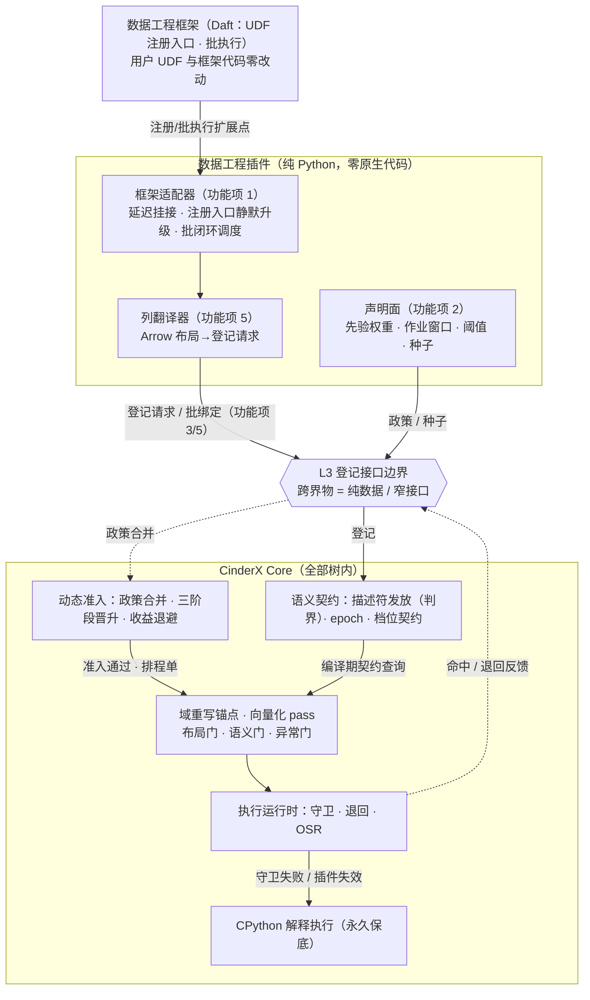
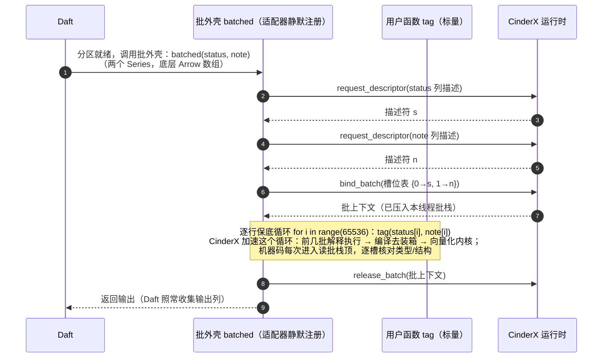
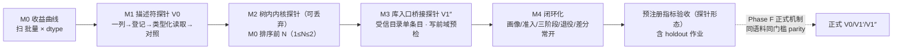

# 功能设计说明书 — CinderX 支持数据工程领域插件

## 产品版本&密级

| 项目 | 内容 |
| --- | --- |
| 产品/方案 | CinderX Runtime Core / 数据工程领域插件（首个领域插件） |
| 文档版本 | 2.1 |
| 方案阶段 | 目标架构迁移路线 Phase C（垂直切片证伪）的领域侧承载 |
| 密级 | 内部技术设计 |
| 适用范围 | 数据工程领域插件的供给面（框架适配、声明式注册、列式性能优化）与消费面切片（V0/V1′/V1″）及验收 |
| 事实基线 | CinderX 主线 `ba5ecb4d`；适配对象锚定 Daft v0.7.2（github.com/Eventual-Inc/Daft） |
| 上游文档 | 《【架构设计】CinderX 增强运行时》《【功能设计】CinderX 支持插件化》（`docs/design/`） |

## 拟制信息

| 项目 | 内容 |
| --- | --- |
| 拟制日期 | 2026-08-23（V2.1 重写于 2026-08-28） |
| 拟制方式 | 基于上游架构设计、插件化功能设计与 CinderX 主线代码形成 |
| 文档状态 | 待评审 |

## 修订记录

| 日期 | 版本 | 修改描述 |
|------|------|---------|
| 2026-08-23 | V1.0 | 初始版本 |
| 2026-08-24 | V1.1–V1.7 | 七轮评审演进：卸载语义改停用分级；DescriptorRequest 增补变长 offsets 与绑定段、别名检测升级为跨视图指针区间重叠检测；批级 handle 改为批上下文运行期绑定（编译期只登记槽位）；首发列存引擎定为 Arrow、目标运行时收敛为 CPython 3.14；Table 级共同窗口算法更正为 chunk 边界有序并集；新增 Framework Adapter 三形态挂接合同与"注册内容与接入点清单" |
| 2026-08-25 | V1.8 | 功能项 5 增补挂接前置合同（形态 0：框架探测与延迟挂接——探测只查 sys.modules、不触发 import，meta_path 导入完成事件延迟挂接）；开放问题 7 收敛为 Daft/Data-Juicer/PySpark/PyFlink 对照 |
| 2026-08-27 | V2.0 | 全文重写：术语与叙述口径统一，吸收使用实例的机制剖析（Daft 0.7.2 静默升级源码剖析、Arrow 三缓冲内存布局、先验权重机制、批闭环时序）；功能项重排——框架适配器为功能项 1，声明式注册为功能项 2，性能优化三件套（列式分发 / 向量化执行 / 列式内存布局优化）为功能项 3–5；安装面随上游收敛为 pip（`cinderx[udf]`） |
| 2026-08-28 | V2.1 | 各功能项按"功能是什么、用来干什么 → 从头到尾流程 → 架构模块交集（提供接口/调用接口/执行操作）"重述；功能项标题去掉实现片段后缀；SR/REQ 编号沿用 V2.0 排列 |

## Keywords 关键词

数据工程、UDF、标量函数、静默升级、批外壳、声明式注册、列存、Arrow、描述符（登记请求）、列式分发、批栈、槽位表、向量化执行、三阶段、回退、列式内存布局、空值位图、null 极性、先验权重、画像种子、差分测试、框架适配器、列翻译器、`sys.meta_path`

## Abstract 摘要

本文档设计 CinderX 的首个领域插件——数据工程领域插件（pip 包 `cinderx-plugin-dataeng`，经 `pip install cinderx[udf]` 无感带入）。数据工程作业（ETL/批处理）里，用户用最自然的标量写法（一行进一行出）定义 UDF，逐行的函数调用与对象装箱开销很重。本插件的核心价值：**把"对整列逐行调用标量函数"这件事静默地换成向量化执行**——用户一行代码都不用改。功能域拆为五个功能项，按"先接入、再声明、后优化"排列：**功能项 1 框架适配器**——探测与延迟挂接目标框架（首发 Daft 0.7.2），在注册入口把标量函数静默升级为批式注册（Daft 源码里两种注册走同一个工厂、只差一个 `batched` 布尔位），UDF 与框架代码零改动；**功能项 2 声明式注册**——清单里声明准入政策（先验权重、作业窗口、按 dtype 阈值）、画像种子与结构假设，启动期登记、零插件代码执行，结构失效以批绑定结构签名承载；**功能项 3–5 性能优化**——列式分发（每批"登记→绑定→执行→解除绑定"闭环与运行期绑定）、向量化执行（解释执行 → JIT 标量 → 向量化三阶段晋升、自动回退、M0–M4 切片验收）、列式内存布局优化（把 Arrow 三块缓冲指给 CinderX，判界后按连续布局去装箱并整块处理）。插件实现为纯 Python 包、零原生代码；首发列存引擎 Apache Arrow，首发框架 Daft + Ray，目标运行时 CPython 3.14。

## List of abbreviations 缩略语清单

| 缩略语 | 英文全称 | 中文名 |
|--------|---------|--------|
| dtype | Data Type | 数据类型（缓冲元素类型） |
| ETL | Extract-Transform-Load | 抽取-转换-加载 |
| FMEA | Failure Mode and Effects Analysis | 失效模式与影响分析 |
| LSB0 | Least Significant Bit 0 | 位序从最低有效位开始 |
| SR | Software Requirement | 软件（增量）需求 |
| UDF | User-Defined Function | 用户自定义函数 |
| ulp | Unit in the Last Place | 末位单位（浮点误差度量） |

## 前言

本文档为 CinderX "支持数据工程领域插件"功能设计说明书，定义功能域划分、功能项实现方案、逻辑接口与 DFX 分析。本文档为功能设计（非详细设计），实现方案以伪代码、schema 与流程描述为主。

**与上游文档的关系**：《【架构设计】CinderX 增强运行时》定义描述符（判界不变量与容量权威）、向量化三道门、档位契约、V0/V1′/V1″/V2 四形态、树内注册表等 Core 侧机制；《【功能设计】CinderX 支持插件化》定义本插件依赖的登记与编排接口（四类登记入口、三类窄接口、两阶段加载、`sys.meta_path` 延迟挂接、停用与退役）。本文档定义**数据工程这一具体领域**如何使用这些机制。Core 侧机制不由本文修改。

**范围**：数据工程场景（列存引擎上的 UDF 标量循环；首发 Apache Arrow + Daft 0.7.2 + Ray）的插件供给面与消费面切片；首版目标运行时 CPython 3.14。

**非目标**：通用向量化引擎与 V2（按 V1′/V1″ 命中率与收益证据另行启动）；树内内核的 SIMD 实现细节（随 Core 数据面阶段交付）；Arrow 之外列存引擎与 Daft 之外框架的适配（扩展面，非首版范围）；Python list 输入（无缓冲协议，首版拒绝）。

---

# 功能域：CinderX 支持数据工程领域插件

## 功能域概述

### 问题：逐行调用标量函数的"装箱税"

数据工程作业的标准形态是列存数据上的 UDF：清洗、分类、过滤、派生列。贯穿本文的例子是 nightly 订单清洗作业（Daft 0.7.2 + Ray + Arrow，每分区 65536 行）：

```python
# jobs/order_tagging.py —— 普通 Python，装不装 cinderx 都是这一份代码
import daft

def classify_prefix(code: str) -> str: ...      # 状态码前缀分类（普通函数）

@daft.func(return_dtype=daft.DataType.string())
def tag(status: str, note: str) -> str:         # 标量函数：一行进，一行出
    if status is None or note is None:
        return None
    return classify_prefix(status)

@daft.func(return_dtype=daft.DataType.bool())
def paid(amount: float) -> bool:
    return False if amount is None else amount > 0
```

`@daft.func` 是 Daft 的默认 UDF 形态（row-wise，一行进一行出），也是用户最自然的写法——不需要写任何批处理代码。但这个形态的执行代价很重：框架对**每一行**都要从列缓冲拆出 Python 标量（拆箱）、发起一次 Python 函数调用、把返回值装回输出列（装箱）——65536 行就是 65536 次调用加十几万次对象转换，真正有用的计算（字节比较、数值比较）只占零头。而且 Python 堆上的对象离散分布，遍历输出是"指针追逐"，CPU 缓存几乎每步都 miss（内存布局对比见功能项 5）。现有解法要么要求用户改写代码（手写向量化、迁移到专用执行引擎），要么引入整条引擎链路。

### 解决方案：无感接入 + 声明式注册 + 树内向量化

本插件不携带任何执行机制，按三个层次供给：

1. **框架适配器（功能项 1）**：在 Daft 的注册入口挂钩，把用户标量函数**静默升级**为批式注册——内部包一个"逐行保底循环"的批外壳，语义与 row-wise 完全等价；CinderX 加速的正是批外壳里的这个循环。用户与框架代码零改动。
2. **声明式注册（功能项 2）**：清单里声明先验权重（这类循环通常值得早点编译）、作业窗口（框架初始化期不编译）、按 dtype 的向量化阈值、画像种子与结构假设——全部是数据，启动期登记，不执行插件代码。
3. **列式性能优化（功能项 3–5）**：列式分发（每批"登记→绑定→执行→解除绑定"的闭环与运行期绑定）、向量化执行（三阶段晋升、自动回退、切片验收）、列式内存布局优化（把 Arrow 三块缓冲指给 CinderX，判界后按连续布局去装箱并整块处理）。

### 目标形态

```python
# tag 的逐行循环在向量化阶段的语义（树内内核；null 语义由空值位图承载）
tags  = prefix_compare(status)        # 树内内核：前缀比较分类
mask0 = filter_mask(amount, gt0)      # 树内内核：数值比较 → 掩码
# 归约类 UDF（sum/count）保持顺序标量循环（浮点重排会改变结果，首版不做）
```

改写由 Core 的树内规则在域重写锚点完成，插件与用户不可见、不可指定；上图仅示意目标形态。

### 核心概念

| 概念 | 定义 |
|------|------|
| 标量 UDF | 一行进一行出的用户函数（`@daft.func` 默认形态） |
| 静默升级 | 适配器在注册期把标量函数包进批外壳、按批式注册——用户全程不可见 |
| 批外壳 | 适配器生成的批式函数：内部逐行调用用户函数（保底语义），返回逐行结果列表 |
| 框架适配器（FrameworkAdapter） | 插件内面向某个数据工程框架的适配模块：探测与延迟挂接、注册入口包装、批闭环调度（每框架一个，首发 Daft） |
| 列翻译器（ColumnAdapter） | 插件内面向某个列存引擎的翻译模块：列对象 → 登记请求（每引擎一个，首发 Arrow） |
| 槽位表 | UDF 形参序号 → dtype/布局/访问模式的登记表；编译期登记，机器码按"形参 → 槽位"编译，不捕获具体数据 |
| 描述符 | Core 登记通过后发放的有界句柄；判界/别名检测/固定的验证全部在 Core 侧 |
| 先验权重 | 0~1 的数，"这类循环通常值得编译"的可信度提示，由画像数据标定；作用于准入打分 |
| 三阶段 | 解释执行 → JIT 标量（去装箱）→ 向量化内核，逐级晋升，可自动回退 |

### 能力范围与功能项划分

| 功能项 | 一句话边界 |
|--------|-----------|
| 功能项 1：框架适配器 | 探测与延迟挂接 Daft，注册入口静默升级标量 UDF，UDF 与框架代码零改动 |
| 功能项 2：声明式注册 | 清单声明政策（先验/窗口/阈值）、种子与结构假设；结构失效承载 |
| 功能项 3：列式分发 | 每批"登记→绑定→执行→解除绑定"进入加速路径，运行期绑定与入口校验 |
| 功能项 4：向量化执行 | 三阶段晋升、自动回退、M0–M4 切片与预注册指标收口 |
| 功能项 5：列式内存布局优化 | Arrow 布局翻译成登记请求，判界后连续缓冲去装箱与整块处理；输出写协议 |

功能项 3–5 共同构成插件的性能优化能力：列式分发解决"数据怎么按批进入加速路径"，向量化执行解决"循环怎么变快"，列式内存布局优化解决"数据以什么形态被访问"。

**首版支持清单**：参数列类型 utf8 字符串、float64、int64/int32、bool（Arrow 物理布局）；纯标量变换（映射、分类、过滤、掩码、比较），不依赖其他行的结果。

**首版排除清单**（命中即放弃该形态的加速，函数按原语义继续执行——"放弃"指不再尝试其他加速形态，不是拒绝执行）：object/decimal/字典编码等白名单外类型列；列对象被子类覆写访问语义；非连续布局（跨步/负步长/间接视图）；固定期间可搬迁内存的可调整对象；不支持缓冲协议的输入（如 Python list）；变长列缺偏移索引、bool 未按位打包声明等请求不一致情况；循环体含副作用调用、对象身份比较、早退/break、跨迭代依赖；async/生成器形态；归约重排（Tier 3）。

## 功能域总体方案



**现成支撑**（本域新增工作集中在适配与契约内容，机制全部复用基线与插件化功能项）：

| 环节 | 基线已有 |
|------|---------|
| 模式识别 | FloatAccumulatorPromotion（同族 Phi 模式先例，fork `3018ab4c`）、TreeIter 状态机（整段 HIR 改写先例）、behavior_classifier 的 NumericLoop 家族（`cinderx/Jit/behavior_classifier.h:15`，数值类循环的准入信号） |
| 身份/类型保障 | 属性身份缓存、GuardIs/GuardType、UseType |
| 兜底 | 三层退回漏斗；守卫失败重执行当前指令的恢复点语义 |
| 治理 | ROI 退避直接复用（`config.h` `roi_backoff_*`：预算翻倍、rewarm、冻结） |
| 编译期约束 | preload 契约（编译期唯一可执行 Python 的阶段） |

另：函数入口缓存（间接入口指针，重编译后自动切换，`cinderx/Jit/context.cpp:190-226`）是三阶段的实现基础——同一时刻仅一个激活产物，级间迁移经退回/重编译闭环完成。

### 注册内容与接入点清单（对上游合同的实例化）

上游预留的接入点由本插件按下表实例化；显式列出**空登记**与**暂不调用**项，避免实现者猜测。

**声明面登记（四类登记入口）**：

| 上游接入点 | 本插件登记内容 | 备注 |
|-----------|--------------|------|
| 插件描述（Manifest） | `id`（cinderx-plugin-dataeng）、`spi_version`、`runtime_abi`、`target_capabilities`、`adapter` 入口与适配目标（daft）、**阶段一显式激活请求** | 形态 A 挂接必须先于用户注册 UDF 在场，若等"Core 首次需要列登记"触发会死锁（不挂接 → 无槽位登记 → 无列登记需求 → 永不激活），见功能项 1 |
| 契约 | ① 槽位表声明（UDF 形参序号、dtype、布局、访问模式——由框架适配器从注册信息推导，见功能项 1）；② 结构签名假设（Arrow 模式，见功能项 2）；③ 档位申请（Tier 1 默认；Tier 2 引用部署方授权，只申请不授权） | 假设台账记账，发布门禁 |
| 准入策略 | StringLoop/NumericLoop 先验权重、作业窗口（框架初始化期不编译）、按 dtype 阈值（M0 标定静态值）；种子文件引用（均见功能项 2） | 只偏置不裁定 |
| Pass 配置 | **空登记**——数据面改写由 Core 树内规则承担，本域无 pass 条目 | 显式空，合同的一部分 |

**适配面调用（三类窄接口，按频次）**：

| 上游接口 | 本插件调用点 | 频次/时机 |
|---------|------------|----------|
| `request_descriptor(登记请求)` | 批外壳每批每列登记（请求由列翻译器构造，见功能项 5） | 每批 × 每参与列 |
| `bind_batch` / `release_batch` | 批外壳的进入/退出（finally），闭环见功能项 3 | 每批各一次（嵌套压栈） |
| `register_epoch` / `bump` | **首版不调用**（Arrow 结构签名模式不需要） | 可变引擎接入时启用 |
| `wrap_entry` | **首版不调用**（Arrow 无原地变异路径） | 可变引擎接入时启用 |
| `activate(ctx)` / `deactivate()` | Core 在 daft 导入完成后调用 activate；激活内完成政策登记（功能项 2）、探测与 meta_path 观察（功能项 1） | 每进程一次（幂等） |

**消费的 Core 机制（插件被作用，不登记不调用）**：域重写锚点与三道门、档位契约、假设台账发布门禁、动态准入/ROI 闭环、安全退役、诊断旁路。

## 功能域规格设计

| 规格项 | 规格 |
|--------|------|
| 模式集（首版） | 连续列缓冲上的 map（数值/utf8 变换）、filter 掩码、classify 分类、前缀比较、条件映射；归约的逐元素部分向量化、归约保持顺序标量循环 |
| null 语义 | 位图 LSB0；极性按请求显式声明（Arrow 为 0_is_null：位=1 有效）；向量化版本与标量循环的 null 传播、输出极性一致；出错元素逐行重放含 null 语义 |
| 档位默认 | Tier 1 默认允许；Tier 2 需部署方显式开启；Tier 3 归约默认不重排 |
| 失效 | Arrow 批绑定结构签名不符 → 退回；插件停用走安全退役 |
| 验收口径 | 预注册指标（功能项 4）；差分对照 0 失败为一票否决 |
| 运行时 | CPython 3.14；3.12/3.15/3.11 待共生构建线就绪后经 `runtime_abi` 协商开放 |

## 核心契约：登记请求与批上下文

本节定义全部功能项共享的请求字段与判界/绑定语义（架构文档"描述符"节的本域实例化），各功能项引用本节。

### 登记请求（DescriptorRequest，冻结）

```text
DescriptorRequest {
  data_exporter        # 列数据缓冲本体（支持缓冲协议；不支持即拒绝，无裸指针兜底）
  element_offset       # 起始行号，>= 0（缓冲内绝对行号，适配器负责换算源对象自身 offset）
  element_count        # 行数，>= 0
  dtype                # 白名单：utf8 / f8 / i8 / i4 / bool
  utf8_layout          # varlen（变长，须携带 offsets）| bytestream，仅 dtype=utf8 有效
  layout               # byte（定宽）| bitpacked（bool 按位打包）
  data_bit_offset?     # bitpacked 的位内起始偏移（须满足位偏移—行号绑定不变量）
  access               # read | write
  offsets_exporter?    # 变长列的偏移索引缓冲（i4/i8；须覆盖 [offset, offset+count] 共 count+1 项）
  validity_exporter?   # 空值位图对象（全有效列可缺省）
  validity_bit_offset? # 位图内起始位
  bit_order            # LSB0（首版冻结）
  null_polarity        # 显式二值：1_is_null | 0_is_null——按源引擎极性声明（Arrow 为 0_is_null）
  binding{             # 绑定段：三视图与列对象的一次受检快照
    column_snapshot    #   列对象只读属性快照（type/length/offset/null_count）
    expected{dtype, length, column_identity}
  }
}
```

三视图（数据/偏移/位图）必须**同一次请求原子提交**；变长 utf8 的唯一表达是 varlen + 偏移索引（元素 = `data[offsets[i] : offsets[i+1]]`）；bool 按 Arrow 物理布局以 bitpacked 表达。

### 判界与所有权不变量（Core 侧，与上游架构文档同版）

```text
# 定宽
起始字节 + 行数 × 元素宽度 <= 数据缓冲长度
# 按位打包
data 位偏移 + 行数 <= 数据缓冲字节数 × 8
# 变长 utf8
起始行 + 行数 + 1 <= 偏移索引长度 / 元素宽度
偏移索引[起始行] >= 0
偏移索引[起始行 + 行数] <= 数据缓冲字节数          # 首末两项卡住；切片段单调非减
# 位图
validity 位偏移 + 行数 <= 位图字节数 × 8
# 位偏移与行号绑定（防"判界通过却读错行"）
data 位偏移 == data 基准位 + 起始行
validity 位偏移 == validity 基准位 + 起始行
```

全部下界非负；乘加全程溢出检查；容量权威为 Core 自行经缓冲协议取得的内存长度（插件报的区间只是待验证申请）；三视图分别判界，任一失败拒绝该描述符并放弃该列加速（进程继续）。别名不变量：Core 记录每个已固定视图的指针区间，读写不相容的区间重叠即拒绝向量化。描述符持有缓冲引用保活；可调整对象一律排除；带失效代号，结构变更即作废。判界记录进假设台账，是向量化产物发布的硬门禁。

### 语义绑定校验

缓冲协议只暴露指针与长度，不能证明"三块缓冲属于同一列"。绑定正确性分两层：**Core 可亲自验证层**（登记期硬门禁）——属性快照与 Core 自取的各视图元数据交叉一致（长度需求 ≤ 实际长度、dtype 与格式一致），不符拒绝；**验证不了层**（三缓冲与列对象的归属关系）——由适配器受信地位承载（同进程、pip 可信口径），以差分对照兜底：首批绑定全量对照、此后常态抽样，差分失败永久禁用该绑定形态。

### 批上下文与运行期绑定

批级描述符不进任何静态契约：**编译期只登记槽位表**，机器码按"形参 → 槽位"编译、不捕获任何描述符。运行期：`bind_batch` 把"槽位 → 描述符"压入 **Core 维护的线程局部批栈**（多线程各自绑定互不可见；递归/嵌套压栈弹栈，内层读内层）；机器码入口与类型化访问一律读当前线程栈顶完成逐槽校验，不符退回解释器。`release_batch` 校验调用线程一致、栈顶（LIFO）、未重复释放，任一不符拒绝弹栈并审计（校验失败不消耗栈，批钩子 finally 重试；适配器缺陷导致的泄漏由生命周期表兜底强制退役）。描述符生命周期 = 批上下文；批上下文跨普通退回保活至批结束。空批（行数 0）直接跳过登记与执行。

---

## 功能项 1：框架适配器

### 功能概述

**这个功能是什么**：插件内面向某个数据工程框架的适配模块（每框架一个，首发 Daft）。它接管两件事：框架的 **UDF 注册入口**（把用户标量函数静默升级为批式注册）和**批执行时机**（每批驱动"登记→绑定→执行→解除绑定"闭环，见功能项 3）。

**用来干什么**：用户代码与框架代码零改动获得加速——用户继续写最自然的标量函数，适配器替他把"批"补上。"装上插件即加速"的交付形态由此成立；接入一个新框架 = 一个适配器模块 + Contract Tests。

| 要点 | 内容 |
|------|------|
| 接管对象 | 框架自身的注册入口与数据接口（不打框架补丁） |
| 核心动作 | 静默升级：标量函数 → 批外壳 → 批式注册（保底语义与 row-wise 等价） |
| 零改动边界 | 用户 UDF 零改动、框架代码零改动、失败回退与未安装等价 |

### 功能流程

**① 分工与包结构**。框架适配器与列翻译器正交：适配器管"何时/如何挂接注册与批执行"（面向框架），列翻译器管"列对象如何翻译成登记请求"（面向列存引擎）；组合经清单 `adapter` 字段声明。

```text
cinderx_plugin_dataeng/
  ├─ cinderx_plugin.json            # 清单：策略/种子/适配器入口的声明（功能项 2）
  ├─ policy/overlays.json           # 策略与阈值数据（功能项 2）
  ├─ seeds/profile_orders_etl.json  # 画像种子（订单作业的数据形状，功能项 2）
  ├─ adapter/framework_daft.py      # Daft 适配器（注册入口包装 + 批外壳，本功能项）
  └─ adapter/columns_arrow.py       # Arrow 列翻译器（功能项 5）
```

**② 启动：记下目标，不加载**。清单 `adapter` 字段声明"适配目标模块 = daft"；激活时只查 `sys.modules` 存在性并核验白名单制品摘要，**不触发任何 import**——cinderx 自己绝不 import 框架，装了插件但作业不用 Daft 的进程，一行适配器代码都不执行；摘要不符即该框架不挂接（等价未安装）并审计。

**③ import daft → 延迟挂接**。机制定义见插件化功能项 1（`sys.meta_path` 延迟激活）；Daft 实例的完整时序：

```text
① 解释器启动，cinderx 初始化：
     读清单 cinderx_plugin.json，adapter 字段声明"适配目标模块 = daft"
     ——此刻只是记下目标，不加载适配器（daft 尚未导入，内存里没有可包装的东西）
② cinderx 在 sys.meta_path 头部插入一个观察查找器：
     此后任何模块加载完成，都会先经过它（Python 导入机制的公开扩展点；
     观察器只观察透传，不拦截改写 finder/loader）
③ 用户作业执行 import daft：
     Python 导入机制完成 daft 模块初始化，模块对象进入 sys.modules
     → 观察查找器被触发（此刻 import 语句还没返回给用户代码）
     → 比对适配目标清单：命中 daft → 触发阶段二加载
④ 阶段二：加载 adapter/framework_daft.py → activate() → attach(daft)：
     此刻 daft 模块对象已在内存——attach 把 daft.func 模块属性替换为
     包装版（原对象存起来，batch 等入口原样透传）
⑤ import daft 返回：
     用户后续写 @daft.func 装饰 tag 时，拿到的必然是包装版
```

时序为什么**不早不晚恰好**：早于③daft 不在内存，没有属性可替换；晚于③用户的装饰器可能已经执行完，注册就漏了。③的触发点在"模块加载完成 → import 返回"之间，这个窗口由 Python 导入机制本身保证，用户代码不可能插进去——所以不存在漏网路径。挂接次序断言（"框架导入完成 → attach → 用户注册"）进 Contract Tests。

**④ 用户注册：槽位推导 + 静默升级**。先看 **Daft 0.7.2 的真实源码**（`daft/udf/__init__.py`，中文注释为本文所加）：

```python
class _FuncDecorator:
    def __call__(self, fn=None, *, return_dtype=None, ...):
        """Row-wise (1 row in, 1 row out) - the default variant"""    # ← @daft.func
        def deco(fn):
            return Func._from_func(fn, return_dtype, unnest,
                                   use_process, False, None, ...)     # ← batched=False
        return deco(fn) if fn else deco

    def batch(self, *, return_dtype, batch_size=None, ...):
        """Batch functions receive `daft.Series` arguments, and return a
        `daft.Series`, `list`, `numpy.ndarray`, or `pyarrow.Array`"""
        def deco(fn):
            return Func._from_func(fn, return_dtype, unnest,
                                   use_process, True, batch_size, ...)  # ← batched=True
        return deco
```

源码揭示一个关键事实：**row-wise 与 batch 两种注册走同一个工厂 `Func._from_func`，只差一个 `batched` 布尔位**（v0.7.2 真实路径为 `daft/udf/udf_v2.py`）。这就是"静默升级"的最短路径——适配器不伪造任何 Daft 内部结构，只需在注册时把布尔位换成 `True`，并把用户函数包进一个"逐行保底的批外壳"：

```python
# adapter/framework_daft.py（要点骨架）
import inspect
from daft.udf.udf_v2 import Func       # Daft 0.7.2 的注册工厂（真实路径）

class _WrappedFuncDecorator:
    """替换 daft.func 模块属性的包装对象；batch 等入口原样透传。"""
    def __init__(self, orig, adapter):
        self._orig, self._adapter = orig, adapter
        self.batch = orig.batch        # 用户自己写 @daft.func.batch 则不升级，原样走

    def __call__(self, fn=None, **opts):          # 用户看到的 @daft.func
        def deco(f):
            self._adapter.on_udf_register(f, opts.get("return_dtype"))
            if self._adapter.upgradeable(f):
                return self._adapter.silent_batchify(f, **opts)
            return self._orig(**opts)(f)           # 不升级：原样注册，行为零变化
        return deco(fn) if fn else deco

class DaftAdapter:
    def attach(self, daft_module):
        daft_module.func = _WrappedFuncDecorator(daft_module.func, self)   # 挂钩

    def on_udf_register(self, fn, return_dtype):
        # 对订单作业的 tag(status, note)：
        #   槽位表 = {0: utf8/变长/只读, 1: utf8/变长/只读, 返回: string}
        # 类型不在支持清单（object/decimal…）→ 不登记、不升级，原样注册
        ...

    def upgradeable(self, f):
        # 只升级纯标量函数；async / 生成器变体不升
        return not (inspect.iscoroutinefunction(f) or inspect.isgeneratorfunction(f))

    def silent_batchify(self, fn, *, return_dtype, **opts):
        # 静默升级：用户函数 → 批外壳 → 按批注册（用户全程不可见）
        def batched(*series_list):                 # Daft 执行期调到的就是它
            handles = [request_descriptor(self.columns.translate(s))
                       for s in series_list]       # ← 登记列（请求由列翻译器构造，功能项 5）
            ctx = bind_batch(self.slot_table, handles)   # ← 绑定本批（功能项 3）
            try:
                out = []
                for i in range(len(series_list[0])):     # 逐行保底循环 = row-wise 原语义
                    out.append(fn(*[s[i] for s in series_list]))
                return out    # list 是批式的合法返回类型（见上面源码 docstring）
            finally:
                release_batch(ctx)                # ← 解除绑定（异常路径也走，功能项 3）
        return Func._from_func(batched, return_dtype, ...,
                               use_process, True, None, ...)   # ← batched=True
```

这段骨架的语义有三层保证：**保底正确性**——批外壳的逐行循环（`fn(status[i], note[i])`）与 row-wise 的"每行调用一次"完全等价，即使 CinderX 完全不介入，行为也与原版一致；**加速对象明确**——CinderX 加速的是批外壳里的这个循环（去装箱 → 向量化），不是用户函数本身；**升级资格检查**——async/生成器/类型不支持的函数原样走 Daft 原注册路径。对 Daft 而言，`silent_batchify` 返回的仍是一个工厂相同、返回类型合法的正常批式 Func 对象。

**⑤ 执行期**。Daft 触发执行（`write_parquet` 等）时，把分区的列构造为 Series 调用批外壳——进入功能项 3 的批闭环；返回值原样交回，Daft 照常收集输出列。

**⑥ 多框架并存与适配集冻结**。多个适配器同进程并存：各自命名空间隔离；同一 UDF 只被一个适配路径挂接（先注册者生效，重复拒绝并审计）。首发适配框架集合随预注册负载清单在 M0 之前冻结；未覆盖框架不在首版承诺，接入判据见开放问题 7。

**⑦ 失败回退**。任一环节失败（摘要不符/白名单外类型/判界失败/门拒绝/签名失配/适配器自身异常）即走原语义路径，与未安装插件一致。

**Ray 为什么一行代码都不用写**：Ray 在这个体系里只做调度——把作业的分区分发到各 worker 进程。每个 worker 是独立的 Python 进程，import daft 时各自完成同样的挂钩，跑批时各自的登记/绑定/释放互不共享。所以插件包里没有 ray 相关的代码；Ray 集群与单机的差别只是"有多少个进程各自跑同一套流程"。

### 架构模块交集

| 架构模块 | 角色 | 内容 |
|----------|------|------|
| Daft（目标框架） | 提供接口 | UDF 注册入口（`@daft.func`，被包装）、批执行扩展点（分区就绪调用注册的函数） |
| 用户 | 调用接口 | 写 `@daft.func` 标量函数（实际命中包装版，全程不可见） |
| L3 插件框架 | 执行操作 | `sys.meta_path` 观察与延迟加载；调用 `activate(ctx)`；探测 sys.modules 与摘要核验 |
| 插件·框架适配器 | 提供接口 | `attach` / `on_udf_register` / `upgradeable` / `silent_batchify`；调用列翻译器（功能项 5）与批闭环接口（功能项 3） |
| 语义契约 | 提供接口 | 槽位表登记（`provides.contracts` 声明面 + 推导结果登记） |

### 实现细则

**三形态挂接合同**（每框架按其扩展点形态择一；Daft 属形态 A）：

| 形态 | 框架特征 | 挂接方式 | 槽位表来源 |
|------|---------|---------|-----------|
| A 注册式 | 框架以装饰器/注册函数收集 UDF（`@daft.func`） | 包装注册入口：注册时推导槽位表并登记；框架后续批执行回调批外壳 | 函数签名 + 注册时声明的返回类型 |
| B 执行器式 | 框架有执行器/后端扩展点 | 适配器实现该接口，在批循环内插入"登记→绑定→执行→解除绑定→发布" | 执行器接口的输入 schema |
| C 公开 API 包装式 | 框架仅暴露 map/apply 类公开 API | 包装公开 API（调用点不变），包装内驱动批闭环 | API 签名 + 首批类型探测（结果进守卫假设，批间不一致回退） |

**升级资格**：容易升级 = 纯标量变换（映射、分类、过滤、掩码、比较），不依赖其他行的结果，参数列类型在支持清单内（utf8、float64、int64/int32、bool）；不升级（原样注册，行为零变化）= 有副作用、依赖跨行状态、async/生成器、类型不在支持清单、用户自己写了显式批式注册。

**交付要求**：框架适配器必须同时交付三组 Contract Tests——挂钩前后框架行为一致（透传等价）、任一加速环节失败后与没装插件时行为一致（回退等价）、重复挂钩无副作用（幂等）。

**插件红线**：插件包里不能有任何二进制（原生扩展）；不能自带变换/优化代码去改机器码（加速逻辑全部在 CinderX 本体内）；不能用策略"命令"运行时编译谁（功能项 2 边界）；数值精度档位只能申请，授权在部署方。

### 增量 SR 清单

| SR 编号 | 描述 |
|---------|------|
| SR-DE-001 | 框架适配器应只经框架自身的注册入口或公开 API 挂接（三形态合同），用户 UDF 与框架代码零改动 |
| SR-DE-002 | 任一环节失败后的框架可观察行为应与未安装插件等价（回退等价验收） |
| SR-DE-003 | 槽位表应只从框架注册元数据推导（不执行 UDF、不读数据内容），白名单外类型在推导期拒绝登记 |
| SR-DE-004 | 框架适配集（含每框架接入形态与扩展点清单）应随负载清单在 M0 之前冻结 |
| SR-DE-005 | 多框架适配器并存时应命名空间隔离，同一 UDF 重复挂接应拒绝并审计 |
| SR-DE-006 | 框架探测与延迟挂接应满足：探测只查 sys.modules 存在性与白名单摘要核验且不触发 import；框架专属子模块延迟导入至探测通过；挂接经导入完成事件延迟执行且次序为"框架导入完成 → attach → 用户注册"；未探测到或摘要不符的框架适配器不挂接，行为与未安装等价 |

### DFX 分析

#### 可靠性分析

##### FMEA 分析

| 失效模式 | 影响 | 原因 | 检测手段 | 补偿措施 |
|---------|------|------|---------|---------|
| 框架升级破坏入口形态 | 适配失效/异常 | 入口非稳定 API | 版本钉定 + Contract Tests | 挂接失败即整框架回退（原语义），诊断上报 |
| 包装透传语义漂移 | 框架行为改变 | 包装未透传某语义 | 透传等价用例 | Contract Tests 全量透传断言 |
| 延迟挂接晚于用户注册 | 该框架 UDF 漏挂（静默无收益） | 挂接次序错误 | 次序 Contract Tests | 漏挂等价未安装；诊断计数；修复前禁用该框架适配 |
| 观察查找器干扰框架导入 | 框架导入行为改变 | 观察器缺陷 | 只观察透传（不改写 finder/loader） | 观察器异常自摘除 + 整框架回退，进程继续 |
| 形态 C 类型探测漂移 | 守卫频繁失配 | 批间类型不稳定 | 退回/回退计数 | 结构签名失配 → 回退原语义（ROI 退避） |
| 重复挂接 | 双重执行风险 | 多适配路径争抢 | 挂接登记表 | 先注册者生效，重复拒绝并审计 |
| 适配器自身异常 | 批执行中断 | 适配器缺陷 | 挂钩层异常包裹 | 整框架回退原语义（本批重放），进程继续 |

#### 可服务性分析

每框架适配状态（探测命中/摘要核验结果、挂接形态、入口版本、挂接/回退计数）进诊断；适配集与扩展点清单可导出（与预注册冻结件对照审计）。

#### 安全设计检查

框架适配器是插件适配面的一部分（进程可信边界内）；其一切供给仍经窄接口与判界验证；挂接不改变框架信任边界。类型探测（形态 C）只读类型元数据，不读数据内容。

#### 可用性/性能分析

挂接为每框架每进程一次 O(1)；观察查找器对每次导入增加一次小常数名单比对，命中目标前零行为变化；回退路径零额外开销（原语义直通）。

### 影响点列表

| 模块 | 文件 | 影响描述 |
|------|------|---------|
| 插件包 | `adapter/framework_daft.py`（新建） | Daft 适配器：探测与延迟挂接、注册入口包装、静默升级 |
| 插件包 | `tests/` | 回退等价/透传等价/幂等/挂接次序/探测零 import Contract Tests |
| 契约面 | `cinderx/Jit/contracts/` | 槽位表登记消费，与编译假设对账 |

### 分配需求

| 需求编号 | 描述 |
|---------|------|
| REQ-DE-001 | 数据工程框架应能经既有入口无感接入本插件（UDF 与框架代码零改动），标量 UDF 被静默升级为批式注册且保底语义与 row-wise 等价，回退后与未安装插件等价 |

（对应架构 AR-10 零插件等价、插件化功能项 1 延迟激活。）

---

## 功能项 2：声明式注册

### 功能概述

**这个功能是什么**：插件以纯数据（静态清单 `cinderx_plugin.json`）向 Core 声明本域知识：准入政策（先验权重、作业窗口、按 dtype 阈值）、画像种子、结构假设与档位申请。

**用来干什么**：让登记全程零插件代码执行（启动期读文件即可），且数据工程作业的准入决策从冷启动就有领域先验——`tag` 第 4 批就编译，而不是第 8 批；结构假设失效有承载，语义无损。

| 要点 | 内容 |
|------|------|
| 供给形态 | 纯数据（清单 `provides.*`），启动期登记 |
| 决策权 | 政策只偏置，拍板在动态准入 |
| 更新方式 | 改 JSON 发新版本，`pip install -U cinderx[udf]` 获得，不改 Core |

### 功能流程

**① 编写清单**。`cinderx_plugin.json` 中与订单作业直接相关的字段（节选）：

```json
{
  "id": "cinderx-plugin-dataeng",
  "provides": {
    "policies": [
      {"priors": [{"pattern_family": "StringLoop", "weight": 0.6},
                  {"pattern_family": "NumericLoop", "weight": 0.8}]},
      {"window": {"phase": "framework_init", "action": "defer"}},
      {"threshold_bias": {"per_dtype": {"utf8": 8192, "f8": 4096}}}
    ],
    "seeds": ["seeds/profile_orders_etl.json"]
  },
  "adapter": {"entry": "cinderx_plugin_dataeng.adapter.framework_daft", "target": "daft"}
}
```

逐条对应到订单作业：

| 声明项 | 取值 | 对订单作业的作用 |
|--------|------|----------------|
| StringLoop 先验 | 0.6 | `tag` 的循环在字符串列上逐元素处理——这类循环值得早点编译 |
| NumericLoop 先验 | 0.8 | `paid` 的金额比较循环，数值类模式更规整、权重更高 |
| 初始化窗口 defer | framework_init | `daft.read_parquet`/计划构建阶段不编译，避免浪费预算 |
| utf8 阈值 8192 / f8 阈值 4096 | 每批 65536 行，远超阈值 | 批量低于阈值不向量化（向量化对小批量是负收益） |
| 种子文件 | profile_orders_etl.json | 冷启动参考，内容见下 |

种子文件记录订单作业的数据形状（只含分布指纹，不含业务数据）：

```json
{"seed_version": 2, "corpus_fingerprint": "orders-etl-2026H1",
 "entries": [
   {"pattern_family": "StringLoop", "dtype": "utf8", "n_distribution": "mode 65536", "null_ratio": 0.03},
   {"pattern_family": "NumericLoop", "dtype": "f8",    "n_distribution": "mode 65536", "null_ratio": 0.01}]}
```

**② 启动期登记**。经 L3 准入策略与契约入口登记（插件化功能项 1 流程③），schema 校验、条目级拒绝、零插件代码执行。

**③ 合并与缓存**。登记链：清单 `provides.policies` → 启动期 `cinderx.plugins.discover()` 读清单登记 → 进入 CinderX 的**准入治理模块**（规划路径 `cinderx/Jit/admission/` 的政策合并器），与全局配置、其他插件政策按固定顺序合并，结果缓存（键 = 政策集指纹）。

**④ 生效**。生效链：动态准入的热度评估点——每批执行计数更新时，按合并缓存的算分为该 UDF 判定是否过编译门槛；热路径读的是缓存结果，O(1)。

先验权重（0.6 / 0.8）的完整机制——它是一个 0~1 的数，意思是"这类循环通常值得编译"的可信度提示，数值由画像数据标定（种子文件就是干这个的）。作用位置在 CinderX 的**准入打分**。四个问题依次讲清：

**问：0.6 怎么换算成"第 4 批编译"**（门槛与基础热度为示意值，换算关系是设计的）：编译门槛设 1.0 分；每跑完一批，该 UDF 的累计热度分增加"单批基础热度 0.42 × 家族先验"：

| 场景 | 每批得分增量 | 过 1.0 门槛需要 | `tag`（StringLoop）首编 |
|------|-------------|----------------|------------------------|
| 不装插件（通用 JIT，家族先验默认 0.3） | 0.42 × 0.3 = 0.126 | 1.0 ÷ 0.126 ≈ 8 批 | 第 8 批 |
| 插件先验 StringLoop = 0.6 | 0.42 × 0.6 = 0.252 | 1.0 ÷ 0.252 ≈ 4 批 | 第 4 批 |
| 先验配得过高 | 增量大、编译早 | 更早 | 若假设不成立会退回，反馈把本地权重打折后更晚才再试 |

**问：每个 UDF 的阈值为什么不一样、UDF 语义从哪来**：阈值按 dtype 分档（utf8 8192 / f8 4096——字符串向量化固定开销更大，门槛更高）。档位归属由两层信息决定：**静态**——注册期适配器从 `@daft.func` 的参数与返回类型得知 `tag` 是"utf8 列批函数"，槽位表里登记了 dtype（功能项 1）；**动态**——执行期头几批观察到该 UDF 的实际行数分布与空值率，补足画像（同一插件服务两个作业，一个批 1 万行、一个批 10 万行，阈值判断各自成立）。

**问：在线怎么调整**：运行反馈写回准入模块的**本地修正系数**：编译后反复退回（假设失配）→ 系数下调、更难再编译直至退避冻结；稳定高收益 → 系数上调。插件政策本身不变，修正叠加其上；种子只负责冷启动，跑起来后被运行数据逐步取代。

**问：边界在哪**（保证它只是催化剂）：过门槛后的正确性检查一点不放宽——先验影响"多早编译"，不影响"能不能安全编译"；反馈可推翻先验；删掉种子、配错权重只影响前几批的快慢，不影响任何输出结果。

**⑤ 作业窗口生效**。框架初始化阶段（注册 UDF、建表、读配置）不触发编译——政策声明窗口，动态准入在窗口内延迟准入（复用基线 startup 检测，`autojit_import.cpp`、`_cinderx_auto.py:48-77` 的注册式化形态）。窗口只影响准入时机，不影响正确性。

**⑥ 结构失效**。按引擎对象模型二选一：

- **Arrow 模式（首发）——批绑定结构签名**：Arrow 数组不可变（列增删返回新对象），不存在原地变异路径可包装；且流式作业每批通常创建**新的数组对象**，对象身份每批皆变。失效源改为读时校验：签名只含 schema 级内容（列名、类型、dtype、布局、极性），**不含对象身份**——结构相同的新批次对象签名匹配、不退回。每批 `bind_batch`（功能项 3）时 Core 计算列集结构签名并与编译期槽位假设比对，不符即退回。
- **可变引擎模式（定义保留、非首版）——构造式不变量**：包装框架必经的变异 API（addColumn/alterType/rebind 等），入口递增 epoch；机器码守卫读 epoch 不等即退回。变异入口覆盖清单进 Contract Tests；DDL 密集触发高频递增由速率上限合并、超限熔断（复用插件化功能项 4）。

**⑦ 政策更新交付**。改插件包里的策略数据（JSON），发新版本，用户侧 `pip install -U` 即获得——不需要改代码，不需要改 Core。

### 架构模块交集

| 架构模块 | 角色 | 内容 |
|----------|------|------|
| 插件声明面 | 提供接口 | 政策与种子数据（`provides.policies` / `seeds`）、契约条目（结构签名假设、档位申请） |
| L3 准入策略入口 / 契约入口 | 执行操作 | 登记：schema 校验、条目级拒绝、命名空间隔离 |
| 动态准入·政策合并器 | 执行操作 | 按权威序合并、结果缓存（键 = 政策集指纹） |
| 动态准入·热度评估点 | 消费接口 | 每批计数更新时按缓存打分（O(1)）；本地修正系数的写入与读取 |
| 语义契约 | 执行操作 | 结构签名比对（每批一次 O(列数)，复用机器码入口守卫）；epoch 单元发放与守卫（可变引擎模式） |
| 语义观察与反馈 | 提供接口 | 退回计数、收益统计（修正系数的输入） |
| 部署方 | 执行操作 | 显式配置（最高权威）、静态画像供给、档位授权 |

### 实现细则

- **诊断治理参数**：按命名空间计数——登记数/失败原因、三道门通过率、内核与规则命中、重放频率、退回率、epoch 递增与熔断状态；全部低基数，默认关闭时零产物。
- **失效语义**：签名不符/epoch 不等 → 退回，重执行当前指令的恢复点语义；语义无损；列内容变更不触发结构失效，结构变更必触发。
- **政策字段白名单**：先验权重、窗口、阈值偏置、命名空间配额、种子——超出白名单的声明字段拒绝登记（插件化功能项 2 合并不变量同样适用）。

### 增量 SR 清单

| SR 编号 | 描述 |
|---------|------|
| SR-DE-101 | 本域先验/窗口/阈值/配额应经政策登记并确定性合并，不得改变决策权归属 |
| SR-DE-102 | 画像种子应仅做冷启动偏置且运行反馈可推翻；Phase C 只消费部署方静态画像 |
| SR-DE-103 | 作业窗口声明应使框架初始化期不触发编译，窗口语义只影响准入时机不影响正确性 |
| SR-DE-104 | Arrow（不可变对象模型）应以批绑定**结构签名**（schema 级内容，不含对象身份）承载结构失效：签名与编译期槽位假设不符必退回；流式新批对象同结构不得误判失效 |
| SR-DE-105 | 可变引擎的结构变异路径应经包装入口引流并递增 epoch、覆盖清单进 Contract Tests、递增受速率上限与熔断约束（接入时生效，非首版交付） |
| SR-DE-106 | 删除或篡改任意种子/政策不得改变正确性测试结果（建议只影响快慢的验收） |

### DFX 分析

#### 可靠性分析

##### FMEA 分析

| 失效模式 | 影响 | 原因 | 检测手段 | 补偿措施 |
|---------|------|------|---------|---------|
| 种子数据错误 | 准入选择变差（性能） | 恶意/错误种子 | 建议隔离测试（AR-04） | 只影响性能；运行反馈推翻；种子带语料指纹可追溯 |
| 政策冲突 | 准入行为不可预期 | 多插件同字段叠加 | 确定性合并序 | 合并指纹留档，可复现可审计 |
| 阈值过激 | 小批量负收益向量化 | 静态阈值偏离实际 | 收益归因统计 | M0 曲线标定 + 画像动态化（M4） |
| 窗口声明失效 | 初始化期误编译 | 窗口语义失效 | 窗口命中计数 | 只损失性能（预算内），无正确性影响 |
| 签名粒度过细 | 换对象即误判失效 | 签名含身份/代号 | 签名字段冻结为 schema 级 | 流式新批同结构不退回（Contract Tests） |
| 变异路径漏包装（可变引擎） | 机器码读过期结构 | 覆盖清单不全 | Contract Tests | 清单外路径存在即失败；差分对照兜底 |
| 守卫读与递增竞态 | 误判有效 | 读序问题 | epoch 原子语义 | 稳定地址整数单元 + 代号 |

#### 可服务性分析

政策合并结果、种子版本与命中、阶段晋升/回退事件、签名失配计数、epoch 递增与熔断状态可查询；阈值与先验调整无需改 Core（声明面数据更新）。

#### 安全设计检查

政策与种子是建议类输入：缺失/错误/过期只允许影响性能选择（AR-04 验收）。epoch 是正确性输入：观察者写、Core 读、守卫验证——插件不能凭声明获得未验证的信任。

#### 可用性/性能分析

政策合并为启动期/按需一次性（缓存键 = 叠加集指纹）；种子摄入为冷启动读文件；稳态（结构稳定）零递增成本，签名比对为每批一次 O(列数) 比较（复用入口守卫）；均不进热路径。

### 影响点列表

| 模块 | 文件 | 影响描述 |
|------|------|---------|
| 插件包 | `policy/overlays.json`、`seeds/`（新建） | 政策与种子数据 |
| 契约面 | `cinderx/Jit/contracts/` | 结构假设登记、epoch 注册/递增/守卫读取 |
| 准入治理 | `cinderx/Jit/admission/` | 本域政策的合并与指纹、作业窗口合并 |
| 观察面 | `cinderx/Jit/observation/`（随架构 L2 交付） | 值/形状/dtype 画像与种子摄入 |

### 分配需求

| 需求编号 | 描述 |
|---------|------|
| REQ-DE-101 | 领域准入知识与结构假设应以纯数据经声明面登记进入 Core，失效以结构签名或构造式不变量承载，决策权保持在动态准入 |

（对应架构 AR-04、AR-07 与"假设、守卫与失效"节。）

---

## 功能项 3：列式分发

### 功能概述

**这个功能是什么**：把框架按分区产生的每一批列数据，沿固定的四步闭环——**登记 → 绑定 → 执行 → 解除绑定**——送进加速路径，并把结果原样交回框架。

**用来干什么**：让"数据按批流动"这件框架本来就在做的事，成为运行期绑定的载体。编译期只登记槽位表、机器码不捕获任何一批具体数据，于是**数据每批都换、结构不换就直接复用机器码**，不用重编译；绑定校验失败退回原语义，保底正确。多线程、Ray 多进程下无需任何额外配置。

| 要点 | 内容 |
|------|------|
| 每批开销 | 登记 × 参与列数 + 绑定/解除各一次，全部常数（与批大小无关） |
| 复用条件 | 结构（槽位 dtype/布局/列结构签名）不变 |
| 回退 | 机器码入口逐槽校验不符 → 当场退回解释器 |

### 功能流程

**① 编译期（前移的重活）**。UDF 注册时框架适配器推导槽位表（形参序号 → dtype/布局/访问模式，功能项 1）并登记；机器码按"形参 → 槽位"编译，不捕获任何描述符。这一步做完，每批只剩常数开销的核对工作。

**② 每批四步闭环**。Daft 按分区成批，每批调用一次批外壳。先认清这一环上**谁给谁提供接口**：

| 接口/函数 | 提供方 | 调用方 | 干什么 |
|----------|--------|--------|--------|
| `request_descriptor(列描述)` | CinderX | 批外壳（请求由列翻译器构造，功能项 5） | 登记一列，返回描述符；边界由 CinderX 亲自核对 |
| `bind_batch(槽位表, 描述符)` | CinderX | 批外壳 | 把这批数据与登记绑定，压入本线程批栈 |
| `release_batch(绑定)` | CinderX | 批外壳 | 批结束解除绑定并释放（异常路径也走） |
| `func` 装饰器 | Daft（被适配器包装） | 用户 | 注册标量 UDF；包装版静默按批式注册（功能项 1） |
| `tag(status, note)` | 用户 | 批外壳的逐行循环 | 标量业务逻辑 |



**③ 机器码入口逐槽校验**。机器码每次被调、启动前，读批栈顶，逐槽比对类型/布局/列结构签名与编译时的假设——不符当场退回解释执行。这是"用户零改动、结果永远一致"的保障点：编译产物只认"参数位置 + 类型"，不记住具体某批数据。

**④ 异常路径与空批**。批结束（正常返回**或异常路径**）在 finally 语义下解除绑定，释放不依赖 UDF 正常返回；空批（行数 0）直接跳过登记与执行。输出列先写进预分配缓冲，整批成功后一次性构造发布（写协议见功能项 5）；中途失败（比如第 k 行抛业务异常），这批缓冲直接丢弃，按原始方式重跑——结果永远和不用插件时一致。

**⑤ 多线程与 Ray**。多线程各自持有独立的批栈，互不干扰；嵌套调用按栈隔离（内层读内层）。Ray 把作业调度到多个 worker 进程，每个进程独立完成同样的启动初始化与批闭环，互不依赖、互不共享状态——单机怎么跑，集群就怎么跑，零额外配置。

### 架构模块交集

| 架构模块 | 角色 | 内容 |
|----------|------|------|
| Daft（目标框架） | 调用接口 | 分区就绪调用批外壳；收集输出列 |
| 插件·批外壳（框架适配器） | 调用接口 | `request_descriptor` × N、`bind_batch`、`release_batch`（finally）；驱动四步闭环 |
| 插件·列翻译器 | 提供接口 | 构造登记请求（功能项 5） |
| Core·数据面（语义契约） | 提供接口 | `request_descriptor` / `bind_batch` / `release_batch` 三个窄接口与批上下文 |
| Core·数据面 | 执行操作 | 判界、别名检测、固定（pin）、发放描述符（功能项 5 细则） |
| Core·执行运行时 | 执行操作 | 线程局部批栈维护；机器码入口逐槽校验（含结构签名比对） |
| Core·生命周期表 | 执行操作 | 泄漏批上下文的强制退役兜底（插件化功能项 1） |
| 用户函数 | 被调用 | 逐行业务逻辑（批外壳的保底循环） |

### 实现细则

- **解除绑定的校验与栈恢复**：`release_batch` 校验调用线程 == `bind_batch` 线程、上下文为当前线程**栈顶**（LIFO）、状态 active 且未重复释放——任一不符**拒绝弹栈**并审计（不释放仍在执行的描述符；错误弹栈的缓冲随真实栈顶上下文正常释放）。校验失败不消耗栈；批外壳的 finally 对目标上下文重试释放直至成功；适配器缺陷导致的连续失败由生命周期表兜底（批超时/泄漏检测强制退役，有界）。插件停用后 `bind_batch` 拒载返回错误，栈内存量上下文按停用流程失效。
- **Table 级共同窗口规划**：Table 列为一个或多个 chunk，多列 UDF 的各列 chunk 边界可能不同——以全部参与列累计 chunk 边界的**有序并集**切分共同窗口（等价实现：每轮窗口终点 = 各列当前 chunk 终点的最小值），保证每个窗口在每一列上都完整落在单一 chunk 内；单列 UDF 退化为该列自身 chunk 边界。窗口规划是适配器职责，Core 不认识 chunk。窗口按框架批大小切分为 `[起始行, 起始行+行数)`，起始行含 Arrow 数组自身逻辑 offset 换算（绝对行号）。
- **批上下文保活**：批上下文跨普通退回保活至批结束（输出缓冲语义见功能项 5）；描述符生命周期 = 批上下文。

### 增量 SR 清单

| SR 编号 | 描述 |
|---------|------|
| SR-DE-201 | 编译期只应登记槽位表且产物不捕获任何描述符；批级描述符应经批栈运行期绑定（线程局部、嵌套压栈），机器码入口读栈顶逐槽校验，不符退回 |
| SR-DE-202 | `release_batch` 应校验调用线程一致、栈顶（LIFO）、未重复释放，任一不符拒绝弹栈并审计；校验失败不消耗栈，泄漏由生命周期表强制退役兜底 |
| SR-DE-203 | 批结束（正常或异常路径）应在 finally 语义下解除绑定并释放，释放不依赖 UDF 正常返回；空批跳过登记与执行 |
| SR-DE-204 | 多列 UDF 应做 Table 级共同窗口规划（各列累计 chunk 边界的有序并集），保证每个窗口在每一列上完整落在单一 chunk 内 |

### DFX 分析

#### 可靠性分析

##### FMEA 分析

| 失效模式 | 影响 | 原因 | 检测手段 | 补偿措施 |
|---------|------|------|---------|---------|
| 跨批悬挂描述符 | 释放后使用 | 描述符被静态契约捕获 | 产物不捕获描述符的设计断言 | 批栈运行期绑定 + 入口校验 |
| 批内异常后上下文滞留 | 内存增长/泄漏 | 释放依赖正常返回 | finally 语义断言测试 | 异常路径统一释放 + 生命周期表兜底 |
| release 校验失败后栈损坏 | 后续批绑定错乱 | 弹栈位置错误 | 校验失败不消耗栈 | finally 重试；强制退役兜底 |
| 多线程共享上下文 | 跨线程读到别人的批 | 误用全局栈 | 线程局部批栈（Contract Tests） | 栈隔离；嵌套按栈隔离 |
| 窗口跨 chunk | 列翻译越界/断言失败 | 窗口规划遗漏单列边界 | 共同窗口 Contract Tests | 有序并集算法；单列退化正确性 |
| 批间结构漂移 | 反复退回与重新晋升 | 上游数据源不稳定 | 回退/重晋升计数 | 结构签名承载（功能项 2）；ROI 退避 |

#### 可服务性分析

批闭环各阶段计数（登记/绑定/释放/入口校验失配/退回）进诊断，按插件命名空间聚合。

#### 安全设计检查

批上下文由 Core 创建、持有、释放——适配器只拿有界句柄；入口校验不可绕过，是"用户零改动、结果一致"的保障点。

#### 可用性/性能分析

绑定/解除为每批各一次原子栈操作；入口校验为逐槽 O(列数) 比较；无批闭环发生时零成本。Ray/多进程无额外配置与共享状态。

### 影响点列表

| 模块 | 文件 | 影响描述 |
|------|------|---------|
| 插件包 | `adapter/framework_daft.py` | 批外壳的闭环调度（登记/绑定/解除的调用次序与 finally） |
| Core 数据面 | `cinderx/Jit/dataplane/`（随架构 Phase B2/F 交付） | 批栈、批上下文、入口逐槽校验 |
| 契约面 | `cinderx/Jit/contracts/` | 生命周期表（泄漏兜底、强制退役） |

### 分配需求

| 需求编号 | 描述 |
|---------|------|
| REQ-DE-201 | 每批数据应经"登记→绑定→执行→解除绑定"闭环进入加速路径，运行期绑定校验失败退回原语义 |

（对应架构"批处理闭环"节与 AR-06 入口校验。）

---

## 功能项 4：向量化执行

### 功能概述

**这个功能是什么**：把批外壳里的逐行循环沿**三阶段**逐步加速——解释执行 → JIT 标量（去装箱）→ 向量化内核；任何不确定的情况自动回退原样执行。

**用来干什么**：把逐行的函数调用与对象装箱开销整段消除（向量化阶段整段循环换成少数几次整块内核调用），同时保证结果、异常、null 语义与不用插件时完全一致。本功能项同时定义收益与正确性的验收方式（M0–M4 切片 + 预注册指标 + 差分对照）。

| 要点 | 内容 |
|------|------|
| 晋升依据 | 热度（先验加权，功能项 2）→ 批量 + 循环模式 + 类型稳定 |
| 回退依据 | 守卫失败、结构漂移、业务异常、插件缺陷——一律原语义 |
| 改写位置 | 域重写锚点（树内规则），插件与用户不可指定 |

### 功能流程

**① 作业启动（刻意不编译）**。框架初始化、注册 UDF 阶段处于作业窗口内（功能项 2），解释执行 + 观察攒热度——免得把编译预算浪费在只跑一次的初始化代码上。

**② 热度与准入**。每跑完一批，该 UDF 的累计热度分增加"单批基础热度 × 家族先验"；过编译门槛（动态准入判定）后进入下一阶段。

**③ JIT 标量版（V0）**。逐行循环编译成机器码，去掉装箱拆箱、空值判断、调用派发的开销——列数据直接从连续缓冲读取（依托功能项 5 的描述符）。

**④ 向量化版（V1′/V1″）**。批量够大 + 循环模式匹配 + 类型稳定时，整段循环改写为少数几次整块内核调用（前缀比较、字节分类、掩码生成）。两种内核来源：V1′ 树内 SIMD 内核；V1″ 外部库公开向量入口（限受信目录条目，见实现细则）。

**⑤ 出错元素的处理**。向量化执行中遇到"将抛异常"的元素：树内内核先推测执行、遇错回退标量循环从该元素逐行重放（输出缓冲可丢弃重写由描述符所有权保证）；外部库入口拿不到"第一个失败元素在哪"，必须写前域预检（见实现细则）——异常的内容和时机与原代码一致。

**⑥ 自动回退**。所有"不确定"的情况走同一条路：放弃加速，按原始方式执行，作业结果不受任何影响：

| 情形 | 发生什么 |
|------|---------|
| 某列类型不在白名单（object、decimal 等） | 该 UDF 一直按原样执行 |
| 批之间列结构变了（换了数据源） | 机器码入口核对不一致 → 本轮退回原样；结构稳定后自动重新晋升 |
| 某行抛业务异常 | 向量化执行中途退回逐行执行，从出错行继续 |
| 插件自己出 bug | 挂钩层把异常接住，整批按原样重跑 |
| 整个插件不可用/被停用 | 行为等同于没装插件 |

反向的楼梯也存在：假设反复不成立会自动退回解释执行，多次失败后停止再尝试这个函数——宁可慢，不能错。

**⑦ 切片验收（M0–M4）**。收益假设按可丢弃探针验证，正式机制按同语料同门槛复验：



M1/M2/M3 均为 B2 式**可丢弃探针**（硬编码最小实现，不经 PassManager/注册表/三道门正式机制），Phase C 验收只对探针形态按预注册指标收口；正式机制随架构 Phase F 交付并以同一负载语料做 parity 复验。四点边界：① 探针绕过正式机制的编译期开销，其收益是正式机制收益的**上界**（报告须如此标注）；② parity 未通过判定为**假设被否决**，回到证伪阶段重新评估，不作为实现瑕疵反复修补；③ parity 须同时满足绝对收益门槛与**正式化损耗余量门槛**（正式机制收益 ≥ 探针收益 × 预注册比例）；④ 复验使用 M0 前与 Phase C holdout 同时选择封存的**第二阶段独立验证集**。

**⑧ 差分对照常开**。同一份语料（含空值密集、空批、类型混合、会抛异常的行）在"解释执行 / JIT 标量 / 向量化"几种形态下各跑一遍，输出（含 null 位图与异常顺序）逐元素比对，常开进 CI。用户侧命令形态：

```bash
$ python3.14 -m pytest -q cinderx_plugin_dataeng/tests/test_diff.py \
      --udf jobs/order_tagging.py:tag \
      --corpus corpora/order_tagging_mixed.json \
      --variants interp,v0,v1p
DiffReport: corpus=48 cases, variants=3, mismatches=0    # 0 失败才合格
```

### 架构模块交集

| 架构模块 | 角色 | 内容 |
|----------|------|------|
| 动态准入与治理 | 执行操作 | 热度打分与三阶段晋升判定；ROI 退避（退回/冻结）；排程单生成 |
| 语义观察与反馈 | 提供接口 | 热度计数、退回统计、值/形状画像（晋升依据） |
| 域重写锚点 · 向量化 pass | 执行操作 | 三道门判定（布局/语义/异常）与循环改写——全部树内 |
| 树内注册表 | 提供接口 | 内核条目（filter-mask/utf8-classify/prefix-compare）与改写规则条目 |
| 受信桥接目录 | 提供接口 | V1″ 可桥接外部库入口条目（制品摘要/输入域/语义承诺/对照证据） |
| 执行运行时 | 执行操作 | 守卫、退回、OSR、出错元素逐行重放 |
| 插件·差分 harness | 提供接口 | `IF-DIFF-HARNESS` / `IF-BENCH`（Contract Tests 载体与验收工具） |
| 部署方 | 执行操作 | 档位授权（Tier 2/3）；验收与语料数据安全把关 |

### 实现细则

**M0 收益曲线与预注册冻结**：目标机器（鲲鹏 aarch64 与 x86_64 各一）实测标量循环 vs 手写向量化随批量（10²~10⁷）与 dtype 的耗时曲线；产出批量阈值标定与内核收益排序。**预注册冻结时点在 M0 之前**：负载清单与权重、热点定义、覆盖目标、数据安全要求在实测前冻结，M0 只产出阈值与内核优先级，不得回改。M0 同时产出**早期退出门**：覆盖率或热点占比低于阈值提前终止；零个候选内核达标时 V1′ 路径终止（V0 与 V1″ 承诺不变，产品范围收缩并声明）。

**M1 描述符探针（V0）**：一条硬编码读取路径——一个框架列对象 → 登记（判界/固定/代号）→ 类型化读取 → 与标量路径逐元素对照；差分 0 失败为出口判据。

**M2 树内内核探针（可丢弃）**：首批内核集 = M0 收益排序中达阈值的前 N 个（1 ≤ N ≤ 2），候选：

| 内核 | 计算模式（业务中立命名） | 典型 UDF 场景 |
|------|------------------------|--------------|
| filter-mask | 连续缓冲数值/字节比较 → 布尔掩码 | 过滤条件、null 掩码组合 |
| utf8-classify | utf8 字节流按类映射（空白/数字/标点等闭集） | 字符串清洗分类、脏数据识别 |
| prefix-compare | 字节序列前缀闭集匹配 → 类别 id | 状态码/编码分类（订单作业的 tag） |

**M3 库向量入口桥接探针（V1″ 单目录条目）**：数值列超越函数标量循环（逐元素 `math.exp`/`math.sin`）整段改写为对一个库公开向量入口的调用。守卫清单：入口身份钉死（防 monkeypatch）；exact 列 dtype 守卫（object、子类覆写、`__array_ufunc__` 钩子排除）；库大版本钉定（epoch 承载失效）；别名检测（Core 登记）；**写前域预检**——必须防止"标量在第 k 个抛异常、向量版整段不抛"的分叉：全域 no-raise 条目可直接桥接；受限域条目先对整批做一次 O(n) 廉价预检，预检不过不发起向量调用、整段回原循环。档位：Tier 2（末位误差）需部署方显式开启。

**M4 闭环化**：画像接入准入（部署方静态画像；种子遥测回路随 Phase G）；三阶段治理（同一时刻仅一个激活产物，级间迁移经退回/重编译）；插件停用与退役闭环；差分对照常开进 CI。

**预注册指标（切片开始前冻结）**：

| 维度 | 指标 |
|------|------|
| 机制有效性 | 探针路径几何平均加速 ≥ 1.5× |
| 端到端收益 | 代表性作业几何平均 ≥ 1.10×；P95 不回归（≥ -2%）；逐关键作业不回归 |
| 覆盖 | 真实热点占比与可服务覆盖率目标值切片前冻结，验收时报告实测 |
| 接入成本 | 插件侧 ≤ 2 人周；Core 正式机制零改动；探针硬编码计入 B2 可丢弃预算（不进 release） |
| 开销 | 编译时间增幅 ≤ 5%；默认诊断零产物 |
| 正确性 | 差分对照 0 失败（一票否决）；退回率 ≤ 1‰（分母 = JIT 入口执行次数） |
| 统计口径 | 固定种子、N ≥ 5 轮、几何平均与置信区间；≥1 个未参与调优的 holdout 作业 |
| 数据安全 | 语料脱敏或合成替换；holdout 隔离；种子只含分布指纹不含原始数据；差异样本导出过评审 |

边界成立才进入 Phase F；只有 Phase F parity 通过才进入泛化。

### 增量 SR 清单

| SR 编号 | 描述 |
|---------|------|
| SR-DE-301 | 收益曲线应先于向量化切片实测并冻结批量阈值与内核优先级；负载/热点/覆盖目标与数据安全要求应在 M0 之前预注册冻结 |
| SR-DE-302 | 描述符探针（V0）应实现"一列→登记→类型化读取→与标量对照"闭环且差分 0 失败 |
| SR-DE-303 | M2 应以可丢弃探针验证 M0 排序中达阈值的前 N 个内核（1 ≤ N ≤ 2；零个达标则 V1′ 路径提前终止）的收益与出错元素重放语义；正式 V1′ 改写与验收随 Phase F parity |
| SR-DE-304 | V1″ 桥接应限于受信目录条目：全域 no-raise 条目可直接桥接，受限域条目必须写前域预检，预检不过整段回原循环（异常时机与标量一致） |
| SR-DE-305 | 预注册指标应在切片开始前冻结，验收含 holdout 作业 |
| SR-DE-306 | 差分对照 harness 应常开进 CI，覆盖空值/空批/类型混合/异常序列用例 |

### DFX 分析

#### 可靠性分析

##### FMEA 分析

| 失效模式 | 影响 | 原因 | 检测手段 | 补偿措施 |
|---------|------|------|---------|---------|
| 差分失败 | 语义破坏 | 三道门漏洞 | 差分 harness（一票否决） | 收紧门条件 + 负缓存该模式 |
| 收益不达阈值 | 无效复杂度 | 模式/阈值错配 | M0 曲线 + 端到端指标 | 预注册门槛终止切片，输出修订清单 |
| 出错元素重放频繁 | 向量化退化 | 异常元素密集 | 重放频率统计 | ROI 退避（退回/冻结；不选择性保留 V0） |
| V1″ 异常时机分叉 | 标量会抛而向量不抛 | 域外输入进入向量调用 | 写前域预检 + 异常序列用例 | 预检不过整段回原循环 |
| 指标口径漂移 | 验收不可信 | 事后调整门槛 | 预注册冻结 | 门槛、负载与热点清单切片前冻结留档 |

#### 可服务性分析

三道门通过率、内核/规则命中、重放频率、退回率进诊断；DiffReport 与收益曲线可导出。用户侧常见现象定位：

| 现象 | 原因 | 怎么确认 |
|------|------|---------|
| 完全没变快 | 类型不支持；或循环模式在排除清单里 | 查登记失败原因计数；对照支持/排除清单 |
| 只快了一点 | 还在热身（只有 JIT 标量，没有向量化） | 看阶段计数；多跑几批再测 |
| 批量小时不划算 | 批量低于向量化阈值，刻意不向量化（避免负收益） | 阈值在插件策略数据里；加大批对比 |
| 时快时慢 | 列结构批间漂移，反复回退与重新晋升 | 看回退/重晋升计数；检查上游数据源稳定性 |
| 突然回到原速且不再恢复 | 假设反复失配触发保守停止 | 看停止标记；重启进程或修数据源后恢复 |

#### 安全设计检查

V1″ 语义承诺不由优化提出者自证（受信目录绑定制品摘要与对照证据）；档位授权主体是部署方。差分与调优语料按数据安全要求执行（脱敏/合成、holdout 隔离、导出过评审）。

#### 可用性/性能分析

向量化分析只在域重写锚点、预算内运行（廉价预过滤 + 匹配预算）；V1″ 域预检为一次 O(n) 扫描，成本远低于被替换的标量派发。编译时间增幅 ≤5% 为验收项；默认诊断零产物。

### 影响点列表

| 模块 | 文件 | 影响描述 |
|------|------|---------|
| 插件包 | `tests/`（新建） | 差分 harness、Contract Tests、覆盖清单测试 |
| Core 数据面 | `cinderx/Jit/dataplane/`（V0/V1′/V1″，随架构 Phase B2/F 交付） | 类型化访问指令族、三道门、重放续体、桥接规则 |
| 树内注册表 | `cinderx/Jit/capability/` + `codegen/arch` | M2 首批内核条目 |
| 桥接目录 | 受信目录（Core 构建携带/部署方签发） | M3 单条目 |

### 分配需求

| 需求编号 | 描述 |
|---------|------|
| REQ-DE-301 | 列存 UDF 标量循环应能被自动加速（V0 去装箱与 V1′/V1″ 向量化），且语义等价在授权档位内、异常语义与标量一致、差分零失败 |
| REQ-DE-302 | 向量化收益与开销应按预注册指标验收（含 holdout），不达标不得泛化 |

（对应架构 AR-06 与 Phase C 垂直切片证伪。）

---

## 功能项 5：列式内存布局优化

### 功能概述

**这个功能是什么**：把框架列对象在内存里的真实排布（Arrow 的三块缓冲）翻译成登记请求，经 Core 判界后发放描述符；此后的读取不再逐行装箱，直接在连续缓冲上访问；输出先写进预分配缓冲、整批成功后一次性构造发布。

**用来干什么**：消除逐行的跨语言转换（拆箱/装箱）与指针追逐——它们是标量 UDF 开销的大头；同时为整块处理（向量化，功能项 4）提供"一行 = 一个区间"的布局基础。翻译器的全部职责就是**把数据指给 CinderX**；越界检查、缓冲保活、重叠检测全部由 Core 做，翻译器不背这些责任。

| 要点 | 内容 |
|------|------|
| 翻译对象 | 框架列对象 → 登记请求（三视图 + 类型映射 + 行号区间） |
| 权威归属 | 容量权威 = Core 自取的缓冲协议元数据；插件报的区间只是申请 |
| 首发引擎 | Apache Arrow（钉大版本），每引擎一个列翻译器 |

### 功能流程

**① 优化前后：数据在内存里长什么样**。先看优化前——`status[i]` 每次迭代把一行字节变成 Python 堆上的一个对象，堆上离散分布、逐行分配：

```text
  0x7f3a10c0 ┌──────────────────────┐
              │ str 对象 "PAID"       │ ←─ 拷贝自 [0,4)     Arrow data 缓冲：一次分配、连续紧凑
  0x7f298840 │ （不相干的别的对象）    │                     0x55c00000: P A I D P E N D _ C A N C E L
              ├──────────────────────┤                        0x55c00008: …（同一块内存，
  0x7f4b2070 │ str 对象 "PEND"       │ ←─ 又一次分配+拷贝        下一行紧挨着上一行）
              ├──────────────────────┤
  （单例）     │ None                 │ ←─ 查 validity 第 2 位 = 0
              ├──────────────────────┤
  0x7f3a1148 │ str 对象 "CANCEL"     │ ←─ 再一次分配+拷贝
              └──────────────────────┘
  out 列表: [指针, 指针, 指针, 指针]   ←─ 每个元素装箱一次
```

离散的代价不止分配和拷贝：堆对象地址毫无规律（图中示意地址彼此相差很远），遍历 `out` 是**指针追逐**——先读列表里的指针、再跳到随机地址才碰到数据，缓存几乎每步 miss；对象之间还夹着不相干的分配，每个对象背着对象头。右边正相反：连续布局一次分配、顺序扫描缓存友好，且"一行 = 一个区间"使按区间批量处理（向量化）成为可能——离散堆上没有"区间"可言。**优化后**：向量化执行直接在右边那块连续缓冲上按区间批量处理，全程零 Python 对象。

**② Arrow 的 string 列是三块缓冲**（以 status 列前 4 行为例；登记请求就是把这三块缓冲指给 CinderX）：

```text
逻辑值:      行0 "PAID"    行1 "PEND"    行2 NULL     行3 "CANCEL"

缓冲③ data（utf8 字节流，一整条）
             ┌─────────┬─────────┬┬─────────────┐
             │ P A I D │ P E N D │ │ C A N C E L │
             └─────────┴─────────┴┴─────────────┘
字节位置:     0         4         8            14

缓冲② offsets（int32 数组，每行首字节位置，共 行数+1 项）
             [ 0, 4, 8, 8, 14 ]
                          ↑ 行2 起止相同（NULL 行长度为 0）

缓冲① validity（位图，从最低位排，Arrow 约定位=1 有效、位=0 为 NULL）
             位:   0    1    2    3
                   1    1    0    1        ← 第 2 位 = 0 → 行2 是 NULL
```

用户循环里的 `status[i]` = 把 `data[offsets[i] : offsets[i+1]]` 的字节切成 Python 字符串、再查位图第 i 位——每行一次跨语言转换，正是被消除的开销。向量化执行直接在缓冲②③上按区间批量处理、在缓冲①上批量判空。

**③ 构造登记请求**。列翻译器从列对象定位三块缓冲、映射类型、按批窗口切行号区间。以本列（utf8 变长，一个分区 65536 行）为例：

```python
request_descriptor({
    "data_exporter":     status 列的数据缓冲,     # 缓冲③
    "element_offset":    0,                      # 分区首行（含 Arrow 数组自身 offset 换算）
    "element_count":     65536,
    "dtype":             "utf8",
    "utf8_layout":       "varlen",
    "offsets_exporter":  status 列的偏移索引,     # 缓冲②
    "validity_exporter": status 列的空值位图,     # 缓冲①（全有效批次可省略）
    "null_polarity":     "0_is_null",            # Arrow 约定：位 = 1 表示有效
    "access":            "read",
    "binding":           {"列属性快照": {"类型": "string", "长度": 65536, "空值数": 0},
                          "期望": {"dtype": "utf8", "长度": 65536, "列身份": "orders.status"}},
})
```

`null_polarity` 必须显式声明而不是靠猜：Arrow 是"位=0 为 NULL"，别的引擎可能相反。

**④ Core 判界与发放**。Core 收到请求后做的全是算术检查（公式见核心契约节）：对每个缓冲走缓冲协议取内存指针和长度 → 按布局判界（定宽乘加；变长首末偏移卡界 + 单调；位图位数够用；位偏移与行号绑定）→ 别名检测（读写不相容的视图指针区间重叠即拒绝）→ 固定（pin，持缓冲引用，可调整对象排除）→ 绑定校验（属性快照 × 自取元数据交叉）→ 发放带失效代号的描述符。任一步不过：返回失败原因，该列放弃加速，进程继续。判界记录进假设台账，是向量化产物发布的硬门禁。

**⑤ 优化后的访问**。机器码（V0 起）经描述符直接在连续缓冲上按区间读取——`status[i]` 变成一次内存访问而不是一次跨语言转换；向量化（功能项 4）进一步整块处理。

**⑥ 输出列写协议（Arrow 数组不可变）**。不存在对既有数组的原地写：适配器预分配可写缓冲 → 写描述符指向该缓冲、批内写入 → 批成功后从缓冲构造数组发布。输出缓冲由批上下文持有，**跨普通退回保活**（退回后解释器续跑仍写同一缓冲，输出目标跨执行形态稳定）；异常逃逸判批失败，缓冲保活至批末释放后**清零丢弃**（输出可能承载业务敏感数据）。发布门禁三条：①整批完成且全部输出槽位已初始化（无未写区）；②最终结构复核——复用完整判界不变量组对输出缓冲按发布形态重验；③可观察残留清零（padding 字节、按位打包尾位、缓冲可观察尾部；成功发布的缓冲同样清零，防跨批信息残留）。任一不满足按批失败处理。别名检测覆盖"输出缓冲与输入视图指针区间重叠"。

### 架构模块交集

| 架构模块 | 角色 | 内容 |
|----------|------|------|
| 框架列对象（Arrow） | 提供接口 | 三块缓冲（数据/偏移/位图，支持缓冲协议）与列元数据——被翻译的对象 |
| 插件·列翻译器 | 提供接口 | `translate(column, window)` → 登记请求或跳过（白名单外拒绝翻译） |
| 插件·批外壳 | 调用接口 | 每批每列调用 `request_descriptor`（功能项 3 闭环的第 1 步） |
| Core·数据面（语义契约） | 提供接口 | `request_descriptor`（判界后发放描述符） |
| Core·数据面 | 执行操作 | 判界、跨视图指针区间重叠检测、固定（pin）、失效代号分配、绑定校验 |
| Core·编译管线 | 执行操作 | 描述符 → 类型化访问指令（V0 去装箱）；向量化 pass 按区间整块处理（功能项 4） |
| 语义契约 | 执行操作 | 判界记录进假设台账（发布门禁） |
| 插件·差分 harness | 执行操作 | 绑定差分抽查（首批全量 + 常态抽样） |

### 实现细则

**翻译规则表（首发：Apache Arrow）**：

| Arrow 列类型 | dtype / 布局映射 | 偏移索引 | 位图 | null 极性 |
|-----------|-----------|---------|------|----------|
| string/large_string | utf8 / varlen | value_offsets 缓冲 | 可缺省（全有效） | 0_is_null |
| binary 单字节流 | utf8 / bytestream | — | — | — |
| float64 | f8 / byte | — | 可缺省 | 0_is_null |
| int64/int32 | i8 / i4，byte | — | 可缺省 | 0_is_null |
| bool | bool / **bitpacked**（按位打包，定宽判界不适用） | — | 位图 | 0_is_null |
| null/object/dictionary/decimal 等 | **拒绝翻译**（该列不参与加速，作业照常跑） | | | |

`paid` 的 `amount` 列更简单：定宽 float64，无偏移索引。

**成本分层**：登记为 O(1)（与批大小无关，定宽列）；变长的偏移段首末校验为 O(1)、切片段校验为 O(行数) 的索引扫描——按"每元素摊销 < 标量派发开销的 1%"验收（M0 实测）。

**失败语义**：拒绝原因枚举（`bounds`/`offsets`/`format`/`contiguity`/`alias`/`resizable`/`binding`），该列放弃加速，进程继续；同一列对象 + 同一窗口的请求字段确定（可重放）。

### 增量 SR 清单

| SR 编号 | 描述 |
|---------|------|
| SR-DE-401 | 适配器应按冻结的登记请求字段（含 utf8_layout、布局、显式 null 极性、绑定段）构造请求，且不接受裸指针路径 |
| SR-DE-402 | 类型白名单外的列应拒绝翻译（该列不参与加速）；变长 utf8 必须携带偏移索引，bool 必须按位打包声明 |
| SR-DE-403 | 应按布局分别判界（定宽/按位打包/变长/位图四组不等式，含非负下界、Arrow offset 换算、偏移段单调性与首末卡界），任一失败拒绝该描述符并放弃该列加速 |
| SR-DE-404 | 描述符应固定（pin）所有者并排除可调整对象；读写不相容的视图指针区间重叠应被检测并拒绝向量化 |
| SR-DE-405 | 三视图应同次原子提交；Core 可验证层（属性快照 × 自取元数据交叉）不一致应拒绝；归属关系应以首批全量 + 常态抽样差分兜底，差分失败永久禁用该绑定形态 |
| SR-DE-406 | 输出列应按"预分配可写缓冲 → 批内写入 → 成功后构造发布、失败清零丢弃"协议写入，不得对不可变数组原地写 |

### DFX 分析

#### 可靠性分析

##### FMEA 分析

| 失效模式 | 影响 | 原因 | 检测手段 | 补偿措施 |
|---------|------|------|---------|---------|
| 请求范围越界 | 原生越界访问 | offset/count 错或漏算 Arrow 逻辑 offset | 分布局判界 + 绝对行号约定 | 拒绝登记（发布硬门禁） |
| 偏移索引非单调/末项越界 | 变长元素切分越界 | 偏移缓冲翻译错 | 首末卡界 + 单调性 | 拒绝登记 |
| 极性声明与源引擎相反 | null 语义反转 | 极性字段声明错 | 显式二值 + 差分 null 用例 | 差分 0 失败验收 |
| 错列/错 null 策略稳定错 | 静默数据错误 | 绑定段错或缓冲归属错 | 可验证层交叉 + 差分抽查 | 拒绝登记 / 永久禁用该绑定形态 |
| 不同对象对应重叠缓冲 | "先算后写"与逐元素读写结果分叉 | 身份比较不充分 | 跨视图指针区间重叠检测 | 拒绝向量化（回标量路径） |
| 固定期间缓冲搬迁 | 释放后使用 | 可调整对象 | 能力探测 | 可调整对象一律排除 |
| 对不可变数组原地写 | 框架不变量破坏 | 写路径协议违背 | 输出写协议 Contract Tests | 预分配 + 构造发布，失败清零丢弃 |
| 发布残留泄漏 | 跨批信息残留 | padding/尾位未清 | 发布门禁③清零断言 | 成功/失败缓冲一律清零 |

#### 可服务性分析

登记成败计数（按原因）进诊断；差分抽查结果可导出。

#### 安全设计检查

描述符只能经 Core 登记：容量权威来自缓冲协议而非插件自报；越界/释放后使用类缺陷目标为 0（架构 AR-06）。输出缓冲与差分样本可能承载业务数据：失败缓冲清零；样本导出按功能项 4 数据安全要求执行。

#### 可用性/性能分析

登记成本分层（见实现细则）；差分抽查不进稳态热路径；去装箱收益（V0 起）与整块处理收益（V1′/V1″ 起）的量化验收在功能项 4。

### 影响点列表

| 模块 | 文件 | 影响描述 |
|------|------|---------|
| 插件包 | `adapter/columns_arrow.py`（新建） | 列翻译器与类型映射表、输出写协议 |
| Core 数据面 | `cinderx/Jit/dataplane/`（随架构 Phase B2/F 交付） | 登记 API：判界、固定、代号、绑定校验 |
| 契约面 | `cinderx/Jit/contracts/` | 登记记录进假设台账 |

### 分配需求

| 需求编号 | 描述 |
|---------|------|
| REQ-DE-401 | 框架私有列布局应能在插件侧翻译为冻结格式的登记请求，由 Core 以缓冲协议为权威判界后发放描述符，连续布局上去装箱与整块处理方可生效 |

（对应架构 AR-06 布局门前置。）

---

## 开放问题

1. 绑定差分抽查的覆盖率与抽样策略：首批绑定全量对照 vs 常态抽样的比例（架构开放问题的本域取值）。
2. Tier 2 在本域的默认取值（部署方全局开启 vs 按作业 opt-in）与作业级档位申请的表达粒度。
3. 批量阈值的机器相关标定（M0 实测后冻结；鲲鹏与 x86 分阈值或统一保守值）。
4. 空批/超窄列（行数 < 寄存器宽度）的批合并策略（跨批聚合 vs 直接 V0 标量）。
5. V1″ 可桥接条目的实际候选集：哪些数值入口同时满足"全域 no-raise 或受限域可廉价预检"，M3 实测后确定。
6. Arrow 之外列存引擎的适配节奏与列翻译器公共抽象的收敛时机。
7. 框架适配集的扩展节奏与准入判据。接入硬判据 = **用户 UDF 代码边界存在列式数据对象**（Arrow 三视图或可映射的缓冲协议列——无此边界的框架挂接后模式集无法命中、无收益）。首版候选对照：Daft（`daft.Series` 批，Arrow 支撑——命中）；Data-Juicer 现版（算子入口 `pa.Table.to_pydict()` 装箱为逐样本 dict，用户代码无列缓冲——不命中，待其 Ray-native 算子向用户暴露 Arrow 后 revisit）；PySpark `@udf`（逐行执行，Arrow 传输优化不改变执行粒度——不命中）、`mapInArrow`（Spark 3.3+）与 Arrow UDF（Spark 4.1+，`pyarrow.RecordBatch` 到达用户边界——命中，另需 executor Python 环境部署插件并过白名单摘要核验）、`pandas_udf`（`pandas.Series` 为 numpy 支撑，需 numpy/pandas 列翻译器扩展面，见开放问题 6）；PyFlink 普通 UDF（逐行——不命中）、`pandas_udf`（同 pandas 路径且无公开 Arrow 批 API——覆盖最弱）。
