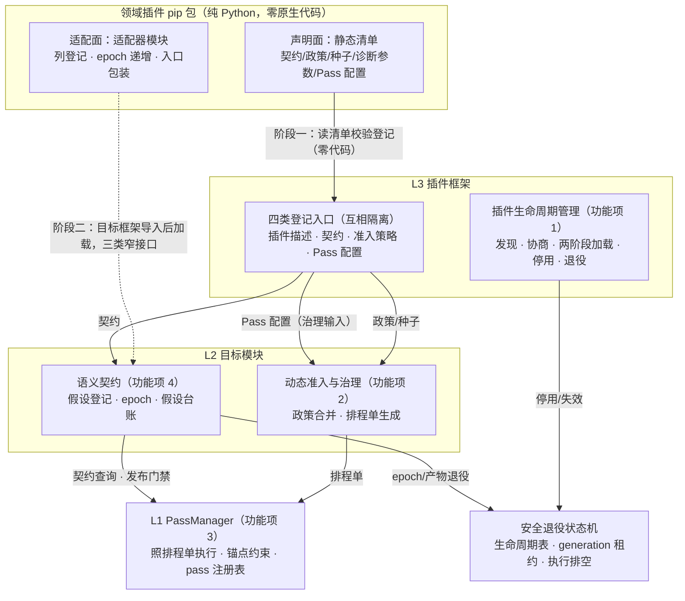

# 功能设计说明书 — CinderX 支持插件化

## 产品版本&密级

| 项目 | 内容 |
| --- | --- |
| 产品/方案 | CinderX Runtime Core / 插件框架（L3）与配套机制 |
| 文档版本 | 2.1 |
| 方案阶段 | 目标架构迁移路线 Phase A/B0/B1 的功能级展开 |
| 密级 | 内部技术设计 |
| 适用范围 | L3 插件框架（生命周期管理）；准入治理、编译管线、语义契约的插件化接口 |
| 事实基线 | CinderX 主线 `ba5ecb4d`（本文 file:line 锚点按该版本） |
| 上游文档 | 《【架构设计】CinderX 增强运行时》（`docs/design/【架构设计】CinderX增强运行时.md`） |
| 关联文档 | 《【功能设计】CinderX 支持数据工程领域插件》（`docs/design/data-engineering-plugin/`） |

## 拟制信息

| 项目 | 内容 |
| --- | --- |
| 拟制日期 | 2026-08-23（V2.1 重写于 2026-08-28） |
| 拟制方式 | 基于上游架构设计与 CinderX 主线代码形成 |
| 文档状态 | 待评审 |

## 修订记录

| 日期 | 版本 | 修改描述 |
|------|------|---------|
| 2026-08-23 | V1.0 | 初始版本 |
| 2026-08-24 | V1.1–V1.9 | 九轮评审演进：排程单改为基线模板+覆盖层并修正管线盘点；退役模型改为（地址, 代号）双元组比较；信任链机制逐步细化；批上下文接口并入列登记族并随 SPI 版本化；模板分 production/diagnostic 两类并发布隔离 |
| 2026-08-27 | V2.0 | 全文重写：术语与叙述口径全文统一；安装面收敛为 pip——插件经 `pip install cinderx[udf]` 的 extras 带入，首版按"pip 安装即可信"口径运行，原信任链机制压缩为后续版本增强备注；补入 `sys.meta_path` 延迟挂接因果链 |
| 2026-08-28 | V2.1 | 功能项按逻辑架构重划为四个：插件生命周期管理、准入治理插件化、编译管线插件化、语义契约插件化；**移除已否决的能力申请通道**（清单字段、接口、SR 全部删除，非目标显式记录）；各功能项按"功能是什么、用来干什么 → 从头到尾流程 → 架构模块交集（提供接口/调用接口/执行操作）"重述 |

## Keywords 关键词

插件框架、插件生命周期管理、声明面/适配面、静态清单、两阶段加载、四类登记入口、窄接口、政策叠加、准入治理插件化、排程单、PassManager、锚点组、域重写锚点、正确性骨架、语义契约插件化、假设台账、停用、安全退役、generation 租约

## Abstract 摘要

本文档设计 CinderX 的插件化能力：把"领域扩展 CinderX"从改编译器改为经登记接口供给知识。插件是纯 Python 的 pip 包，用户通过 `pip install cinderx[udf]` 这类可选依赖组无感带入。功能域按逻辑架构划分为四个功能项：**① 插件生命周期管理**——插件从安装、发现、协商、登记、延迟激活到停用、退役的全过程，进出都不影响作业与其他插件；**② 准入治理插件化**——把"哪类代码值得编译、多早编译、什么时候刻意不编译"这些准入知识做成插件可声明的政策（先验权重、窗口、阈值、种子），决策权留在动态准入；**③ 编译管线插件化**——把写死的 pass 序列改成"注册表 + 排程单"的编排机制，向插件开放树内 pass 的启用与配置这一治理输入，正确性骨架不可关闭；**④ 语义契约插件化**——把插件对世界的假设（结构不变、缓冲归属、数值档位）变成可登记、可守卫、可失效的契约，并定义适配器与 Core 交互的三类窄接口（列登记、epoch、入口包装）。能力申请通道已否决，不在本文范围。

## List of abbreviations 缩略语清单

| 缩略语 | 英文全称 | 中文名 |
|--------|---------|--------|
| AutoJIT | Automatic JIT Admission | 动态准入（编不编的唯一决策者） |
| HIR | High-level Intermediate Representation | 高层中间表示 |
| JIT | Just-in-Time Compilation | 即时编译 |
| LIR | Low-level Intermediate Representation | 低层中间表示 |
| PassManager | — | Pass 编排器（机制层，只照排程单执行） |
| SPI | Service Provider Interface | 插件接口（L3 对插件暴露的服务接口版本） |
| SR | Software Requirement | 软件（增量）需求 |
| UAF | Use-After-Free | 释放后使用（内存安全缺陷） |

## 前言

本文档为 CinderX "支持插件化"功能设计说明书，定义功能域划分、功能项实现方案、逻辑接口与 DFX 分析。本文档为功能设计（非详细设计），实现方案以伪代码、schema 与流程描述为主。

**与上游文档的关系**：《【架构设计】CinderX 增强运行时》定义 L3 的模块边界、双通道供给、树内注册表、PassManager 的机制/策略分界与安全退役；本文档把这些模块"打开"为功能项，给出可实施的接口、流程、验收口径与影响点，不重复论证架构决策。数据面向量化、描述符判界细则与领域插件实现由《【功能设计】CinderX 支持数据工程领域插件》承载，本文只定义其依赖的登记与编排接口。

**范围**：插件生命周期管理（L3 主体）；准入治理、编译管线、语义契约三个子系统的插件化接口；最小安全退役闭环。

**非目标**：数据面向量化机制（由领域功能设计承载）；诊断权限体系的完整建设；subinterpreter 支持；运行期完整热卸载（插件集启动期固定，见功能项 1）；供应链签名机制（首版按"pip 安装即可信"口径，见功能项 1）；**能力申请通道（已否决）**——不为插件提供"申请新内核进树内"的通道，树内注册表演进由 Core 仓库治理。

---

# 功能域：CinderX 支持插件化

## 功能域概述

### 问题：扩展 CinderX 的唯一途径是改编译器

基线上不存在插件接入面，领域需求只能以硬编码形态进入 Core 仓库：

| 现状 | 基线证据 | 后果 |
|------|---------|------|
| 优化能力焊死在固定编译序列 | `cinderx/Jit/compiler.cpp:75-157` 的固定 pass 序列 + 开关位集；唯一 pass 注册表在 `RuntimeTests/main.cpp`（测试专用） | 新优化 = 改编译器；没有运行时登记机制 |
| 领域知识以环境变量硬编码 | `cinderx/PythonLib/_cinderx_auto.py:48-77`：环境变量 + 硬编码 token | 领域知识（窗口、先验）无法随插件分发 |
| 没有发现/协商机制 | 启动引导只有 `cinderx.pth`（内容 `import _cinderx_auto`） | 第三方供给物没有受控进入路径 |

### 解决方案：登记接口 + 两条供给通道

插件化 = Core 提供**登记类接口**（只收数据与少量受信窄接口调用，不收变换代码），插件按两条通道供给：

| 通道 | 载体 | 内容 | 需要执行插件代码吗 |
|------|------|------|------------------|
| 声明面 | wheel `.dist-info` 内静态清单 `cinderx_plugin.json` + 数据文件 | 插件描述、契约（槽位声明/档位申请）、准入政策（先验权重/窗口/阈值）、画像种子、诊断参数、Pass 配置 | 否——启动期读文件、校验、登记 |
| 适配面 | 清单 `adapter` 字段声明的适配器模块（目标框架导入后按需加载） | 列登记（`request_descriptor`/`bind_batch`/`release_batch`）、失效递增（`bump`）、入口包装（`wrap_entry`） | 是——同进程 Python，只经三类窄接口 |

**为什么适配面必须是代码而不是 Core 内置的声明式解释**：适配器翻译的是**活的运行期对象**——定位一个列的缓冲常要调用框架自身的 API（chunk 拼接、按批切片），静态映射表只覆盖无计算的固定布局；入口包装是"包装任意方法还要保持透传"的高阶动作，数据表达不了；Core 也不可能为无穷多的框架内置适配器。所以边界定为：**能写成数据的全部走声明面（零代码执行），必须写代码的部分收敛为三类窄接口（Core 逐一校验）**。不需要运行期能力的插件可以是纯声明插件（连适配器都没有）。

四条不变量（本文全部功能项的底线）：

1. **插件分发物零原生代码**：闭包里出现任何二进制原生扩展即拒载。
2. **Core 是全部变换与机器码的唯一持有者**：插件不是"变换者"也不是"供码者"。
3. **准入决策权唯一**：插件政策只提供倾向（先验权重、窗口、阈值），拍板的永远是动态准入。
4. **可退化**：插件缺失、校验失败、登记异常、停用，Core 与其他插件不受影响，作业按原语义继续。

### 核心概念

| 概念 | 定义 |
|------|------|
| 插件身份 | `{id, spi_version, runtime_abi}` 三元组；id 为全局唯一稳定标识（如 `cinderx-plugin-dataeng`） |
| SPI 版本 | L3 对插件暴露的接口主版本；主版本精确匹配，不匹配不是报错而是"不可用"（unavailable） |
| runtime_abi | 运行时兼容信息 `{python_version, soabi, core_build_id, cpu_caps}`；任一不符即 unavailable |
| 排程单（Schedule） | 一次编译的执行策略 = 基线模板（构建期登记、不可变的步骤实例表）+ 覆盖层（只能开关可选优化步骤）；由治理侧生成、PassManager 照单执行 |
| 正确性骨架 | 基线模板中覆盖层不得关闭的步骤：SSA 化、引用计数插桩（无条件执行）与退回状态维护（生产模板） |
| generation 租约 | 一切"想引用某个生命周期对象"的代码点，必须先取（身份, 代号）租约并复核对象仍为 active——防住退役进行中的迟到引用 |
| 停用（deactivate） | 运行期受理的插件级失效：Core 拒绝其后续调用并退役关联产物；完整卸载随进程重启完成 |

### 能力范围与功能项划分

| 功能项 | 对应逻辑架构模块 | 一句话边界 |
|--------|----------------|-----------|
| 功能项 1：插件生命周期管理 | L3 插件生命周期管理 | 插件从安装、发现、登记、延迟激活到停用、退役的全程，进出不惊动作业 |
| 功能项 2：准入治理插件化 | L2 动态准入与优化治理 | 准入知识（先验/窗口/阈值/种子）以政策数据进入决策证据 |
| 功能项 3：编译管线插件化 | L1 PassManager 与排程单 | pass 编排机制化，插件 Pass 配置作为治理输入，骨架不可关 |
| 功能项 4：语义契约插件化 | L2 语义契约管理 | 假设以契约登记、装守卫、可失效；适配器三类窄接口 |

## 功能域总体方案



四条设计原则：

- **先声明后适配**：一切不执行插件代码就能完成的事（发现、协商、登记）都在不 import 插件的前提下完成。
- **登记即数据**：四类入口登记的全部是版本化 schema 的数据；单条数据格式不对只拒那一条。
- **机制/策略分界**：PassManager 照排程单执行，不做取舍；治理生成排程单，不碰机制。
- **撤销即退役**：不存在"从注册表摘掉就完事"的撤销；一切失效走安全退役状态机。

**阶段交付**（对应架构迁移路线 Phase A/B0/B1）：

| 交付段 | 功能项 | 出口判据 |
|--------|--------|---------|
| Phase A 底座 | 功能项 1 | 发现确定性；预算按插件粒度生效 |
| Phase B0 编排 | 功能项 3 增量 I1–I4、I6a（可与 A 并行） | 无行为漂移（golden 全绿）；排程单可下发且骨架校验生效 |
| Phase B1 最小闭环 | 功能项 1（两阶段加载与停用）+ 功能项 4（台账门禁） | 四入口登记 + 快照发布 + 假设台账门禁 + 最小退役闭环可用 |
| 参考插件（并行） | 数据工程插件垂直切片：M0 收益曲线即刻启动，M1+ 依赖 B1 | 架构 Phase C 预注册指标；插件侧接入 ≤ 2 人周 |

## 功能域规格设计

| 规格项 | 要求 |
|--------|------|
| 零原生代码 | 插件闭包内出现任何原生二进制一律拒载；领域库（NumPy/Daft 等）本身不是插件依赖，其原生制品经受信桥接目录条目管理（架构裁决 8） |
| SPI 协商 | 主版本精确匹配；`runtime_abi` 任一分量不符 → unavailable 并计入诊断，进程继续 |
| 登记隔离 | 四类入口数据按插件命名空间隔离；A 插件的登记项不可见、不可覆盖 B 插件的登记项 |
| 可退化范围 | 覆盖"导入前拒绝"与"Core 登记数据回滚"；适配器导入后的进程内副作用不在撤销范围（见核心契约信任边界） |
| 插件集固定 | 插件集启动期固定：运行期只受理停用，不受理卸载；完整卸载随进程重启完成（功能项 1） |
| 启动预算 | 预算按插件粒度：单个插件超预算仅其自身 unavailable，处理顺序固定、集合不截断 |
| 零插件等价 | 不装任何插件时行为与基线一致（现网 setup provider 语义由 Core 内置默认层保持，功能项 2） |
| 排程单安全 | 覆盖层只能开关可选优化步骤；骨架被关即整单拒绝；取舍只影响快慢不影响对错 |
| 停用安全 | 停用完成后不存在对插件登记数据的活引用、不存在悬垂补丁；保守持有态总量有界 |

## 核心契约：插件供给物与窄接口

本节定义所有功能项共享的 schema 与接口语义，各功能项引用本节，不再重复定义。

### 静态清单（`cinderx_plugin.json`）字段

| 字段 | 类型 | 约束 | 登记入口 |
|------|------|------|---------|
| `id` | string | 全局唯一，进程内二次登记同 id 拒绝 | 插件描述 |
| `spi_version` | string | L3 SPI 主版本，精确匹配 | 插件描述 |
| `runtime_abi` | object | `{python_version, soabi, core_build_id, cpu_caps}` | 插件描述 |
| `target_capabilities` | list[string] | 依赖的 Core 能力名；Core 不具备即 unavailable | 插件描述 |
| `provides.contracts[]` | list | 槽位声明、结构签名假设、档位申请（只申请不授权）、库入口运行时绑定（纯数据对） | 契约 |
| `provides.policies[]` | list | 准入政策：先验权重、作业窗口、阈值偏置、命名空间配额 | 准入策略 |
| `provides.seeds[]` | list | 画像种子文件引用（版本化，随包分发） | 准入策略 |
| `provides.diagnostics` | object | 诊断参数（命名空间计数开关） | 准入策略 |
| `provides.pass` | object | 树内 pass 的启用与配置（仅治理输入，不直接写入排程单） | Pass 配置 |
| `adapter` | object | **可选**——适配器入口与适配目标（框架模块名）；纯声明插件缺省 | 插件描述 |

（数据工程插件的真实清单示例与逐字段讲解见《【功能设计】CinderX 支持数据工程领域插件》功能项 2。）

### 适配面三类窄接口

适配器对 Core 的全部交互收敛为三类 API 族（Core 提供，适配器只调用）：

| 接口族 | 语义 |
|--------|------|
| 列登记族 `request_descriptor(req)` / `bind_batch(slots, handles)` / `release_batch(ctx)` | 登记一列（Core 判界后发放描述符，失败返回原因、该列放弃加速）；把一批数据与登记绑定（压入本线程批栈）；批结束解除绑定（finally 语义；校验线程一致、栈顶、未重复释放，不符拒绝弹栈并审计） |
| epoch 族 `register_epoch(key)` / `bump(epoch)` | 获取失效时钟（key 必须在阶段一声明的契约条目内）；原子递增（速率受限） |
| 入口包装 `wrap_entry(obj, attr, on_change)` | 把目标对象的必经变异路径引流过包装入口；返回带身份与代号的**可撤销句柄**（回调不得抛异常；停用时统一撤销，杜绝插件回调残留） |

**适配器生命周期入口**（方向相反：Core 调用适配器）：Core 在阶段二加载适配器后调用其导出的 `activate(ctx)` / `deactivate()`——`ctx` 绑定插件身份与命名空间，此后窄接口调用全部归属到该身份；两个入口均幂等。停用后窄接口对该插件一律返回不可用。

### 信任边界声明

适配器是同进程 Python 代码，与用户作业代码同级权限：**窄接口是职责边界，不是权限隔离**——它保证"适配器只能做三类事，且 Core 对这三类事逐一校验（判界、限速、可撤销）"，不承诺防恶意代码；恶意代码的防线在 pip 供应链（首版口径："经 pip 从受信源安装的插件即可信"，见功能项 1）。同理，"一个插件出 bug 不影响别的插件"的保证范围是**登记数据面与故障面**（异常被接住、登记可回滚、产物可退役），不是权限面。

---

## 功能项 1：插件生命周期管理

### 功能概述

**这个功能是什么**：管理插件从装上到退场的全过程——安装、发现、协商、登记（两阶段加载的第一阶段）、延迟激活（第二阶段）、停用、退役。

**用来干什么**：给领域扩展一条唯一的进出路径。进：用户 `pip install cinderx[udf]` 之后一切自动发生，不感知"插件"这个安装单元；出：停用与失效不惊动作业、不影响其他插件，资源回收不带安全隐患（无释放后使用、无悬垂补丁）。

| 要点 | 内容 |
|------|------|
| 管理对象 | 插件包（声明面数据 + 适配器代码）及其登记数据、关联编译产物 |
| 全程是否执行插件代码 | 只在延迟激活之后执行（且只经三类窄接口） |
| 停用语义 | 运行期停用 + 重启边界完整卸载（插件集启动期固定） |

### 功能流程

**① 安装与发现**。插件是普通的 Python 包（如 `cinderx-plugin-dataeng`），由 `cinderx` 的可选依赖组带入：`pip install cinderx[udf]` 只是让 pip 多装一个纯 Python 包。解释器启动时（基线引导 `cinderx.pth` → `_cinderx_auto.py` 保持不变），`cinderx.plugins.discover()` 枚举已安装发行版里的 `cinderx_plugin.json`——不 import、不需要 entry point（纯声明插件同样能被发现与登记），按发行版名排序保证确定性，预算按插件粒度（清单大小、条目数设上限，超限仅该插件 unavailable）。

**② 协商**。读清单后立即进行（仍不 import）：SPI 主版本、Python 小版本、SOABI、Core 构建标识、CPU 能力、能力依赖逐项核对，任一不符标记 unavailable 并计入诊断——版本不兼容不是安装失败，是"这个插件在本进程不可用"。

**③ 阶段一登记**。`provides` 四类数据（契约/政策/种子与诊断参数/Pass 配置）逐条 schema 校验后经四类登记入口进入 L2 目标模块（语义契约、动态准入治理——见功能项 2/4）。登记按命名空间构建**不可变快照**、构建完成后原子安装——编译与准入线程不会观察到半登记状态。故障粒度三级：单条 schema 失败只拒该条；入口数据文件缺失拒该入口全部条目；插件级失败（协商等）整插件 unavailable。`target_capabilities` 构成原子能力组（全组通过才可见）。**到此为止，插件的代码一行都没有执行。**

**④ 延迟激活**。适配器在**目标框架被导入之后**才加载。因果链（Daft 实例见数据工程功能项 1）：

```text
① 解释器启动，discover() 读清单：
     adapter 字段声明"适配目标模块 = daft"——此刻只是记下目标，
     不加载适配器（框架尚未导入，内存里没有可包装的东西）
② cinderx 在 sys.meta_path 头部插入一个观察查找器：
     此后任何模块加载完成都会先经过它（Python 导入机制的公开扩展点；
     观察器只观察透传，不拦截改写 finder/loader）
③ 用户作业执行 import daft：
     模块初始化完成、进入 sys.modules → 观察查找器被触发
     （此刻 import 语句还没返回给用户代码）→ 命中适配目标 → 触发阶段二
④ 加载适配器 → activate(ctx) → 挂钩框架入口：
     此刻框架模块对象已在内存，可安全替换/包装
⑤ import 返回：
     用户后续写框架的注册装饰器时，拿到的必然是包装版——不存在漏网路径
```

时序为什么**不早不晚恰好**：早于③框架不在内存，没有可包装的东西；晚于③用户的装饰器可能已经执行完，注册就漏了。③的触发点在"模块加载完成 → import 返回"之间，这个窗口由 Python 导入机制本身保证。cinderx 自己**绝不 import 框架**——装了插件但作业不用该框架的进程，一行适配器代码都不执行。阶段二也可由部署配置或插件显式请求提前触发（注册式挂接依赖"先于用户注册"在场，若等"Core 首次需要列登记"才触发会死锁：不挂接 → 无槽位登记 → 无列登记需求 → 永不激活）。

**⑤ 运行**。适配器经三类窄接口工作（接口语义与校验归功能项 4），Core 对每次调用做归属、限流与审计。

**⑥ 停用**。触发条件：吊销、信任失败、插件请求。动作顺序：① Core **原子封禁**（登记快照与三类窄接口立即对该插件拒载，不依赖插件配合）；② 按前向索引（命名空间 → 产物集）退役其全部关联产物；③ `deactivate()` 作为尽力通知发出（不等待）；④ 适配器代码驻留（Python 模块不可卸载）；⑤ 审计并上报**强制限时重启**——截止期限到达仍未完成接管确认时，进程本地停止接流并退出，不依赖控制面在线。完整卸载（登记数据释放、模块消失）随进程重启自然完成。

**⑦ 退役**。失效触发（epoch 递增、代码死亡、注册集版本变化、插件停用）后，生命周期对象（epoch 单元、编译产物、补丁队列项）沿六步状态机回收，固定顺序、不可跳步：

1. **登记**：对象进生命周期表，建立强引用并分配代号（generation）。
2. **失效触发**：状态原子迁移为 retiring。
3. **入口切换**：间接入口切回解释器或保守版本；新进入者必须先取 generation 租约并复核状态仍是 active——防住"退役进行中又有人引用上"的竞态。
4. **执行排空**：以活动执行计数判定（进入产物递增、退出递减），不靠超时。挂起的 generator/coroutine 也是持有点——先枚举持有者、把恢复入口转为解释器形态，各自递减。宽限期内排不空 → 对长寿帧注入强制退回检查；再超期 → 进入**保守持有态**（不释放、总量有配置上界；达界触发全局熔断——受影响入口全部切回解释器并上报强制重启）——绝不带活引用释放。
5. **补丁注销**：移除该产物全部待落补丁，杜绝"补丁命中已回收代码"。
6. **最后释放**：引用归零后按依赖序释放（机器码 → epoch 单元 → 登记数据可见性）。epoch 防复用以**（地址, 代号）双元组比较**实现：地址可复用，但新单元必有新代号，旧机器码读旧代号一律失效。

**⑧ 重启边界**。完整卸载随进程终止完成；保守持有态同样随重启消解。

### 架构模块交集

| 架构模块 | 角色 | 内容 |
|----------|------|------|
| `cinderx.pth` / `_cinderx_auto.py` | 执行操作 | 启动引导；追加 `discover()` 调度点（保持既有语义） |
| L3 插件框架 | 提供接口 | `discover()` / `status()`：发现、校验、协商、快照发布、停用受理 |
| 插件包 | 提供接口 | 静态清单（声明面数据）；适配器导出 `activate(ctx)` / `deactivate()`（被 Core 调用，幂等） |
| L3 观察查找器 | 执行操作 | `sys.meta_path` 注册，只观察透传；命中适配目标触发阶段二加载 |
| L2 准入治理 / 语义契约 | 被调用 | 消费阶段一登记的数据（功能项 2/4 的登记入口） |
| 生命周期表 | 提供接口 | `acquire()`（generation 租约）/ `retire()` / 计数与状态查询；执行状态机驱动与双向索引维护 |
| 函数入口缓存、补丁队列 | 执行操作 | 入口切换与租约复核（`context.cpp:190-226` 入口缓存区域）；补丁注销（锁序固定：生命周期表 → 补丁队列） |
| `_cinderx` 模块 | 提供接口 | 构建标识与 CPU/NUMA 能力探测导出（协商输入，基线无现成接口，新增） |

### 实现细则

- **协商决策表**：SPI 主版本 / Python 小版本 / SOABI / Core build-id / CPU 能力 / target_capabilities / 插件 id 七项，任一不符 unavailable（原因枚举进诊断）。
- **双向索引与计数配对**：产物发布时登记归属（消费的假设/epoch/描述符/排程单指纹与命名空间）并维护前向索引（命名空间 → 产物集）——未登记归属的产物不得发布（发布门禁一票否决）。执行计数点成对闭合：普通入口/静态入口/OSR 进入/挂起恢复（取租约并递增）↔ 正常返回/出口退出/退回/重放完成/挂起转换完成（各自递减）；"执行计数 + 持有者数 = 活动引用总数"作为断言持续校验。
- **保守持有态有界性**：总量受配置上界；达界后新对象不再进入该态也绝不回退 active，触发全局熔断 + 强制重启上报——内存上界因此成立。
- **拒载原因枚举**（诊断面）：`spi_mismatch / py_mismatch / soabi_mismatch / build_mismatch / cpu_insufficient / capability_missing / id_conflict / schema_invalid / native_in_closure`。
- **信任口径**：首版按"经 pip 从受信源安装的插件即可信"运行；登记接口已为校验留位，后续版本可引入签名清单、防回滚水位、受控加载等强化，不改变本文接口形态。

### 增量 SR 清单

| SR 编号 | 描述 |
|---------|------|
| SR-PF-001 | 插件应作为普通 pip 包经 `cinderx` 的 extras 分发（如 `cinderx[udf]`），不引入独立安装单元或部署工具 |
| SR-PF-002 | 系统应经 `.dist-info` 静态清单发现已安装插件（无需 entry point，纯声明插件可发现），并在 import 插件代码之前完成全部校验 |
| SR-PF-003 | 协商应按决策表执行（SPI/ABI/CPU/能力/id），任一不符应将插件标记为 unavailable 且进程继续 |
| SR-PF-004 | 插件闭包内出现任何原生二进制应无条件拒载 |
| SR-PF-005 | 发现与声明面校验应受按插件粒度的预算门禁约束：单个插件超预算仅其自身 unavailable |
| SR-PF-006 | 首版信任口径应为"pip 安装即可信"；签名校验等供应链强化作为后续版本增强，不改变登记接口形态 |
| SR-PF-007 | 系统应支持两阶段加载：阶段一登记零插件代码执行；阶段二经目标框架导入完成事件（`sys.meta_path` 观察）延迟触发，加载后调用 `activate(ctx)`，生命周期入口幂等 |
| SR-PF-008 | cinderx 不应主动 import 任何目标框架；未触发阶段二的插件适配器零成本 |
| SR-PF-009 | 声明面应按命名空间不可变快照原子发布；单条 schema 失败只拒该条；`target_capabilities` 为原子能力组；条目间依赖（depends_on）成环或被拒时按拓扑传递不可见 |
| SR-PF-010 | 编译与准入线程只应读取已发布的登记快照，不得观察部分登记状态 |
| SR-PF-011 | 运行期插件停用应 Core 原子封禁先行（不依赖插件配合），按前向索引退役关联产物并撤销登记可见性；完整卸载在重启边界完成 |
| SR-PF-012 | epoch 单元、编译产物与补丁器应登记进生命周期表并带原子状态（active/retiring/retired/保守持有）与代号 |
| SR-PF-013 | 一切再引用点（入口/OSR/编译发布/挂起恢复/补丁入队）应在取得引用前取 generation 租约并复核状态，失败放弃引用 |
| SR-PF-014 | 执行排空应以活动执行计数判定（计数点闭合清单），挂起 generator/coroutine 应先完成恢复入口转换 |
| SR-PF-015 | 补丁注销应先于最后释放；锁序固定为生命周期表 → 补丁队列 |
| SR-PF-016 | epoch 防复用应以（地址, 代号）双元组比较实现：单元内存正常释放、地址可复用，旧代号读取一律失效 |
| SR-PF-017 | 宽限期超期应升级为强制退回检查，再超期应进入保守持有态并上报强制重启；保守持有态总量应有上界，达界触发全局熔断 |
| SR-PF-018 | 产物发布时应登记归属与前向索引（未登记不得发布）；强制重启截止期限到达仍未完成接管确认时，进程应本地停止接流并退出 |

### DFX 分析

#### 可靠性分析

##### FMEA 分析

| 失效模式 | 影响 | 原因 | 检测手段 | 补偿措施 |
|---------|------|------|---------|---------|
| 清单 schema 非法 | 条目不可用 | 插件缺陷 | schema 校验 | 条目级拒绝 + 诊断计数 |
| 版本不匹配 | 插件不可用 | 版本演进 | 协商 | unavailable + 原因枚举 |
| 适配器加载/激活抛异常 | 插件不可用 | 适配器缺陷 | 加载包裹 | 回滚已登记快照（走退役），进程继续 |
| 挂接晚于用户注册 | 该框架 UDF 漏挂（静默无收益） | 挂接次序错误 | 次序 Contract Tests | 漏挂等价未安装；诊断计数 |
| 启动期插件拖慢解释器 | 启动延迟 | 清单过大/过多 | 预算门禁 | 按插件粒度 unavailable，不阻塞启动 |
| 迟到补丁入队 | 补丁命中已回收代码 | 注销与入队竞态 | 锁序 + 租约 | 入队前复核，Stale 拒绝 |
| 挂起对象枚举遗漏 | 计数不减→无法释放 | 登记面不全 | 持有者登记 + 转换完备性测试 | 宽限→强制退回→保守持有兜底（绝不释放） |
| 关联产物漏退役 | 停用后产物仍引用插件数据 | 归属/前向索引登记不全 | 索引完整性断言（发布门禁） | 未登记不得发布；遗漏按保守处置 |
| 同地址复用 | 旧机器码误判有效 | 分配器复用 | 双元组比较 | 新单元代号不同 → 失效 |
| 长寿帧 | 退役永久阻塞 | 业务长循环 | 宽限期监控 | 强制退回检查点；保守持有 + 重启上报 |
| 停用后适配器线程残留 | 后台副作用持续 | 线程/hook 不可回收 | 停用计数与线程清单审计 | 原子封禁 + 强制限时重启 |

#### 可服务性分析

`status()` 查询插件状态与拒载原因；退役各阶段计数、保守持有对象（只读，含身份/代号/持有者统计）进诊断；启动预算实测校准（目标：插件集 <100 时发现+校验增量 <50ms）。

#### 安全设计检查

信任入口为 pip 供应链；Core 侧控制点 = 零原生强制 + 内容校验（判界/门禁/台账在消费侧，不因"可信"而省略）。退役机制消除悬垂补丁与释放后使用两类内存安全缺陷；重启上报只含元数据。

#### 可用性/性能分析

发现与校验为启动期一次性纯文件操作；适配器不加载则零成本。租约为每再引用点一次原子读 + 复核（目标 <1% 入口开销）；无退役发生时全部为无竞争快路径。

### 影响点列表

| 模块 | 文件 | 影响描述 |
|------|------|---------|
| 启动引导 | `cinderx/PythonLib/cinderx.pth`、`_cinderx_auto.py` | 保持引导语义，追加 `discover()` 调度点 |
| L3 框架 | `cinderx/PythonLib/cinderx/plugins/`（新建） | 发现、协商、两阶段加载、`sys.meta_path` 观察、快照发布、停用受理 |
| 生命周期表 | `cinderx/Jit/contracts/`（新建） | LifecycleTable、租约、状态机驱动、双向索引 |
| 入口切换 | `cinderx/Jit/context.cpp`（入口缓存区域） | 入口取租约与复核；间接入口切回 |
| 补丁队列 | `cinderx/Jit/type_deopt_patchers.*`、`code_patcher.*` | 注销顺序与锁序；onUnpatch abort 路径改造（`type_deopt_patchers.cpp:45-49`） |
| 挂起对象 | `cinderx/Jit/gen_data_footer.h`、`generators_rt.cpp` | 持有者登记与恢复入口转换 |
| 能力探测 | `_cinderx` 模块导出（新增） | 构建标识与 CPU/NUMA 能力探测 |

### 分配需求

| 需求编号 | 描述 |
|---------|------|
| REQ-PF-001 | 插件应可被发现、登记、延迟激活、停用与安全退役，全程零插件代码执行（激活后除外）且不影响作业与其他插件 |

（对应架构 AR-01、AR-10 与"安全退役"节。）

---

## 功能项 2：准入治理插件化

### 功能概述

**这个功能是什么**：把准入知识——"哪类代码值得编译、多早编译、什么时候刻意不编译、编译预算给多少"——做成插件可以用纯数据声明的政策（先验权重、作业窗口、阈值偏置、命名空间配额）与画像种子。

**用来干什么**：让领域经验（比如"字符串列上的逐元素循环通常值得早点编译"）从进程冷启动就进入准入决策，而不是等 Core 自己慢慢试错；同时决策权完整留在动态准入——政策只是证据，不是命令。

| 要点 | 内容 |
|------|------|
| 供给形态 | 纯数据（清单 `provides.policies` / `provides.seeds`），零代码执行 |
| 决策权归属 | 动态准入唯一；政策只偏置 |
| 更新方式 | 改 JSON 数据发新版本，用户 `pip install -U` 获得，不改 Core |

### 功能流程

**① 政策编写**。插件作者按字段白名单写四类政策：先验权重（循环家族 → 0~1 可信度）、作业窗口（某阶段不编译）、阈值偏置（按 dtype 的批量门槛）、命名空间配额（编译预算与负缓存）；需要冷启动画像时附种子文件引用。（本域取值实例见数据工程功能项 2。）

**② 分发与登记**。随插件包 pip 分发；启动期经 L3 准入策略入口登记（功能项 1 流程③），schema 校验、条目级拒绝。

**③ 合并**。动态准入的政策合并器把多方输入按权威序合并：部署方显式配置 >（缺省）插件 id 字典序（稳定 tie-break）；清单不携带优先级字段——插件不能自抬治理权。Core 内置默认层以最低权威参与同一管道。

**④ 缓存**。合并结果按政策集指纹缓存——同一插件集与同一部署配置的合并结果唯一且可复现，热路径读缓存，O(1)。

**⑤ 生效**。动态准入的热度评估点在每批执行计数更新时按合并缓存的算分为该函数判定是否过编译门槛。

**⑥ 在线反馈**。运行反馈（退回计数、收益统计，来自语义观察）写回准入模块的**本地修正系数**：编译后反复退回 → 系数下调直至退避冻结；稳定高收益 → 系数上调。插件政策本身不变，修正叠加其上——政策是静态建议，修正由 Core 持有。

**⑦ 政策更新**。阈值标定、先验调整都只改插件包里的 JSON 数据，发新版本即生效。

### 架构模块交集

| 架构模块 | 角色 | 内容 |
|----------|------|------|
| 插件声明面 | 提供接口 | 政策与种子数据（清单 `provides.policies` / `seeds`，版本化 schema） |
| L3 准入策略入口 | 执行操作 | 登记：schema 校验、条目级拒绝、命名空间隔离 |
| 动态准入·政策合并器 | 执行操作 | 按权威序合并、逐字段冲突规则、结果缓存（键 = 叠加集指纹）；排程单生成时并入 Pass 配置 |
| 动态准入·热度评估点 | 消费接口 | 每批计数更新时按缓存打分（O(1)），决定编译/延迟/放弃/晋升 |
| 语义观察与反馈 | 提供接口 | 退回计数、收益统计、值/形状画像（修正系数的输入） |
| 部署方 | 执行操作 | 显式配置（最高权威）；静态画像数据供给 |
| `_cinderx_auto.py` 硬编码 token | 迁移对象 | 现网 setup provider 语义（`_cinderx_auto.py:48-77`）转为 Core 内置默认层，走同一合并管道 |

### 实现细则

```python
def merge_policy_overlays(base, overlays):
    # 权威顺序：部署方显式配置 >（缺省）插件 id 字典序（稳定 tie-break）
    # 只作用于白名单字段：先验权重、窗口、阈值、配额、种子
    # 逐字段冲突规则：阈值取更保守值、窗口取并集、先验权重可加和（受全局封顶）、配额取最小
    for ov in sorted(overlays, key=lambda o: (o.authority, o.plugin_id)):
        base.apply(ov.fields)
    return base    # 结果确定 → 指纹稳定，进政策/排程单缓存键
```

两层合并不变量：① **正确性与资源维度不放宽**——窗口并集只延迟编译、阈值取更保守、配额取最小；② **准入倾向维度允许正向调整**（先验权重、热度偏置——这是插件的存在意义），但叠加后的编译预算与速率不得超过全局上限。内置默认层是 Core 默认行为的永久组成，不因插件覆盖率移除（可退役的只是插件对同字段的重复供给）。

### 增量 SR 清单

| SR 编号 | 描述 |
|---------|------|
| SR-PF-101 | 政策叠加只应影响准入证据（先验/窗口/阈值/种子/配额），不得改变决策权归属 |
| SR-PF-102 | 政策合并的跨插件顺序应完全由部署方持有（部署配置 > 插件 id 字典序，清单不携带优先级字段），逐字段冲突规则确定，结果指纹稳定可复现 |
| SR-PF-103 | 合并应满足两层不变量：正确性与资源维度不放宽；准入倾向的正向调整受全局上限封顶 |
| SR-PF-104 | 现网 setup provider 语义应由 Core 内置默认层永久保持（零插件环境与基线等价）；内置层不因插件覆盖率移除 |
| SR-PF-105 | 画像种子应仅做冷启动偏置且运行反馈可推翻；Phase C 只消费部署方静态画像 |
| SR-PF-106 | 诊断治理参数应为低基数计数，默认关闭时零产物 |

### DFX 分析

#### 可靠性分析

##### FMEA 分析

| 失效模式 | 影响 | 原因 | 检测手段 | 补偿措施 |
|---------|------|------|---------|---------|
| 种子数据错误 | 准入选择变差（性能） | 恶意/错误种子 | 建议隔离测试（AR-04） | 只影响性能；运行反馈推翻；种子带语料指纹可追溯 |
| 政策叠加互相覆盖 | 准入行为不可预期 | 多插件同字段冲突 | 确定性合并序 | 合并指纹留档，可复现可审计 |
| 内置默认层被误删 | 零插件环境偏离基线 | 迁移失误 | 零插件等价测试（AR-10） | 内置层为永久组成，验收断言 |

#### 可服务性分析

政策合并结果、种子版本与命中可查询；合并结果可导出（排程单指纹含合并后 Pass 配置）。

#### 安全设计检查

政策与种子是建议类输入：缺失/错误/过期只允许影响性能选择（AR-04 验收：删除/篡改不改变正确性测试结果）。

#### 可用性/性能分析

政策合并为启动期/按需一次性（缓存键 = 叠加集指纹）；种子摄入为冷启动读文件；均不进热路径。

### 影响点列表

| 模块 | 文件 | 影响描述 |
|------|------|---------|
| 准入治理 | `cinderx/Jit/admission/`（新建，自 `pyjit.cpp` 拆出） | 政策合并器、种子摄入、Core 内置默认层 |
| 启动引导 | `cinderx/PythonLib/_cinderx_auto.py` | setup provider 硬编码 token 迁移为内置默认层（不直接移除） |
| 观察面 | `cinderx/Jit/observation/`（随架构 L2 交付） | 值/形状画像与种子摄入 |

### 分配需求

| 需求编号 | 描述 |
|---------|------|
| REQ-PF-101 | 领域准入知识应以纯数据政策经登记进入动态准入的证据输入，且决策权保持在动态准入 |

（对应架构 AR-04、AR-07。）

---

## 功能项 3：编译管线插件化

### 功能概述

**这个功能是什么**：把编译管线从"写死的 pass 序列"改成"注册表 + 排程单"的编排机制——PassManager 只照排程单执行；同时向插件开放**树内 pass 的启用与配置**这一治理输入。

**用来干什么**：对 Core 维护者，pass 编排机制化、取舍策略化，新优化 = 注册表条目而非改编译器；对插件，可以按域调整优化配置（比如关闭对本域负收益的 pass），而正确性骨架永远不可关闭。

| 要点 | 内容 |
|------|------|
| 机制/策略分界 | PassManager 执行排程单，不做取舍；治理生成排程单，不碰机制 |
| 排程单模型 | 基线模板（构建期登记、不可变步骤实例表）+ 覆盖层（只开关可选优化） |
| 骨架 | SSA 化、引用计数插桩（无条件）+ 退回状态维护（生产模板）；被关即整单拒绝 |

### 功能流程

**① 基线现状**。`Compiler::runPasses`（`compiler.cpp:75-157`）+ `runPass<T>()` 模板 + 开关位集——已经承担编排、门控、横切服务，只是全部写死、无注册表。重构 = 把这些职责拆出为显式模块并加注册表（**抽取，不是新造**）。

**② 抽取 PassManager**（增量 I1–I6a，见实现细则）。pass 以 PassDescriptor（锚点组/依赖/门控位/骨架位/插件可配置资格位）构建期注册；序列与门控原样迁出，验收 = 无行为漂移。

**③ 排程单生成与校验**。治理侧（动态准入）生成排程单 = 基线模板 + 覆盖层；PassManager 校验：覆盖层引用的步骤实例存在且非骨架位，骨架被关 → 整单拒绝。全局 `Config` 是生产排程单的特例；`kMinimal`/`kAll` 等预设映射为诊断类模板，其产物不得进入生产入口与缓存复用。

**④ 指纹贯穿**。排程单指纹贯穿四处，任一不一致不得复用产物：编译缓存键、产物元数据、孪生 code 去重（`auto_code_twin_dedup`，`pyjit.cpp:819,3885`）、命中校验。

**⑤ 插件 Pass 配置进入**。插件清单 `provides.pass{enabled, config}` 经 L3 Pass 配置入口登记（治理输入）→ 排程单生成时与全局配置/其他插件配置按政策合并优先级（功能项 2）合并 → 生成排程单 → PassManager 照单执行。粒度边界：仅"树内已注册且标记可配置的 pass 的启用与参数"；不提供排程模板、不指定顺序、不注册新 pass 实现。

**⑥ 域重写锚点**。优化组末尾、收尾组之前的新增挂载位——树内改写规则与向量化 pass 的挂载位置（为数据面阶段留位；硬理由与不变量见实现细则）。

### 架构模块交集

| 架构模块 | 角色 | 内容 |
|----------|------|------|
| PassManager | 提供接口 | `register(PassDescriptor)`（构建期）、`execute(func, schedule)`、`analysis_cache()`；执行锚点不变量校验、分析缓存共享、横切服务（计时/dump/校验） |
| 动态准入与治理 | 调用接口 | 经 `IF-SCHEDULE` 下发排程单（全局配置为特例）；执行排程单生成（合并 Pass 配置） |
| L3 Pass 配置入口 | 执行操作 | 登记治理输入（schema 校验；引用不可配置的 pass 拒绝登记） |
| 插件声明面 | 提供接口 | `pass{enabled, config}`（仅限带可配置资格位的 pass） |
| 编译缓存 / 孪生去重 / 命中校验 | 执行操作 | 键含排程单指纹，防不同策略错配复用 |
| 域重写锚点 | 提供接口 | 树内规则表与向量化 pass 的挂载位（本期只交付机制与不变量保证） |

### 实现细则

#### HIR Stage 调度单元盘点（抽取对象）

调度点 `Compiler::runPasses`（`compiler.cpp:82-156`），共 18 个调度单元。抽取时必须完整保留的三个事实：**Simplify + FloatAccumulatorPromotion 以组合 lambda 在三个固定点重复调用**（`compiler.cpp:102/111/119`，inliner 启用时 Simplify 单次编译最多执行 3 次）；**CleanCFG 执行两次**（DCE 前后各一）；**HIRStats 仅在开关开启时执行**。遗漏任一重复调用点或条件步骤即行为漂移。

| # | Pass | 锚点组 | 作用 | 开关 |
| - | ---- | ------ | ---- | ---- |
| 1 | SSAify | 规范化 | 栈式非 SSA → SSA（唯一可见非 SSA HIR 的 pass） | 无条件 |
| 2 | Simplify（三个固定调用点） | 优化 | 强度削减：去冗余空值检查/转换/常量容器加载 | kSimplify |
| 3 | FloatAccumulatorPromotion（与 Simplify 组合） | 优化 | `int 0` 起始 + float 累加 Phi 提升为非装箱 float | 同上 |
| 4 | DynamicComparisonElimination | 优化 | 比较+真值+分支链 → 布尔比较 | 位 |
| 5 | GuardTypeRemoval | 优化 | 删除已被约束保证的 GuardType | 位 |
| 6 | PhiElimination | 优化 | 删单输入平凡 Phi | 位 |
| 7 | InlineFunctionCalls | 优化 | HIR 级内联（需 stable frame） | kInliner |
| 8 | BeginInlinedFunctionElimination | 优化 | 去掉无需 frame 的内联包裹 | 位 |
| 9 | BuiltinLoadMethodElimination | 优化 | 内建 LoadMethod+Call → 直接 C 调用 | 位 |
| 10 | PrimitiveUnboxCSE | 优化 | 同值重复拆箱消除 | 位 |
| 11 | FloatComparisonSimplification | 优化 | float 比较 → 原生比较（依赖 ARM NaN 条件码） | AArch64 门控 + 位（**位未接 flag，随本功能项补齐**） |
| 12 | PrimitiveBoxRemat | 优化 | 非必要装箱移入退回状态供重物化 | 仅 AArch64 |
| 13 | CleanCFG（两次） | 优化 | CFG 清理（吸收跳转目标、删不可达块） | 位 |
| 14 | DeadCodeElimination | 优化 | 从副作用反向标记删无用指令 | **位未接线，管线级 DCE 当前不执行**（RefcountInsertion 内部另有 DCE 调用 `refcount_insertion.cpp:1231`，不经该位）；修复属行为改动，独立立项 |
| ★ | **域重写锚点（目标态新增）** | 优化组末尾 | 规则表与向量化 pass 的挂载位 | 见下 |
| 15 | RefcountInsertion | 收尾 | 插入引用计数增减（按最终 HIR 形态计算） | 无条件 |
| 16 | HIRStats | 收尾 | 每函数指令计数 JSON | dump 开关 |
| 17 | InsertUpdatePrevInstr | 收尾 | 维护退回解释器所需状态 | 默认 true（生产模板骨架位） |

#### 排程单 schema 与锚点不变量

```text
PassDescriptor（树内注册表条目，构建期静态注册）
  ├─ name / factory
  ├─ stage / phase_group        # 所属 Stage 与锚点组
  ├─ dependencies[]             # 显式依赖（分析与其他 pass）
  ├─ gate_flag                  # 现有开关位（可选 pass 才有）
  ├─ capabilities[]             # 能力声明（需稳定 frame、仅 AArch64 等）
  ├─ skeleton: bool             # 骨架位 = 覆盖层不得关闭的步骤
  └─ plugin_configurable: bool  # 插件 Pass 配置可否引用该 pass（默认 false）

Schedule（排程单，治理侧生成）
  ├─ template                   # 基线模板引用：有序步骤实例表
  │                                steps[{pass_name, occurrence, condition}]
  │                                ——重复调用点各占一项（occurrence 区分）
  ├─ template_class             # production | diagnostic（诊断产物发布隔离）
  ├─ overlay{}                  # 覆盖层：仅可选优化步骤实例的开关/参数
  ├─ rule_set / budget / 诊断策略
  └─ fingerprint                # (template_id + 归一化 overlay + rule_set + budget
                                 #   的代码形态相关子集) 摘要
```

**锚点不变量**：域重写锚点位于 HIR 优化组末尾、收尾组之前。硬理由：引用计数插桩按**最终** HIR 形态计算每一处增减，**它之后任何结构性改写都会使已插入的增减失效**。不变量由基线模板登记期的构建期校验保证（AR-12），运行期无重排路径。

#### 版本兼容合同

- **稳定面**（跨 CPython 版本不变，contract tests 逐版本断言）：四粒度词汇（Stage/Pass/锚点组/规则）与三锚点组结构、排程单 schema 与模板/覆盖层语义、骨架判定规则、域重写锚点位置契约。
- **允许变化面**（登记 + 逐版本差分验证背书）：HIR 指令与 pass 实现内的受控版本分支（如 `pass.cpp:326` 的类型宽度随 3.13+ 分化）、新增可选条目、schema 追加可选字段。
- **破坏性变更** = SPI 主版本递增 + 一个主版本兼容期。

#### 增量交付序列

| 增量 | 内容 | 行为影响 | 验收 |
|------|------|---------|------|
| I1 纯抽取 | `runPasses`/`runPass<T>`/门控/组合 lambda/位集迁出为 `Jit/hir/pipeline/` | 无（目标 = 无行为漂移） | golden-file + dump 逐函数对照（配置 × 架构归一化） |
| I2 注册表 | PassDescriptor 构建期注册 + 显式基线模板 | 无 | 模板 ↔ golden 实际执行序列逐项一致 |
| I3 排程单通道 | 排程单下发 + 骨架/覆盖层校验 + 全局配置映射为特例 + 指纹贯穿 | 有（可选层取舍可变） | 骨架拒绝用例 + 缓存键含指纹 |
| I4 锚点机制化 | 域重写锚点挂载位 + 构建期锚点校验（AR-12） | 无 | 模板校验单测 |
| I5 分析缓存 | requires/preserves/invalidates 失效契约 + HIR 修订号 | 有（复用分析） | 失效正确性单测 + 差分 |
| I6a flag 补齐 | FloatComparisonSimplification 暴露 CLI/env flag | 无 | flag 矩阵用例 |

I1/I2/I4 任一出现 golden 差异即阻断；I3 以"默认排程单下产物不变"为门禁。

### 增量 SR 清单

| SR 编号 | 描述 |
|---------|------|
| SR-PM-001 | PassManager 应自 `Compiler::runPasses` 抽取且无行为漂移（增量 I1；golden + dump 对照，配置 × 架构归一化） |
| SR-PM-002 | 树内 pass 应以 PassDescriptor 构建期注册并登记显式基线模板（步骤实例表逐项列出，含三个组合调用点与两次 CleanCFG）；模板与基线实际执行序列逐项一致（增量 I2） |
| SR-PM-003 | 排程单应为基线模板 + 覆盖层：覆盖层只能开关可选优化步骤，骨架步骤被关闭即整单拒绝 |
| SR-PM-004 | 引用计数插桩之后无结构性改写应由模板登记期的锚点不变量校验保证 |
| SR-PM-005 | 分析缓存共享应以 pass 的失效声明与 HIR 修订号为依据，复用不得跨 HIR 变更 |
| SR-PM-006 | 排程单应支持外部下发（全局配置为特例）；指纹应贯穿缓存键、产物元数据、孪生去重与命中校验 |
| SR-PM-007 | FloatComparisonSimplification 应暴露 flag（默认值不变）；管线级 DCE 修复独立立项；InsertUpdatePrevInstr 为生产模板骨架，不补关闭 flag |
| SR-PM-008 | PassDescriptor 应带插件可配置资格位（默认 false）；诊断类模板产物不得进入生产入口、Context、CodeExtra 或孪生复用 |
| SR-PM-009 | 插件 Pass 配置应作为治理输入并入排程单生成（与全局配置按政策合并优先级合并），不得直接写入最终排程单；引用不可配置的 pass 应拒绝登记 |

### DFX 分析

#### 可靠性分析

##### FMEA 分析

| 失效模式 | 影响 | 原因 | 检测手段 | 补偿措施 |
|---------|------|------|---------|---------|
| 抽取引入行为漂移 | 产物语义变化 | 重构失误（含遗漏重复调用点/条件步骤） | golden + dump 对照 | 验收门禁；回归即阻断 |
| 排程单关骨架 | 破坏正确性插桩 | 治理输入缺陷 | 骨架校验 | 整单拒绝 + 诊断 |
| 指纹未贯穿 | 不同策略复用旧机器码 | 缓存键缺指纹 | 指纹断言 | 缓存/去重/命中三处强制 |
| 约束环 | 编译挂死 | 注册依赖成环 | 注册期/校验期环检测 | 显式报错拒绝 |
| 分析缓存过期误用 | pass 消费脏分析 | HIR 变更后复用 | 失效契约 + 修订号 | 条目随修订号失效；差分测试 |

#### 可服务性分析

`-X jit-dump-hir-passes` 语义保持并加指纹标注；排程单拒绝原因枚举进诊断（`missing_skeleton` / `dependency_cycle` / `unknown_pass` / `pass_not_configurable`）；per-pass 计时平移。

#### 安全设计检查

排程单是治理侧输入，不是任意用户输入面；无运行期代码接入面（pass 实现全部树内构建期登记）；指纹进缓存键防错配。

#### 可用性/性能分析

注册表按名索引 O(1)；模板执行为查表（运行期不求解不排序）；抽取不改热路径结构，编译时间无回归（验收项）。

### 影响点列表

| 模块 | 文件 | 影响描述 |
|------|------|---------|
| 编排抽取 | `cinderx/Jit/compiler.cpp:37-156` | runPasses 职责迁出（含三个组合调用点与两次 CleanCFG 的完整保留） |
| PassManager | `cinderx/Jit/hir/pipeline/`（新建） | 编排机制、注册表、排程单执行、分析缓存 |
| 配置注册 | `cinderx/Jit/pyjit.cpp:1043` 起 | flag 对齐；补 FloatComparisonSimplification flag |
| 测试注册表 | `cinderx/RuntimeTests/main.cpp:64-98` | 测试注册表改为产品注册表的消费者 |
| 域重写锚点 | runPasses 优化组末尾 | 新增挂载位（本期只交付机制，规则表内容随数据面阶段填充） |

### 分配需求

| 需求编号 | 描述 |
|---------|------|
| REQ-PM-001 | 编译管线编排应机制化：PassManager 只照排程单执行，取舍归治理 |
| REQ-PM-002 | 排程单取舍只应影响性能，不应影响正确性 |

（对应架构 AR-05、AR-11、AR-12、AR-13。）

---

## 功能项 4：语义契约插件化

### 功能概述

**这个功能是什么**：把插件对世界的**假设**——"这个表结构在批内不变"（epoch 声明）、"这批缓冲属于这一列"（槽位声明与绑定段）、"允许超越函数有末位误差"（档位申请）——变成可登记、可守卫、可失效的契约；同时定义适配器与 Core 交互的三类窄接口（列登记、epoch、入口包装）。

**用来干什么**：让正确性输入有唯一的登记通道与台账——每条被编译消费的假设都有所有者、核对机制和失效动作，发布前可验证完整性；接口面收敛到三类，可审计、可版本化。

| 要点 | 内容 |
|------|------|
| 登记物 | 契约条目（受护事实 / epoch 声明 / 档位申请 / 运行时绑定对），纯数据 |
| 台账 | 每条被消费假设一条记录，发布门禁 |
| 接口面 | 三类窄接口族 + 生命周期入口，别无其他 |

### 功能流程

**① 契约编写**。插件作者在清单 `provides.contracts` 里声明契约条目：受护事实（带稳定 ID、schema 版本、断言、失效方式）、epoch 声明（失效时钟的 key）、档位申请（只申请，授权在部署方）、运行时绑定对（外部库入口身份 + 制品指纹 → 受信目录条目，纯数据）。

**② 启动期登记**。阶段一（功能项 1 流程③）逐条 schema 校验后进入语义契约管理的假设登记表；条目可声明同插件内依赖（`depends_on`），快照发布时做拓扑检查——成环该插件全部条目不可见，被依赖条目被拒则依赖它的条目一并不可见。

**③ epoch 单元发放**。声明的 epoch key 由 Core 创建单元（稳定地址整数、带代号）；适配器后续只能经句柄递增。

**④ 编译期查询与守卫安装**。前端编译时向语义契约查询适用契约，把事实翻译成守卫（epoch 读比较、结构签名比对、入口身份核对）。

**⑤ 台账记账**。每条被消费的假设产生台账记录 `{假设 ID, 所有者, 核对机制, 检查时机, 失效动作}`。

**⑥ 发布门禁**。产物发布前校验台账完整——消费了假设却没有记录，拒绝发布。不存在"错误假设悄悄进入机器码"的路径。

**⑦ 运行期验证与失效**。守卫逐次验证（epoch 不等 / 结构签名失配 / 批栈入口逐槽校验不符 → 退回解释器）；失效由适配器 `bump(epoch)` 触发（原子、速率受限、超限合并/熔断）或由结构签名自然触发。

**⑧ 档位授权**。Tier 2/3 的开启范围由部署方注册；插件只能随契约表请求，不能授权。

### 架构模块交集

| 架构模块 | 角色 | 内容 |
|----------|------|------|
| 插件声明面 | 提供接口 | 契约数据（清单 `provides.contracts`，版本化 schema） |
| L3 契约入口 | 执行操作 | 登记：schema 校验、depends_on 拓扑检查、命名空间隔离 |
| 语义契约管理 | 提供接口 | 三类窄接口族：列登记族（`request_descriptor`/`bind_batch`/`release_batch`）、epoch 族（`register_epoch`/`bump`）、入口包装（`wrap_entry`）；执行假设台账记账、epoch 单元发放、守卫安装协调、档位契约管理 |
| 适配器 | 调用接口 | 三类窄接口（与 Core 的全部交互面）；被 Core 调用 `activate`/`deactivate` |
| 前端 | 调用接口 | 编译期契约查询（事实 → 守卫） |
| 发布路径 | 调用接口 | 台账完整性校验（发布门禁，`pyjit.cpp` 原子发布点） |
| 部署方 | 执行操作 | 档位授权（Tier 2/3 开启范围） |

（窄接口的逐条语义见核心契约节；数据工程插件对各接口的调用实例见其"注册内容与接入点清单"。）

### 实现细则

```text
ContractDeclaration（契约条目，随 provides.contracts 登记）
  ├─ assumption_id   # 稳定 ID：{plugin_id}:{kind}:{name}
  ├─ schema_version
  ├─ kind            # guarded_fact | epoch_decl | tier_request | runtime_binding
  ├─ assertion       # 按 kind 的版本化 payload
  ├─ invalidation    # epoch 键 | 结构签名 | 版本
  └─ depends_on[]?   # 同插件内条目引用；快照发布时拓扑环检测与传递拒绝
```

- **epoch 滥用抑制**：递增线程安全（原子）+ 速率上限（超限周期内的递增合并为一次失效事件）+ 持续超限按命名空间熔断该插件的契约消费（诊断上报）。
- **入口包装句柄语义**：`wrap_entry` 返回带身份与代号的可撤销句柄；组合序 = 注册序（先注册者在外层）；回调不得抛异常（违规计数并吊销该句柄）、不得重入包装机制；停用时按句柄统一撤销，杜绝插件回调残留。
- **批上下文校验**：`release_batch` 校验调用线程 == bind 线程、栈顶（LIFO）、active、未重复释放，任一不符拒绝弹栈并审计；校验失败不消耗栈，批钩子 finally 重试；泄漏由生命周期表兜底（功能项 1）。批上下文族随 SPI 版本化，调用归属插件身份与命名空间；停用后 `bind_batch` 拒载。
- **守卫族与失效动作**：epoch 守卫（读稳定单元，比较（身份, 代号），不等退回）、结构签名比对（批绑定时 O(列数)）、批栈入口逐槽校验——失败动作一律"退回解释器 + 退回事件进观察反馈"。

### 增量 SR 清单

| SR 编号 | 描述 |
|---------|------|
| SR-PF-201 | 契约条目应以版本化 schema 登记（受护事实/epoch 声明/档位申请/运行时绑定对）；条目间依赖成环或被拒时按拓扑传递不可见 |
| SR-PF-202 | 每条被编译消费的假设应有假设台账记录（所有者/核对机制/检查时机/失效动作），台账不完整的产物应被拒绝发布 |
| SR-PF-203 | epoch 单元应由阶段一声明的契约条目创建（阶段二仅幂等获取）；递增应原子、速率受限、超限合并并触发命名空间熔断 |
| SR-PF-204 | 入口包装应返回带身份与代号的可撤销句柄；回调不得抛异常、不得重入；停用时应统一撤销全部句柄 |
| SR-PF-205 | 批上下文接口应归属列登记族随 SPI 版本化：调用按插件身份归属；停用后 `bind_batch` 拒载；`release_batch` 校验线程一致、栈顶、未重复释放，任一不符拒绝弹栈并审计，校验失败不消耗栈 |
| SR-PF-206 | 适配器与 Core 的全部交互应仅限三类窄接口族加生命周期入口（窄接口完备性），别无其他调用面 |

### DFX 分析

#### 可靠性分析

##### FMEA 分析

| 失效模式 | 影响 | 原因 | 检测手段 | 补偿措施 |
|---------|------|------|---------|---------|
| 假设未记账即发布 | 错误产物 | 消费面漏记账 | 台账校验 | 发布门禁拒绝（测试断言零漏检） |
| 契约 schema 错 | 条目不可用 | 插件缺陷 | schema 校验 | 条目级拒绝 + 诊断 |
| epoch 风暴 | 编译风暴/抖动 | 插件高频递增 | 速率计数 | 失效合并 + 限速 + 命名空间熔断 |
| 包装回调抛异常 | 包装链断裂 | 适配器缺陷 | 回调包裹 | 违规计数并吊销句柄 |
| 档位自授权 | 数值语义未授权重排 | 越权声明 | 授权独立于插件断言 | Tier 2/3 需部署方注册；语义门消费授权状态 |

#### 可服务性分析

台账记录可查询（按假设 ID / 产物溯源）；epoch 递增计数、熔断状态、release 校验失败计数进诊断。

#### 安全设计检查

插件不能绕过准入（政策只偏置）、不能改守卫表、不能发布产物（必须过台账与缓存键校验）、不能自行授权档位——控制点在 L2/L1 消费侧，不在插件侧。守卫失败永远可退回原语义。

#### 可用性/性能分析

台账记账为发布前一次性校验，不进热路径；守卫读取为产物入口一次整数比较/签名比对；政策合并缓存见功能项 2。

### 影响点列表

| 模块 | 文件 | 影响描述 |
|------|------|---------|
| 契约最小面 | `cinderx/Jit/contracts/`（新建） | 假设登记表（版本化 schema）、epoch 单元、假设台账与发布门禁、三类窄接口 |
| L3 框架 | `cinderx/PythonLib/cinderx/plugins/` | 契约入口的登记与快照、窄接口的归属与限流 |
| 发布路径 | `cinderx/Jit/pyjit.cpp`（发布点） | 原子发布前接入台账校验；产物归属登记 |

### 分配需求

| 需求编号 | 描述 |
|---------|------|
| REQ-PF-201 | 编译产物消费的每条假设应有唯一所有者与失效动作，未记账不得发布；适配器与 Core 的交互面应收敛为三类窄接口族 |

（对应架构 AR-02、AR-03、AR-06。）

---

## 开放问题

1. 排程单按函数下发的触发面：动态准入结果直连还是治理独立通道（增量 I3 先全局特例）。
2. 供应链强化（签名清单、防回滚水位、受控加载）的引入时机与形态——首版"pip 可信"口径下的接口留位是否充分。
3. 保守持有态的默认上界与强制重启控制面协议（截止期限、接管确认、编排系统联动）。
4. 按插件粒度的启动预算默认上限标定（插件数与清单规模的实测分布）。
5. 纯声明插件的占比与三类窄接口完备性的复核时机（首批领域插件接入后复盘）。
