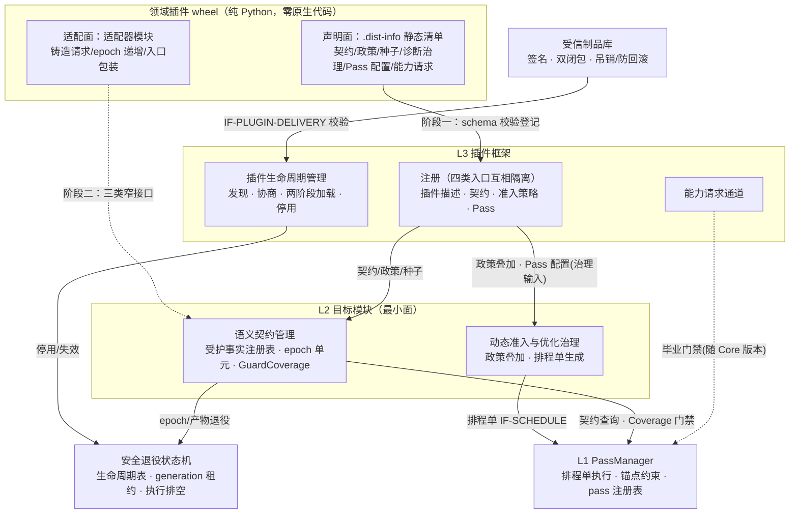
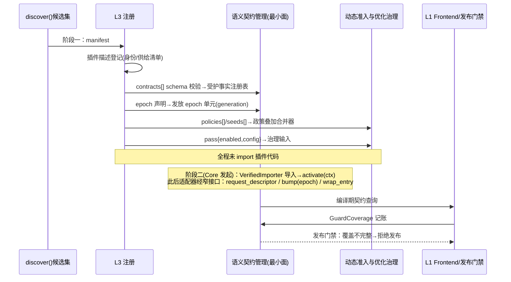
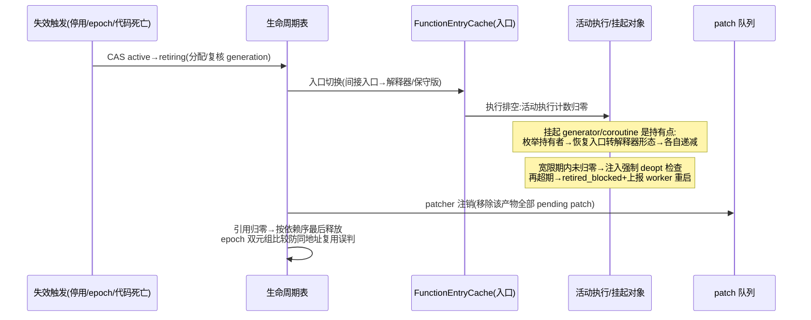
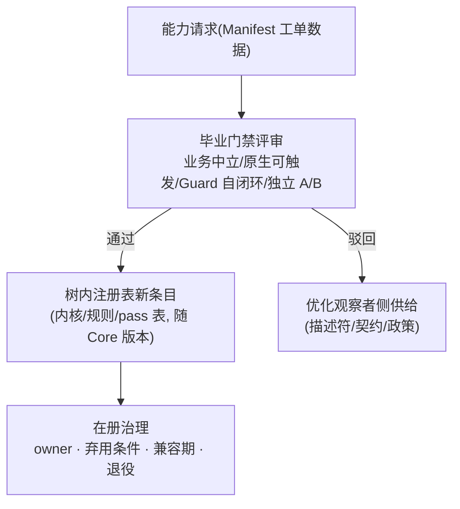

# 功能设计说明书 — CinderX 支持插件化

## 产品版本&密级

| 项目 | 内容 |
| --- | --- |
| 产品/方案 | CinderX Runtime Core / 插件框架（L3）与配套机制 |
| 文档版本 | 1.9 |
| 方案阶段 | 目标架构迁移路线 Phase A/B0/B1 的功能级展开 |
| 密级 | 内部技术设计 |
| 适用范围 | L3 插件框架（生命周期管理、注册、能力请求通道）；L1 PassManager 与排程单；L2 承接注册的目标模块最小面；安全退役状态机最小闭环 |
| 事实基线 | CinderX 主线 `ba5ecb4d`（本文全部 file:line 锚点按该版本） |
| 上游文档 | 《【架构设计】CinderX 增强运行时》（`docs/design/【架构设计】CinderX增强运行时.md`） |

## 拟制信息

| 项目 | 内容 |
| --- | --- |
| 拟制日期 | 2026-08-23 |
| 拟制方式 | 基于上游架构设计与 CinderX 主线代码形成 |
| 文档状态 | 待评审 |

## 修订记录

| 日期 | 版本 | 修改描述 |
|------|------|---------|
| 2026-08-23 | V1.0 | 初始版本 |
| 2026-08-24 | V1.1 | 审校修复：信任链封闭化（闭包内原生无条件拒载、native 封闭依赖图、verify-at-load 加载绑定、可信状态缺失即停用、审计事件留痕）；排程单改基线模板+覆盖层并修正管线盘点与 flag 映射；PassManager 增量化交付；退役模型改 (地址, generation) 双元组比较并显式 retired_blocked；插件集启动期固定与停用分级；注册快照发布/合并优先级/Core 内置叠加双轨；版本兼容合同；仓库路径前缀统一 |
| 2026-08-24 | V1.2 | 复审修复：加载绑定升级为 VerifiedImporter（单次字节读取执行整个导入闭包）；可信状态改外部单调权威源 + 插件发布序号 + 吊销新鲜度；native 依赖图改加载前静态验证；吊销改 Core 原子封禁 + 强制限时重启；启动预算按插件粒度；审计防篡改归属部署通道；纯声明插件可发现 + epoch 创建语义归一；模板补步骤实例 schema；类型校验定位为 DCHECK 级；retired_blocked 溢出改全局熔断；退役索引/计数配对/TreeIter 转换机制补全；内置叠加定为永久默认层；盘点事实修正（lambda 行号、flag 12 个完成映射、DCE 位死接线、二次 CleanCFG） |
| 2026-08-24 | V1.3 | 三轮复核修复：签名信封固定路径/算法/key ID/只读 bootstrap root 且文件集来自信封自身；VerifiedImporter 增可信宿主模块策略（按 build-id/摘要绑定的白名单）；发布序号改 (seq, digest) 认领语义 + 外部原子分配；外部水位只升不降（低于本地即 fail-closed）；native 改 memfd 同字节加载 + 运行期载入集持续断言；吊销完成改旧实例终止 ACK + 新实例接管双确认；审计补认证 ACK/事件序号/隔离门禁；优先级收归部署方；排程指纹纳入 rule_set/budget；DCE 措辞修正（RefcountInsertion 内已有 DCE，`refcount_insertion.cpp:1231`；不执行的是管线级独立步骤）；TreeIter 持有者改运行期登记 + 定向 reify 规格；fail-open 保证收窄到导入前与注册面；政策叠加两层不变量；阶段治理补部署侧依赖/owner/投资基线/M0 停止门 |
| 2026-08-24 | V1.4 | 四轮复核修复：插件 wheel 只经部署工具装入**不可执行隔离区**（不进 site-packages，封死 `.pth`/`sitecustomize` 先于信任校验执行的绕过路径），信封成员集禁止启动钩子文件；声明面校验改**单次字节快照**（摘要校验/manifest 解析/注册快照构建同一批内存字节，消除换包 TOCTOU）；信封补 `host_imports[]` 可信宿主白名单与 key→插件命名空间授权绑定；native 加载改全图逐节点 memfd + (SONAME, digest) 映射摘要协议；TrustState 补 `plugin_digests{}`、AuditEvent 补 `session_id/event_seq`；排程模板改构建期显式 BaselineTemplate（occurrence 显式、求解器只校验不生成）；挂起/恢复补原子转换不变量、有界性论证改熔断截止期限约束；阶段治理补部署侧 owner/预算/验收证据、外部权威源版本回退合同、M0 失败触发底座范围复审；pre-refcount DCE 移出本功能域单独立项（I6 拆为 I6a） |
| 2026-08-24 | V1.5 | 五轮复核修复：授权流程统一为 密码学验签→同字节快照解析 manifest→key 授权→外部 CAS 认领（认领侧同样校验命名空间授权，越权不推进水位）；部署工具列为 Phase A 正式交付物（镜像扫描/只读挂载/禁运行期安装/绕过测试）；宿主加载权威唯一边界（白名单框架=进程 TCB+预加载，memfd 仅覆盖桥接目录）；BaselineTemplate 全文统一为构建期登记、运行期只引用校验（补模板登记合同）；PassDescriptor 增 plugin_configurable 资格位（DCE 独立验收前不可启用）；权威源事故恢复改 recovery epoch 与 publish_seq 分离（本地水位不降）；退役补本地 fail-stop 不变量；接入 ≤2 人周纳入 Phase C 门禁；B0 与 A 并行化 |
| 2026-08-24 | V1.6 | 定向核验修复：模块调用路径与规格表的 key 授权顺序同步为"验签→快照解析→授权→认领"；TrustState 增 max_recovery_epoch（更高纪元快照整体校验成功后原子持久化，缺失/回退 fail-closed）；管线级 DCE 自生产 BaselineTemplate 与锚点路径移除（独立验收后经新模板版本引入，模板编码实际执行序列）；sys.modules 排他改分类规则（闭包模块命中拒绝，白名单宿主模块必须命中并校验绑定身份）；部署侧四项 owner 显式覆盖部署工具 |
| 2026-08-24 | V1.7 | 终验修复：引入 template_class（production/diagnostic）与 **DiagnosticTemplate 发布隔离**——`kAll` 等预设映射为 DiagnosticTemplate（保留现有全位语义含 DCE，仅限测试/诊断构建），其产物不得进入生产入口、Context、CodeExtra 与 code-twin 复用；生产 Schedule 只能引用 production 类批准 BaselineTemplate，引用诊断模板即拒绝；隔离为独立验收用例 |
| 2026-08-24 | V1.8 | 跨文档同步：铸造请求族扩为三形态（`request_descriptor` + 批上下文 `bind_batch`/`release_batch`，BatchContext ABI——线程局部上下文栈、LIFO/线程/active/重复释放校验、停用拒载），随 SPI 版本化与插件命名空间归属；窄接口完备性约束、接口定义与增量 SR 同步 |
| 2026-08-24 | V1.9 | 编号修正：新增批上下文 SR 与既有政策合并顺序 SR 撞号，批上下文需求顺延为 SR-PF-111（SR-PF-108 保留给政策合并顺序） |

## Keywords 关键词

插件框架、SPI、声明面、适配面、静态清单、两阶段加载、制品信任链、双闭包、注册类接口、排程单、PassManager、锚点组、域重写锚点、fail-open、安全退役状态机、generation 租约、能力请求、毕业门禁

## Abstract 摘要

本文档设计 CinderX 的插件化能力：把"领域扩展 CinderX"从改编译器改为经注册类接口供给知识。插件分发物为纯 Python wheel、零原生代码，供给分两个通道——声明面（`.dist-info` 静态清单 `cinderx_plugin.json`，纯数据，schema 校验后登记，无需执行插件代码）与适配面（按清单 `adapter` 字段声明的入口按需导入的适配器，只经描述符铸造请求、epoch 递增、变异入口包装三类窄接口进入 Core）。功能域拆为五个功能项：① 插件发现与信任准入（不可执行隔离区发现、SPI/ABI/CPU 协商、签名信封与单次字节快照校验、封闭依赖图与全图 memfd 桥接、VerifiedImporter 加载绑定、外部单调权威源信任状态、审计事件留痕）；② 插件注册（两阶段加载与 activate/deactivate 协议，插件描述/契约/准入策略/Pass 四类入口互相隔离、按不可变快照原子发布，L2 目标模块最小面含 GuardCoverage 记账与发布门禁，Core 内置默认叠加保持零插件等价）；③ HIR Stage 管线与 PassManager（自 `Compiler::runPasses` 抽取为显式编排机制，按"纯抽取→注册表→排程单→锚点→分析缓存→flag 补齐"的独立增量交付，排程单采用基线模板 + 覆盖层模型，正确性骨架不可关闭）；④ 插件停用与安全退役（插件集启动期固定，运行期停用 = Core 原子封禁 + 按前向索引退役关联产物 + 强制限时重启上报；生命周期表、generation 租约、活动执行计数与挂起对象转换，epoch 防复用以 (地址, generation) 双元组比较实现）；⑤ 能力请求通道（离线工单通道，新内核经毕业门禁进树内注册表）。全部注册与编排机制遵循版本兼容合同（稳定面以 contract tests 逐版本断言），3.11 等版本移植不改变本文接口。

## List of abbreviations 缩略语清单

| 缩略语 | 英文全称 | 中文名 |
|--------|---------|--------|
| ABI | Application Binary Interface | 应用二进制接口 |
| AutoJIT | Automatic JIT Admission | 动态准入 |
| CAS | Compare-And-Swap | 原子比较交换 |
| DFX | Design for Excellence | 卓越设计（可靠性/性能/安全等） |
| ELF | Executable and Linkable Format | 可执行可链接格式 |
| FMEA | Failure Mode and Effects Analysis | 失效模式与影响分析 |
| HIR | High-level Intermediate Representation | 高层中间表示 |
| IC | Inline Cache | 内联缓存 |
| IR | Intermediate Representation | 中间表示 |
| JIT | Just-in-Time Compilation | 即时编译 |
| LIR | Low-level Intermediate Representation | 低层中间表示 |
| OSR | On-Stack Replacement | 栈上替换 |
| PassManager | — | Pass 编排器（机制层） |
| ROI | Return on Investment | 投入产出比 |
| SOABI | Shared Object ABI | 扩展模块 ABI 后缀标签 |
| SPI | Service Provider Interface | 插件服务提供接口 |
| SR | Software Requirement | 软件（增量）需求 |
| SSA | Static Single Assignment | 静态单赋值 |
| TCB | Trusted Computing Base | 可信计算基 |
| UAF | Use-After-Free | 释放后使用（内存安全缺陷） |
| W^X | Write XOR Execute | 写执行互斥（内存页不可同时可写可执行） |

## 前言

本文档为 CinderX "支持插件化"功能设计说明书，定义功能域划分、功能项实现方案、逻辑接口与 DFX 分析。

**设计文档层级说明**：本文档为功能设计（非详细设计），实现方案以伪代码、schema 与流程描述为主；代码片段注释仅标注方案级要点（边界条件、不变量、关键决策）。逐行实现指导属于详细设计文档范畴。

**与上游文档的关系**：《【架构设计】CinderX 增强运行时》定义 L3 插件框架的模块边界、双通道供给模型、四类注册入口、信任链双闭包、PassManager 的机制/策略分界与安全退役状态机；本文档把这些模块"打开"为功能项，给出可实施的接口 schema、流程、验收口径与影响点，不重复论证架构决策。涉及数据面向量化、中立描述符铸造细则与领域插件实现的内容，由《【功能设计】CinderX 支持数据工程领域插件》承载，本文只定义其依赖的注册与编排接口。

**范围**：L3 全部模块；PassManager 与排程单（L1）；L2 承接注册的目标模块最小面（受护事实注册表 + GuardCoverage、政策叠加合并、排程单生成）；最小安全退役状态机。

**非目标**：数据面向量化机制与树内内核（V0/V1′/V1″/V2，由领域功能设计与数据面阶段承载）；受信桥接契约目录的条目内容（随领域实现）；诊断 capability 的完整权限体系（本期仅随注册供给命名空间计数，capability 签发体系随诊断专项交付）；subinterpreter 支持；运行期完整热卸载（插件集启动期固定，见功能项 4 范围裁定）；能力请求的在线评审（通道为离线流程，见功能项 5）。

---

# 功能域：CinderX 支持插件化

## 功能域概述

### 问题：扩展 CinderX 的唯一途径是改编译器

基线上不存在插件接入面，领域需求只能以两种硬编码形态进入 Core 仓库：

| 现状 | 基线证据 | 后果 |
|------|---------|------|
| 优化能力焊死在固定编译序列 | `cinderx/Jit/compiler.cpp:75-157` 的 `Compiler::runPasses` 固定序列 + `PassConfig` 位集；唯一 pass 注册表在 `cinderx/RuntimeTests/main.cpp:64-98`（测试专用，编译进测试二进制） | 新优化 = 改 Compiler；无运行时注册机制；无排程可下发面 |
| 准入与窗口知识以环境变量 token 硬编码 | `cinderx/PythonLib/_cinderx_auto.py:48-77`：`CINDERX_AUTOJIT_SETUP_PROVIDER` 环境变量 + 硬编码默认 token `lib2to3_main,multiprocessing_pool` | 领域知识（窗口、先验）无法随插件分发，只能改 Core |
| 无插件发现/协商/信任机制 | 启动引导仅 `cinderx.pth`（内容 `import _cinderx_auto`） | 第三方供给物没有受控进入路径 |

### 解决方案：注册类接口与双通道供给

插件化 = Core 提供**注册类接口**（只收数据与受信窄接口调用，不收变换代码），插件以**双通道**供给：

| 通道 | 载体 | 内容 | 进入方式 | 是否执行插件代码 |
|------|------|------|---------|----------------|
| 声明面 | wheel `.dist-info` 内静态清单 `cinderx_plugin.json` + 所指数据文件 | 插件描述、契约（受护事实/epoch/档位请求）、准入政策、画像种子、诊断治理参数、Pass 启用与配置、能力请求 | 两阶段加载的第一阶段：读清单 → schema 校验 → 登记 | 否 |
| 适配面 | 按需导入的适配器模块（入口由清单 `adapter` 字段声明，**可选**——纯声明插件缺省） | 描述符铸造请求、epoch 递增、变异入口包装（库入口运行时绑定为纯数据绑定对，随契约数据供给） | 两阶段加载的第二阶段：仅经三类窄接口调用 Core API | 是（同进程 Python，属进程 TCB） |

**双通道必要性判据与接口覆盖矩阵**：适配面引入受信代码（TCB 准入成本 + 长期 SPI 兼容负担），因此只在纯声明无法表达的**运行期能力**上引入；插件可以降级为**纯声明插件**（无适配器，仅供给政策/种子/契约数据）。必需适配面的能力与已识别领域（架构 L4）的覆盖：

| 运行期能力 | 为什么声明面给不出 | 数据工程 | 模型推理（PyTorch） | 数据科学（NumPy/Pandas） |
|-----------|------------------|---------|------------------|----------------------|
| 描述符铸造请求 | 翻译对象是**活的运行期实例**（列缓冲/张量存储/块布局在对象上），静态数据无法预知 | ● | ● | ● |
| epoch 递增 | 变异发生在用户操作时刻，失效必须挂在真实变异路径上 | ● | ● | ○ |
| 入口包装 | 包装安装在运行期对象的方法链上 | ● | ○ | ○ |

（● 必需，○ 可选/部分）。三个已识别领域均被覆盖；出现无法表达的领域时走能力请求通道（功能项 5）或架构修订，不在适配面增开第四类接口。

**为什么必须是插件侧代码而非 Core 内置的声明式解释**：布局翻译面对的是活的框架对象——定位缓冲常需调用框架 API（chunk 拼接、惰性物化缓冲、按批切片），静态可描述的声明式映射只覆盖无计算的固定布局；变异入口包装是高阶动作（包装任意方法并保持透传语义），纯数据无法表达；Core 无法为无界框架集内置适配器（能毕业进树内的是计算内核，不是布局翻译）。TCB 成本经三点收敛：适配面按能力可选（纯声明插件为零）、部署审批准入（双闭包 + VerifiedImporter）、三类窄接口为唯一调用面。

四条不变量（架构主张 2/3/8 的功能域落地）：

1. **插件分发物零原生代码**：闭包内任何原生二进制拒载。
2. **Core 是全部变换与机器码的唯一持有者**：插件不是"变换者"也不是"供码者"。
3. **准入决策权唯一**：插件政策只偏置 AutoJIT，不裁定。
4. **fail-open**：插件缺失、校验失败、注册异常、停用，Core 与其他插件不受影响（保证范围：导入前与 Core 注册面，见核心契约信任边界）。

### 核心概念

| 概念 | 定义 |
|------|------|
| 插件身份 | `{id, spi_version, runtime_abi}` 三元组；id 为稳定反向域名风格标识 |
| SPI | L3 对插件暴露的服务提供接口版本；主版本精确匹配，不兼容即 unavailable（不是安装失败） |
| runtime_abi | `{python_version, soabi, core_build_id, cpu_caps}`；Python 小版本 + 扩展 ABI 标签 + Core 构建标识 + CPU 能力（SSE/AVX2/NEON/SVE、NUMA） |
| 制品信任链双闭包 | 纯 Python 插件闭包（签名覆盖清单/适配器/传递依赖，闭包内原生二进制拒载）与批准的 native runtime 闭包（领域库原生制品经受信桥接契约目录条目登记，未登记拒载） |
| 排程单（Schedule） | 一次编译的执行策略 = **基线模板**（构建期登记的显式 BaselineTemplate 步骤实例表，含重复调用点）+ **覆盖层**（仅可选优化步骤实例的开关/参数）；由动态准入与优化治理生成、PassManager 按模板引用执行；排程单指纹贯穿编译缓存与产物 provenance |
| 正确性骨架 | 基线模板中覆盖层不得关闭的步骤：SSAify、RefcountInsertion（无条件执行）与 InsertUpdatePrevInstr（生产模板骨架位）；类型校验为 DCHECK 级横切服务（release 不执行，生产正确性不依赖） |
| generation 租约 | 一切再引用点在取得生命周期对象引用前，先在生命周期表 acquire (身份, generation) 租约并复核状态仍为 active |
| 停用（deactivate） | 运行期受理的插件级失效：Core 原子封禁 + 按前向索引退役关联产物 + 适配器驻留 + 上报强制限时重启；完整卸载在重启边界完成（功能项 4） |

### 能力范围与功能项划分

本功能域交付"插件可被发现、被信任、被注册、被编排、被安全停用，且新能力有进入树内的通道"：

| 功能项 | 对应 L3/配套模块 | 一句话边界 |
|--------|----------------|-----------|
| 功能项 1：插件发现与信任准入 | 插件生命周期管理（前半） | 从受信制品库到"通过协商与校验的候选集" |
| 功能项 2：插件注册（两阶段加载与四类入口） | 插件注册 + L2 目标模块最小面 | 从候选集到"登记进 Core 的数据与窄接口" |
| 功能项 3：HIR Stage 管线与 PassManager | L1 编排机制（Pass 注册的机制底座） | 从固定序列到"注册表 + 排程单可下发" |
| 功能项 4：插件停用与安全退役 | 插件生命周期管理（后半）+ 退役状态机 | 停用/失效后无悬垂引用、无 UAF、无悬垂 patch；完整卸载在重启边界 |
| 功能项 5：能力请求通道 | 能力请求通道 | 插件"希望 Core 高速执行 X" → 毕业门禁 → 树内注册表 |

## 功能域总体方案



**设计原则**：

- **先声明后适配**：一切可在不执行插件代码时完成的事（发现、协商、信任校验、声明面注册）都必须在不 import 插件的前提下完成；import 推迟到首次需要适配面时。
- **注册即数据**：四类入口登记的全部是版本化 schema 的数据；schema 校验失败只影响该入口的登记结果。
- **机制/策略分界**：PassManager 执行排程单，不做取舍；治理生成排程单，不触碰机制。
- **撤销即退役**：不存在"从注册表摘除即完毕"的撤销；运行期停用与失效都走安全退役状态机，完整卸载在重启边界完成。

**阶段交付与依赖**：本期对应架构迁移路线 Phase A/B0/B1，功能项映射与出口判据：

| 交付段 | 功能项 / 增量 | 依赖 | 出口判据 |
|--------|--------------|------|---------|
| Phase A 底座 | 功能项 1 + **部署工具**（隔离区安装器） | — | 拒载原因全覆盖；VerifiedImporter 与按插件预算门禁生效；部署工具交付并通过绕过测试（pip 直装 / 直接写隔离区 / 钩子注入均被阻止；镜像扫描、隔离区只读挂载、禁用运行期包安装） |
| Phase B0 编排 | 功能项 3 增量 I1-I4、I6a | 可与 Phase A **并行启动**（这些增量不消费信任链与部署控制面），在 B1 汇合前完成 | I1 无行为漂移（golden 全绿）；排程单可下发且骨架校验生效 |
| Phase B1 最小闭环 | 功能项 2 + 功能项 4 | Phase A、B0 | 四入口注册 + 快照发布 + Coverage 门禁 + 最小退役闭环可用 |
| 参考插件（并行启动） | 数据工程领域插件垂直切片：**M0 收益曲线不依赖任何底座、即刻启动**；M1+ 依赖 Phase B1；分析缓存增量 I5 随参考插件的画像需求交付（不在 B1 关键路径） | M0 无依赖；M1+ 依赖 B1 | 架构 Phase C 预注册指标（穿刺 ≥1.5×、端到端 ≥1.10×、holdout 通过）；**插件侧接入 ≤ 2 人周（开发者目标同属门禁——性能达标但接入超时同样触发接口修订）** |
| 能力请求 | 功能项 5（schema + 导出 + 门禁流程，无运行时条目） | Phase B1 | 工单导出查询可用 |

**部署侧依赖（Phase A 出口前置）**：外部单调权威源接口、审计事件汇聚点、强制重启控制面联动、**部署工具（隔离区安装器）**——四项各有部署方 owner（前三项为平台侧接口负责人，部署工具为部署管道负责人，随排期指名）、纳入 Phase A 投资基线（部署侧合计 ≤ 2 人周，含部署工具）、验收证据 = 接口联通性测试（水位读写 / ACK 回执 / 重启演练）+ 部署工具绕过测试（覆盖安装/升级/移除，及 pip 直装、直接写隔离区、启动钩子注入的负向用例）；运行环境要求：隔离区只读挂载、worker 禁用运行期包安装（容器层约束）、制品入库镜像扫描。未就绪前 Phase A 不具备出口条件。**外部权威源事故恢复合同（recovery epoch 与 publish_seq 分离）**：权威源维护独立的恢复纪元（recovery epoch，单调，与制品 publish_seq 无关）；事故恢复 = 权威源以**更高 recovery epoch 对既有 (plugin_id, seq, digest) 认领记录整体重新确认**（制品不需重新签发，序号不变）；本地处理 = **不降低任何水位**——只接受高于本地 `max_recovery_epoch` 的权威快照，整体校验成功后将该纪元原子持久化（缺失或回退继续 fail-closed），重放期间相关插件保持停用。

**运营与投资口径**：Phase A owner = L3/信任链模块负责人、Phase B0 owner = 编译管线负责人、Phase B1 owner = 契约与治理负责人、参考插件 owner = 领域插件负责人（首版排期指名）。投资基线：Phase A ≤ 3 人周、Phase B0 ≤ 4 人周、Phase B1 ≤ 6 人周、参考插件接入 ≤ 2 人周（架构口径），随排期冻结并按段核算；指标口径统一为 Phase C 预注册指标。**M0 停止门**：M0 实测穿刺路径几何平均收益 < 1.2× → 冻结 M1+ 切片并触发**底座范围复审**——Phase B0/B1 是否继续、收缩或停止由复审裁决，不自动继续（门槛与本表一同在 M0 开始前冻结）。继续/停止门槛沿用架构迁移路线：Phase C 指标达标 → Phase G 泛化；不达标 → 输出接口修订清单重跑或收缩范围。用户结果指标：插件侧接入 ≤ 2 人周、失败可回退、零插件环境 A/B 等价。

## 功能域规格设计

| 规格项 | 要求 |
|--------|------|
| 零原生代码 | 插件闭包（清单、数据文件、适配器、传递依赖）内出现 ELF/`.so`/`.pyd` 等原生二进制**无条件拒载**（即使该制品同时出现在桥接契约目录中也不豁免）；领域库原生制品是**闭包外**的宿主运行时目标，只能经受信桥接契约目录条目（含封闭依赖图）登记后由 Core 桥接——同一制品不存在"闭包放行"与"目录登记"两条裁定路径 |
| SPI 协商 | `spi_version` 主版本精确匹配；`runtime_abi` 任一分量不符 → 插件标记 unavailable 并计入诊断，进程继续 |
| 注册隔离 | 四类入口数据按命名空间隔离；插件 A 的任何登记项不可见、不可覆盖插件 B 的登记项；注册按不可变快照原子发布（功能项 2）。保证范围：导入前与 Core 注册面（导入后的进程级影响不在保证内，见核心契约信任边界） |
| fail-open 范围 | 覆盖导入前拒绝（信任/协商/schema 校验失败 → unavailable）与 Core 注册数据回滚（停用撤销注册可见性并按退役状态机失效产物）；不承诺撤销适配器 import 的副作用。运行期吊销 = Core 原子封禁 + 退役关联产物 + 尽力通知 + 强制限时重启（新进程确认拒载后吊销才完成） |
| 插件集固定 | 本期插件集**启动期固定**：运行期不受理"卸载插件"请求，仅受理停用（吊销/信任失败/插件请求）；完整卸载（注册数据释放）随进程重启完成 |
| 启动预算 | 预算按**插件粒度**设定：单个插件超预算仅其自身 unavailable，其他插件不受影响；处理顺序固定，集合不因超时截断；不阻塞解释器启动 |
| 零插件等价 | 不安装任何插件时，Core 行为与 A/B 基线一致（含 PassManager 抽取本身无行为漂移；现网 setup provider 语义由 Core 内置默认叠加保持，功能项 2） |
| 排程单安全 | 排程单 = 基线模板 + 覆盖层；覆盖层只能开关可选优化步骤，骨架步骤被关闭即整单拒绝；排程单取舍只影响性能不影响正确性 |
| 停用/退役安全 | 停用完成后不存在对插件注册数据的活引用、不存在悬垂 patch；epoch 防复用以 (地址, generation) 双元组比较实现，不依赖"地址永不复用"承诺；退役保守持有态（retired_blocked）总量有界 |
| 版本兼容 | 稳定面（四入口 schema 语义、排程单模板/覆盖层语义、锚点契约、退役 API）跨 CPython 版本不变并有 contract tests；允许变化面登记并差分验证；破坏性变更 = SPI 主版本递增 + 兼容期（功能项 3"版本兼容合同"） |

## 核心契约：插件供给物与窄接口

本节定义所有功能项共享的供给物 schema 与接口语义，各功能项引用本节，不再重复定义。

### PluginManifest（`cinderx_plugin.json`）字段

| 字段 | 类型 | 约束 | 登记入口 |
|------|------|------|---------|
| `id` | string | 反向域名风格，全局唯一，进程内二次注册同 id 拒绝 | 插件描述 |
| `publish_seq` | int | 插件级发布序号，按 (seq, artifact_digest) 认领：更高接受、同 seq 同摘要幂等、同 seq 异摘要分叉拒载、更低拒载；由外部权威源原子分配 | 插件描述 |
| `spi_version` | string | L3 SPI 主版本，精确匹配 | 插件描述 |
| `runtime_abi` | object | `{python_version, soabi, core_build_id, cpu_caps}`；`python_version` 精确到小版本 | 插件描述 |
| `target_capabilities` | list[string] | 声明依赖的 Core 能力名（如 `dataplane-v0`）；Core 不具备即 unavailable | 插件描述 |
| `provides.contracts[]` | list | 受护事实/epoch 声明/档位请求（引用式），逐条带 schema 版本 | 契约 |
| `provides.policies[]` | list | 准入政策叠加项：先验特征、窗口、阈值偏置、命名空间配额 | 准入策略 |
| `provides.seeds[]` | list | 画像种子文件引用（版本化，随包分发） | 准入策略 |
| `provides.diagnostics` | object | 诊断治理参数（命名空间计数开关、保留策略） | 准入策略（治理参数随政策登记） |
| `provides.pass` | object | 树内 pass 的启用与配置（按 pass 名键控；仅治理输入，不直接写入排程单） | Pass |
| `capability_requests[]` | list | 能力请求工单数据（非可执行物；不进入运行时注册表，仅导出给离线评审——不构成第五注册入口，见功能项 5） | 导出数据（随插件描述登记） |
| `adapter` | object | **可选**——适配器入口与元数据（阶段二加载依据）；纯声明插件缺省 | 插件描述 |

签名范围：清单文件 + 全部被引用数据文件 + 适配器 wheel 代码 + 传递依赖锁定摘要清单，整体签名（见功能项 1）。`dependency_lock` 粒度裁定为**解析后的文件级摘要清单**（依赖 wheel 摘要仅作快速预检）；制品闭包摘要与入口数据摘要是两层不同的点验，故障粒度见功能项 2。

### 适配面三类窄接口

适配器模块对 Core 的全部交互收敛为三类 API 族（Core 侧提供，适配器只调用）：

| 接口族 | 方向 | 语义 | C 侧消费点 |
|--------|------|------|-----------|
| 铸造请求族 `request_descriptor(DescriptorRequest)` / `bind_batch(slots, handles)` / `release_batch(ctx)` | 适配器 → Core | 提交描述符铸造请求：Core 以 `Py_buffer` 为容量权威判界，失败 fail-closed 返回错误（不发放 handle）。批上下文运行期形态：`bind_batch` 将"槽位 → handle"映射压入 **Core 维护的线程局部批上下文栈**（多线程各持独立栈；递归/嵌套压栈弹栈，内层读内层），返回 opaque `BatchContext`；`release_batch` 校验调用线程 == bind 线程、ctx 为当前线程栈顶（LIFO）、状态 active 且未重复释放，任一不符拒绝弹栈并审计（不释放仍在执行的 handle）。批上下文归铸造请求族：随 SPI 版本化、调用归属插件身份与命名空间（限流/审计同族适用）、插件停用后 `bind_batch` 拒载返回错误（不创建上下文），栈内存量上下文按停用流程失效（判界细则与 ABI 语义由领域功能设计实例化） | 数据面铸造 API（契约查询面）；JIT 入口守卫读线程栈顶上下文 |
| epoch 单元 `register_epoch(key)` / `bump(epoch)` | 适配器 → Core | 单元由**阶段一声明的契约条目创建**（manifest 声明 key → Core 创建）；阶段二 `register_epoch` 仅幂等获取既有单元（key 不在声明集 → 拒绝），`bump` 只经句柄递增（原子、速率受限）；单元带 generation，退役走状态机 | 守卫安装与运行期读取 |
| 入口包装 `wrap_entry(obj, attr, on_change) -> WrapHandle` | 适配器 → Core 登记 | 把目标对象的必经变异路径引流过包装入口，触发失效；返回带身份与 generation 的**可撤销句柄**：组合序 = 注册序（先注册者在外层）；回调不得抛异常（违规计数并吊销该句柄）、不得重入包装机制；停用时按句柄统一撤销，杜绝插件回调残留 | 窗口计数与失效通知 |

**适配器生命周期入口**（Core → 适配器，与上表"适配器 → Core"三类接口方向相反）：Core 在阶段二导入适配器后调用其导出的 `activate(ctx: PluginContext)` / `deactivate()`——`ctx` 绑定插件身份与命名空间，此后三类窄接口的调用全部归属到该身份（Core 据此归属、限流与吊销）；两个入口均幂等（重复调用为 no-op）。停用时 Core 调用 `deactivate()`，之后三类窄接口对该插件一律返回 unavailable（触发与协议见功能项 2）。

库入口运行时绑定（V1″ 场景）是纯数据绑定对（入口身份 + 制品指纹 → 受信桥接契约目录条目 id），随 `provides.contracts` 供给，不新增第四类代码接入面。

### 信任边界声明

适配面是同进程 Python 代码：**窄接口不构成权限隔离，适配器属于完整进程 TCB**（与宿主应用代码同级信任）。受信制品与依赖闭包管理是供应链措施而非隔离边界；fail-open 不承诺撤销适配器 import 的副作用。**隔离与 fail-open 的保证范围限定于导入前（声明面）与 Core 注册面**：适配器导入后与宿主同进程，恶意或缺陷适配器可影响整个进程（含其他插件与宿主业务）——"其他插件不受影响"在导入后不作强保证，属信任边界内的尽力隔离 + 审计。本文所有"隔离"均指数据面与故障面隔离（且以前述范围为限），不指权限隔离。

---

## 功能项 1：插件发现与信任准入

### 功能概述

**目标用户/系统**：部署方（受信制品库运维）与 L3 插件生命周期管理模块。

**输入/输出**：输入 = 受信制品库中的插件 wheel 集合；输出 = 通过协商与双闭包校验的插件候选集（含 unavailable 标记与拒载原因）。

**核心能力**：静态清单发现、SPI/ABI/CPU 协商、制品信任链双闭包校验、外部权威源信任状态（吊销/防回滚/密钥轮换）、审计事件留痕。

**约束**：零原生代码强制；一切校验先于 import；启动路径成本可控。

**收益**：插件供给物有唯一受控进入路径，供应链闭环。

**主要风险**：密钥管理与信任根运营（部署方职责，见开放问题）。

### 实现思路

基线启动引导为 `cinderx.pth`（内容 `import _cinderx_auto`）→ `_cinderx_auto.py` 按环境变量初始化 `_cinderx`。**插件 wheel 不进入解释器可执行面**：Python 的 `site` 机制会执行 site-packages 内任意 `.pth`/`sitecustomize.py` 启动钩子——若插件可被 pip 直装进 site-packages，其启动钩子先于任何信任校验执行，信任门禁被整体绕过。因此部署管道规定：插件 wheel 只能经部署工具从受信制品库安装进**不可执行隔离区**（专用目录，不在 `sys.path`、不参与 `site` 的 `.pth` 扫描，进程内除 Core 外无读取入口）；发现与校验全部在隔离区上执行。

目标态在该引导之后增加插件发现阶段：**发现以隔离区内 wheel 的 `.dist-info` 静态清单为准**——枚举隔离区发行版的 `cinderx_plugin.json`（不 import、不需要 entry point，**纯声明插件同样被发现与注册**）；清单声明的适配器入口仅为阶段二定位信息（可选字段）。发现顺序按发行版名排序保证确定性；同 `id` 二次注册拒绝。**启动钩子禁止**：信封成员集不得包含 `.pth`、`sitecustomize.py`、`usercustomize.py`、`__editable__.*.py` 等启动钩子文件——出现即拒载。**激活语义**：校验通过后的"激活"= 注册快照安装 + VerifiedImporter 获得从隔离区加载适配器的资格——插件文件永不搬迁进 site-packages，不存在"激活到解释器可见路径"的文件面。

协商在读取清单后立即进行（不 import）：`spi_version` 主版本不匹配、`runtime_abi` 任一分量不符（Python 小版本、SOABI、Core build-id、CPU 能力不足）、`target_capabilities` 缺项，均标记 unavailable。3.11 等移植进行中的版本由 `runtime_abi.python_version` 自然拒绝——插件按版本矩阵声明兼容（cp312/cp314/cp315），不兼容即 unavailable。

双闭包校验（先签名后内容）：

- **纯 Python 插件闭包**：验签范围 = 清单 + 数据文件 + 适配器代码 + 传递依赖锁定摘要清单（`dependency_lock`，文件级粒度）。闭包内出现任何原生二进制**无条件拒载**——即使该制品同时在桥接契约目录中登记也不豁免：目录登记的原生运行时是闭包外的宿主运行时目标，两者没有同一制品的裁定交集。
- **批准的 native runtime 闭包（封闭依赖图）**：领域库（NumPy/Pandas/PyTorch 等）不是插件传递依赖；其原生制品由受信桥接契约目录条目登记，条目声明封闭依赖图（规范路径、摘要、build-id、依赖边、受控搜索路径）。桥接建立前静态解析并验证完整依赖图（此时无任何代码执行），验证过的字节经 memfd 加载，运行期载入集持续断言兜底——顶层摘要正确不足以放行。
- **验签与加载绑定**：阶段二经 VerifiedImporter 以同一份字节读取完成校验与执行（见实现设计），Core 不执行未验签的字节；声明面同样以单次字节快照完成校验与解析（防换包 TOCTOU）。

信任状态持久化：防回放以**外部单调权威源**为基线（本地状态只是缓存，启动核对新鲜度，**水位只升不降**、外部不可达即停用）；发布序号按 (seq, digest) 认领（幂等重启、分叉拒载），由外部权威源原子分配；吊销条目带生效时间与有效期；状态缺失、损坏或外部源不可达即停用（fail-closed）。启动与定期核对吊销清单，命中即处置：Core 原子封禁 + 退役关联产物 + 尽力 `deactivate()` 通知 + **强制限时重启**（旧实例终止 ACK + 新实例接管确认双确认后吊销才完成）。

### 模块调用关系

原始路径（基线）：

```text
解释器启动
  → cinderx.pth: import _cinderx_auto
  → _cinderx_auto: 环境变量判定（CINDERX_PLUGIN_ENABLE 等）
  → import _cinderx / cinderjit → cinderx.init()
  →（无插件概念；autojit provider 为 env + 硬编码 token）
```

修改后路径：

```text
部署管道（先于一切）：插件 wheel 经部署工具从受信制品库装入不可执行隔离区
解释器启动（site 启动钩子只见到 Core 自带的 cinderx.pth）
  → cinderx.pth: import _cinderx_auto
  → _cinderx_auto: 初始化 _cinderx（保持既有语义）
  → cinderx.plugins.discover()
      → 枚举隔离区发行版的 .dist-info/cinderx_plugin.json + 排序
      → 读固定路径信封 cinderx_plugin.sig → 密码学验签
      → 单次字节快照：摘要校验 + 解析 manifest（plugin_id 可用）
      → key 对 plugin_id 的授权校验 → 启动钩子禁止 + 原生检测
      → 协商（spi_version / runtime_abi / target_capabilities / 发布序号认领）
      → 吊销/防回滚核对（外部权威源水位）
      → 候选集（含 unavailable 与原因）→ 功能项 2 注册（快照从字节构建）
```

### 实现设计

#### 协商决策表

| 检查项 | 通过条件 | 失败动作 |
|--------|---------|---------|
| SPI 版本 | `spi_version` 主版本 == L3 当前主版本 | unavailable（reason=`spi_mismatch`） |
| Python 版本 | `python_version` == 解释器小版本 | unavailable（`py_mismatch`） |
| SOABI | 与当前解释器一致 | unavailable（`soabi_mismatch`） |
| Core build-id | 与已加载 `_cinderx` 一致 | unavailable（`build_mismatch`） |
| CPU 能力 | 声明的 `cpu_caps` ⊆ 本机 | unavailable（`cpu_insufficient`） |
| target_capabilities | Core 能力注册表全量命中 | unavailable（`capability_missing`） |
| 插件 id | 进程内唯一 | 拒绝后注册者（`id_conflict`） |
| 发布序号认领 | `(publish_seq, artifact_digest)`：seq 更高 → 接受；相等且摘要同 → 幂等接受（正常重启）；相等且摘要异 → 分叉，拒绝后注册者；更低 → 旧版本复活 | unavailable（`publish_fork` / `stale_plugin`） |

#### 签名信封与双闭包校验

**信封是独立制品，不依赖未验签的 manifest 内容**——文件集来自信封自身：

```text
cinderx_plugin.sig（固定路径，随 .dist-info 分发）
  ├─ alg / key_id          # 签名算法 id 与密钥 id（密钥属于只读 bootstrap root）
  ├─ signed_files[]        # 被签文件集（含 cinderx_plugin.json 自身），
  │                          逐条 {规范化路径, sha256}——清单来自信封而非 manifest
  ├─ host_imports[]        # 可信宿主模块白名单（在签名覆盖内）：
  │                          逐条 {模块名限定符/前缀, 绑定身份}
  │                          —— stdlib 绑定 Python 版本 / _cinderx 绑定 build-id /
  │                             第三方宿主库绑定制品摘要
  └─ signature             # 对"信封头 + signed_files + host_imports 摘要清单"
                             规范化序列化的签名值
```

**bootstrap root 与密钥授权**：验签公钥根随 Core 构建携带（只读，无运行期写入面）。root 登记条目 = {key_id, **授权范围**（全局 | 插件命名空间前缀列表）}——密钥默认按命名空间授权（最小权限），验签时校验 `key_id` 对该插件 id 的授权，越权签名拒载（`key_not_authorized`）；全局密钥仅 Core 官方插件使用。root 与授权表轮换经 Core 版本演进。

```python
def verify_plugin_closure(dist) -> Verdict:
    # 顺序固定：密码学验签 → 同字节校验并解析 manifest → key 授权 → 序号认领
    # 0) 读固定路径信封——先于任何 manifest 解析；信封与清单均受解析预算约束
    env = read_envelope(dist, ".dist-info/cinderx_plugin.sig")
    # 1) 密码学验签（无授权判断——plugin_id 尚不可用）：
    #    alg/key_id → bootstrap root 选钥；验签对象是信封自身的规范化序列化
    if not verify(env, root=BOOTSTRAP_ROOT):
        return Reject("signature")
    # 2) 单次字节快照：signed_files 逐文件读入内存一次，此后不再按路径读取——
    #    摘要校验、manifest/数据解析、注册快照构建全部在这批内存字节上进行
    #    （与 VerifiedImporter 同原则，杜绝"校验后换包"TOCTOU）
    blobs = {}
    for entry in env.signed_files:                  # manifest 必在集合内
        blobs[entry.path] = read_bytes(entry.path)
        if sha256(blobs[entry.path]) != entry.digest:
            return Reject("envelope_mismatch")
    manifest = parse_manifest_from(blobs)           # plugin_id 自此可用
    # 3) 密钥授权：校验 key_id 对 manifest 声明的 plugin_id 的授权范围
    #    （越权即拒——不得推进到序号认领，不得触碰水位）
    if not root.authorizes(env.key_id, manifest.plugin_id):
        return Reject("key_not_authorized")
    # 4) 启动钩子禁止：成员集中出现 .pth / sitecustomize.py / usercustomize.py /
    #    __editable__.* 等启动钩子文件即拒载
    # 5) 原生检测：成员集内任何文件为 ELF/原生扩展即无条件拒载（目录登记不豁免）
    # 6) 发布序号认领（协商决策表）：外部 CAS，携带 (plugin_id, seq, digest) 与
    #    同一信封身份——认领侧执行同样的命名空间授权校验，越权请求不得推进水位
    ...
    return Admit(manifest)    # 注册快照从同一批字节构建；
                              # 信封缓存键 = 文件集摘要，任一文件变化即失效
```

解析预算：信封与清单的大小、嵌套深度、条目数设上限（超限拒载），防解析放大。

#### 验签与加载绑定（VerifiedImporter）

阶段一验签与阶段二 import 之间无原子性，且 Python import 默认走 `sys.path` 搜索、子模块与依赖会被隐式引入、`sys.modules` 可能命中既有缓存——"比对一次摘要再交给常规 import"仍可能执行与验签对象不同的字节。约束升级为**同一份字节读取完成校验与执行**：

- **完整信封 schema**：信封覆盖整个导入闭包——适配器主模块、其全部子模块文件、依赖文件（与 `dependency_lock` 同源），逐文件摘要；闭包外文件不得进入执行。
- **VerifiedImporter**：阶段二不使用常规 import 机制。Core 以受控导入器从信封登记路径**单次读取文件字节**：对这批字节验证摘要，通过后**用同一批内存字节**完成模块构造（importlib 字节加载原语，不落回磁盘二次读取）。校验与执行的字节因此天然是同一份。
- **闭包边界强制与可信宿主模块策略**：适配器必然 import 标准库、CinderX 自身与宿主框架——"仅闭包内"不可执行。信封声明**宿主白名单**：条目 = {模块名限定符/前缀， 绑定身份}——标准库绑定 Python 版本、`_cinderx` 绑定 build-id、第三方宿主库绑定制品摘要；白名单本身在签名覆盖内。导入器对闭包内模块同字节加载；对白名单宿主模块放行 import 并在放行时校验绑定身份（不匹配 → 拒绝导入）；两者之外（既不在闭包、又未获白名单授权）的 import 一律拒绝。**加载权威唯一边界**：白名单中的第三方宿主框架属**进程 TCB**——必须在适配器激活前由宿主环境**预加载**（部署方责任，制品经部署镜像供应链管理），VerifiedImporter 放行的是**引用已加载实例**（校验其 build-id/摘要与白名单声明一致），自身不触发任何磁盘加载；native 桥接的全图 memfd 协议仅覆盖**桥接契约目录条目**。两类原生代码各归其唯一权威——宿主框架 = 进程 TCB + 预加载，桥接目录 = memfd 协议，不存在第三方磁盘加载与 memfd 并存的第二权威。
- **既有缓存排他（分类）**：**插件闭包内模块**名不得已存在于 `sys.modules`（存在即非受控路径先行加载 → 拒绝并审计）；**白名单宿主模块**相反——必须已存在于 `sys.modules`（预加载保证），放行时校验其实例的版本/build-id/摘要与白名单声明一致。停用后 VerifiedImporter 将该插件的闭包模块从 `sys.modules` 摘除并置为拒载占位。
- **缓存绑定**：阶段一信封缓存键为文件集摘要，文件变化即缓存失效并触发重校验。

#### native runtime 封闭依赖图（加载前验证）

目标库原生制品不经插件闭包进入。桥接契约目录条目（`BridgeContractEntry`）必须声明**封闭依赖图**：每个制品的规范路径、内容摘要、build-id、动态依赖边（`DT_NEEDED` 等）与受控搜索路径集合。

**加载前静态验证为主门禁**：桥接建立前，在磁盘上从条目根制品出发**静态解析完整 ELF 依赖图**（逐文件读取动态段、沿 `DT_NEEDED` 递归，仅在受控搜索路径内解析），与声明图逐项比对（路径/摘要/build-id）；任一不符 → 拒绝该桥接——**此时无任何原生代码执行**。

**从验证过的字节加载（全图 memfd）**：静态验证对**依赖图逐节点**执行——每个制品读入字节、验证摘要、各自建立 memfd；不存在"根 ELF 走 memfd、依赖走磁盘路径"的缝隙。加载按依赖图拓扑序（叶先）逐节点从 memfd 进行；SONAME 解析限定在 memfd 集与声明受控路径内（进程级 `LD_LIBRARY_PATH` 类不参与），磁盘路径不可达。**映射摘要协议**：加载完成后（及运行期断言时）对每个实际映射比对 (SONAME, digest) 对——必须等于声明图对应节点的摘要，任何偏差按运行时故障处置。静态图无法约束构造器执行期间的再次 `dlopen` 与延迟加载——**运行期载入集持续断言**覆盖之：桥接存续期间监控实际映射集，出现声明图之外的原生映射 → 立即停用该桥接、deopt 全部关联产物、上报**强制重启**（此时可能有未审计代码已执行，不作可恢复拒载）。条目字段规格属数据面/领域设计范围。

#### 信任状态持久化（外部单调权威源）

**信任状态的防回放以外部单调权威源为基线**（受信制品库/部署通道签发的单调计数或时间戳）：本地状态文件只是缓存，启动时必须与外部权威源核对新鲜度。**水位只升不降**：外部值**低于**本地已见值 → fail-closed（视为权威源异常或回滚攻击，停用依赖信任状态的插件与目录条目并审计，直至部署通道裁决）；外部值更高 → 更新本地；无法连通外部源 → 按"新鲜度未证明"处理，同样停用。部署形态按环境选择外部源载体（制品库水位接口 / 部署通道 broker / 硬件单调计数器），本地不存在"独立可信"的形态。

本地状态文件（Core 私有目录，权限受限）带部署方注入密钥的 MAC 校验——**保证范围收窄为磁盘损坏与进程外修改的检测**（进程内攻击者可读出密钥伪造 MAC，该威胁由外部权威源与强制重启兜底）；回放防线 = 外部权威源 + 单调序号：

```text
TrustState {                      # 整体纳入 MAC；真值以外部权威源为准
  plugin_root_key_id              # 插件签名根当前密钥（轮换序号）
  directory_root_key_id           # 桥接目录审批根（与插件根分离）
  max_directory_generation        # 已见最高目录 generation（防回滚水位）
  plugin_publish_seq{}            # {plugin_id: 已认领的最高 seq}
  plugin_digests{}                # {plugin_id: 已认领的 artifact_digest}
                                  #   ——(seq, digest) 认领判定所需的两个分量都在本地
  max_recovery_epoch              # 已见最高恢复纪元；更高 epoch 的权威快照整体校验
                                  #   成功后随本地状态原子持久化；缺失或回退 fail-closed
  revocation_list_version         # 吊销清单版本（含条目生效时间与有效期）
}
```

启动时：`directory_generation < max_directory_generation` → 按回滚处理，目录条目全部停用并审计上报；插件发布序号按 **(publish_seq, artifact_digest) 认领语义**判定——seq 更高 → 接受并更新水位；seq 相等且摘要相同 → 幂等接受（同制品正常重启）；seq 相等且摘要不同 → 并发发布分叉，拒绝后注册者；seq 更低 → 旧版本复活，拒载。**publish_seq 由外部权威源原子分配/认领**（发布方在制品库对 (id, seq) 做 CAS 认领；认领侧执行与本地验签相同的**密钥→命名空间授权校验**，越权请求不得推进水位），并发分叉在发布时即被权威源消解——同 seq 只有一个制品能认领成功。吊销清单版本旧于外部权威源对应版本或吊销条目超有效期 → 按"吊销状态未证明"停用后核对。状态文件缺失、MAC 失败或解析失败 → 同样停用至部署通道恢复（不重建水位）。

**运行期吊销与已导入适配器**：定期核对发现已导入适配器的插件被吊销时，处置顺序为——① **Core 原子封禁**（注册快照与三类窄接口立即对该插件拒载，不依赖插件配合）；② 按前向索引退役其全部关联产物；③ `deactivate()` 作为**尽力通知**发出（不等待、不依赖其完成）；④ 上报**强制限时重启**（带截止期限，编排系统拉起替换 worker）——已启动线程与已安装 hook 无法在同进程内回收，属进程 TCB 边界；⑤ 吊销完成条件为**双确认**：编排系统对**旧实例终止的 ACK**（原 worker 退出且撤流）+ **新实例接管确认**（新进程启动核对吊销清单、确认拒载）；两者齐备前吊销状态为"进行中"（控制面可查询），不视为完成。

#### 拒载与停用原因枚举（诊断面）

`spi_mismatch / py_mismatch / soabi_mismatch / build_mismatch / cpu_insufficient / capability_missing / id_conflict / signature / key_not_authorized / startup_hook_in_closure / dependency_drift / native_in_closure / envelope_budget / envelope_mismatch / load_binding_mismatch / publish_fork / stale_plugin / revoked / rollback_detected / state_unavailable`——全部产生审计事件（见下）并进入低基数指标与诊断查询接口。

#### 审计事件（留痕与防篡改边界）

聚合计数不足以事后还原安全事件（哪个制品、因何被拒、处置结果）。审计事件为只追加记录：

```text
AuditEvent {
  session_id / event_seq    # per-进程会话单调序号（汇聚 ACK 截断协议依据）
  ts / event_kind           # 拒载、吊销、回滚、验签失败、加载绑定失败、状态停用、强制重启…
  plugin_id / artifact_digest
  reason_enum / disposition # 处置结果：unavailable / 停用 / 目录条目停用 / 强制限时重启
}
```

**防篡改边界与完成语义**：适配器与 Core 同进程，本地日志在进程 TCB 内**不是防篡改证据**——防篡改保证归属部署通道（事件同步转发至外部汇聚点，随外部单调权威源部署形态交付；本地文件仅尽力留痕）。**汇聚完成语义**：事件带 per-进程会话的单调序号；汇聚点认证后返回 ACK（含已确认序号），本地保留窗口以 ACK 为界截断；汇聚持续失败且本地关键事件缓冲达界 → 进入**隔离门禁**——暂停新的插件安装与桥接建立（不中断已运行业务），直至汇聚恢复。持久化与保留：本地 append-only 文件；**关键事件**（吊销/回滚/验签失败/强制重启）同步写 + 内存环形缓冲兜底（溢出计数告警），**非关键事件**异步有界重试；磁盘上界对所有类别成立——按类别独立配额 + 时间上限，超限最老淘汰并计数（关键事件的溢出计数本身作为高优先级事件在恢复后补报）。导出仅元数据，不含密钥材料与用户数据。

### 增量 SR 清单

| SR 编号 | 描述 |
|---------|------|
| SR-PF-001 | 系统应经 `.dist-info` 静态清单（`cinderx_plugin.json`）发现已安装插件（无需 entry point，纯声明插件可发现），并在 import 插件代码之前完成全部校验 |
| SR-PF-002 | 系统应按协商决策表执行 SPI/ABI/CPU/能力协商，任一不符应将插件标记为 unavailable 且进程继续 |
| SR-PF-003 | 闭包校验应基于单次字节快照：`signed_files` 逐文件读入一次，摘要校验、manifest/数据解析与注册快照构建全部在同一批内存字节上完成（防换包 TOCTOU）；信封成员集禁止启动钩子文件（`.pth`/`sitecustomize.py` 等），闭包内原生二进制无条件拒载（目录登记不豁免） |
| SR-PF-004 | 信任状态防回放应以外部单调权威源为基线（本地仅缓存；**水位只升不降**——外部值低于本地即 fail-closed，外部不可达即停用）；发布序号按 (seq, artifact_digest) 认领（同 seq 同摘要幂等、异摘要分叉拒载），由外部权威源原子分配（认领侧同校验命名空间授权）；`max_recovery_epoch` 随更高 epoch 快照整体校验成功后原子持久化，缺失或回退 fail-closed；吊销条目带生效时间与有效期 |
| SR-PF-005 | 吊销命中或回滚检测时 Core 应先原子封禁（不依赖插件配合）再退役关联产物，上报强制限时重启；吊销完成需双确认（旧实例终止 ACK + 新实例接管确认） |
| SR-PF-006 | 阶段二导入应经 VerifiedImporter：完整信封覆盖导入闭包，同一份字节读取完成摘要校验与执行；闭包外且不在信封 `host_imports[]` 白名单内的 import 一律拒绝（白名单绑定 Python 版本 / build-id / 制品摘要）；闭包模块 `sys.modules` 命中拒绝，白名单宿主模块必须命中缓存并校验绑定身份 |
| SR-PF-007 | 安全事件应产生审计事件并持久化（有界重试与保留规则见审计节；防篡改保证归属部署通道） |
| SR-PF-008 | 发现与声明面校验应受**按插件粒度**的预算门禁约束：单个插件超预算仅该插件 unavailable，不影响其他插件的发现确定性与可用性 |
| SR-PF-009 | 桥接契约目录条目应声明封闭依赖图；桥接建立前应静态解析并验证完整 ELF 依赖图（无代码执行），验证后的**全图逐节点 memfd** 加载并执行映射摘要协议；运行期载入集持续断言（失败按运行时故障强制重启） |
| SR-PF-011 | 插件 wheel 应仅经部署工具从受信制品库装入**不可执行隔离区**（不进 site-packages、不参与 `site` 启动钩子扫描）；发现与校验全部在隔离区上执行，激活仅为注册快照安装与加载资格授予，不存在文件搬迁 |

### 实现接口设计

本功能项对外暴露 Python 层查询接口与清单 schema；签名与状态管理为 Core 内部机制。

#### 实现接口定义

```python
# PythonLib/cinderx/plugins/（L3 框架包）
def discover() -> list[PluginCandidate]:
    """枚举、协商、校验；返回候选集。PluginCandidate 含
    manifest / state(available|unavailable) / reject_reason。"""

def status() -> list[PluginStatus]:
    """查询插件状态与拒载原因（诊断面，只读）。"""
```

```text
cinderx_plugin.json（静态清单，schema 版本随 SPI 主版本）
  ├─ id / publish_seq / spi_version / runtime_abi / target_capabilities
  ├─ dependency_lock{path: sha256}
  ├─ provides{contracts[], policies[], seeds[], diagnostics, pass}
  │    └─ 条目通用字段 depends_on[]（同插件内条目引用，发布时环检测与传递拒绝）
  ├─ capability_requests[]
  └─ adapter?{entry}            # 可选——纯声明插件缺省
  # 文件集权威来源是信封 cinderx_plugin.sig（signed_files + host_imports），清单不自报
```

### 功能规格设计

| 规格项 | 规格 |
|--------|------|
| 发现确定性 | 同一环境下枚举顺序确定（按发行版名排序）；预算超限只影响超限插件自身，不改变处理顺序 |
| 隔离区 | 插件 wheel 仅存在于不可执行隔离区（不进 site-packages）；信封成员集禁止启动钩子文件；发现/校验/加载全部以隔离区为对象，激活无文件面 |
| 校验时序 | 密码学验签 → 同字节快照摘要校验并解析 manifest → key 对 plugin_id 授权 → 启动钩子/原生检测 → 吊销/回滚/序号认领核对，全部先于插件 import |
| VerifiedImporter | 阶段二不走常规 import：同一份字节完成摘要校验与执行；闭包外且不在 `host_imports[]` 白名单的 import 拒绝；闭包模块 `sys.modules` 命中拒绝，白名单宿主模块必须命中缓存并校验绑定身份 |
| 信任根 | 插件签名根与桥接目录审批根分离，互不连锁失效 |
| 防回放 | 外部单调权威源为基线（本地仅缓存、启动核对新鲜度）；目录 generation、插件 publish_seq 与 recovery epoch 三水位均只升不降，回退即拒；吊销条目带生效时间与有效期 |
| 状态文件 | 仅 Core 写入，整体 MAC（篡改检测）；缺失/损坏/外部源不可达 → fail-closed 停用 |
| 封闭依赖图 | 桥接前静态解析并验证完整 ELF 依赖图（无代码执行）；加载后载入集比对仅作断言 |
| 启动成本 | 声明面校验 O(闭包文件数)；信封缓存键 = 文件集摘要；预算按插件粒度（单个超限仅自身 unavailable） |

### DFX 分析

#### 可靠性分析

##### FMEA 分析

| 失效模式 | 影响 | 原因 | 检测手段 | 补偿措施 |
|---------|------|------|---------|---------|
| 伪造/篡改 wheel 通过发现 | 恶意声明面进入 | 签名验证缺陷 | 签名测试向量 | 验签先于一切解析；失败即拒载并审计 |
| 验签后文件被替换 | 执行未验签字节 | 验签与执行间 TOCTOU / 子模块与缓存旁路 | VerifiedImporter（同一份字节校验并执行、闭包边界强制、`sys.modules` 排他） | 拒绝导入 + 停用 + 审计 |
| 依赖闭包漂移 | 未审代码进入适配器闭包 | 传递依赖升级 | 摘要锁定校验 | `dependency_drift` 拒载 |
| 闭包内混入目录已登记原生库 | 双重裁定歧义 | 分发错误 | 无条件拒载规则 | 闭包内原生一律拒载（目录登记不豁免） |
| 载入未登记原生依赖 | 未审计原生代码执行 | 搜索路径解析 / 声明图缺项 | 加载前静态依赖图验证（无代码执行） | 拒绝桥接；加载后断言失败 → 停用 + deopt + 强制重启 |
| 目录回滚 / 旧插件复活 | 已吊销条目或旧版本重新通过 | 状态整体回放 | 外部单调权威源水位 + 插件 publish_seq 双单调 | 回退即拒载 + 审计 |
| 信任状态缺失/损坏/外部源不可达 | 校验基准丢失 | 磁盘/篡改/网络 | MAC 校验 + 新鲜度核对 | fail-closed 停用（不重建水位） |
| 运行期吊销后线程残留 | 后台副作用持续 | 线程/hook 不可回收 | 停用计数与线程清单审计 | 原子封禁 + 退役产物 + 强制限时重启（进程 TCB 边界） |
| 密钥轮换窗口 | 合法插件被拒 | 新旧密钥并存 | 轮换序号 | 按序号接受有限窗口内的旧密钥签名，窗口外拒绝 |

#### 可服务性分析

- `cinderx.plugins.status()` 查询全部插件状态与拒载原因枚举。
- 拒载与吊销事件进入低基数指标（按 reason 聚合）。
- 信任状态可导出（仅元数据，不含密钥材料）供部署审计。

#### 安全设计检查

##### 安全设计确认

本功能项是插件化的信任入口：签名验证、原生检测、防回滚是核心控制点；一切校验先于插件代码执行，插件无法参与自身校验。

##### 敏感操作检查

| 敏感操作 | 控制措施 |
|---------|---------|
| 信任状态文件读写 | 仅 Core 持有写面；目录权限受限；整体 MAC 校验；缺失/损坏即 fail-closed 停用 |
| 密钥使用 | 验签仅用公钥；私钥不进入进程 |

#### 可用性/性能分析

发现与校验全部为启动期一次性成本（声明面纯文件操作）；适配器不 import 则零成本。信封缓存键为文件集摘要，重复启动不重算。`cinderx.pth` 启动路径引入发行版清单枚举、JSON 解析与验签，是独立的**启动导入预算门禁**对象（SR-PF-008，按插件粒度）：单个插件超预算仅其自身 unavailable，发现顺序与集合不因超时改变；上限验收时实测校准（目标：插件集 <100 时发现+校验增量 <50ms）。

### 影响点列表

| 模块 | 文件 | 影响描述 |
|------|------|---------|
| 启动引导 | `cinderx/PythonLib/cinderx.pth` | 保持 `import _cinderx_auto`，追加插件发现调度点 |
| 启动引导 | `cinderx/PythonLib/_cinderx_auto.py` | 初始化后调用 `cinderx.plugins.discover()`（在隔离区上执行）；`_autojit_setup_provider` 的硬编码 token 机制（`_cinderx_auto.py:48-77`）转为 Core 内置默认叠加（**永久默认层**，与插件叠加同一合并管道），不直接移除 |
| 部署管道 | 部署工具 + 隔离区目录（新增约定） | 插件 wheel 仅可经部署工具从受信制品库装入隔离区（不进 site-packages）；隔离区不参与 `site` 启动钩子扫描 |
| L3 框架 | `cinderx/PythonLib/cinderx/plugins/`（新建） | 发现、协商、信封验签、VerifiedImporter、状态查询 |
| Core 侧 | `cinderx/Jit/contracts/`（新建，最小面） | 信任状态持久化（MAC）、吊销核对、审计事件持久化 |
| 能力探测 | `_cinderx` 模块导出（新增） | Core build-id、CPU/NUMA 能力探测与导出（基线无现成接口，为协商新增实现） |

### 分配需求

| 需求编号 | 描述 |
|---------|------|
| REQ-PF-001 | 系统应在不执行插件代码的前提下完成插件发现、协商与信任校验 |
| REQ-PF-002 | 插件分发物应保持零原生代码，闭包校验失败的插件不得进入注册 |

（对应架构 AR-01 扩展边界零原生代码、AR-10 零插件环境等价。）

---

## 功能项 2：插件注册（两阶段加载与四类入口）

### 功能概述

**目标用户/系统**：插件开发者（供给方）与 L2 各目标模块（消费方）。

**输入/输出**：输入 = 功能项 1 的候选集（manifest + 适配器入口）；输出 = 登记进 Core 的声明面数据（四类入口）与可按需激活的适配面窄接口。

**核心能力**：两阶段加载；插件描述/契约/准入策略/Pass 四类互相隔离的注册入口；L2 承接注册的目标模块最小面（受护事实注册表、epoch 单元、GuardCoverage 记账与发布门禁、政策叠加合并、Pass 配置并入排程单生成）。

**约束**：阶段一零插件代码执行；阶段二仅三类窄接口；适配器属进程 TCB。

**收益**：领域知识以数据形态进入 Core 的唯一受控通道成形。

**主要风险**：schema 演进与 SPI 版本管理；epoch 滥用（高频递增触发编译风暴）。

### 实现思路

**两阶段加载**：

- 阶段一（启动期，无 import）：逐条校验 `provides` 四类数据 schema → 按入口登记（发布语义见实现设计"注册可见性与快照"）。单条 schema 失败仅拒绝该条并计入诊断，不影响同入口其他条目与其他入口；信任类失败（功能项 1）才是整插件 unavailable。
- 阶段二（按需，**由 Core 发起**）：触发条件是 Core 侧首次出现对适配面能力的运行期需求（编译期需要描述符绑定、部署配置要求安装入口包装、插件在阶段一显式请求激活）——未导入的适配器无法调用任何 API，触发点只能是 Core 侧需求。流程：Core 经 VerifiedImporter 导入适配器模块（功能项 1；import 本身可能执行模块级代码，故属进程 TCB）→ 调用适配器导出的 `activate(ctx: PluginContext)`（幂等；`ctx` 绑定插件身份与命名空间）→ 适配器在 `activate` 中经三类窄接口完成注册（epoch、入口包装、铸造前置）。停用时 Core 调用 `deactivate()`（幂等的尽力通知），此后三类窄接口对该插件返回 unavailable；`deactivate` 后残余线程/hook 无法回收，处置为上报强制限时重启（功能项 4 停用分级）。

**四类入口与 L2 目标模块的最小面**：

| 入口 | 登记目标（L2 最小面） | 登记内容 | 消费方 |
|------|---------------------|---------|--------|
| 插件描述 | L3 Manifest 登记表 | 身份三元组、供给清单、能力依赖 | 全 Core（身份解析） |
| 契约 | 语义契约管理：受护事实注册表 + epoch 单元 + GuardCoverage | 受护事实（稳定 ID、schema 版本、断言、失效方式）、epoch 声明、档位请求（引用式）、库入口运行时绑定对 | L1 Frontend 契约查询；发布门禁 |
| 准入策略 | 动态准入与优化治理：政策叠加合并器 | 先验特征、窗口、阈值偏置、命名空间配额、种子文件、诊断治理参数 | AutoJIT 决策（只偏置） |
| Pass | 动态准入与优化治理：排程单生成的治理输入 | 树内 pass 的启用与配置（按 pass 名键控） | 排程单合并（不直接写入最终排程单） |

**GuardCoverage 最小闭环**：每条被 L1 消费的假设（含 epoch 声明）产生记账记录 `{assumption_id, owner, mechanism, check_phase, failure_action}`；原子发布前校验产物消费的假设集覆盖完整，不完整拒绝发布。这是契约入口具备正确性意义的最小面，也是 AR-03 的落地。

**政策叠加语义**：政策是 AutoJIT 分类器的证据输入（先验/窗口/阈值/种子四类），合并进决策证据，不改变决策权；种子只做冷启动偏置，可被运行反馈推翻（AR-07/AR-04）。合并的权威优先级与逐字段冲突规则见实现设计"政策合并优先级"——同一插件集与同一部署配置的合并结果唯一且可复现。

**Core 内置默认叠加（永久默认层）**：现网 `cinderx/PythonLib/_cinderx_auto.py:48-77` 的硬编码 setup provider token（`lib2to3_main,multiprocessing_pool` 等）转为 **Core 拥有的内置叠加**，与插件叠加走同一合并管道——零插件环境因此与基线等价（AR-10）。**内置叠加是 Core 默认行为层的永久组成，不因插件覆盖率退役**：插件叠加只在其上覆盖，移除内置叠加将使默认零插件环境偏离基线；可退役的是插件对内置字段的重复供给（遥测确认覆盖充分后由插件侧清理，属插件治理，不改变 Core 默认行为）。

**Pass 注册语义**：静态清单登记的是树内 pass 的启用与配置，作为治理输入并入排程单生成（与全局 Config、其他插件 Pass 配置按"政策合并优先级"同一规则合并）；pass 实现永远是树内注册表条目（功能项 3），插件无运行期代码接入面。

### 模块调用关系



### 实现设计

#### 声明面条目 schema（示例：契约入口）

```text
ContractDeclaration {
  assumption_id   # 稳定 ID：{plugin_id}:{kind}:{name}
  schema_version
  kind            # guarded_fact | epoch_decl | tier_request | runtime_binding
  assertion       # 按 kind 的版本化 payload
  invalidation    # epoch 键 | dict_watcher | version
  depends_on[]?   # 同插件内条目引用（可跨入口）；快照发布时拓扑环检测——
                  #   成环 → 该插件全部条目不可见（dependency_cycle）；
                  #   被依赖条目被拒 → 依赖条目一并不可见（dependency_rejected:{ref}，传递）
}
```

`tier_request` 只能引用档位开关的部署方授权状态（请求而非授权）；`runtime_binding` 为 `{entry_identity, artifact_digest} → directory_entry_id` 纯数据对。

#### 政策合并优先级（确定性合并）

```python
def merge_policy_overlays(base: AdmissionConfig,
                          overlays: list[PolicyOverlay]) -> AdmissionConfig:
    # 权威优先级：部署方显式配置 >（缺省）插件 id 字典序（稳定 tie-break）
    # 跨插件顺序完全由部署方持有——Manifest 不携带优先级字段（插件不能自抬治理权）
    # 叠加只作用于白名单字段：先验特征权重、准入窗口、阈值偏置、命名空间配额、种子
    # 逐字段冲突规则：阈值取更保守值（按字段语义 min/max）、窗口取并集、
    #   先验权重可加和（受全局预算封顶）、配额取最小；决策权仍在 AutoJIT 分类器
    for ov in sorted(overlays, key=lambda o: (o.authority, o.plugin_id)):
        base.apply(ov.fields)
    return base    # 结果规范序列化确定 → 指纹稳定，进政策/排程单缓存键
```

Core 内置默认叠加以最低权威参与同一管道（零插件等价保证见实现思路）。

**合并不变量（两层）**：① **正确性与资源维度不放宽**——窗口并集只延迟编译；阈值按字段语义取更保守值；配额取最小。② **准入倾向维度允许正向调整**（先验权重、热度偏置——这是叠加的存在意义），但受全局资源上限封顶：叠加后的编译预算与速率上限不得超过无叠加时的全局上限——激进性被资源边界约束，不能突破。两层合起来构成组合语义安全：正确性不受叠加影响、资源不被叠加放大；确定性（部署方权威序 + tie-break）是附加性质。

#### 注册隔离与故障粒度

两层摘要点验不同层次：**制品闭包摘要**（detached 签名信封，整插件不可分——失败即整插件拒载，功能项 1）与**入口数据摘要**（manifest 指向的数据文件，按入口/条目降级）。

| 故障 | 层次 | 粒度 | 动作 |
|------|------|------|------|
| 单条声明 schema 非法 | 入口数据 | 条目 | 拒绝登记 + 诊断计数，其余条目不受影响 |
| 入口数据文件缺失/摘要不符 | 入口数据 | 入口 | 该入口全部条目拒绝登记 |
| 制品闭包验签/摘要失败（签名信封） | 制品闭包 | 插件 | unavailable，无任何登记（功能项 1） |
| 协商失败 / 吊销 / 回滚 | 制品 | 插件 | unavailable / 停用（功能项 1） |
| 阶段二 import 或 activate 抛异常 | 适配器 | 插件 | unavailable + 已发布快照回滚（走功能项 4 退役） |

#### 注册可见性与快照（部分注册不可见）

编译与准入线程不得观察到半注册状态。每个插件的声明面按命名空间构建**不可变快照**：四入口登记先落快照、构建完成后原子安装，读者（编译/准入/诊断）只读已发布快照。`target_capabilities` 构成**原子能力组**——全组校验通过才整体可见，任一缺失整组不可见（不做半能力降级）；其余条目可独立降级（条目级拒绝不影响同快照内其他条目）。跨入口依赖：条目可声明 `depends_on`（同插件内条目引用，如契约条目依赖某政策窗口，schema 见"声明面条目 schema"），快照发布时校验依赖闭合——被依赖条目被拒则依赖它的条目一并不可见；依赖图成环 → 该插件全部条目不可见；传递拒绝带原因链。

#### epoch 滥用抑制

epoch 递增线程安全（原子）+ 递增速率上限（失效合并、重编译限速）：超限周期内的递增合并为一次失效事件；持续超限按命名空间熔断该插件的契约消费（诊断上报）。

### 增量 SR 清单

| SR 编号 | 描述 |
|---------|------|
| SR-PF-101 | 系统应支持两阶段加载：声明面登记不执行插件代码；阶段二由 Core 发起（VerifiedImporter 导入 + `activate(ctx)`），适配器生命周期入口幂等 |
| SR-PF-102 | 四类注册入口的数据应按命名空间隔离并按不可变快照原子发布；单条 schema 失败只影响该条目，target_capabilities 为原子能力组 |
| SR-PF-103 | 每条被编译消费的假设应有 GuardCoverage 记账，覆盖不完整的产物应被拒绝发布 |
| SR-PF-104 | 政策叠加只应影响准入证据（先验/窗口/阈值/种子/配额），不得改变决策权归属 |
| SR-PF-105 | Pass 配置应作为治理输入并入排程单生成，不得直接写入最终排程单 |
| SR-PF-106 | epoch 递增应有速率上限与失效合并，超限应触发命名空间熔断 |
| SR-PF-107 | 编译与准入线程只应读取已发布的注册快照，不得观察部分注册状态 |
| SR-PF-111 | 批上下文接口（`bind_batch`/`release_batch`）应归属铸造请求族随 SPI 版本化：调用按插件身份与命名空间归属（限流/审计同族适用）；停用后 `bind_batch` 拒载、栈内存量上下文按停用流程失效；`release_batch` 校验线程一致、LIFO 栈顶、active 状态与重复释放，任一不符拒绝弹栈并审计；错误语义与 Contract Tests 约束随族断言 |
| SR-PF-108 | 政策合并的跨插件顺序应完全由部署方持有（部署配置 > 插件 id 字典序，Manifest 不携带优先级字段），逐字段冲突规则确定，结果指纹稳定可复现 |
| SR-PF-109 | 现网 setup provider 语义应由 Core 内置默认叠加永久保持（零插件环境与基线等价）；内置叠加不因插件覆盖率移除 |
| SR-PF-110 | 入口包装应返回带身份与 generation 的可撤销句柄；停用时应统一撤销全部句柄，不残留插件回调 |

### 实现接口设计

#### 实现接口定义

```python
# 适配面窄接口（Core 提供，适配器调用；即"核心契约"节三类 API 族）
def request_descriptor(req: DescriptorRequest) -> NeutralDescriptor | MintError: ...
def bind_batch(slots, handles) -> BatchContext: ...  # 线程局部批上下文栈压栈（铸造请求族运行期形态）
def release_batch(ctx: BatchContext) -> None: ...    # 弹栈释放：校验线程/LIFO 栈顶/active/重复释放
def register_epoch(key: str) -> EpochHandle: ...
def bump(epoch: EpochHandle) -> None: ...          # 原子递增，速率受限
def wrap_entry(obj, attr, on_change) -> WrapHandle: ...   # 可撤销句柄（身份+generation）

# 适配器生命周期入口（适配器导出，Core 调用；幂等）
def activate(ctx: PluginContext) -> None: ...      # ctx 绑定插件身份与命名空间
def deactivate() -> None: ...                      # 停用后窄接口对该插件返回 unavailable

# 声明面（无代码执行，schema 见"核心契约"节）
provides: {contracts[], policies[], seeds[], diagnostics, pass}
```

| 逻辑接口 | 提供方 | 使用方 | 内容 |
|---------|--------|--------|------|
| `IF-PLUGIN-MANIFEST` | L3 注册 | 全 Core | 身份三元组、供给清单 |
| `IF-PLUGIN-CONTRACT` | 语义契约管理（最小面） | L3/适配器、L1 | 受护事实、epoch 单元、GuardCoverage、运行时绑定对 |
| `IF-PLUGIN-POLICY` | 动态准入与优化治理 | L3 | 政策叠加、种子、诊断治理参数 |
| `IF-PLUGIN-PASS` | 动态准入与优化治理 | L3 | Pass 启用与配置（治理输入） |

### 功能规格设计

| 规格项 | 规格 |
|--------|------|
| 阶段一时序 | 声明面登记全程零插件代码执行 |
| 阶段二触发 | Core 侧首次适配面需求（描述符绑定/部署要求的包装安装/显式激活请求）时由 Core 导入并 `activate`，此前零成本 |
| 生命周期入口 | `activate(ctx)`/`deactivate()` 幂等；`ctx` 绑定身份与命名空间；停用后窄接口返回 unavailable |
| 快照发布 | 声明面按命名空间不可变快照原子安装；target_capabilities 原子能力组 |
| 窄接口完备性 | 适配器与 Core 的全部交互仅三类窄接口 API 族——铸造请求族含批上下文运行期形态（`bind_batch`/`release_batch`，BatchContext ABI）（+纯数据绑定对随契约供给）；反向仅生命周期入口 |
| GuardCoverage | 记账字段封闭枚举 + 稳定假设 ID；发布门禁为硬门禁 |
| 政策白名单 | 叠加字段白名单化；不可操控其他命名空间的熔断/负缓存 |
| 合并确定性 | 权威优先级 + 逐字段冲突规则 + 稳定 tie-break；合并结果指纹进缓存键 |
| 注册可观测 | 每入口登记/拒绝计数；`cinderx.plugins.status()` 可查询 |

### DFX 分析

#### 可靠性分析

##### FMEA 分析

| 失效模式 | 影响 | 原因 | 检测手段 | 补偿措施 |
|---------|------|------|---------|---------|
| 声明面 schema 错 | 条目不可用 | 插件缺陷 | schema 校验 | 条目级拒绝 + 诊断 |
| 适配器 import 抛异常 | 插件 unavailable | 适配器缺陷 | import 包裹 | 回滚已登记声明面（走退役），进程继续 |
| epoch 风暴 | 编译风暴/抖动 | 插件高频递增 | 速率计数 | 失效合并 + 限速 + 命名空间熔断 |
| 假设未覆盖即发布 | 错误产物 | 消费面漏记账 | Coverage 校验 | 发布门禁拒绝（测试断言零漏检） |
| 政策叠加互相覆盖 | 准入行为不可预期 | 多插件同字段冲突 | 权威优先级 + 逐字段冲突规则 + 稳定 tie-break | 合并结果指纹留档，可复现可审计 |

#### 可服务性分析

- 注册状态与拒绝原因可查询（`status()`）；按入口/命名空间计数进低基数指标。
- 政策合并结果可 dump（排程单指纹含合并后 Pass 配置，见功能项 3）。

#### 安全设计检查

##### 安全设计确认

插件不能绕过准入（政策只偏置）、不能改守卫表、不能发布产物（必须经 Coverage 与缓存键校验）、不能自行授权档位（只能请求）；这些控制点在 L2/L1 消费侧，不在插件侧。

##### 敏感操作检查

适配器 import 执行任意模块级代码：属进程 TCB，按受信制品管理（功能项 1 闭包校验）；导入副作用不可撤销，不在 fail-open 承诺内——文档与部署指南明示。

#### 可用性/性能分析

阶段一登记为纯数据操作，成本 O(条目数)；阶段二懒加载。政策合并在准入决策路径外预算内完成（合并结果缓存，键 = 叠加集指纹）。GuardCoverage 记账为发布前一次性校验，不进热路径。

### 影响点列表

| 模块 | 文件 | 影响描述 |
|------|------|---------|
| L3 框架 | `cinderx/PythonLib/cinderx/plugins/`（新建） | 注册入口、两阶段加载与生命周期协议、快照发布、隔离与回滚 |
| 契约最小面 | `cinderx/Jit/contracts/`（新建） | 受护事实注册表（版本化 schema）、epoch 单元发放、GuardCoverage 记账与发布门禁 |
| 准入治理 | `cinderx/Jit/admission/`（新建，自 `pyjit.cpp` 拆出） | 政策叠加合并器（优先级与逐字段冲突规则）、种子摄入、Core 内置默认叠加、Pass 配置治理输入 |
| 发布路径 | `cinderx/Jit/pyjit.cpp`（发布点） | 原子发布前接入 Coverage 校验；产物 provenance 与前向索引登记（功能项 4） |

### 分配需求

| 需求编号 | 描述 |
|---------|------|
| REQ-PF-101 | 领域知识应能以纯数据形态经四类注册入口进入 Core，且各入口互相隔离 |
| REQ-PF-102 | 编译产物消费的每条假设应有唯一所有者与失效动作，未覆盖不得发布 |

（对应架构 AR-02 注册接口完备、AR-03 GuardCoverage 门禁、AR-04 Hint 隔离、AR-07 准入动态性。）

---

## 功能项 3：HIR Stage 管线与 PassManager

### 功能概述

**目标用户/系统**：Core 编译管线维护者（机制方）与动态准入及优化治理（策略方，含 L3 Pass 注册的治理输入）。

**输入/输出**：输入 = Frontend 产出的 HIR + 一份排程单（Schedule）；输出 = 按锚点组不变量编排、完成可选优化与正确性骨架插桩的 HIR。

**核心能力**：把 `Compiler::runPasses` 的退化硬编码编排抽取为显式 PassManager——pass 描述符注册表（含骨架位与插件可配置资格）、BaselineTemplate 引用执行、锚点不变量校验、分析缓存共享、横切服务（计时/dump/verify/stats）平移。

**约束与验收**：抽取按独立增量交付（见"增量交付序列"）；"无行为漂移"验收绑定纯抽取增量 I1——golden-file 测试全量通过 + `-X jit-dump-hir-passes` 输出前后逐函数对照（按配置 × 架构归一化）；引入行为面的增量（排程单通道、分析缓存、flag 补齐）各自独立验收；机制/策略分界不可破（PassManager 内出现 ROI 取舍逻辑即架构违规）。

**收益**：pass 编排从编译期写死变为机制化；"跑哪些 pass、用什么配置"可由治理侧排程单下发（全局 Config 为其特例）；为域重写锚点（树内规则表与向量化 pass 的挂载位）提供机制保证。

**主要风险**：抽取引入行为漂移；排程单语义膨胀（越权取舍正确性骨架）。

### 实现思路

**结论：抽取，不是新造。** 现有代码已经是一个退化硬编码的 PassManager：`Compiler::runPasses`（`cinderx/Jit/compiler.cpp:75-157`，内部以 `runPassIf` lambda 门控）+ `runPass<T>()` 模板（`compiler.cpp:37-73`）+ `PassConfig` 位集，已承担编排（固定顺序）、门控（开关位）、横切服务（per-pass 计时、前后 dump、类型校验）——只是全部编译期写死、无注册表、无依赖声明。"重构" = 把这些职责从 Compiler 拆出为显式模块并加注册表。

**管线词汇（四粒度，全管线统一）**：

- **Stage（阶段）**：按 IR 层级划分的编译大段。L1 管线四个 Stage：Frontend（bytecode→HIR）、HIR、Native Lowering（HIR→LIR + Regalloc）、Native Codegen。
- **Pass（通道）**：Stage 内的调度单元（HIR Stage 内全部 HIR 进、HIR 出）。
- **锚点组（phase group）**：Stage 内的排序约束分组。HIR Stage 内三组：规范化组 → 优化组 → 收尾组。
- **规则（子 pass）**：pass 内部的变换单元。

**职责归属**：

| 职责 | 归属 | 说明 |
|------|------|------|
| 注册（工厂 + 描述符：锚点、依赖、能力声明、门控位、骨架位） | PassManager | 类型级，进程内一份 |
| 实例化/执行/销毁 | PassManager | 每次 Function 编译一套短命实例 |
| 锚点不变量校验 | PassManager | 机制：构建期校验 BaselineTemplate 满足"规范化在收尾前""域重写锚点在 RefcountInsertion 之前"等不变量；运行期只按模板引用执行 |
| 分析结果的计算与缓存共享 | PassManager | Liveness/Dominator/AliasClass 算一次多 pass 复用；独立增量交付（I5），失效契约 = pass 的 requires/preserves/invalidates 声明 + HIR 修订号 |
| 横切服务（计时、dump、verify、stats） | PassManager | 现有 `runPass<T>` 职责平移 |
| **决定跑哪些 pass、用什么配置** | 治理（L2），**不属于** PassManager | 排程单 = 基线模板 + 覆盖层（今天来自全局 Config，目标态支持按函数下发）；覆盖层只能开关可选优化步骤，骨架步骤（SSAify、RefcountInsertion、InsertUpdatePrevInstr〔生产模板〕）不得关闭——违者整单拒绝；类型校验为 DCHECK 级横切服务，不在排程单内 |

### 模块调用关系

原始路径（基线）：

```text
Compiler::Compile (compiler.cpp:251-255)
  └─ COMPILE_TIMER("HIR transformations")
     └─ Compiler::runPasses(irfunc, config)      # 固定序列，PassConfig 位集
        └─ runPassIf lambda × N                   # 门控
           └─ runPass<T>(pass, func, callback)    # 计时/dump/类型校验横切服务
```

修改后路径：

```text
Compiler::Compile
  └─ PassManager::execute(func, schedule)
     ├─ 校验排程单（骨架位完整性；缺骨架 → 拒绝编译）
     ├─ BaselineTemplate 引用校验（锚点组序/骨架在位/覆盖层合法）→ 按模板执行
     ├─ 按序实例化 pass（自 pass 注册表）
     │  └─ runPass<T>(pass, func, callback)       # 横切服务原样平移
     └─ 分析缓存（Liveness/Dominator/AliasClass 共享）
```

### 实现设计

#### HIR Stage 调度单元盘点（抽取对象）

调度注册点 `Compiler::runPasses`（`cinderx/Jit/compiler.cpp:82-156`，薄包装重载始于 `compiler.cpp:75`），由 `Compiler::Compile`（`compiler.cpp:251-255`）调用，包裹在 `COMPILE_TIMER(..., "HIR transformations")` 中。按 pass 类型计数共 18 个调度单元；固定序列中有三处需要抽取时完整保留的事实：**Simplify + FloatAccumulatorPromotion 以组合 lambda（`runSimplifyAndFloatAccumulatorPromotion`，`compiler.cpp:95`）在三个固定点重复调用**（`compiler.cpp:102`、kInliner 块内 `compiler.cpp:111`、BuiltinLoadMethodElimination 之后 `compiler.cpp:119`——kInliner 启用时 Simplify 单次编译最多执行 3 次）；**CleanCFG 执行两次**（DCE 前后各一）；**HIRStats 仅在 `dump_hir_stats` 开启时执行**。逐 pass 经 `runPass<T>()` 模板执行（`compiler.cpp:37-73`），内含前/后 HIR dump（`log.dump_hir_passes`）、计时（`Timer` + `PostPassFunction` 回调）、类型校验（`funcTypeChecks`，DCHECK 级）。抽取遗漏任一重复调用点或条件步骤即行为漂移。

| # | Pass | 锚点组 | 来源 | 作用 | 开关 |
| - | ---- | ------ | ---- | ---- | ---- |
| 1 | SSAify | 规范化 | 上游 | 栈式非 SSA HIR → SSA（唯一可见非 SSA HIR 的 pass） | 无条件（kMinimal 也跑） |
| 2 | Simplify（多轮；三个固定调用点，见盘点说明） | 优化 | 上游（fork 内大量增强：array('d') 下标快路径、x**2→x*x、long/float true divide 等） | 混合袋强度削减：去冗余 null 检查/转换/常量容器加载 | kSimplify |
| 3 | FloatAccumulatorPromotion（与 Simplify 组合三调用点） | 优化 | fork（`3018ab4c`） | 识别 `int 0` 起始 + float 累加 Phi，提升为非装箱 float Phi | kFloatAccumulatorPromotion |
| 4 | DynamicComparisonElimination | 优化 | 上游 | Compare+IsTruthy+CondBranch 链 → CompareBool | kDynamicComparisonElim |
| 5 | GuardTypeRemoval | 优化 | 上游 | 用 use 类型分析删除已被约束保证的 GuardType | kGuardTypeRemoval |
| 6 | PhiElimination | 优化 | 上游 | 删除单输入平凡 Phi | kPhiElim |
| 7 | InlineFunctionCalls | 优化 | 上游 | HIR 级函数内联 | kInliner（且需 stable_frame；frame_mode≠kLightweight 时强制关） |
| 8 | BeginInlinedFunctionElimination | 优化 | 上游 | 对无需 Python frame 的内联函数去掉 Begin/EndInlinedFunction | kBeginInlinedFunctionElim |
| 9 | BuiltinLoadMethodElimination | 优化 | 上游（fork 修复空方法查找空指针崩溃 `957be71a`） | 内建类型 LoadMethod+CallMethod 对 → 直接 CallCFunc | kBuiltinLoadMethodElim |
| 10 | PrimitiveUnboxCSE | 优化 | fork（`4914fe98`） | 同值重复 PrimitiveUnbox 公共子表达式消除 | kPrimitiveUnboxCSE |
| 11 | FloatComparisonSimplification | 优化 | fork（`40d82390`，NaN 修复 `4b584a7e`） | FloatCompare → PrimitiveCompare（依赖 ARM fcmp NaN 条件码） | AArch64 编译期门控 + `kFloatComparisonSimplification` 位（默认 true，`config.h:53`）；**位未注册 CLI/env flag**（已知缺口，随本功能项补齐） |
| 12 | PrimitiveBoxRemat | 优化 | fork（`4914fe98`） | 非必要 PrimitiveBox 移入 frame state 供 deopt 后重物化 | 仅 AArch64，kPrimitiveBoxRemat |
| 13 | CleanCFG（两次夹 DCE） | 优化 | 上游 | CFG 清理组合（吸收跳转目标、去 trampoline、删不可达块） | kCleanCFG |
| 14 | DeadCodeElimination | 优化 | 上游（fork 修复内联短路条件函数后段错误 `a1eeb70c`：先移除不可达块） | 从副作用/terminator 反向标记删无用指令 | kDeadCodeElim——位从未被 `createConfig` 设置（`jit-dead-code-elim` flag 注册了 `hir_opts.dead_code_elim`〔`config.h:42`〕但未接线）：**管线级独立 DCE 步骤当前不执行**；注意 RefcountInsertion 内部已有 DCE 调用（`cinderx/Jit/hir/refcount_insertion.cpp:1231`，不经该位）——修复（新增 pre-refcount DCE 步骤）为行为改动，**移出本功能域单独立项** |
| 15 | TreeIterStateMachinePass | 优化 | fork（`b37aaaf8`→`f0c0e4d0` 默认启用） | `__iter__` 中序树遍历生成器 → GenDataFooter 显式状态机，消除递归生成器帧 | kTreeIterStateMachine |
| ★ | **域重写锚点（目标态新增挂载点）** | 优化组末尾 | — | 树内重写规则表与向量化 pass 的挂载位置 | 见"域重写锚点" |
| 16 | RefcountInsertion | 收尾 | 上游 | 插入 Incref/Decref（规范见 `refcount_insertion.md`） | 无条件（kMinimal 也跑） |
| 17 | HIRStats | 收尾 | 上游 | 每函数 opcode/输出类型计数 JSON | `dump_hir_stats` |
| 18 | InsertUpdatePrevInstr | 收尾 | 上游 | 插入 UpdatePrevInstr 维护 deopt 回解释器所需状态 | kInsertUpdatePrevInstr（默认 true，`config.h:47`；位未注册 flag，生产模板标骨架位） |

辅助模块（非 pass）：`pass.cpp`（outputType/reflowTypes/CFG 工具；内含受控版本分支，如 `cinderx/Jit/hir/pass.cpp:326` 的 LoadEvalBreaker 类型宽度随 3.13+ 分化——锚点组与 PassManager 机制版本无关，pass 实现允许登记版本分支并经逐版本差分验证）、`analysis.*`（Liveness/Dominator/Assignment）、`alias_class.*`（别名格）、`instr_effects.*`（DCE 的内存效果）、`preload.*`（编译前预加载，`Compiler::Compile` 入口执行，是编译期唯一允许执行 Python 的阶段；入口方法现为 `Preloader::make`）、`array_specialize.h`（fork，array('d') 布局）、builder/parser/printer 等。

规则粒度现状示例：CopyPropagation 作为子 pass 被 7 处复用（`phi_elimination.cpp:43`、`inliner.cpp:414`、`simplify.cpp:2613`、`guard_removal.cpp:98`、`float_accumulator_promotion.cpp:176`、`primitive_unbox_cse.cpp:68`、`primitive_box_remat.cpp:125`）——注册表的规则条目以此类复用单元为一等公民。

#### 开关体系（现状与映射）

flag 体系与 `PassConfig` 位（`cinderx/Jit/compiler.h:27-57`，共 15 位）**不是一一映射**：`cinderx/Jit/pyjit.cpp:1043` 起的 `HIR_OPTIMIZATION_OPTION` 宏注册 14 个 flag，其中**仅 12 个完成到位的映射**：`jit-list-prefix-reverse-assign` 是 Frontend builder 行为开关（`cinderx/Jit/hir/builder.cpp:4542` 消费，不是 pass 位）；`jit-dead-code-elim` 是**死接线**——注册了 `hir_opts.dead_code_elim` 但 `createConfig`（`compiler.cpp:169-200`）未把它设置进 `kDeadCodeElim`，DCE 因此当前不执行（见盘点表）。位侧：15 位中 12 位由 flag 接线、2 位（`kInsertUpdatePrevInstr`、`kFloatComparisonSimplification`）由无 flag 的配置字段接线（默认 true，`config.h:47,53`；后者另有 AArch64 编译期门控）、1 位（`kDeadCodeElim`）完全未接线（**管线级 DCE 步骤不执行**；RefcountInsertion 内部的 DCE 调用不经该位，`refcount_insertion.cpp:1231`）。预设：`kMinimal = 0`（仅无条件 pass：SSAify + RefcountInsertion，`compiler.h:27`）、`kAll`、`kAllExceptInliner`；参数级旋钮：Simplify 迭代上限（`jit-simplify-iteration-limit`/`new-block-limit`）、inliner cost-limit（默认 2000）/cold-call-threshold（默认 20）；`compact_long_guards` 已于主线删除。测试侧有 golden-file 框架与 `TestPassRegistry`（`cinderx/RuntimeTests/main.cpp:64-98`）按名实例化单个 pass——这是当前**唯一的** pass 注册表（测试专用）；目标态将其泛化为产品注册表并把测试注册表改为其消费者。

#### PassDescriptor 与排程单 schema（基线模板 + 覆盖层）

排程单采用**基线模板 + 覆盖层**模型：模板是注册表在构建期登记的**显式基线步骤实例表**（BaselineTemplate，版本化）——逐项列出 {pass_name, occurrence, condition}，编码基线**实际执行**序列（SSAify；Simplify+FloatAccumulatorPromotion 组合的三个调用点 SA#1-#3；两次 CleanCFG；TreeIter；RefcountInsertion；HIRStats；InsertUpdatePrevInstr；架构/flag 条件随项标注）。**管线级 DCE 步骤不在生产模板**——源码中两 CleanCFG 之间的 DCE 因位未接线从未执行，独立立项验收后经**新模板版本**引入，当前模板不含该步骤。**模板登记合同**：BaselineTemplate 在构建期与 PassDescriptor 一起登记（版本化、内容哈希为 template_id、**template_class 分类**、交叉校验锚点不变量），此后不可变；运行期**只引用模板版本并校验覆盖层合法性，不生成、不重排**步骤——PassDescriptor 只描述 pass 类型，occurrence 来自模板显式条目。覆盖层只能对可选优化步骤实例做开关与参数调整，**不能增删步骤、不能重排**。

```text
PassDescriptor（树内注册表条目，构建期静态注册）
  ├─ name / factory
  ├─ stage / phase_group        # 所属 Stage 与锚点组
  ├─ dependencies[]             # 显式依赖（分析与其他 pass）
  ├─ gate_flag                  # 现有 PassConfig 位（可选 pass 才有）
  ├─ capabilities[]             # 能力声明（需稳定 frame、仅 AArch64 等）
  ├─ skeleton: bool             # 骨架位 = 覆盖层不得关闭的步骤
  └─ plugin_configurable: bool  # 插件 Pass 配置可否引用该 pass（默认 false；
                                #   管线级 DCE 在独立立项验收前为 false 且不进任何基线模板）

Schedule（排程单，治理侧生成）
  ├─ template                   # 基线模板 = 有序步骤实例表：
  │                                steps[{pass_name, occurrence, condition}]
  │                                ——重复调用点是独立步骤实例（Simplify 的三个调用点、
  │                                两次 CleanCFG 各占一项，occurrence 区分）；
  │                                condition 承载 flag/架构参数化（如 AArch64、stable_frame）
  │                                构建期登记的显式步骤实例表（版本化）；
  │                                template_id = 步骤表内容哈希
  ├─ template_class             # production | diagnostic——生产排程单只能引用
  │                                production 类批准模板；diagnostic 产物发布隔离
  ├─ overlay{}                  # 覆盖层：仅可选优化步骤实例的开关/参数，
  │                                按 (pass_name, occurrence) 引用
  ├─ rule_set / budget / 诊断策略
  ├─ fingerprint                # (template_id + 归一化 overlay + rule_set + budget 的
  │                                代码形态相关子集) 规范序列化摘要
  │                                （诊断策略不影响代码形态，不入指纹）
  └─ 校验：overlay 引用的步骤实例存在且非骨架位；骨架步骤被关闭
                                  → 整单拒绝，编译按拒绝处理
```

骨架位判定按基线事实：**SSAify、RefcountInsertion** 无条件执行（`kMinimal = 0` 时也跑）为骨架；**InsertUpdatePrevInstr** 有开关位（默认 true）且支撑 deopt 回解释器状态，生产模板将其标为骨架位（不补关闭 flag）——`kMinimal` 属 DiagnosticTemplate 预设，不属于生产排程单；**类型校验（`funcTypeChecks`）是 `runPass<T>` 的 DCHECK 级横切服务**（debug 构建执行、release 不执行，生产正确性不依赖它），不在步骤表内，不适用骨架位概念。

全局 `Config` 是生产排程单的特例（**production 类 BaselineTemplate** + 全部可选位取全局值）；`kMinimal`/`kAll`/`kAllExceptInliner` 预设映射为预生成的 **DiagnosticTemplate**（`template_class = diagnostic`，含 inliner 分支与 AArch64 条件步骤的架构参数化）。**DiagnosticTemplate 发布隔离**：DiagnosticTemplate 保留现有 `kAll` 全位语义（含管线级 DCE——独立验收前生产模板不含该步骤的唯一例外），但仅限测试/诊断构建使用，其产物**不得进入生产入口、Context、CodeExtra 与 code-twin 复用**——不安装入口、不入编译缓存键体系、provenance 标记 `template_class = diagnostic` 供发布路径与复用点校验；生产 Schedule 只能引用 `template_class = production` 的批准 BaselineTemplate（引用诊断模板的生产排程单一律拒绝）。

#### 编译策略身份（排程单指纹贯穿）

排程单指纹 = (template_id + 归一化 overlay + rule_set + budget 的代码形态相关子集) 的规范序列化摘要（预算与规则集会改变是否执行某规则、进而改变代码形态，必须入指纹；诊断策略不影响代码形态，不入），贯穿四处，任一不一致即不得复用产物：

1. **编译缓存键**：与代码身份、消费的契约/epoch 集、内核/规则集、目标 ABI/CPU 共同入键；
2. **产物元数据（provenance）**：产物记录生成它的排程单指纹，随 CodeExtra 可查；
3. **code-twin 去重**：`auto_code_twin_dedup`（exec 内容孪生复用）仅在指纹相同的产物间复用；
4. **命中校验**：入口/缓存命中时比对治理侧当前指纹，不同 → 不复用、按新排程单编译（增量 I3 交付）。

#### 锚点约束校验（不生成步骤）

BaselineTemplate 在构建期登记时与 PassDescriptor 一起接受不变量校验：锚点组为强序（规范化 < 优化 < 收尾）；组内步骤满足依赖边的拓扑序（同秩按模板声明序，确定性）；域重写锚点固定吸附于优化组末尾（拓扑上位于全部可选优化之后、收尾组之前）；骨架步骤在位且非条件步骤。约束环或违反锚点序在构建期（模板登记）与排程单校验期（治理输入）检测，出现即报错拒绝，不静默去环。运行期 PassManager 只按模板执行，不再求解。

#### 锚点不变量与域重写锚点

位置：HIR Stage 内部、优化组末尾（CleanCFG→CleanCFG→TreeIterStateMachinePass 之后——源码中两 CleanCFG 之间的管线级 DCE 因位未接线从未执行，不在生产模板，锚点路径相应不含该步骤）、收尾组之前、一切 Native 侧工作之前。

硬理由：**RefcountInsertion 按最终 HIR 形态计算三态引用（Uncounted/Borrowed/Owned）与借用支撑，任何在它之后的结构性改写都会使已插入的 incref/decref 失效**；而它必须在 Native Lowering 之前，因为 lowering 的输入就是这份已插桩的 HIR。因此域重写（无论产出何种向量/内核调用形态）必须以 HIR 形态完成于锚点处，交由收尾组重新插桩。

挂载内容（目标态）：树内重写规则表的规则与向量化 pass（三道门）。规则匹配失败/被门拒绝 → 无操作，函数按原 HIR 继续走收尾组。锚点不变量由 PassManager 机制保证（AR-12），非约定保证。

#### L3 Pass 注册的合并链路

```text
插件静态清单 provides.pass{enabled, config}
  → L3 Pass 入口登记（治理输入，功能项 2）
  → 排程单生成时与全局 Config / 其他插件配置合并（按"政策合并优先级"）
  → 生成排程单（骨架校验）
  → PassManager 执行
```

插件登记的粒度边界：仅"树内已注册且 **`plugin_configurable = true`** 的 pass 的启用与配置"（开关位、参数旋钮）——引用不可配置的 pass 在登记时拒绝（`pass_not_configurable`）；不提供排程模板、不指定顺序、不注册新 pass 实现——命令式 Pass ABI 原则性拒绝（架构裁决 6/8）。

#### 版本兼容合同

"版本无关"是可测试的兼容承诺，不是泛称（AR-13）：

- **稳定面**（跨 CPython 版本不得变化，contract tests 逐版本断言）：四粒度词汇与三锚点组结构、排程单 schema 与模板/覆盖层语义、骨架位判定规则、域重写锚点位置契约、PassDescriptor 注册 API 形状、BaselineTemplate 登记合同。
- **允许变化面**（登记 + 逐版本差分验证背书，不算破坏）：HIR 指令与 pass 实现内的受控版本分支（如 `cinderx/Jit/hir/pass.cpp:326` 的 LoadEvalBreaker 类型宽度）、新增可选 pass/规则条目、诊断枚举追加、schema 追加可选字段。
- **破坏性变更判据**：稳定面任何语义变化或 schema 必填字段变化 = SPI 主版本递增（插件协商失败 → unavailable），并保留一个主版本兼容期后旧面移除。

LIR 侧的命名后端阶段序列（postgen 定点重写 → target_select → regalloc → postalloc → arch peephole）是 PassManager 后续扩展到 Native Lowering Stage 的对象，本期不展开。

#### 增量交付序列

"纯重构"验收只对行为等价的增量成立；注册表、外部排程、分析缓存与新 flag 各自引入可归因的行为面，拆为独立提交、独立可回滚的增量：

| 增量 | 内容 | 行为影响 | 验收 |
|------|------|---------|------|
| I1 纯抽取 | `runPasses`/`runPass<T>`/`runPassIf`/组合 lambda/`PassConfig` 职责迁出为 `cinderx/Jit/hir/pipeline/`，序列与门控原样 | 无（目标 = 无行为漂移） | golden-file + dump 逐函数对照 |
| I2 注册表 | PassDescriptor 构建期注册 + 骨架位 + 显式 BaselineTemplate（版本化步骤实例表） | 无（模板与 I1 golden 的实际执行序列逐项一致） | BaselineTemplate ↔ golden runPasses 实际执行序列比对断言 |
| I3 排程单通道 | IF-SCHEDULE 下发 + 骨架/覆盖层校验 + 全局 Config 映射为特例 + 指纹贯穿 | 有（可选层取舍可变，产物形态可变） | 骨架拒绝用例 + 缓存键含指纹 + 命中校验 |
| I4 锚点机制化 | 域重写锚点挂载位 + 模板锚点不变量的构建期校验保证 AR-12 | 无（锚点尚无消费者） | 模板校验单测 |
| I5 分析缓存 | requires/preserves/invalidates 失效契约 + HIR 修订号 | 有（复用分析） | 失效正确性单测 + 差分 |
| I6a flag 补齐 | FloatComparisonSimplification 位暴露 CLI/env flag（默认值不变） | 无 | flag 矩阵用例 |

I6 原 DCE 死接线修复（新增 pre-refcount 管线级 DCE 步骤）为**行为改动，已移出本功能域单独立项**（含两段 DCE 语义测试），不在插件化关键路径。

每个增量独立验收；**I1/I2/I4 任一出现 golden 差异即阻断**；I3 允许非默认排程单下的产物差异（预期行为），以"默认排程单（全局 Config 映射）下产物不变"为门禁。抽取验收绑定 I1：golden-file 全量通过 + `-X jit-dump-hir-passes` 输出前后逐函数对照，对照按 **(配置 × 架构) 归一化**——AArch64 独占 pass、`dump_hir_stats` 条件步骤、inliner 依赖 `stable_frame` 等差异在基线中固定（同一配置与架构下比较，跨架构差异不构成漂移）；`kMinimal`/`kAll`/`kAllExceptInliner` 预设映射的 DiagnosticTemplate 在诊断构建内逐一比对，且其产物发布隔离（不入生产入口/缓存/twin）为独立验收用例。

### 增量 SR 清单

| SR 编号 | 描述 |
|---------|------|
| SR-PM-001 | PassManager 应自 `Compiler::runPasses` 抽取且无行为漂移（增量 I1；golden-file + dump 逐函数对照，配置 × 架构归一化） |
| SR-PM-002 | 树内 pass 应以 PassDescriptor（锚点组/依赖/能力/门控位/骨架位/插件可配置资格）构建期注册，并登记显式 BaselineTemplate（版本化步骤实例表，occurrence 逐项列出）；模板与基线**实际执行**序列逐项一致（含三个组合调用点与两次 CleanCFG；管线级 DCE 在独立验收前不在模板）（增量 I2） |
| SR-PM-003 | 排程单应为基线模板 + 覆盖层：覆盖层只能开关可选优化步骤，骨架步骤（SSAify/RefcountInsertion/InsertUpdatePrevInstr 生产模板）被关闭即整单拒绝 |
| SR-PM-004 | RefcountInsertion 之后无结构性改写应由 BaselineTemplate 登记期的锚点不变量校验保证（模板不可变，运行期无重排路径） |
| SR-PM-005 | 分析缓存共享应以 pass 的 requires/preserves/invalidates 声明与 HIR 修订号为失效依据，复用不得跨 HIR 变更（增量 I5） |
| SR-PM-006 | 排程单应支持外部下发（全局 Config 为特例）；排程单指纹应贯穿编译缓存键、产物 provenance、code-twin 去重与命中校验（增量 I3） |
| SR-PM-007 | FloatComparisonSimplification 位应暴露 CLI/env flag（默认值不变，增量 I6a）；DCE 死接线修复（pre-refcount DCE，行为改动）移出本功能域单独立项；InsertUpdatePrevInstr 为生产模板骨架，不补关闭 flag |
| SR-PM-008 | PassDescriptor 应带 `plugin_configurable` 资格位（默认 false）；插件 Pass 配置引用不可配置的 pass 应拒绝登记；管线级 DCE 在独立立项验收前不得进入任何 production 类基线模板，亦不可经插件 Pass 配置或覆盖层启用；DiagnosticTemplate（含 `kAll` 预设）中的 DCE 仅限诊断构建，其产物不得进入生产入口、Context、CodeExtra 或 code-twin 复用 |

### 实现接口设计

本功能项为 Core 内部机制改造 + 治理侧逻辑接口，不直接暴露 Python API；dump/stats 经既有诊断通道。

#### 实现接口定义

```text
IF-SCHEDULE（Core 内部：动态准入与优化治理 → PassManager）
  submit(schedule: Schedule) → ExecResult
  # 校验覆盖层引用与骨架完整性 → 模板引用校验 → 按模板执行；拒绝原因枚举进诊断

PassManager（cinderx/Jit/hir/pipeline/，自 compiler.cpp 抽取）
  register(descriptor: PassDescriptor)          # 构建期静态注册
  execute(func: hir::Function, schedule) -> void
  analysis_cache() -> AnalysisCache             # Liveness/Dominator/AliasClass（增量 I5，失效契约见 SR-PM-005）
```

### 功能规格设计

| 规格项 | 规格 |
|--------|------|
| 行为等价 | 默认排程单（全局 Config 映射）下产物与基线逐函数一致（增量 I1/I2 验收） |
| 骨架不可选 | SSAify、RefcountInsertion（无条件）与 InsertUpdatePrevInstr（生产模板）为骨架步骤，不在覆盖层可选集；类型校验为 DCHECK 级横切服务（release 不执行） |
| 确定性 | 同一 (HIR, 排程单) 的执行序确定；排程单指纹进编译缓存键并贯穿 provenance/twin 去重/命中校验 |
| 机制/策略分界 | PassManager 无任何 ROI/热度取舍逻辑（评审检查项） |
| 注册唯一性 | pass 进入管线只有注册表一条路；无散落硬编码序列 |
| 版本兼容 | 稳定面（词汇/锚点/schema 语义/骨架规则）跨版本不变并有 contract tests；允许变化面登记并差分验证；破坏性变更 = SPI 主版本递增 + 兼容期 |

### DFX 分析

#### 可靠性分析

##### FMEA 分析

| 失效模式 | 影响 | 原因 | 检测手段 | 补偿措施 |
|---------|------|------|---------|---------|
| 抽取引入行为漂移 | 产物语义变化 | 重构失误（含遗漏组合调用点/条件步骤） | golden-file + dump 对照 | 验收门禁；回归即阻断 |
| 排程单关骨架 | 破坏正确性插桩 | 治理输入缺陷 | 骨架校验 | 整单拒绝 + 诊断 |
| 排程单指纹未贯穿 | 不同策略复用旧机器码 | 缓存/去重键缺失指纹 | 指纹断言 | 缓存键/twin 去重/命中校验三处强制 |
| 约束环 | 编译挂死 | 注册依赖成环 | 注册期/校验期环检测 | 显式报错拒绝 |
| 分析缓存过期误用 | pass 消费脏分析（错误代码） | HIR 变更后复用旧分析 | requires/preserves/invalidates + HIR 修订号 | 缓存条目随修订号失效；差分测试 |
| 版本分支未登记 | 多版本语义漂移 | pass 内加分支未登记 | 版本分支清单审查 | 逐版本差分验证门禁 |

#### 可服务性分析

- `-X jit-dump-hir-passes` 语义保持；dump 增加排程单指纹标注。
- 排程单拒绝原因枚举进诊断（`missing_skeleton` / `dependency_cycle` / `unknown_pass`）。
- per-pass 计时（`Timer` + `PostPassFunction`）平移，排程单来源（全局/按函数）可归因。

#### 安全设计检查

##### 安全设计确认

排程单是治理侧输入（Core 内部生成或部署方配置），不是任意用户输入面；无运行期代码接入面（pass 实现全部树内构建期注册）。排程单指纹进缓存键，防缓存投毒错配。

##### 敏感操作检查

不涉及。

#### 可用性/性能分析

注册表查询 O(1)（按名索引）；模板执行为按引用查表（BaselineTemplate 构建期已登记并校验，运行期不求解、不排序）；分析缓存（增量 I5）在失效契约约束下消除重复分析，不引入正确性风险。抽取本身不改热路径结构，编译时间无回归（验收项）。

### 影响点列表

| 模块 | 文件 | 影响描述 |
|------|------|---------|
| 编排抽取 | `cinderx/Jit/compiler.cpp:37-156` | `runPasses`/`runPass<T>`/`runPassIf`/组合 lambda/`PassConfig` 职责迁出（含三个组合调用点与两次 CleanCFG 的完整保留） |
| PassManager | `cinderx/Jit/hir/pipeline/`（新建） | PassManager、pass 注册表（PassDescriptor）、排程单执行、分析缓存、横切服务 |
| 配置注册 | `cinderx/Jit/pyjit.cpp:1043` 起 | flag 注册对齐排程单映射；补 FloatComparisonSimplification flag（增量 I6a）；DCE 死接线修复随独立立项（不在本功能域） |
| 测试注册表 | `cinderx/RuntimeTests/main.cpp:64-98` | `TestPassRegistry` 改为产品注册表的消费者 |
| 域重写锚点 | `runPasses` 优化组末尾 | 新增挂载位（本期只交付挂载机制与不变量保证，规则表内容由数据面阶段填充） |

### 分配需求

| 需求编号 | 描述 |
|---------|------|
| REQ-PM-001 | 编译管线编排应机制化：PassManager 只执行排程单，取舍归治理 |
| REQ-PM-002 | 排程单取舍只应影响性能，不应影响正确性 |

（对应架构 AR-05 树内注册表可用、AR-11 排程单可下发、AR-12 锚点不变量、AR-13 版本矩阵可维护。）

---

## 功能项 4：插件停用与安全退役

### 功能概述

**目标用户/系统**：L3 插件生命周期管理与 L1/L2 生命周期资源（epoch 单元、编译产物、patch 队列项）的管理方。

**输入/输出**：输入 = 失效触发（epoch 递增、代码死亡、注册集版本变化、插件停用）；输出 = 完成退役的生命周期对象（安全释放或 retired_blocked 保守持有态）。

**核心能力**：最小安全退役闭环——生命周期表与产物双向索引（前向：命名空间 → 产物集）、原子状态（active → retiring → retired | retired_blocked）与 generation、再引用点的 generation 租约、活动执行计数（含挂起 generator/coroutine 持有点）、入口切换/执行排空/patcher 注销/最后释放；插件级停用分级（运行期停用 + 重启边界完整卸载）。

**约束**：固定顺序不可跳步；锁序固定（生命周期表 → patch 队列）；绝不带活引用释放；保守持有态总量有界。

**收益**：失效与停用不再产生 UAF 与悬垂 patch；长寿帧不再永久阻塞退役；epoch 内存可正常回收（无"地址永不复用"的不可实现承诺）。

**主要风险**：挂起对象与关联产物枚举的完备性；retired_blocked 的内存上界。

### 实现思路

基线失效兜底（三层漏斗：IC 慢路径 → 7 字节 patchpoint patch → 整函数 deopt/uncompile/重编译）回答"产物错了怎么退"；退役状态机回答"资源何时才能放"。基线的三个生命周期缺陷点由本状态机消除：`CodePatcher` 超越机器码生命周期的 patch（UB）、活跃机器码读取已释放/复用的 epoch 地址、`TypeDeoptPatcher::onUnpatch` 直接 abort（`type_deopt_patchers.cpp:45-49`，patch 单向、恢复只能重编译）。这三项是生命周期缺陷，不是可降级的契约问题，不可软化。

**本期范围裁定：插件集启动期固定**。没有必须同进程热卸载的用户场景（作业进程生命周期由编排系统管理，重启成本低），且 Python 模块本身不可卸载——"卸载适配器代码"在同进程内不可实现。因此本期运行期只受理**停用**（吊销/信任失败/插件请求）：Core 原子封禁、按前向索引退役关联产物、适配器驻留、上报强制限时重启；**完整卸载**（注册数据释放、模块消失）在**重启边界**完成。状态机本体服务于运行期始终存在的失效需求——epoch 递增、代码死亡、注册集版本变化、产物替换——不依赖插件卸载场景。停用是该状态机的插件级实例：Core 原子封禁先行，再失效其全部关联产物（走步骤 2-5）、撤销注册可见性；导入副作用不在回滚范围。

### 模块调用关系



### 实现设计

#### 状态机六步（固定顺序）

1. **注册**：epoch 单元、编译产物、patcher 登记进生命周期表，建立强引用（产物持 epoch 单元强引用；patch 队列持产物强引用）并分配 generation，状态置 active。
2. **失效触发**：epoch 递增 / 插件停用 / 代码死亡 / 注册集（内核/规则/桥接契约目录）版本变化；状态 CAS 迁移为 retiring。
3. **入口切换**：`FunctionEntryCache` 间接入口切回解释器或保守版本；普通入口、静态入口与 OSR 进入在进入产物前必须先取租约，租约失败即走解释器。
4. **执行排空**：以**活动执行计数**判定——每次进入产物递增、退出/返回递减（OSR 产物走出口退出），而非等待超时。**挂起 generator/coroutine 是持有点**：每个持有该产物恢复入口的挂起对象计 1（基线证据：`gen_data_footer.h` 的 `GenResumeFunc resumeEntry` 裸恢复入口、`generators_rt.cpp` 的 send/throw 恢复路径），排空必须先完成**挂起对象转换**——枚举登记的持有者，把恢复入口 deopt 为解释器形态（下次 send/throw/close 从解释器帧继续），各自递减计数；未转换的挂起对象视为活动执行，不得进入释放。**长期运行帧不得永久阻塞退役**：宽限期（配置上限）内未归零 → 对未退出帧注入强制 deopt 检查（长寿循环在既有 safepoint/deopt 检查点退出）；再超期 → 产物与 epoch 单元进入 **retired_blocked**（不释放、保守持有，见"状态枚举与有界性"）并上报控制面"该 worker 需要重启"——绝不带活引用释放。
5. **patcher 注销**：从 patch 队列移除该产物全部 pending patch——已排空产物不再有 patch 落点，杜绝"patch 命中已回收代码"。
6. **最后释放**：生命周期表引用归零后按依赖序释放（机器码块 → epoch 单元 → Core 侧注册数据可见性）。epoch 单元的防复用语义以 **(地址, generation) 双元组比较**实现（架构开放问题 16 的落地取值）：单元内存正常释放、地址可被新单元复用，但新单元必有新 generation；产物守卫比较 (单元地址, 编译时 generation) 双元组，任一不等即 deopt——同地址复用不产生误判，且无需"地址永不复用"的不可实现承诺，内存上界可证。

**状态枚举与有界性**：原子状态为 `active → retiring → retired`，外加 **`retired_blocked`（退役阻塞）**——宽限与强制 deopt 均未能排空时的终态，是唯一的保守持有态：不参与正常编译与执行、仅诊断可读、随进程重启消解。retired_blocked 总量受配置上界约束；**达界后新对象不再进入该态，也绝不回退 active**（retiring 对象不可再被租约——acquire 对非 active 一律 Stale）：后续无法安全排空的失效请求触发**全局熔断**——受影响命名空间的全部入口切回解释器（拒绝新编译进入）+ 全局告警 + 上报**强制重启**。内存上界因此成立：retired_blocked 有界；达界熔断后停留于 retiring 的对象不再受宽限期约束，而是由**强制重启截止期限**约束——熔断同时禁止新编译进入，retiring 集合随既有执行排空单调递减，熔断窗口内的 retiring 增量有界；合计（retired_blocked 上界 + 熔断窗口 retiring 上界）为总保守持有上界。**本地 fail-stop 不变量**：有界性不依赖控制面在线——强制重启截止期限到达仍未完成双确认接管（旧实例终止 ACK + 新实例接管确认）时，进程**停止接收流量并硬退出**（放弃清理、直接终止），外部控制面只负责替换实例；控制面分区不能使退役资源无限期滞留。

#### 并发线性化门（generation 租约）

退役进行中，新的编译发布、OSR 进入、挂起对象恢复（send/throw/close）或 patch 入队可能重新引用正在退役的产物。规则：一切再引用点（普通入口、静态入口、OSR 进入、编译发布、挂起对象恢复、patch 入队）在取得引用前先在生命周期表 acquire **generation 租约**，取得后**复核状态仍为 active 且 generation 未变**，复核失败即放弃引用——入口走解释器、编译发布丢弃产物不安装、挂起对象恢复转入第 4 步转换流程、patch 入队直接拒绝。锁序固定（生命周期表 → patch 队列），使"注销"与"迟到引用"线性化为二选一。编译发布的额外竞态：新编译完成时目标函数可能已被禁用（ROI 退避/负缓存/函数已死），发布前同样复核租约与负缓存，失败即丢弃。

```text
LifecycleTable（最小闭环）
  acquire(obj) -> Lease | Stale     # 再引用点入口；Stale = 状态非 active 或 generation 变
  retire(obj) -> RetireHandle       # CAS active→retiring；驱动步骤 3-6
  on_enter / on_exit / on_suspend_convert   # 执行计数点增减（配对清单见"双向索引"节）
  artifacts_of(namespace) -> Artifact[]     # 前向索引：命名空间 → 产物集（停用/失效定位）
  provenance(artifact) -> Namespace[]       # 归属校验（产物 → 命名空间）
  compare(unit_addr, generation)            # epoch 双元组比较（防同地址复用误判）
  状态: active | retiring | retired | retired_blocked
  配置: 宽限期上限 / retired_blocked 总量上界（达界全局熔断）/ 上报通道
```

#### 停用分级

| 级别 | 触发 | 动作 |
|------|------|------|
| 停用（运行期） | 吊销 / 信任失败 / 插件请求 | ① Core **原子封禁**（注册快照与三类窄接口立即拒载，不依赖插件配合）；② 前向索引退役全部关联产物（步骤 2-5）；③ `deactivate()` 尽力通知（不等待）；④ 适配器代码驻留（模块不可卸载）；⑤ 审计并上报**强制限时重启**——截止期限到达未完成双确认接管 → 本地 fail-stop（停止接流并硬退出） |
| 完整卸载（重启边界） | 进程重启 | 注册数据释放与模块消失随进程终止自然完成 |

#### 关联产物双向索引与退役完备性

- **双向索引**：产物发布时登记 provenance（产物 → 消费的契约/epoch/描述符/内核/规则/排程单指纹与所属命名空间），并维护**前向索引（命名空间 → 产物集）**——停用与失效按前向索引定位全部关联产物（O(该插件的产物数)，不做全表扫描）；产物 → 命名空间方向用于归属校验。索引登记在原子发布路径内完成，未登记 provenance 的产物不得发布（发布门禁一票否决）。
- **入口/出口计数 ABI（闭合配对）**：*执行计数点*（成对）——普通入口、静态入口、OSR 进入、挂起恢复（各自 acquire 租约并递增计数）↔ 正常返回、出口退出、deopt、trap-to-scalar、挂起转换完成（各自递减）；*纯租约点*（acquire 复核、不计数）——编译发布、patch 入队。两类点清单一一配对闭合，清单外不得存在持有产物引用的路径。**原子转换不变量**：挂起 = 同一临界区内原子地〔执行计数 −1 且 持有者表 +1〕；恢复 = 先 acquire 租约复核状态（Stale → 转入退役转换流程，不恢复执行），成功后原子地〔持有者表 −1 且 执行计数 +1〕。配对不变量：**执行计数 + 持有者数 = 已发放未归还的活动引用总数**（作为断言持续校验，两侧永不同时缺失或双计）。
- **挂起持有者运行期登记**：具体 generator/coroutine 实例在产物执行中创建——持有者登记发生在**运行期**（TreeIter 类产物创建的挂起对象在挂起路径挂钩登记进产物的持有者表），发布时仅登记"该产物会创建挂起对象"的类型标记。转换机制为**按 TreeIter 状态机规格的定向 reify**——通用 reifyFrame 无法直接恢复自定义 TreeIterState：产物发布时携带**逆向转换说明**（TreeIterState → 解释器帧字段的映射规格，随 provenance 登记，是 TreeIter 条目的发布要求），转换按该规格逐字段重建解释器帧挂回 generator，恢复入口随之替换为解释器形态（下次 send/throw/close 从解释器帧继续）；规格覆盖不全的产物不满足转换条件，退役直接走宽限→强制 deopt→retired_blocked 兜底。转换、宽限、强制 deopt、retired_blocked 四级兜底构成完备性闭环——枚举遗漏时宁可 retired_blocked，绝不带活引用释放。

### 增量 SR 清单

| SR 编号 | 描述 |
|---------|------|
| SR-RET-001 | epoch 单元、编译产物与 patcher 应登记进生命周期表并带原子状态（active/retiring/retired/retired_blocked）与 generation |
| SR-RET-002 | 一切再引用点应在取得引用前 acquire generation 租约并复核状态，失败放弃引用 |
| SR-RET-003 | 执行排空应以活动执行计数判定（进入/出口计数 ABI 闭合清单），挂起 generator/coroutine 应先完成恢复入口转换 |
| SR-RET-004 | patcher 注销应先于最后释放，锁序固定为生命周期表 → patch 队列 |
| SR-RET-005 | epoch 防复用应以 (地址, generation) 双元组比较实现：单元内存正常释放、地址可复用，旧 generation 读取一律失效 |
| SR-RET-006 | 宽限期超期应升级为强制 deopt 检查，再超期应进入 retired_blocked 并上报强制重启；retired_blocked 总量应有配置上界，达界后新对象不进入该态且不回退 active（acquire 对非 active 一律 Stale），触发全局熔断（入口切回解释器）+ 上报强制重启 |
| SR-RET-007 | 运行期插件停用应 Core 原子封禁先行（不依赖插件配合），按前向索引退役关联产物并撤销注册可见性；完整卸载在重启边界完成 |
| SR-RET-008 | 产物发布时应登记 provenance 与前向索引（命名空间 → 产物集；provenance 归属校验），未登记不得发布 |
| SR-RET-009 | 强制重启截止期限到达仍未完成双确认接管时，进程应本地 fail-stop（停止接收流量并硬退出），不依赖控制面在线 |

### 实现接口设计

#### 实现接口定义

```text
IF-RETIRE（Core 内部：L3 停用 / L2 契约失效 / L1 产物死亡 → 生命周期表）
  deactivate_plugin(plugin_id)      # 停用实例：原子封禁 → 前向索引退役关联产物
                                    #   → 撤销注册可见性（完整卸载在重启边界）
  retire_epoch(epoch_handle)
  retire_artifact(code_object)

IF-LEASE（Core 内部：再引用点 → 生命周期表）
  acquire(target) -> Lease | Stale  # 普通入口/静态入口/OSR/编译发布/挂起恢复/patch 入队
```

### 功能规格设计

| 规格项 | 规格 |
|--------|------|
| 顺序不可跳步 | 注册→失效→入口切换→排空→注销→释放；跳步即断言失败 |
| 锁序 | 生命周期表 → patch 队列；反向获取为缺陷 |
| 挂起对象 | 持有产物恢复入口的挂起对象计入活动执行；转换前不得释放 |
| 宽限期 | 配置上限；超期升级强制 deopt，再超期 retired_blocked + 上报 |
| 内存有界 | retired_blocked 总量有配置上界；达界触发全局熔断（入口切回解释器、对象保持 retiring 不回 active）；其余生命周期资源正常释放（无"地址不复用"承诺） |
| 停用分级 | 运行期停用 = 原子封禁 + 前向索引退役 + 适配器驻留 + 强制限时重启上报；完整卸载 = 重启边界 |
| 语义 | 带活引用释放 = 0（测试断言：TSAN/ASAN + 专用压力用例） |

### DFX 分析

#### 可靠性分析

##### FMEA 分析

| 失效模式 | 影响 | 原因 | 检测手段 | 补偿措施 |
|---------|------|------|---------|---------|
| 迟到 patch 入队 | patch 命中已回收代码 | 注销与入队竞态 | 锁序 + 租约 | 入队前 acquire 复核，Stale 拒绝 |
| 挂起对象枚举遗漏 | 计数不减→无法释放 | 登记面不全 | 持有者登记 + 转换完备性测试 | 宽限→强制 deopt→retired_blocked 兜底（绝不释放） |
| 关联产物漏退役 | 停用后产物仍引用插件数据 | provenance/前向索引登记不全 | 索引完整性断言（发布门禁） | 未登记不得发布；遗漏按保守处置 |
| 同地址复用 | 旧机器码误判有效 | 分配器复用 | (地址, generation) 双元组比较 | 新单元 generation 不同 → deopt |
| 长寿帧 | 退役永久阻塞 | 业务长循环 | 宽限期监控 | 强制 deopt 检查点；retired_blocked + worker 重启上报 |
| 停用后适配器线程残留 | 后台副作用持续 | 线程/hook 不可回收 | 停用计数与线程清单审计 | 原子封禁 + 强制限时重启（进程 TCB 边界） |
| epoch 风暴拖垮退役 | 退役队列堆积 | 高频失效 | 递增速率上限 | 失效合并 + 重编译限速（功能项 2） |
| 递增速率与 CAS 竞争 | 状态撕裂 | 实现错误 | TSAN + 压力测试 | 原子状态 + 单写者 CAS 约定 |

#### 可服务性分析

- 退役各阶段计数（retiring/retired/retired_blocked 数）进低基数指标。
- retired_blocked 上报含：对象身份、generation、持有者类别统计、宽限期超时点。
- retired_blocked 对象可经诊断查询（只读）。

#### 安全设计检查

##### 安全设计确认

本功能项消除的是生命周期类 UB（悬垂 patch、UAF），属内存安全底座；不引入新攻击面。租约与 (地址, generation) 双元组比较防的是非恶意竞态，也顺带封死"复用地址伪造 epoch"的路径。

##### 敏感操作检查

worker 重启上报（控制面联动）属运维敏感操作：上报只含元数据（对象身份/统计），不含用户数据。

#### 可用性/性能分析

租约 acquire 为每再引用点一次原子读 + 状态复核（预期 ~几 ns 级，进入热路径前测量并校准，目标 <1% 入口开销）。活动执行计数为进入/退出各一次原子增减。无退役发生时，生命周期表操作全部为无竞争快路径。

### 影响点列表

| 模块 | 文件 | 影响描述 |
|------|------|---------|
| 生命周期表 | `cinderx/Jit/contracts/`（epoch/退役，新建） | LifecycleTable、租约、状态机驱动、双向索引 |
| 入口切换 | `cinderx/Jit/context.cpp`（FunctionEntryCache 区域） | 入口 acquire 租约与复核；间接入口切回 |
| patch 队列 | `cinderx/Jit/type_deopt_patchers.*`、`code_patcher.*` | 注销顺序与锁序；`onUnpatch` abort 路径改造（`type_deopt_patchers.cpp:45-49`） |
| 挂起对象 | `cinderx/Jit/gen_data_footer.h`、`generators_rt.cpp`（send_core） | 持有者登记与恢复入口转换 |
| 失效顺序 | `cinderx/Jit/pyjit.cpp`（funcModified deopt-先行序列） | 对接状态机触发点 |

### 分配需求

| 需求编号 | 描述 |
|---------|------|
| REQ-RET-001 | 生命周期资源应经安全退役状态机回收，禁止跳步与带活引用释放 |
| REQ-RET-002 | 插件停用应可完整撤销其注册可见性并失效关联产物，且不影响其他插件；完整卸载随进程重启完成 |

（对应架构"生命周期约束"与安全韧性控制点清单。）

---

## 功能项 5：能力请求通道

### 功能概述

**目标用户/系统**：插件开发者（请求方）与树内注册表维护者（评审方）。

**输入/输出**：输入 = Manifest 内 `capability_requests[]`（工单数据，非可执行物、不进入运行时注册表）；输出 = 毕业门禁评审结论（通过 → 树内注册表新条目随 Core 版本；驳回 → 观察者侧供给建议）。

**核心能力**：能力请求的登记与工单导出、评审流程入口、在册治理（owner/弃用条件/兼容期/退役）。

**约束**：通道是**离线治理流程**，不是运行时机制——请求字段随 Manifest 携带仅为工单数据（归类为声明面导出数据，不构成第五注册入口），不进入注册表、不影响任何运行时行为。本期交付 = schema + 导出查询 + 门禁流程文档；树内注册表条目随数据面阶段（架构 Phase D/E）产生，首版无条目为预期状态。

**收益**：插件侧新内核需求有明确进入树内的通道，Core 发版仍是内核演进唯一节奏。

**主要风险**：评审吞吐（请求积压）；请求与毕业标准错位。

### 实现思路

插件声明"希望 Core 能证明/执行 X"（新内核形态、新重写模式）；请求随静态清单进入并汇聚为**工单清单**（导出给离线评审，运行时零消费）。毕业门禁在 Core 仓库侧执行，产出注册表条目（内核表/规则表/pass 表），随 Core 版本发布——插件在后续版本协商中获得该能力（`target_capabilities` 命中）。

### 实现设计

#### 请求 schema 与毕业门禁

```text
CapabilityRequest {
  pattern          # 期望的计算模式描述（业务中立命名，如 filter-mask）
  input_domain     # dtype/形状/取值前提
  effect_class     # 期望效果类（纯/只读/读写/可分配/可抛异常/可 deopt）
  oracle_plan      # 差分对照设想
  motivation       # 作业证据（热点/频次/收益估计）
}
```

毕业门禁（五条件同时满足）：零插件环境可触发并有价值；无业务术语；Core 自持 soundness（类型/效果/守卫/失效）；插件输入至多可忽略 hint 或版本化契约；普通 Python 功能测试 + 独立 A/B 覆盖，异常/递归/线程/内存上限/失败缓存/向量化差分验证通过。



#### 在册治理

树内注册条目（内核/规则/pass/桥接契约）必须有唯一 owner；弃用条件——连续两个版本零命中、维护成本超限或上游语义变化；兼容期——弃用公告后保留至少一个主版本并默认关闭；退役——条目移除、注册表版本递增、关联产物按注册集版本失效、golden 测试同步更新。

### 增量 SR 清单

| SR 编号 | 描述 |
|---------|------|
| SR-CAP-001 | 能力请求应随静态清单登记并汇聚为可导出的待评审清单（零执行语义） |
| SR-CAP-002 | 毕业门禁应同时满足五条件方可进树内注册表 |
| SR-CAP-003 | 树内注册条目应有唯一 owner 与显式弃用条件，退役时注册表版本递增并失效关联产物 |

### 实现接口设计

#### 实现接口定义

```python
# PythonLib/cinderx/plugins/（诊断/治理面）
def capability_requests() -> list[CapabilityRequest]:   # 汇聚查询（只读）
```

毕业评审记录为 Core 仓库侧文档与测试产物（条目 + owner + A/B 报告引用），不进入运行时。

### 功能规格设计

| 规格项 | 规格 |
|--------|------|
| 请求语义 | 工单数据，无执行面；不进入运行时注册表，不因请求存在而改变任何运行时行为 |
| 门禁产物 | 注册表条目 + 效果/前提声明 + golden/差分测试，随 Core 版本发布 |
| 生命周期 | owner 必填；弃用走兼容期；退役触发注册集版本失效 |

### DFX 分析

#### 可靠性分析

##### FMEA 分析

| 失效模式 | 影响 | 原因 | 检测手段 | 补偿措施 |
|---------|------|------|---------|---------|
| 请求积压 | 插件侧能力迟迟不可用 | 评审吞吐不足 | 请求队列监控 | 请求分级（作业证据权重）；驳回附观察者侧替代建议 |
| 条目无主退役 | 维护真空 | owner 离场 | 在册清单审计 | 门禁准入时 owner 必填；离场交接流程 |
| 毕业标准漂移 | 劣质条目进树 | 评审口径不一 | 门禁清单核对 | 五条件为硬清单，逐项留痕 |

#### 可服务性分析

- 待评审请求与在册条目（含 owner/状态/命中统计）可导出。
- 条目退役公告与兼容期状态进入发布说明。

#### 安全设计检查

##### 安全设计确认

请求不含可执行物；门禁产物全部树内（构建期注册、同 CI/测试），无运行期写入面。

##### 敏感操作检查

不涉及。

#### 可用性/性能分析

通道本身零运行时成本（清单数据汇聚查询按需）。收益侧由门禁的独立 A/B 报告背书。

### 影响点列表

| 模块 | 文件 | 影响描述 |
|------|------|---------|
| L3 框架 | `cinderx/PythonLib/cinderx/plugins/` | 请求汇聚与导出查询 |
| 树内注册表 | `cinderx/Jit/capability/`（随数据面阶段建设） | 构建期注册 API 与在册治理字段不在本期交付——首版无注册表条目为预期状态，本期全部交付物在 Python 侧（schema + 导出 + 门禁流程） |

### 分配需求

| 需求编号 | 描述 |
|---------|------|
| REQ-CAP-001 | 新的可执行能力应只能经毕业门禁进入树内注册表，随 Core 版本演进 |

（对应架构 AR-05 树内注册表可用、能力毕业门禁节。）

---

## 开放问题

1. 信任根运营归属：插件签名根与桥接目录审批根的密钥托管、轮换节奏与部署方边界；外部单调权威源的载体选择（制品库水位接口 / 部署通道 broker / 硬件计数器）。
2. 排程单按函数下发的触发面：AutoJIT 分类结果直连 vs 治理独立通道（增量 I3 先全局特例）。
3. retired_blocked 的内存上界默认值与强制重启控制面协议（截止期限、旧实例终止 ACK 与新实例接管确认的协议细节、编排系统联动）。
4. 按插件粒度的启动预算默认上限标定（插件数与闭包规模的实测分布）。
5. 审计事件外部汇聚点的部署形态与转发带宽预算。
