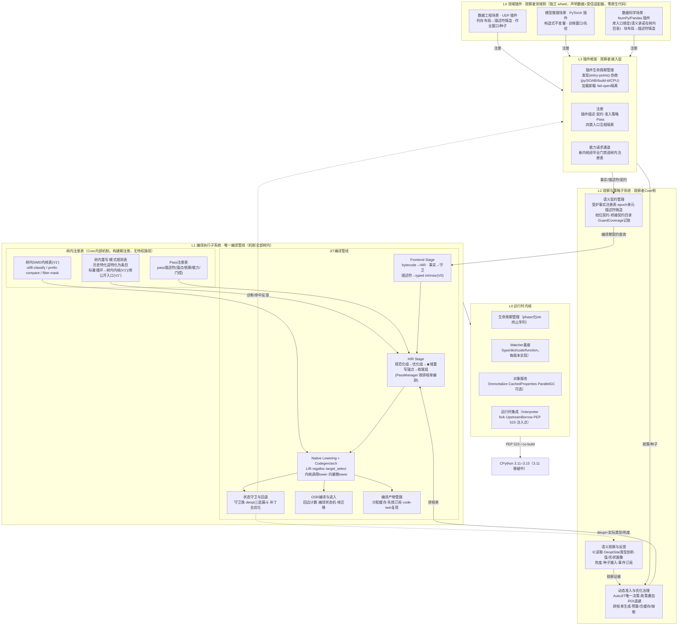
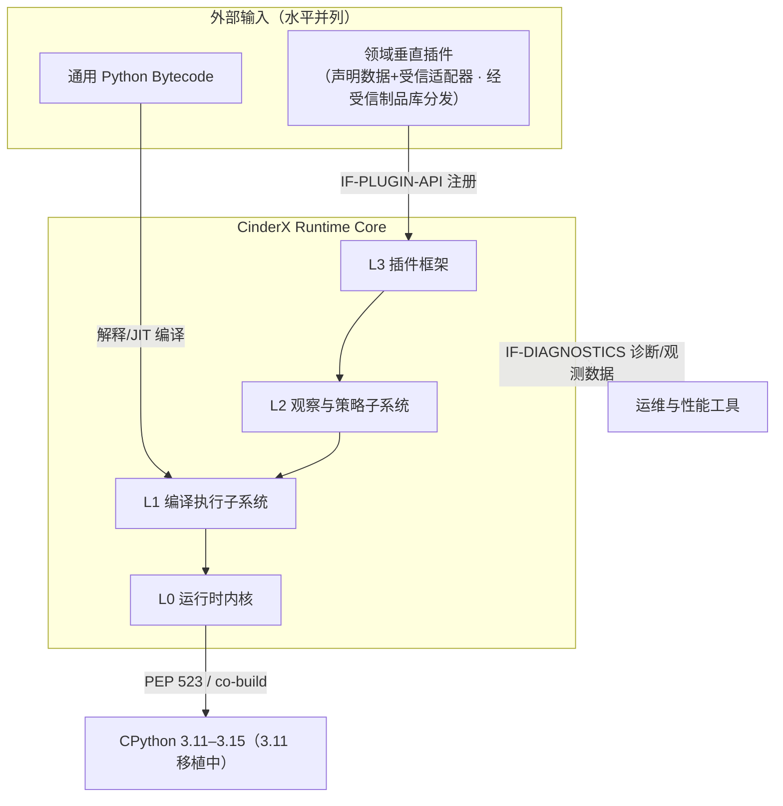
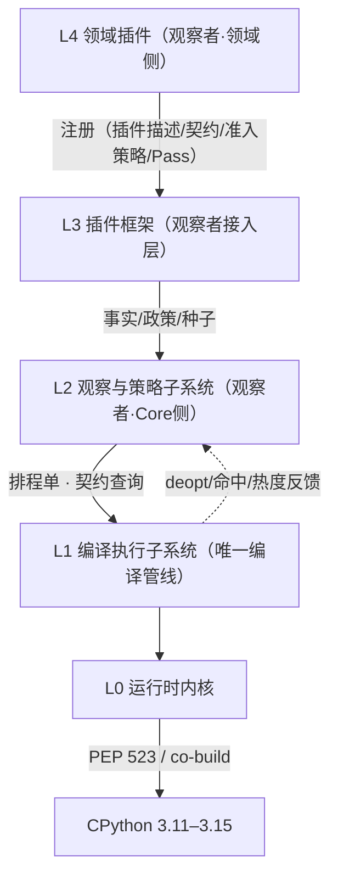
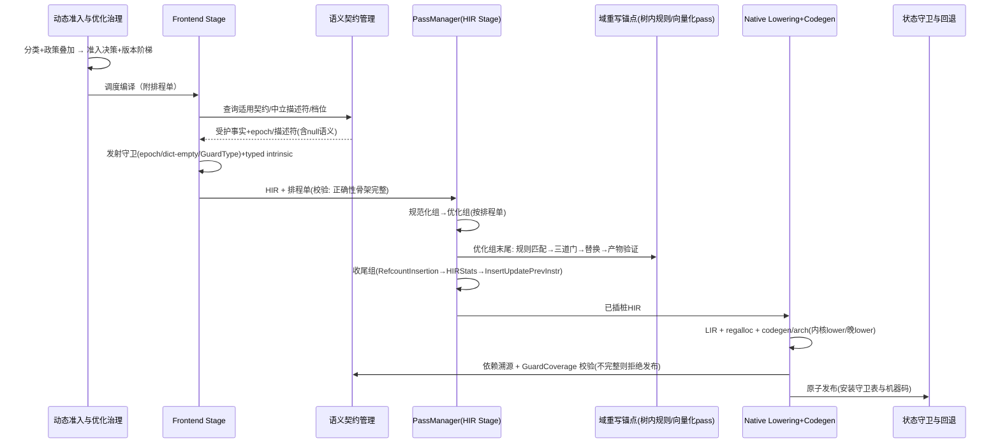
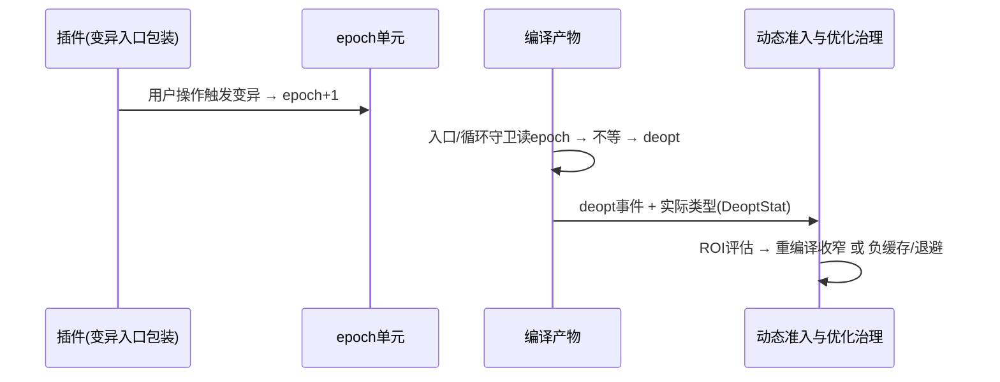
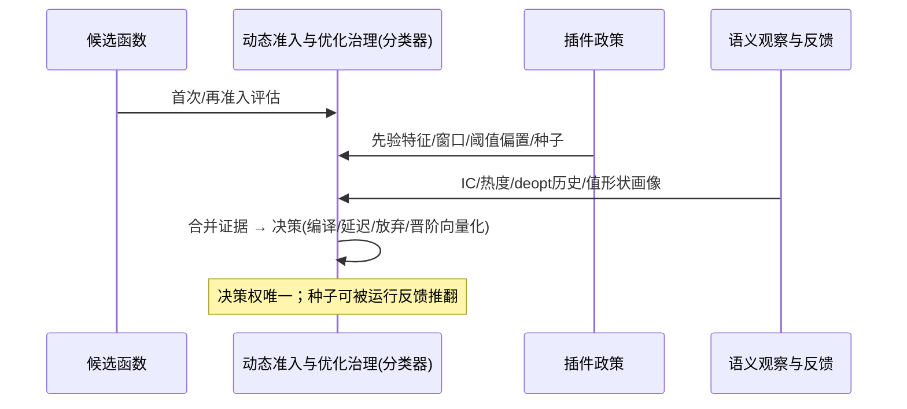
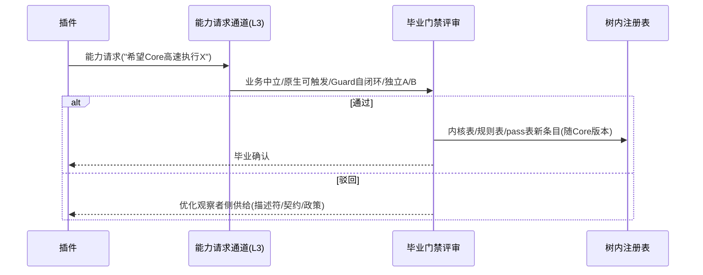

# 【架构设计】CinderX 增强运行时

## 产品版本与密级

| 项目 | 内容 |
| --- | --- |
| 产品/方案 | CinderX Runtime Core / 增强型 CPython 运行时 |
| 文档版本 | 1.2 |
| 方案阶段 | 目标架构基线，待按阶段实现 |
| 密级 | 内部技术设计 |
| 适用范围 | Runtime Core 全部子系统（L0-L3）与领域垂直插件（L4） |
| 事实基线 | CinderX 主线 `ba5ecb4d`（本文全部 file:line 锚点按该版本） |

## 拟制信息

| 项目 | 内容 |
| --- | --- |
| 拟制日期 | 2026-08-20 |
| 拟制方式 | 基于 CinderX 主线代码与目标架构评审形成 |
| 文档状态 | 待评审 |

## Keywords 关键词

增强型 CPython 运行时、Runtime Core、执行者/观察者、Stage/Pass/锚点组、PassManager、排程单、域重写锚点、树内（in-tree）、中立描述符（Neutral Descriptor）、树内内核表、树内重写规则表、语义契约管理、GuardCoverage、档位契约（Equivalence Tier）、库向量入口桥接、向量化三道门、trap-to-scalar、动态准入（AutoJIT）、画像种子（Profile Seed）、Epoch 守卫、垂直插件。

## Abstract 摘要

本文定义 CinderX 从"CPython JIT 插件"重组为"增强型 CPython 运行时"的目标架构。定位收敛为：**单一编译后端（CinderX 自身 Frontend/HIR/LIR/codegen 管线）、优化对象仅为 Python 代码**；领域插件只覆盖框架的 Python 层（不含框架自身的图编译与 C/C++ 内核）——但允许把用户 Python 代码中的标量调用循环**桥接到外部库公开的向量入口**（见裁决 8）。

核心架构主张六条：

1. **执行者/观察者分离**。执行者（L1 编译执行子系统）唯一、封闭，持有全部不可判定的机械（分析、调度、寄存器分配、codegen、deopt、frame）；观察者按领域分化，供给全部可判定的知识。垂直性不再以"改编译器"进入，而以**数据**进入。
2. **插件零原生代码，声明与适配分通道**。插件供给分两个通道：声明面（准入政策、受护事实/epoch、画像种子、诊断治理——纯数据，schema 校验后进入，无需执行插件代码）与适配面（描述符铸造请求、epoch 递增、变异入口包装——同进程 Python 代码，属进程 TCB，按受信制品管理，经窄接口进入）；插件分发物**零原生代码**；一切可执行优化能力（SIMD 内核、模式重写）都是树内注册表条目。新领域内核经"能力请求 → 毕业门禁"进树内注册表。
3. **正确性货币统一**。一切正确性输入（受护事实/契约、外部假设、内核效果、重写前提）遵守同一闭环：声明假设 → GuardCoverage 记账（所有者/机制/失效动作）→ 守卫安装 → 发布，不完整则拒绝编译；准入政策与画像种子只影响性能选择，不进入正确性闭环。
4. **管线编排机制化**。编译管线按 Stage（IR 层级大段）/ Pass（stage 内调度单元）/ 锚点组（排序约束分组）/ 规则（pass 内变换单元）四粒度描述；PassManager 是 L1 内的编排机制，"跑哪些 pass、用什么配置"由治理下发排程单——编排归机制，取舍归策略。
5. **域重写锚点**。领域向量化/模式重写统一挂在 HIR Stage 优化组末尾、收尾组之前（引用计数插桩按最终 HIR 形态计算，其后不允许任何结构性改写）；标量→向量路由以档位契约（Tier 1 位精确 / Tier 2 末位误差 / Tier 3 归约重排，默认保守）约束数值语义等价，内核来源可为树内 SIMD 例程或外部库公开向量入口（库向量入口桥接）。
6. **多版本共生**。版本矩阵固定为 CPython 3.11/3.12/3.14/3.15，每版本一条 co-build 线（UpstreamBorrow 版本模板 + 解释器 fork + 发行 wheel）；版本差异集中收敛在 Frontend/L0/执行侧边界，版本无关的不变量收窄为 **HIR Stage 机制与锚点契约**（三锚点组结构、PassManager、域重写锚点、排程单语义）——HIR 指令与 pass 实现允许存在受控版本分支（基线已见，如 `Jit/hir/pass.cpp:326`），其语义等价以逐版本差分验证背书。3.11 JIT 移植（进行中）确立的"vendored 评估器 PEP 523 接管 → Eval/Observe 调度仿真 → 差分引擎 + 验收门禁 → JIT 源集入构 → 放开编译入口"为版本移植标准方法论。

观察者的语义获取不依赖静态分析：类型恒定走"打赌 + 守卫验证 + deopt 纠错"，阶段不变性走"构造式不变量"。向量化是树内机制：插件只把框架私有布局翻译成铸造请求，Core 边界验证后发放**中立描述符**（有界 opaque handle），向量化 pass 以三道门（布局/语义/异常）自行判定合法性；对外部库场景则以"档位契约 + 库向量入口桥接"复用同一锚点与同一治理闭环。

## List of abbreviations 缩略语清单

| 缩略语 | 英文全称 | 中文名 |
| --- | --- | --- |
| ABI | Application Binary Interface | 应用二进制接口 |
| AOT | Ahead-of-Time Compilation | 提前编译 |
| AutoJIT | Automatic JIT Admission | 动态准入 |
| CFG | Control Flow Graph | 控制流图 |
| EAFP | Easier to Ask Forgiveness than Permission | 先试后判（异常驱动）惯用法 |
| ELF | Executable and Linkable Format | 可执行可链接格式 |
| HIR | High-level Intermediate Representation | 高层中间表示 |
| IC | Inline Cache | 内联缓存 |
| IR | Intermediate Representation | 中间表示 |
| JIT | Just-in-Time Compilation | 即时编译 |
| LIR | Low-level Intermediate Representation | 低层中间表示 |
| OM | Operations and Maintenance | 运维（观测/告警/日常运营） |
| OSR | On-stack Replacement | 栈上替换 |
| PEP 523 | Adding a frame evaluation API to CPython | CPython 帧评估器接管 API |
| PassManager | — | Pass 编排器（机制层） |
| ROI | Return on Investment | 投入产出比 |
| SIMD | Single Instruction Multiple Data | 单指令多数据 |
| SOABI | Shared Object ABI | 扩展模块 ABI 后缀标签 |
| SPI | Service Provider Interface | 插件服务提供接口 |
| SSA | Static Single Assignment | 静态单赋值 |
| TCB | Trusted Computing Base | 可信计算基 |
| UDF | User-Defined Function | 用户自定义函数 |
| W^X | Write XOR Execute | 写执行互斥（内存页不可同时可写可执行） |

# 简介

## 目的

1. 冻结增强型 CPython 运行时的分层、模块划分与职责边界。
2. 定义垂直插件接入 Core 的唯一机制（注册类接口，声明面纯数据、适配面受信窄接口）与扩展边界。
3. 定义观察者（事实/政策/种子）与执行者（编译器内核）的分工和正确性归属。
4. 定义数据面以树内向量化并入 Core 原流程的路径（中立描述符 + 三道门 + 档位契约 + V0/V1′/V1″/V2）。
5. 固定编译管线词汇（Stage/Pass/锚点组/规则）与 PassManager 的机制/策略边界。
6. 给出基线代码到目标架构的映射与迁移路线。

## 范围

本文覆盖：Runtime Core L0-L3 与领域垂直插件 L4 的结构、行为、数据模型；插件 API；守卫与失效归属；安全与治理；迁移路线。

本文不覆盖（非目标）：

- 引入 CinderX 之外的编译后端（torch.compile、LLVM、独立向量化引擎等）；
- 优化非 Python 代码（外部库 C/C++ 内核、CUDA 图）——注意：把 Python 循环**桥接**到外部库公开向量入口是 Python 代码优化，属本文范围；
- 具体领域插件的实现（契约表内容、守卫清单、落地切法）；
- 开放命令式 Pass ABI（插件提供任意 IR→IR 变换代码）——原则性拒绝，见架构原则 6 与裁决 8；
- 插件分发原生代码（外部 SIMD 内核 `.so`）——见裁决 4；
- GPU/异构执行域。

## 文档结构

- 第 1 章简介。
- 第 2-4 章定义概念、目标、约束与原则。
- 第 5 章总体架构（分层与模块划分）；第 6 章系统用例模型。
- 第 7 章关键技术方案设计。
- 第 8-9 章逻辑架构与实现架构。
- 第 10-11 章安全分析与独立能力。
- 第 12 章其他说明（迁移路线、毕业门禁、开放问题、审计结论）。
- 附录 A 给出九项关键架构裁决，其后为参考资料清单。

## 利益相关人

| 角色 | 关注点 |
| --- | --- |
| Runtime Core 开发者 | 执行者边界是否封闭、守卫/deopt 归属是否单一、树内注册表是否可控、PassManager 抽取是否无行为漂移 |
| 领域插件开发者 | 注册类接口是否够用、新内核的毕业通道是否顺畅、失败是否隔离 |
| 框架用户 | 无需改写代码、语义一致（含浮点结果档位透明）、失败可回退、默认零诊断负担 |
| 生产运维 | 准入是否动态自治、预算/熔断是否闭环、可观测性 |
| 性能工程师 | 收益归因、编译时间回归、A/B 证据 |

# 概念模型

## 核心概念

| 概念 | 定义 |
| --- | --- |
| 执行者（Executor） | L1 编译执行子系统；唯一将"带前提的 Python 代码"变为"受守卫机器码"的场所 |
| 观察者（Observer） | 供给语义知识的角色：Core 侧为 L2 观察与策略子系统，领域侧为 L4 垂直插件 |
| Stage（阶段） | 按 IR 层级划分的编译大段；L1 编译管线为 Frontend（bytecode→HIR）、HIR、Native Lowering（HIR→LIR + 寄存器分配）、Native Codegen 四个 Stage |
| Pass（通道） | Stage 内的调度单元（HIR Stage 内全部 HIR 进、HIR 出）；编排与门控统一由 PassManager 承担 |
| 锚点组（phase group） | Stage 内的排序约束分组；HIR Stage 内为规范化组 → 优化组 → 收尾组三组 |
| 规则（子 pass） | Pass 内部的变换单元 |
| 域重写锚点 | HIR Stage 优化组末尾的领域重写挂载点（树内重写规则表与向量化 pass 的挂载位置），位于收尾组之前——引用计数插桩按最终 HIR 形态计算，其后不允许结构性改写；该不变量由 PassManager 机制保证 |
| PassManager | L1 编译管线内的编排机制模块：pass 注册、实例化/执行、排序与锚点约束求解、分析缓存共享、横切服务（计时/dump/verify/stats）；只执行排程单，不做取舍 |
| 排程单（Schedule） | 一次编译的 pass/规则选择及其配置；由动态准入与优化治理生成、PassManager 执行；取舍只发生在可选优化覆盖层——正确性骨架（引用计数插桩、验证、守卫发射、UpdatePrevInstr 插桩）不可选，缺失骨架的排程单被拒绝 |
| 树内（in-tree） | 源码位于 Core 仓库，构建期编译进 `_cinderx.so` 并静态注册进统一注册表；与 Core 同版本、同 CI、同测试、同发布节奏 |
| 树外（插件） | 独立仓库/wheel，运行期经 L3 注册接口进入；分发物为纯 Python、**零原生代码**，供给分两通道：声明面（纯数据，schema 校验后进入，无需执行插件代码）与适配面（描述符铸造请求、epoch 递增、变异入口包装——同进程受信代码） |
| 结构事实（Structural Fact） | 可从代码对象/字节码自推导的事实（CFG、常量、annotation、closure） |
| 受护事实（Guarded Fact / Contract） | 不能自推导、以守卫+失效闭环为条件进入编译的断言；有稳定 ID、来源、失效方式 |
| 外部假设（External Assumption） | 正确性依赖的外部条件（依赖库版本、schema epoch、框架全局状态），由 epoch 单元承载失效 |
| 中立描述符（Neutral Descriptor） | 类型化缓冲区布局契约，形态为 **Core 铸造的有界 opaque handle**：适配器提交 `DescriptorRequest`（data/offsets/validity 三视图 exporter、element offset/count（非负、绝对行号）、dtype、布局（byte/bitpacked）、utf8 形态、访问模式、validity 位序与显式极性二值、绑定段——offset/count 是不可信请求范围），Core 经 `PyObject_GetBuffer` 取得 `Py_buffer` 容量权威（首版限 C-contiguous、非负 stride 的 view），按布局分组 checked arithmetic 判界并通过语义绑定校验后发放 handle 并 pin 所有者；禁裸指针；epoch/generation 承载失效。框架私有布局（数据表列、连续块、张量存储等）的翻译留在插件侧；Core 不认识任何框架私有布局 |
| 档位契约（Equivalence Tier） | 标量↔向量数值等价的分档承诺：Tier 1 位精确（IEEE754 逐元素确定的算术）、Tier 2 末位误差（向量核与标量 libm 差 1 ulp）、Tier 3 归约重排（顺序累加 vs pairwise）。消费方按档位决定向量化范围 |
| 库向量入口桥接（Library Vector Entry Bridging） | 域重写的内核来源形态之一：不生成自研 SIMD 内核，而把循环改写为对**外部库公开向量入口**的普通调用；可桥接入口限于受信桥接契约目录条目 |
| 桥接契约目录（Bridge Contract Directory） | 受信目录：随 Core 构建携带或部署方签发的可桥接外部入口清单，每条目 = {库制品摘要、入口符号、输入域（dtype/形状/取值前提）、语义承诺（no-raise 域、副作用声明、等价档位上限）、oracle 证据引用}；插件只能引用条目并供给运行时绑定，不能新增或修改语义承诺；无运行期写入面 |
| 能力（Capability / Intrinsic） | 树内注册的高速执行单元：`{id, 签名, 效果类, lower 方式}`，构建期注册进树内内核表 |
| 重写规则（Rewrite Rule） | 树内注册的 `{模式, 前提(引用契约), 替换体, 优先级}` 条目；挂在域重写锚点；树内历史特化逆特化后的形态 |
| 效果声明（Effect Class） | intrinsic 对外承诺的行为类别：纯/只读/读写/可分配/可抛异常/可 deopt；驱动分析与调度 |
| GuardCoverage | 每条被消费假设的执行时保障记录：所有者、机制、检查时机、失效动作 |
| Epoch 单元 | 稳定地址的整数单元；观察者写入递增，编译产物读比较，不等则 deopt；单元带 generation，生命周期与全部消费产物强引用绑定，回收走安全退役状态机 |
| 画像种子（Profile Seed） | 生产遥测汇聚的按位点知识（类型稳定率、热点清单），仅做冷启动偏置 |
| 政策叠加（Policy Overlay） | 插件对动态准入的偏置：先验/特征、窗口、阈值、种子 |
| 向量化三道门 | 树内向量化 pass 的合法性判定：布局门（描述符内存模型）、语义门（循环体可向量化 op 集结构校验 + 档位契约）、异常门（Core 可控内核：推测执行 + trap-to-scalar 逐元素重放；外部库入口：仅 no-raise/无副作用/输出可丢弃，调用边界整段回退） |
| 能力请求（Capability Request） | 插件声明"希望 Core 能证明/执行 X"，经毕业门禁后进树内注册表 |

## 信息分类与正确性规则

| 信息类别 | 典型内容 | 生产方 | 消费规则 | 决定正确性 |
| --- | --- | --- | --- | --- |
| 结构事实 | bytecode、CFG、SSA、常量、annotation | Core 前端自给 | 直接消费 | 可以 |
| 受护事实 | 精确类型先验、不可变约定、中立描述符（Core 铸造）、档位授权；库桥接语义承诺为受信目录条目（Core 携带或部署方签发） | 观察者（打赌或构造） | 守卫化后消费；GuardCoverage 记账 | 可以 |
| 外部假设 | 依赖库版本、schema epoch、框架全局状态 | 插件/框架契约源 | epoch 守卫覆盖，否则拒绝 | 可以 |
| 画像 hints | 调用次数、热度、类型稳定率、列宽/批大小、值/形状/dtype 分布 | 遥测/观察基座 | 仅影响准入与特化选择（含向量化 unroll 因子、n 阈值） | 不可以 |
| 效果声明 | 树内内核行为类别 | Core 树内注册（构建期） | 分析与调度依据 | 可以 |
| Core 私有产物 | HIR/LIR/机器码/守卫表 | Core | 不跨版本、不外泄 | Core 负责 |

不变量：

1. Hint 缺失、错误或过期只允许影响性能选择，不允许改变业务结果。
2. 假设只有在 GuardCoverage 完整后方可进入发布产物。
3. 插件声明面是纯数据；适配面虽为同进程 Python 代码，但只经铸造请求、epoch 递增、入口包装三类窄接口进入——插件不是"变换者"也不是"供码者"，Core 是全部变换与机器码的唯一持有者。
4. 观察者不能验证的事实必须放弃，不能因为来源可信而默认为真。
5. 插件声称的纯度/可向量化性至多是 hint；向量化合法性由语义门的结构校验自行判定；数值等价范围由档位契约显式授权。

## 信息来源与归属

### 观察者语义的两种获取模式

- **打赌 + 验证（类型恒定类）**：不需要证明类型恒定。编译期依据观察证据（IC、DeoptStat、种子）下注 `GuardType`，守卫逐次验证，deopt 纠错并回填观察（DeoptStat 的 `FixedTypeProfiler` 记录实际类型，`cinderx/Jit/context.cpp:244-267`）。回答的问题是"本编译周期赌什么、错了多快知道、错了多便宜恢复"。
- **构造式不变量（阶段不变类）**：不判断不变，构造不变。插件把目标对象的全部变异路径引流过仪表化入口（包装 `__setattr__`/`register_hook`/options API 等框架结构性保证必经的入口），入口递增 epoch。对普通 dict，Core 的 dict watcher 是零成本版本。不变性由"声明者（插件）+ 验证者（守卫/watcher）+ 失效动作（deopt/重编译）"三方闭环。

### Core 自给清单（不成为插件必需接口）

bytecode、CFG、循环/分支/generator 形态；AutoJIT 行为分类；精确类型与类型反馈；globals/builtins/closure/defaults 及其 GuardIs/Watcher；CPython 内建语义、异常、Safepoint、Deopt state；常量与内部缓存策略。插件可将其作为 hints 传入，Core 正确性不依赖之。

### 树内与树外的边界含义

| 维度 | 树内（in-tree） | 树外（插件） |
| --- | --- | --- |
| 代码位置 | CinderX Core 仓库 | 插件仓库 |
| 版本与发布 | 与 Core 同版本、同节奏 | 独立版本、独立 wheel |
| 构建产物 | 编译进 `_cinderx.so` | 纯 Python 包，零原生代码 |
| 进入方式 | 构建期静态注册进统一注册表（PassManager 的 pass 描述符、树内内核/规则表） | 运行期经 L3 注册接口进入 |
| 正确性义务 | Core 拥有（同测试/CI/守卫体系） | 声明面只供给数据，Core 验证；适配面按受信制品管理（身份/依赖闭包/窄接口） |
| 演进速度 | 受 Core 发版约束（能力请求 → 毕业门禁） | 自由 |
| 例子 | pass 注册条目、树内内核表、重写规则条目、向量化 pass | 描述符铸造请求、epoch 路由、准入政策、种子、库入口运行时绑定 |

要点：**树内 ≠ 特权路径**。树内代码同样必须经统一注册表登记，没有第二种通道；基线现状（TreeIter 焊死在 `runPasses` 固定序列）才是特权路径，目标态要将其改造为注册条目。注册机制是唯一进入方式，树内/树外只是构建期注册与运行期注册之别。

# 架构和关键质量属性目标

## 架构目标

1. **执行者唯一**：全系统只有一条编译管线；任何垂直优化最终都经它落地。
2. **插件零原生代码、能力全树内**：领域扩展以声明数据与受信适配器窄接口进入；一切可执行能力为树内注册表条目，Core 发版是内核演进的唯一节奏。
3. **观察者可领域分化**：插件无需 C++ 或 IR 知识即可供给领域知识（描述符铸造请求、构造式不变量、政策、种子、语义契约）。
4. **动态准入自治**：AutoJIT 是生产准入唯一决策者；插件只偏置，不裁定。
5. **正确性单一归属**：每个假设有唯一所有者与失效动作；守卫/deopt/frame 机械只在 Core。
6. **管线编排机制化**：pass 编排归 PassManager（机制），取舍归治理（策略）；pass 与规则的进入只有注册表一条路。
7. **可退化**：插件缺失、注册失败、守卫失败、deopt、规则被门拒绝均回到原始语义路径。
8. **零默认负担**：诊断默认关闭，不产生 dump 与采样。

## 关键架构需求

| 编号 | 需求 | 验收口径 |
| --- | --- | --- |
| AR-01 | 扩展边界零原生代码 | 插件分发物零原生代码；API 无 opcode/IR 结构暴露；适配面仅铸造请求/epoch 递增/入口包装三类窄接口 |
| AR-02 | 注册接口完备 | 准入政策/事实·epoch·描述符/种子/诊断/pass 接入均可注册且互相隔离 |
| AR-03 | GuardCoverage 门禁 | 无覆盖记录的假设进入产物即测试失败 |
| AR-04 | Hint 隔离 | 删除/篡改任意 hint 不改变正确性测试结果 |
| AR-05 | 树内注册表可用 | 新增 SIMD 内核或重写规则 = 注册表条目 + 效果/前提声明，无散改多文件；无散落硬编码特权路径 |
| AR-06 | 向量化合法性三道门 | 不过布局门/语义门/异常门的循环一律不被向量化；描述符铸造以 `Py_buffer` 为容量权威、按布局分组 checked arithmetic 验证请求范围（data/offsets/validity 分别判界，禁裸指针，含跨视图指针区间重叠检测），越界/UAF 类缺陷为 0；档位契约未授权的 Tier 一律不重排；trap-to-scalar 重放语义与标量执行一致（V1′/V2 逐元素；V1″ 输入域写前预检，异常时机与标量循环一致） |
| AR-07 | 准入动态性 | 生产配置无静态名单；决策可由运行反馈推翻种子 |
| AR-08 | 效果声明驱动调度 | 树内内核按效果类被正确调度/消除/内联决策 |
| AR-09 | 编译时间可控 | 规则匹配与向量化分析有预算与廉价预过滤；构建可复现 |
| AR-10 | 零插件环境等价 | 不安装任何插件时，Core 通用优化与基线行为/A/B 可对照 |
| AR-11 | 排程单可下发 | PassManager 接受外部排程单；全局 Config 是其特例；排程单只在可选优化覆盖层取舍——正确性骨架（骨架位标记的 pass）不可移除，缺失骨架的排程单被拒绝，取舍只影响性能不影响正确性 |
| AR-12 | 锚点不变量 | RefcountInsertion 之后无结构性改写由 PassManager 机制保证（约束求解），非约定保证 |
| AR-13 | 版本矩阵可维护 | 新 CPython 版本纳入走「多版本支持与版本矩阵」节移植方法论，不新增特权路径；HIR Stage 机制与锚点契约（三锚点组/PassManager/域重写锚点/排程单语义）版本无关，HIR 指令与 pass 实现内的版本分支须登记并以逐版本差分验证 |

## 假设和约束

- 与 CPython 小版本 co-build（UpstreamBorrow/解释器 fork/watcher 深度依赖），插件必须声明精确 Python 版本 + SOABI + Core build-id。
- 单一全局 ModuleState，不支持 subinterpreter；x86-64/aarch64 only。
- 版本矩阵：**Python 3.11（JIT 移植进行中：vendored 3.11.6 评估器 + Eval/Observe 模式已落地，JIT 编译入口尚未放开）/ 3.12 / 3.14 / 3.15（全量 JIT）**；每版本独立 co-build 与发行 wheel（cp311/cp312/cp314/cp315，双包 release 编排）。
- 重写与向量化分析仅在域重写锚点、预算内运行。
- 外部库桥接路径钉库大版本（库语义随大版本变化时），由 epoch 承载失效。

### 生命周期约束

- 编译产物进程内有效；epoch 变化、代码/closure/global 变化、插件卸载、ABI 变化必须失效关联产物。
- epoch 单元、编译产物与 patch 队列的回收走安全退役状态机（入口切换 → 执行排空 → patcher 注销 → 最后释放），禁止跳步回收（见「安全退役状态机」节）。
- 画像种子随插件包版本化；诊断 bundle 生命周期独立于代码缓存。

# 架构原则

1. **执行者/观察者分离**：不可判定的机械归执行者，可判定的知识归观察者。
2. **优化降格为数据**：事实、描述符、政策、种子是运行期注册条目；树内内核与规则、pass 描述符是构建期注册条目；桥接契约目录条目随 Core 构建或部署方签发，同样无运行期写入面——注册机制是唯一进入方式，树内/树外只是注册时机之别。
3. **可获得不等于应依赖**：Core 能自给的信息不成为插件必需接口。
4. **假设不是守卫**：先描述条件，执行层生成守卫/watcher/deopt 或拒绝。
5. **打赌优于推断，构造优于检测**：语义获取优先用守卫验证的赌注与构造式不变量。
6. **零原生代码与窄适配边界**：插件不携带任何原生代码，不提供变换逻辑；声明面是纯数据，适配面只经铸造请求、epoch 递增、入口包装三类窄接口进入。IR、守卫表、机器码、deopt 机械永不过界。理由是可判定性——数据形态可校验，变换代码不可判定。
7. **描述符中立与按计算模式命名**：Core 只认识中立缓冲区布局契约；内核以 utf8-classify/filter-mask 等计算模式命名，禁止业务命名。
8. **动态准入唯一决策**：插件政策是偏置，决策权与反馈闭环在 AutoJIT。
9. **能力毕业制**：领域新内核经能力请求 → 毕业门禁 → 树内注册表；树内特化应可逆向表达为注册条目（机制自洽性试金石）。
10. **诊断旁路、预算闭环**：诊断不参与正确性；一切扩展消费受预算与确定性约束。
11. **编排归机制、取舍归策略**：PassManager 只做编排与不变量保障；"跑什么"永远是治理侧的排程单。观测/决策/动作不得在机制层内闭环。

# 总体架构（分层与模块划分）

布局语义（本文所有架构图通用）：**水平为并列，垂直为依赖（上层依赖/供给下层），内外为包含/组成**。



分层律条：**L1 永远不问"这是谁的业务"，L2/L4 永远不生成机器码；插件分发物永远不含原生代码；编排（PassManager）永远不做取舍（治理）。**

各层职责：

- **L0 运行时内核**：CPython 共生层，四个并列模块——生命周期管理（phase 化 init：内核 → 准入 → 插件注册 → StaticPython 延迟）、Watcher 基座（type/dict/code/function 变更事件源，每版本实现，向 L2 开放回调；dict watcher 是构造式不变量的零成本通道）、对象服务（Immortalize/CachedProperties 常驻，ParallelGC 可选）、运行时集成（Interpreter fork、UpstreamBorrow 版本模板、PEP 523 接管、`module_state.h` + `*_iface.h` 注入点）。域接入对 L0 零改动（向量调用对 JIT 只是一次普通 vectorcall）。
- **L1 编译执行子系统**：树内注册表（pass/内核/规则三类条目的构建期注册，PassManager 的数据源）；JIT 编译管线（四个 Stage：Frontend——bytecode→HIR、事实→守卫、描述符→typed intrinsic；HIR Stage——三锚点组 + 域重写锚点，PassManager 编排；Native Lowering——LIR/regalloc/target_select；Native Codegen——arch 分化、内核 lower/向量晚 lower）；状态守卫与回退（守卫族、deopt 三层漏斗、TypeDeoptPatcher 补丁去优化）；OSR 编译与进入（回边计数、编译状态机、帧迁移）；编译产物管理（分配缓存、失效订阅、code-twin 复用、间接入口切换）。
- **L2 观察与策略子系统**：语义观察与反馈（IC 读取、DeoptStat 类型剖析、热度、值/形状/dtype 画像、种子摄入、事件订阅；统一观察数据模型）；语义契约管理（受护事实注册表〔版本化 schema〕、epoch 单元、中立描述符铸造与 null 语义、档位契约、受信桥接契约目录〔V1″ 语义承诺，无运行期写入面〕、守卫安装协调、GuardCoverage 记账）；动态准入与优化治理（AutoJIT 行为分类唯一决策 + 政策叠加 + ROI 反馈/退避 + 排程单生成 + 预算/负缓存/熔断/命名空间配额；JITList 仅调试用）。
- **L3 插件框架**：插件生命周期管理（entry points 发现、py/SOABI/build-id/CPU 协商、制品身份与依赖闭包校验、两阶段加载——先读 `.dist-info` 静态清单完成声明面注册，后按需 import 适配器、加载卸载——卸载即撤销其注册数据并失效关联产物、fail-open 隔离、能力请求通道）；插件描述注册（Manifest：id、spi_version、runtime_abi、供给清单）；契约注册（受护事实/epoch/中立描述符/档位的登记入口；桥接契约目录为受信目录——Core 构建携带或部署方签发，无运行期写入面）；准入策略注册（政策叠加的登记入口）；Pass注册（pass 启用与配置经静态清单登记，作为治理输入由动态准入与优化治理合并生成排程单——不直接写入最终排程单；pass 实现仍为树内条目，无运行期代码接入面）。
- **L4 领域插件**：按场景分化——数据工程（UDF：列存布局→描述符铸造）、模型推理（PyTorch：构造式不变量 + 训练窗口）、数据科学（NumPy/Pandas：库入口运行时绑定 + 块布局→描述符铸造）。插件的差异全部体现在观察者层：谁能把框架布局翻译成铸造请求、谁供给运行时绑定与失效观测、谁构造不变量、谁导流热点；插件实现细节不在本文范围。

# 系统用例模型

## 上下文模型

### 上下文图

布局语义与总体架构图一致：**水平为并列，垂直为依赖（上层依赖/供给下层），内外为包含/组成**。外部输入只有两类：通用 Python Bytecode 与领域垂直插件；诊断/观测为只读输出旁路；CPython 为最底层依赖。



### 外部接口描述

| 聚合接口 | 外部方 | 内容 | 所有权边界 |
| --- | --- | --- | --- |
| `IF-PLUGIN-API` | 领域垂直插件 | 注册类接口聚合（插件描述/契约/准入策略/Pass 接入）+ 能力请求；种子随插件进入 | 声明面供给纯数据、适配面走受信窄接口；Core 校验、装守卫、发布 |
| `IF-PLUGIN-DELIVERY` | 受信制品库 | 插件 wheel（签名覆盖清单/适配器代码/依赖闭包；吊销清单） | 校验失败或被吊销标记 unavailable；适配器按受信代码加载；插件闭包内原生二进制拒载 |
| `IF-DIAGNOSTICS` | 运维与性能工具 | stats、HIR/ASM dump、GuardCoverage 视图、内核/规则命中、负缓存/熔断状态 | 只读输出旁路；进程内需诊断 capability，按命名空间 ACL 过滤，敏感 dump 需独立权限位 |
| `IF-CPYTHON-CO-BUILD` | CPython | 帧评估器、watcher、UpstreamBorrow、解释器 fork | Core 独立闭环 |

## 关键系统用例模型

### 需求编号：UC-01 构造式不变量供给

插件包装目标对象的必经变异入口（属性设置、钩子注册、选项 API 等框架结构性保证必经的路径）并递增 epoch，经契约注册进入契约系统（"该状态在本 epoch 内不变"）。Core 编译消费该事实时装对应守卫并折叠检查路径；用户触发变异 → epoch 递增 → deopt，语义无损。

### 需求编号：UC-02 树内向量化与中立描述符

插件把框架私有布局翻译成铸造请求，Core 边界验证后发放中立描述符；Core 前端发射 typed 访问 intrinsic（V0 去装箱）；向量化 pass 在域重写锚点过三道门后，将循环改写为树内内核表调用（V1′）、外部库公开向量入口调用（V1″，限受信桥接契约目录条目与档位授权）或向量晚 lower（V2）；归约默认保持顺序标量循环；守卫失败 deopt 回原循环。插件全程只供给数据与铸造请求。

### 需求编号：UC-03 动态准入政策叠加

插件经准入策略注册登记先验特征（代码形态家族归类）、准入窗口（框架初始化期不编译）、命名空间阈值偏置与画像种子；AutoJIT 分类器合并证据决策；运行后 deopt 风暴由 ROI 退避推翻种子结论。

### 需求编号：UC-04 能力请求与毕业

插件声明"希望 Core 能高速执行 X"（新内核形态）；毕业门禁评审（业务中立、原生可触发、Guard 自闭环、独立 A/B）通过后以树内注册表条目进入 Core 版本。

# 关键技术方案设计

## 守卫、失效与 Deopt 归属

| 条件 | 观察者 | 执行保障所有者 | 机制 | 失败动作 |
| --- | --- | --- | --- | --- |
| 参数/局部精确类型 | 语义观察与反馈（IC/DeoptStat/种子） | Core | `GuardType` + deopt | 重编译收窄或放弃（ROI 退避） |
| closure/global/调用目标 | Core（Preloader） | Core | `GuardIs` + watcher | deopt/失效 |
| 框架 dict 阶段不变 | 插件（构造式） | Core | dict-empty 守卫 + dict watcher | deopt |
| 外部状态/epoch | 插件（构造式） | Core | epoch 守卫（读稳定单元，比较 (单元身份, generation)，不等 deopt） | deopt + 重编译 |
| 中立描述符布局/所有权/epoch | 插件（铸造请求） | Core | 铸造期按布局分组 checked arithmetic 判界（请求范围 vs `Py_buffer` 容量权威，data/offsets/validity 分别验证）+ 跨视图指针区间重叠检测 + 语义绑定校验（两层权威模型）+ 所有者 pin + generation/epoch 守卫 | 铸造失败拒绝该描述符（降级不向量化）；运行期不等则 deopt 重绑定 |
| 库向量入口的调用目标与参数契约 | 受信桥接契约目录（Core 构建/部署方签发）+ 插件运行时绑定 | Core | `GuardIs`（调用目标身份 + 制品摘要对上目录条目）+ 参数布局/非别名守卫 | deopt 回原循环 |
| 向量化合法性 | Core（语义门结构校验 + 档位契约） | Core | 三道门 + trap-to-scalar 重放（V1′/V2 逐元素；V1″ 调用边界整段回退） | 回标量循环 |
| 树内内核效果 | 树内注册（构建期） | Core | 效果驱动调度 | 无（构建期已验证） |
| 树内重写前提 | 规则条目（引用契约） | Core | 前提守卫化检查 + 产物验证器 | 禁用规则 + 负缓存 |
| 热度/基数/稳定率/列宽/值分布 | 语义观察与反馈 | 无正确性所有者 | 成本 hint | 只调整选择（含 unroll 因子、n 阈值） |

### 现有失效兜底基线（三层漏斗）

基线代码已形成完整的失效兜底体系，目标架构在其上增加"按契约归因"与"软化硬失败"：

1. **不改码层**：IC/全局缓存 miss 走慢路径重填（`inline_cache.cpp`、`global_cache.cpp`）——最廉价。
2. **改码层**：类型变化 → `TypeDeoptPatcher::maybePatch` patch 7 字节 patchpoint 跳 deopt（约束仍满足时只刷新版本号，`type_deopt_patchers.cpp`）——运行中 frame 下个 patch 点自然退出。
3. **重构层**：整函数 deopt/uncompile/重编译（`funcModified` deopt-先行顺序、ROI backoff、`disable(deopt_all=True)`）——最重。

预防性兜底：`CI_CO_SUPPRESS_JIT`、ROI 冻结（`code_extra.h` roi_ctl 位域）、OSR `FailedPermanent`。

**现有硬失败点（目标态需软化为契约降级路径）**：watch 注册失败直接 `JIT_ABORT` 无降级（`context.cpp:381-397`）；watcher 回调一律 `return 0` 吞错误，无失败处理路径（`_cinderx-lib.cpp:523-650`）；`TypeDeoptPatcher::onUnpatch` 直接 abort（patch 单向，恢复只能重编译，`type_deopt_patchers.cpp:45-49`）；未知 DeoptReason abort；subinterpreter 拒绝 import。目标态：这些点按"契约违约统计 → 降级（弃用相关契约/规则/重编译保守版）→ 诊断上报"处理，进程不因可降级的契约问题终止。

注意分界：`CodePatcher` 超越机器码生命周期的 patch 为 UB、活跃机器码读取已释放或复用的 epoch 地址——这两项**不是可降级的契约问题，而是生命周期缺陷**，不可软化，由下节安全退役状态机消除。

### 安全退役状态机（epoch 单元、插件卸载与 CodePatcher）

三层漏斗回答"产物错了怎么退"，退役状态机回答"资源何时才能放"。每个生命周期对象（epoch 单元/编译产物/patch 队列项）带**原子状态**（active → retiring → retired）与 generation；固定顺序，任何一步不可跳过：

1. **注册**：epoch 单元、编译产物、patcher 登记进生命周期表，建立强引用（产物持 epoch 单元强引用；patch 队列持产物强引用）并分配 generation，状态置 active。
2. **失效触发**：epoch 递增 / 插件卸载 / 代码死亡 / 注册集（内核/规则/桥接契约目录）版本变化；状态 CAS 迁移为 retiring。
3. **入口切换**：`FunctionEntryCache` 间接入口切回解释器或保守版本；普通入口、静态入口与 OSR 进入在进入产物前必须先取租约（见下），租约失败即走解释器。
4. **执行排空**：以**活动执行计数**判定——每次进入产物递增、退出/返回递减（OSR 产物走出口退出），而非等待超时。**挂起 generator/coroutine 是持有点**：每个持有该产物恢复入口的挂起对象计 1（基线证据：`gen_data_footer.h` 的 `GenResumeFunc resumeEntry` 裸恢复入口、`generators_rt.cpp` 的 send/throw 恢复路径），排空必须先完成**挂起对象转换**——枚举登记的持有者，把恢复入口 deopt 为解释器形态（下次 send/throw/close 从解释器帧继续），各自递减计数；未转换的挂起对象视为活动执行，不得进入释放。**长期运行帧不得永久阻塞退役**：宽限期（配置上限）内未归零 → 对未退出帧注入强制 deopt 检查（长寿循环在既有 safepoint/deopt 检查点退出）；再超期 → 产物与 epoch 单元置"退役阻塞"墓碑态（不释放，内存有界保守持有）并上报控制面"该 worker 需要重启"——绝不带活引用释放。
5. **patcher 注销**：从 patch 队列移除该产物全部 pending patch——已排空产物不再有 patch 落点，杜绝"patch 命中已回收代码"。
6. **最后释放**：生命周期表引用归零后按依赖序释放（机器码块 → epoch 单元内存 → 插件注册数据）；epoch 单元退役即置墓碑值且该地址不得复用为新单元，旧 generation 读取一律按失效处理（deopt）——不存在"同地址复用使旧机器码误判有效"。

**并发线性化门（租约）**：状态机必须防住迟到引用——退役进行中，新的编译发布、OSR 进入、挂起对象恢复（send/throw/close）或 patch 入队可能重新引用正在退役的产物。规则：一切再引用点（普通入口、静态入口、OSR 进入、编译发布、挂起对象恢复、patch 入队）在取得引用前先在生命周期表 acquire **generation 租约**，取得后**复核状态仍为 active 且 generation 未变**，复核失败即放弃引用——入口走解释器、编译发布丢弃产物不安装、挂起对象恢复转入第 4 步转换流程、patch 入队直接拒绝。锁序固定（生命周期表 → patch 队列），使"注销"与"迟到引用"线性化为二选一。编译发布的额外竞态：新编译完成时目标函数可能已被禁用（ROI 退避/负缓存/函数已死），发布前同样复核租约与负缓存，失败即丢弃。

插件卸载是该状态机的实例：先失效其全部关联产物（走 2-5），再撤销注册数据，最后释放；导入副作用不在回滚范围（见运行安全域）。

## 语义契约管理

### 现有契约基线（十类隐式契约）

基线中契约机制丰富但全部隐式散落在代码与文档中，无统一管理面。盘点：

| 类别 | 代表机制 | 关键位置 |
| --- | --- | --- |
| 类型/属性 | 类型版本标签、type watcher 注册、freeze_type、HIR 类型格（"只偏大不偏小"不变量）、UseType 防误删 | `Common/type.cpp`、`Common/watchers.cpp`、`inline_cache.cpp:30`、`Jit/hir/type.md` |
| 守卫与 deopt | DeoptReason 枚举（9 类）、恢复点决策、DeoptMetadata/reifyFrame（含 DeoptLiveRegFilter 活寄存器过滤）、三级 trampoline、CodePatcher/DeoptPatchpoint | `Jit/deopt.h:88`、`deopt.cpp`、`code_patcher.h`、`deoptimization.md` |
| 内联缓存 | AttributeMutator 8 种 Kind（可特化"默认 `__getattribute__` + `__getattr__` 回退"的类并缓存 miss）、5 组 IC watcher 表、keys_version/dict 版本（双时钟：内容版本与 keys 版本，keys 版本按需铸造） | `Jit/inline_cache.h:106`、`Common/dict.h:60-93` |
| 调用约定 | 双入口（vectorcall/staticEntry）、FunctionEntryCache 间接指针、unboxed 参数信息、funcModified deopt-先行顺序 | `Jit/context.cpp:190-226,459`、`StaticPython/typed-args-info.h` |
| 引用/借用 | 三态引用（Uncounted/Borrowed/Owned）、borrow support 位向量、析构副作用失效、Immortalize、UpstreamBorrow ABI 借用 | `Jit/hir/refcount_insertion.md`、`Immortalize/`、`UpstreamBorrow/` |
| 失效通知 | dict 六事件三路分发（ClassLoader/GlobalCache/弃watch）、code/func 生命周期回调、编译期 pending watch | `_cinderx-lib.cpp:523-650`、`Jit/pyjit.cpp:4747-4801` |
| 静态语义 | classloader 路径解析、vtable、final 方法不可覆写、unboxed 字段布局、StrictModule patch 规则 | `StaticPython/`、`Docs/StaticPython/incompatibilities.md` |
| 公开 API | `cinderjit` 46 函数、`_cinderx` 模块、jit 装饰器/jit_suppress、纯 Python 降级层 | `cinderjit.pyi`、`PythonLib/cinderx/jit.py` |
| 生命周期/并发 | ParallelGC、FT entrypoint guard、编译序列化锁、产物保活（函数死→产物死） | `ParallelGC/`、`Jit/threaded_compile.cpp` |
| OSR | 回边阈值状态机、进入资格清单、builtins/globals 身份绑定 | `Jit/osr.h:16-144`、`docs/design/hot-loop-osr/` |

### 目标态扩充

1. **契约描述符化/注册表**：把上述隐式契约变成一等数据（契约 id、提供方、失效条件、兜底路径、版本），是语义契约管理成为模块的本体工作，也是 L3 契约注册的前置。
2. **领域（外部库）契约**：第三方库/框架的可桥接语义承诺（元素级等价、raise 集合、布局/提升规则、输入域）收进受信桥接契约目录，条目绑定库制品摘要与独立 oracle 证据；插件只登记运行时绑定（入口身份→目录条目）与失效观测，不能新增或修改语义承诺。插件自有语义契约（描述符 null 语义、构造式不变量）仍由插件注册。
3. **档位契约**：标量↔向量数值等价的分档授权（见下节）。
4. **契约健康与降级**：软化上一节列出的硬失败点；按契约统计违约率并降级而非崩溃。
5. **产物→契约依赖映射**：`type_deopt_patchers_` 表是该映射的雏形但只覆盖类型契约；显式记录每个编译产物依赖的契约集合，支撑选择性失效与 AOT/ELF 产物离线校验。
6. **契约违约归因统计**：DeoptReason 9 类太粗；按契约维度聚合违约事件，喂给治理。
7. **规范形式化**：`type.md`、`refcount_insertion.md`、`deoptimization.md`、`preloading.md` 已是散文式底子，统一成可对照测试的契约规范格式。

### 档位契约（Tier Contract）

标量接口与向量接口的数值语义等价必须分档，不能笼统声明"等价"：

| 档位 | 操作类 | 语义差异 | 默认策略 |
| --- | --- | --- | --- |
| Tier 1 位精确 | `+ - * /` 等 IEEE754 逐元素确定的算术 | 向量与标量逐元素结果一致 | 默认允许向量化 |
| Tier 2 末位误差 | `sin/cos/exp/sqrt` 等超越函数 | 向量核与标量 libm 可能差 1 ulp；标量库函数映射到向量核同理 | 需档位契约显式开启（全局开关或按函数） |
| Tier 3 归约重排 | `s += ...` 归约 | 顺序累加 vs 向量归约（pairwise）浮点结果不同 | 默认不向量化归约：逐元素部分向量化，归约保持顺序标量循环（重活在逐元素部分已省） |

档位契约是受护事实的一种：授权主体是部署方（Tier 2/3 的开启范围由部署方注册；插件只能随契约表请求，不能授权），GuardCoverage 记账（守卫 = 档位开关守卫/版本 epoch），语义门消费。

## 语义观察与反馈

### 现有机制基线

| 维度 | 机制 | 关键位置 | 反馈现状 |
| --- | --- | --- | --- |
| 事件观察 | 四类 watcher（code/dict/function/type）+ IC 级 TypeWatcher（5 组缓存表）+ dict 六事件三路分发 | `Common/watchers.cpp`、`_cinderx-lib.cpp:523-650`、`Jit/inline_cache.cpp:26-74` | **闭环**（类型变化→patch/失效/重编译） |
| 热度/准入 | CodeExtra 调用计数、behavior_classifier（Family/WorkDim/RiskReason → 每函数个性化阈值）、import/startup 阶段检测、JITList | `Jit/pyjit.cpp:555-635`、`behavior_classifier.*`、`autojit_import.cpp` | **闭环**（JITList 为纯静态规则） |
| OSR | 回边计数（默认 2000）+ 编译状态机 + FailedPermanent | `Jit/osr.*`、`Interpreter/3.14/cinder-bytecodes.c` | **闭环** |
| deopt 反馈 | DeoptStat（每 deopt 点计数 + FixedTypeProfiler 类型直方图）、ROI backoff（预算 32 起翻倍、max_rounds、rewarm 64、FROZEN）、TypeDeoptPatcher maybePatch、guardFailureCallback | `Jit/context.cpp:244-267`、`pyjit.cpp:4169-4260`、`fixed_type_profiler.h` | ROI **闭环**；类型直方图**开环**；回调仅测试使用 |
| 统计/日志 | AutoJitGateStats 11 计数器、编译事件 JSON 流（`CINDERX_AUTOJIT_COMPILE_EVENTS_FILE`）、jit_time_log 耗时树、HIRStats、allocator 统计、USDT/perf/GDB | `pyjit.cpp:79-137,251-303`、`jit_time_log.*` | **开环**（离线消费） |
| IC 观察 | miss 统计（带 reason），无 hit 计数 | `inline_cache.cpp:144-155` | **开环**（算不出命中率） |
| 产物观察 | allocator used/lost/fragmented、max_code_size 停编 | `code_allocator.h`、`config.h` | **闭环**（内存阈值停编） |
| 工具联动 | sys.monitoring/setprofile/settrace patch → JIT pause/全量 deopt | `pyjit.cpp:3462+` | **闭环** |
| Python API | `cinderjit.get_*` 系列统计查询（拉取式） | `pyjit.cpp:3688`（方法表） | 无推送通道 |
| 移植期观察 | Eval/Observe 模式（3.11）：帧入口热计数 → 调度请求 → 拒绝记录（`CINDERX_JIT_MODE`/`CINDERX_JIT_OBSERVE_FILE`，拒绝原因 `CINDERX311_JIT_EXEC_DISABLED`）；配套差分引擎 + 验收门禁入 CI | `Interpreter/3.11/observe.*`、`Jit/pyjit_stub_311.cpp` | **准入决策仿真**（无机器码执行），证据落盘离线分析 |

核心判断：**事件驱动部分（watcher/OSR 计数/ROI deopt 计数）已闭环，数值统计部分（cache miss、deopt 类型分布、编译耗时、gate 计数）全部开环。**

### 目标态扩充

1. **Deopt 类型直方图回流重编译**：DeoptStat 已采集触发类型分布，`HintType`/`ProfiledTypes` 在 HIR 已有表示，二者接线即"type-profile-guided 重特化"——现成原料最多的闭环。
2. **值/形状/dtype 画像**：现有 FixedTypeProfiler 只采 deopt 元凶值；数组类域重写的准入需要循环输入的 dtype/形状/n 分布观察，喂给动态准入与优化治理判定"这个循环值得不值得向量化"。
3. **IC hit 计数补齐**：命中率是属性缓存容量调优与 pass 效果评估的基础指标。
4. **统一事件订阅接口**：`setGuardFailureCallback` 从 C++ 测试专用升级为生产可编程口；Python 层可订阅 compile/deopt/invalidate/gate 事件（现为拉取式）。
5. **观察数据持久化与读回**：编译事件 JSON 是只写流；跨进程复用（上次的阈值/分类/类型 profile 下次启动读回）完全缺失。
6. **分类器在线重估**：`StructureKey` 是一次性静态分析存进 code extra；运行分歧信号（频繁 deopt、阈值内冷退）应触发重分类。
7. **观察成本治理**：事件订阅落地时同步定义采样/环形缓冲策略，维持"诊断默认零负担"。

## 数据面与向量化扩展

### 中立描述符

Core 数据面只认识"类型化缓冲区布局契约"。描述符不是插件可自造的结构体，而是 **Core 铸造的有界 opaque handle**；**容量权威来自 CPython buffer 协议，不来自插件自报**：

- **`DescriptorRequest` 冻结**：适配器提交的铸造请求 = {data exporter（缓冲对象）、element offset 与 element count（均非负，`element_offset` 为缓冲内绝对行号，含源对象自身逻辑 offset 的换算）、用途 dtype、布局（byte 定宽 / bitpacked 按位打包，bool 为 bitpacked 并携带 data bit offset）、utf8 形态（varlen 变长，须携带可选 offsets exporter | bytestream 单字节流，显式字段）、访问模式（读/写）、可选 validity exporter + validity bit offset + 位序（首版冻结 LSB0）+ null 极性（**显式二值字段 1_is_null | 0_is_null**，适配器按源引擎极性声明，Core 按声明解释——如 Arrow 为 0_is_null）、绑定段（列对象只读属性快照 + expected）}。**`element offset/count` 是不可信的请求范围（子区间选择），不是容量权威**；铸造 API 不接受裸指针；data/offsets/validity 三视图必须在同一次请求中原子提交。buffer 请求 flags 冻结：读访问 `PyBUF_FORMAT | PyBUF_C_CONTIGUOUS`，写访问追加 `PyBUF_WRITABLE`（只读缓冲请求写即拒绝）；非 C-contiguous 布局（strided、负 stride、`PyBUF_INDIRECT` 间接视图）首版一律 fail-closed。dtype 只接受冻结白名单（f8/i8/i4/bool 与 utf8 首版集合），`format` 解析失败或不在白名单即拒绝。不支持缓冲协议的对象同样 fail-closed 拒绝铸造（无指针兜底路径）。
- **判界（checked arithmetic）**：容量权威是 `Py_buffer.len`——C-contiguous、非负 stride 的 view 下它才是底层分配的字节上界（非连续 view 的 `len` 是逻辑长度，多维 stride 累计与负 stride 使静态可达界不可靠，故首版只接受该形态）。请求范围是待验证输入而非权威，全部下界非负，判界不变量（记 `offset_bytes = element_offset × itemsize`，乘加全程溢出检查；按布局分组）：

  ```text
  # 定宽（layout=byte）
  offset_bytes + element_count * itemsize <= data_view.len
  # 按位打包（layout=bitpacked）
  data_bit_offset + element_count <= data_view.len * 8
  # 变长 utf8（varlen，o_itemsize = offsets 元素宽度；切片段单调非减，O(count) 验证）
  element_offset + element_count + 1 <= offsets_view.len / o_itemsize
  offsets[element_offset] >= 0
  offsets[element_offset + element_count] <= data_view.len
  # 位偏移—行偏移绑定（bitpacked 与 validity；base_bit 随绑定快照声明，Arrow 恒 0）
  data_bit_offset == data_base_bit + element_offset
  validity_bit_offset == validity_base_bit + element_offset
  ```

  变长段首项非负 + 单调 ⇒ 全段非负（杜绝负地址通过判界）；位偏移不是独立自由值，必须与同一绝对行号一致平移（防非零 slice 判界通过却读取另一行的 bool/null 位），恒等式不成立按 `binding` 拒绝。任一失败即 fail-closed。后续版本的 gather/scatter 仅在 exporter 保证下逐索引访问，不放宽本约束。
- **validity 契约**：`Py_buffer` 不含 validity 位图与框架列身份。validity 是**独立 exporter 对象**（同样走 buffer 协议、按位图语义解释），带 validity bit offset（位图内起始位）、位序（首版冻结 LSB0）、null 极性（显式二值 1_is_null | 0_is_null，随请求声明）；全有效列可缺省 validity（不要求补造位图）；判界不变量：

  ```text
  validity_bit_offset + element_count <= validity_view.len * 8
  ```

  data、validity 与 offsets 分别判界。列身份不进描述符，属语义绑定校验的元数据交叉（见下）。
- **边界验证与别名不变量**：对齐可满足、各布局 checked arithmetic 判界成立、**跨视图指针区间重叠检测成立**（Core 记录全部 pin 视图的 `[base, base+len)`，访问模式不相容的视图重叠即 fail-closed——不同对象可对应重叠缓冲区，Python 层身份比较不是别名充分条件）；失败 fail-closed 拒绝并降级为不向量化。
- **所有者 pin**：handle 持有 `Py_buffer`（最终释放即 `PyBuffer_Release`），引用保活防释放后访问；**可调整 exporter（pin 期间可 resize/搬迁内存的对象）一律排除**——buffer 协议本身阻止其搬迁，Core 不设例外。
- **语义绑定校验（两层权威模型）**：边界合法不等于绑定正确（错误列、错误 null 策略可能稳定地产生错误结果）。缓冲协议只暴露指针与长度，不能证明"缓冲属于哪个列对象"——绑定正确性分两层：**Core 可独立验证层**——三视图同次原子提交并记录统一绑定 id 与 generation，请求携带的列对象只读属性快照与 Core 自行取得的各视图 `Py_buffer` 元数据（format/itemsize/len）交叉一致（由快照与请求范围推出的各视图需求长度 ≤ 实际长度、dtype 与 format 一致），不符即拒绝；**不可独立验证层**——缓冲与列对象的归属关系由适配器受信地位承载（进程 TCB、双闭包供应链），以 oracle 差分对照兜底（首批全量 + 常态抽样），差分失败永久禁用该绑定形态。handle 带 generation，exporter 结构变更（重绑/列删除）递增并使旧 handle 失效，防"旧 generation 稳定地错"。
- **批级运行期绑定（BatchContext ABI）**：批级 handle 不进入静态契约——编译期只登记槽位 schema（形参序号、dtype、布局、访问模式），产物按"形参 → 槽位"编译、不捕获 handle；每批经 `bind_batch` 将"槽位 → handle"映射压入 **Core 维护的线程局部批上下文栈**（多线程 worker 各持独立栈；递归/嵌套调用压栈弹栈，内层读内层），JIT 入口守卫读栈顶逐槽校验 dtype/布局/结构签名，不符 deopt。
- **失效与门禁**：epoch/generation 承载失效，回收走安全退役状态机；铸造期全部验证记录进入 GuardCoverage，是向量化产物发布的硬门禁——不存在"错误描述符进入原生访问导致越界/UAF、却无法以 deopt 恢复"的路径。

框架私有布局（数据表列、连续块、张量存储等）的翻译（如何从框架对象定位缓冲）留在插件侧；Core 不认识任何框架私有布局。

### 向量化三道门（合法性判定，全部树内）

1. **门 1 布局门**：以 Core 铸造的描述符 handle 为唯一输入（首版限 C-contiguous、非负 stride，边界已在铸造期按布局分组判界——byte 定宽、bitpacked、varlen offsets、validity 各自覆盖）——连续、对齐、dtype 已知、validity 覆盖齐全 → 可向量化内存模型；strided/间接布局 → 首版拒绝（后续版本 gather/scatter，仅 exporter 保证下逐索引访问）；object dtype → 拒绝。
2. **门 2 语义门**：循环体必须完全分解为可向量化 op 集（类型化算术/比较/选择、树内 Unicode 类操作、min/max/sum 归纳）；结构校验即验证器——副作用调用、对象身份比较、跨迭代依赖一律拒绝。**数值等价范围由档位契约显式授权**：Tier 1 默认、Tier 2 需开启、Tier 3 归约默认拒绝。插件声称的纯度与等价至多是 hint。
3. **门 3 异常门**：按内核来源分级。**Core 可控内核（V1′/V2）**：初期白名单"对该 dtype 不会 raise 的操作集合"，目标态升级为推测执行 + trap-to-scalar——向量段遇"将抛异常"元素时回退标量循环从该元素逐元素重放，输出缓冲"可丢弃重写"由描述符所有权语义保证。**外部库入口（V1″）**：普通 vectorcall 不暴露首个失败元素与部分写入状态，逐元素重放不可实现——仅允许**受信桥接契约目录**条目（须声明 no-raise 成立的输入域）：域 = dtype 完整取值域的全域 no-raise 条目可直接桥接；受限域条目必须先经 Core 树内**输入域写前预检**（对整批一次 O(n) 验证），预检不过不发起向量调用、整段回原循环——异常由原循环按原时机抛出，异常语义与标量执行一致；条目另须承诺无外部可见副作用、输出可整体丢弃重写。

### 落地形态四阶段

| 阶段 | 形态 | 内核来源 | 依赖 |
| --- | --- | --- | --- |
| V0 去装箱 | 描述符 + HIR 类型化标量访问 intrinsic（load/store/is_null 族） | 无（纯标量） | 无 |
| V1′ 模式→树内内核表调用 | 向量化 pass 识别惯用循环形状（连续缓冲上的 classify/filter/compare），整段改写为树内 SIMD 内核调用 + 未装箱缓冲参数 | 树内内核表（`codegen/arch`） | 三道门 |
| V1″ 库向量入口桥接 | 用户标量调用循环整段改写为对库公开向量入口的调用；deopt 只在调用边界（整段回原循环，无逐元素重放）；归约默认保持顺序 | **外部库公开向量入口**（限受信桥接契约目录条目，绑定库制品摘要与输入域），非自研内核 | 三道门 + 档位契约 + 桥接契约目录条目（含 no-raise/无副作用/输出可丢弃承诺） |
| V2 JIT 内向量化 codegen | 向量 HIR 指令 + 通用循环向量化（validity 掩码、尾部处理）；晚 lower（LIR 伪指令 + `codegen/arch` 展开） | 树内（晚 lower） | V1′ 命中率与收益证据 |

V1″ 与 V1′ 的关系：同一锚点、同一三道门、同一治理闭环，差别只在替换体的"内核来源"——树内注册例程 vs 外部库公开入口。V1″ 不写任何数值内核：Core 优化的是 Python 代码，调用的是库的公开接口。

### 领域接入方式

具体领域（数值计算库、列存引擎、训练框架等）的接入 = **领域插件（声明数据 + 受信适配器：描述符铸造请求、运行时绑定、政策、种子）+ 树内桥接规则 + 受信桥接契约目录条目（外部库场景）**。目录条目内容、守卫清单、收益切法等领域实现不在本文范围，架构文档不关心具体插件。

## 多版本支持与版本矩阵

### 版本矩阵与每版本实现

| 版本 | JIT 状态 | 解释器 | UpstreamBorrow | watcher 基座 | dict 版本机制（内容版本 / keys 版本） | PEP 659/IC 形态 | 发行 |
| --- | --- | --- | --- | --- | --- | --- | --- |
| 3.11 | **移植进行中**（编译入口 stub 化 + Observe 已落地，机器码结构性未编译；入构余项含 StaticPython 链接闭包——3.11 构建中 StaticPython 与 JIT 均为 stub，`CMakeLists.txt:578-598`） | vendored 3.11.6 评估器（openEuler RPM `python3-3.11.6-34.oe2403sp3` 锚定，`upstream/SHA256SUMS` 钉版，PEP 523 接管，入口改名 `Ci_EvalFrameDefault_311`） | borrowed-3.11 模板（主线新增） | **缺失——移植必做项**：`PyCode/Dict/Function/Type_AddWatcher` 为 3.12+ API，`Common/watchers.cpp` 在 3.11 无原生对应，失效通知须由 vendored 评估器/fork 内挂钩承载 | keys 版本不可铸造（3.11 分配器私有，`dictGetKeysVersion` 返回 0 走通用路径）；specialization 侧经 Borrow 真源 `DICT_NEXT_VERSION()` → `Cix_PyDict_NextVersion()`（不维护第二计数器） | `specialize_wrapper.c`：keys/function 版本分配器取 32 位上半区（避开 stock 流）；16 位缓存特化（`BINARY_SUBSCR_GETITEM`、`LOAD_GLOBAL_BUILTIN`）**fail-closed 拒绝**；"受信评估器"条款允许 CALL/BINARY_SUBSCR 在本钩子下继续特化（vendored 循环是哈希锁定的 stock 循环且不执行机器码） | cp311 wheel（双包 release 编排） |
| 3.12 | 全量 | 解释器 fork | borrowed-3.12 | CPython watcher API | 内容版本 `ma_version_tag`（CPython 原生）；keys 版本 `dk_version` 按需经 `dict_state.next_keys_version` 铸造（`Common/dict.h:60-81`） | split-dict 分支（managed-dict/插入序） | cp312 |
| 3.14 | 全量 | 解释器 fork | borrowed-3.14 | CPython watcher API | 内容版本 `ma_version_tag` 已移除；`Ci_DictVersionTag` 改读 keys 版本 `_PyDict_GetKeysVersionForCurrentState`（`Common/dict.h:83-93`）；内联 dict 值 | 内联 dict 值；module attr cache 挂 `co_caches` 槽位 | cp314 |
| 3.15 | 全量 | 解释器 fork（regen 脚本齐备） | borrowed-3.15 | 同 3.14 | 同 3.14 | 同 3.14 | cp315 |

### 多版本对架构的逐层影响

- **L0（影响最大）**：① watcher 基座需要"每版本实现"抽象——目标态把失效通知源抽象为 L0 接口：3.12+ 走 CPython watcher API，3.11 走 vendored 评估器/fork 内挂钩（type/dict/code/function 四类变更事件在 fork 内直接发出，等价语义、不同载体）；② UpstreamBorrow 版本模板族是"CPython 内部 ABI 借用契约"的版本化物化，`find_missing.py`/`add_pyapi.py` 的一致性检测须按版本运行；③ vendored 上游钉版（SHA256SUMS）目前无 CI 强制，应纳入 L0 治理。
- **L1（边界收敛与受控例外）**：版本分支主要收敛在 Frontend（`builder.cpp` 的 `PY_VERSION_HEX` 分支族）、inline_cache 形态（上表 IC 列）、状态守卫与回退/编译产物管理（frame 布局、deopt 元数据、`interpframe.h` 布局数据）三处边界；HIR 指令集与 pass 实现内亦存在既有的受控版本分支（如 `Jit/hir/pass.cpp:326` 的 LoadEvalBreaker 类型宽度随 3.13+ 分化）。不变量收窄为：**HIR Stage 三锚点组结构、PassManager 机制、域重写锚点契约、排程单语义与后端阶段序列（LIR 生成 → target_select → regalloc → postalloc → arch peephole → codegen）版本无关**——新增版本不改变这些机制与词汇，但允许在指令/pass 实现内登记新的受控版本分支，其语义等价以逐版本解释器/JIT 差分验证背书。OSR 回边特化（`JUMP_BACKWARD_JIT`）每版本 fork 各自实现。
- **L2**：语义观察与反馈读 PEP 659 内联缓存的观察面随版本形态而异（3.11 的 16 位缓存特化被 fail-closed 拒绝，可读观察面相应缩小）；准入/ROI/治理逻辑版本无关；Observe 模式提供"准入决策仿真"新形态。
- **语义契约管理与缓存**：CPython 版本身份是外部假设维度（插件 Manifest 已要求精确 Python 版本 + SOABI + build-id）；每版本独立 wheel 天然隔离 ABI，跨版本无产物共享，缓存键无需跨版本比较。
- **L3/L4**：发行矩阵 cp311/cp312/cp314/cp315 与 SPI 版本协商已定义；插件按版本声明兼容，不兼容即 unavailable。

### 版本移植标准方法论（由 3.11 移植确立）

```text
vendored 评估器 PEP 523 接管（入口/帧符号改名、偏离表成文）
→ Eval/Observe 调度仿真（帧入口热计数 → 调度请求 → 拒绝记录落盘）
→ 差分引擎 + 验收门禁入 CI（对拍 stock 解释器行为）
→ JIT 源集纳入该版本构建（watcher 基座替代、StaticPython 链接闭包等移植必做项完成；link-only 门禁先证符号闭包）
→ 放开编译入口（stub 撤除）
```

当前 3.11 处于"Observe 已落地、JIT 源集未入构"阶段。该方法论对后续 CPython 版本（3.16+）纳入同样适用：先用观察与差分证明"接管无害"，再放开执行。

### 契约视角：vendored 评估器偏离表

`Interpreter/3.11/README.md` 的 Deviation 表（评估器入口改名、帧符号改名、dict 版本流接真源、版本分配器上半区、受信特化、私有 shim 转发、dTrace 禁用，共七项）本质是**vendored 评估器与 CPython 的偏离契约**。目标态应并入语义契约管理注册表的"共生契约"类别：每项偏离 = 一条有稳定 ID 的受护事实（声明方：fork；验证方：SHA256SUMS 钉版 + 差分门禁；失效动作：钉版失配即拒绝构建）。

## 缓存与失效

编译缓存键含：代码身份 + 消费的契约/epoch 集 + 树内内核集/规则集/桥接契约目录版本 + 目标 ABI/CPU + 排程单指纹（可选优化覆盖层的选择，不影响正确性只影响产物形态）。确定性失败进有界负缓存；epoch 递增/watcher 触发/插件卸载强制失效。种子与 hint 不入键。

## 诊断

分层旁路：Core 导出 stats、HIR/ASM dump、GuardCoverage 视图、内核/规则命中与禁用记录、三道门通过率与 trap-to-scalar 频率、负缓存/熔断状态；插件按命名空间聚合。`off` 与 `full` 行为一致，`off` 零产物。权限四要素：capability 由部署方/运维通道签发（签名 token 或受信配置，插件不可签发）；进程内表现为不可伪造的 opaque handle（Core C 侧校验，Python 层无法仿造），handle 绑定持有者与可见命名空间集合（默认仅自身命名空间）；HIR/ASM dump 等含源码结构的敏感导出需独立权限位；撤销——吊销清单/配置重载即失效，进行中的受限导出立即停止。

## 与基线代码的映射

| 目标模块 | 基线来源（`cinderx/`） | 动作 |
| --- | --- | --- |
| L0 生命周期管理 | `_cinderx-lib.cpp` init 序列 | 重构为 phase 化 |
| L0 Watcher 基座/注入点 | watcher 安装点、`module_state.h` + `*_iface.h` | 复用；开放注册回调 |
| L0 对象服务/运行时集成 | `Immortalize/`、`CachedProperties/`、`ParallelGC/`、`Interpreter/`、`UpstreamBorrow/`、`Common/` | 复用；ParallelGC 保持可选 |
| L0 运行时集成-3.11 vendored 评估器（主线新增） | `Interpreter/3.11/`（PEP 523 接管 + Observe）、`UpstreamBorrow/borrowed-3.11.*`、`Jit/pyjit_stub_311.cpp` | 移植进行中：JIT 源集入构、watcher 基座替代、放开入口为余下工作 |
| L1 JIT编译管线-Frontend Stage | `Jit/bytecode.cpp`、`Jit/hir/builder.cpp`、preload | 复用；增契约消费点与 typed access intrinsic |
| L1 JIT编译管线-HIR Stage | `Jit/hir/pass.h` + pass 文件族（调度单元清单与开关体系不在本文范围） | PassManager 抽取（无行为漂移）；树内历史特化逆特化为规则条目（试金石） |
| L1 JIT编译管线-域重写锚点 | `runPasses` 优化组末尾（新增挂载位） | 新建：树内规则表消费 + 向量化 pass（三道门） |
| L1 JIT编译管线-数据面 | 无（基线零 SIMD、零外部库向量引用，已审计） | 新建：描述符铸造 API（`Py_buffer` 权威边界验证）+ typed intrinsic 族 + 向量化 pass + V1″ 桥接规则 |
| L1 JIT编译管线-Native Lowering/Codegen | `Jit/lir/`（含 `target_select.cpp`、`aarch64_peephole.cpp` 主线新增）、`Jit/codegen/`（含 `arch/`）、`elf/` | 复用；arch 层挂树内 SIMD 内核表与向量晚 lower |
| L1 状态守卫与回退 | `Jit/deopt.cpp`、`type_deopt_patchers.*`、`code_patcher.*`、`jit_rt.cpp`、`frame*` | 复用；守卫族扩 epoch/dict-empty/档位；trap-to-scalar 续体；软化硬失败点 |
| L1 OSR编译与进入 | `Jit/osr.*` | 复用 |
| L1 编译产物管理 | `compiled_function.*`、`context.cpp`（缓存/间接入口）、`auto_code_twin_dedup` | 复用；失效订阅与产物→契约映射 |
| 树内注册表 | `jit_rt.cpp` JITRT 表 + `c_helper_translations` 调用翻译表；`RuntimeTests/main.cpp` TestPassRegistry（测试专用注册表） | 改造为构建期统一注册表（pass 表 + 内核表 + 规则表 + 匹配器 + 验证器） |
| 语义观察与反馈 | IC stats API、`DeoptStat + FixedTypeProfiler`（`context.cpp:244-267`）、ROI 数据、gate 计数器/编译事件 JSON | 重组为统一观察数据模型；增值/形状画像与事件订阅；Observe 决策仿真并入 |
| 语义契约管理 | 十类隐式契约（见「语义契约管理」节）；先例 `annotation_index` + type annotation guards | 描述符化新建（含中立描述符铸造 schema、档位契约、受信桥接契约目录） |
| 动态准入与优化治理 | `behavior_classifier.cpp`、`autojit_import.cpp`、startup/框架形态启发式、`_cinderx_auto.py` setup provider、ROI backoff（`config.h roi_backoff_*`） | 从 `pyjit.cpp` 拆出重组；硬编码启发式外部化；JITList 降级；排程单生成；预算/负缓存/熔断 |
| L3 插件框架 | `cinderx.pth` + `_cinderx_auto.py` | 升级为通用发现/协商（注册类接口） |
| 降级 | `StaticPython/`（init 主路径无条件建 `__static__`） | 延迟初始化；远期拆插件 |

## AI架构技术方案

不依赖生成式 AI。未来学习型成本模型只消费 hints，须可关闭、可回退规则模型、版本可追踪、不进入逐行热路径。

# 逻辑架构

## 结构模型

### 架构模式

- **Observer/Executor Split**：知识供给与机器执行分离，扩展只在观察侧。
- **Optimization as Data（双注册时机）**：插件侧为运行期数据条目，Core 侧为构建期能力条目（pass/内核/规则）；统一注册机制，无特权路径。
- **Neutral-Dataplane**：Core 只认识中立缓冲区布局契约；框架布局翻译与运行时绑定留在观察者，库桥接语义承诺在受信桥接契约目录（Core 构建或部署方签发）。
- **Guarded Multi-versioning**：不同前提集产出独立编译版本（含标量版/向量化版阶梯）。
- **Policy-Overlay Admission**：动态准入唯一决策 + 插件偏置。
- **Mechanism/Policy Split**：PassManager 编排机制与治理侧排程单分离。
- **Ports and Adapters**：插件经 L3 稳定端口接入。
- **Fallback-oriented Execution / Observability Sidecar**。

### 分层逻辑模型

总体架构分层图为唯一结构基线（见「总体架构」节）。依赖方向：上层依赖下层；L1 对 L2 的虚线反馈是观察数据回流，不构成控制反转——执行者永远不被观察者直接驱动。



各层逻辑模块与职责（层列留空表示沿用上一行，形成合并单元格效果）：

| 层 | 逻辑模块 | 职责 |
| --- | --- | --- |
| **L4 领域插件** | 数据工程场景插件（UDF） | 列存/表引擎私有布局→描述符铸造请求；schema epoch；作业窗口与热点种子 |
| | 模型推理场景插件（PyTorch） | 构造式不变量（变异路径引流→epoch）；训练窗口与准入先验；不含图编译 |
| | 数据科学场景插件（NumPy、Pandas） | 库入口运行时绑定（语义承诺在受信桥接契约目录）；档位请求；块布局→描述符铸造请求；不含库 C 内核 |
| **L3 插件框架** | 插件生命周期管理 | entry points 发现、版本/ABI/CPU 协商、制品身份与依赖闭包校验、两阶段加载（静态清单注册声明面 → 按需 import 适配器）、加载卸载（卸载即撤销注册数据并失效关联产物）、fail-open 隔离；能力请求通道 |
| | 插件描述注册 | Manifest 登记（id、spi_version、runtime_abi、供给清单） |
| | 契约注册 | 受护事实/epoch/中立描述符/档位契约的登记入口 |
| | 准入策略注册 | 政策叠加（先验/窗口/阈值/种子）的登记入口 |
| | Pass注册 | pass 启用与配置经静态清单登记，作为治理输入合并进排程单（不直接写入最终排程单）；pass 实现仍为树内条目（无运行期代码接入面） |
| **L2 观察与策略子系统** | 语义观察与反馈 | IC 读取、DeoptStat 类型剖析、热度、值/形状/dtype 画像、种子摄入、事件订阅；闭环与开环反馈 |
| | 语义契约管理 | 受护事实注册表（版本化）、epoch 单元、描述符铸造与 null 语义、档位契约、受信桥接契约目录、守卫安装协调、GuardCoverage 记账 |
| | 动态准入与优化治理 | AutoJIT 唯一决策、政策叠加、ROI 退避、排程单生成；预算、负缓存、熔断、命名空间配额 |
| **L1 编译执行子系统** | JIT编译管线 | 四 Stage：Frontend（bytecode→HIR）→ HIR Stage（三锚点组+域重写锚点，PassManager 按排程单编排）→ Native Lowering（LIR+Regalloc）→ Native Codegen；树内注册表（pass/内核/规则）为数据源 |
| | 状态守卫与回退 | 守卫族（类型/身份/epoch/dict-empty/档位）；deopt 三层漏斗与 TypeDeoptPatcher 补丁去优化；安全退役状态机（入口切换→执行排空→patcher 注销→最后释放） |
| | OSR编译与进入 | 回边计数与阈值、OSR 编译状态机、帧状态迁移与资格检查 |
| | 编译产物管理 | 代码分配与缓存、产物生命周期与失效订阅、code-twin 复用、间接入口切换 |
| **L0 运行时内核** | 生命周期管理 | phase 化 init（内核→准入→插件注册→StaticPython 延迟）与终止序列 |
| | 对象服务 | Immortalize、CachedProperties、ParallelGC（可选） |
| | Watcher基座 | type/dict/code/function 变更事件源，每版本实现（3.12+ CPython API / 3.11 fork 内挂钩），向 L2 开放回调 |
| | 运行时集成 | Interpreter fork（按版本）、UpstreamBorrow 版本模板、PEP 523 接管、`module_state`/`*_iface` 注入点 |

注：领域库自身（NumPy/Pandas/PyTorch 及其原生运行时）**不属于插件闭包**——插件 wheel 保持纯 Python；库原生制品经受信桥接契约目录条目绑定（摘要/ABI/build-id/加载路径）管理，见「通信框架」制品信任链的双闭包规则。

### 逻辑接口设计

| 接口 | 提供方 | 使用方 | 核心对象 |
| --- | --- | --- | --- |
| `IF-ADMISSION-OVERLAY` | 动态准入与优化治理 | L3/插件 | 先验特征、窗口、阈值偏置、种子 |
| `IF-CONTRACT` | 语义契约管理 | L3/插件、L1 Frontend | 受护事实、epoch 单元、中立描述符、null 语义、档位契约、GuardCoverage |
| `IF-OBSERVATION` | 语义观察与反馈 | 动态准入与优化治理、L1 重编译决策、L3 事件订阅 | IC 快照、DeoptStat、热度、值/形状画像、种子、事件流 |
| `IF-GOVERNANCE` | 动态准入与优化治理 | L1/插件 | 预算、负缓存、熔断、命名空间配额 |
| `IF-SCHEDULE`（Core 内部） | 动态准入与优化治理 | PassManager | 排程单（可选优化覆盖层的 pass/规则/配置；正确性骨架不在可选集；全局 Config 为其特例） |
| `IF-PLUGIN-API` | L3 | L4 | 注册类接口聚合（插件描述/契约/准入策略/Pass）+ 能力请求 |
| `IF-CAPABILITY-INTERNAL`（Core 内部） | 树内注册表 | PassManager/域重写锚点/后端 | pass 条目、内核条目、规则条目、验证结果 |
| `IF-DIAGNOSTICS` | Core | 运维 | stats/dump/Coverage 视图/命中记录/三道门通过率（capability + 命名空间 ACL + 敏感 dump 权限位） |

## 行为模型

### 用例设计1：编译流（排程单、契约消费、域重写与向量化）



### 用例设计2：失效流（构造式不变量与 ROI 闭环）



### 用例设计3：准入流（政策叠加）



### 用例设计4：能力毕业流（新内核进入树内表）



## 数据模型

### 架构模式

注册条目不可变、版本化、内容寻址；守卫表随产物原子发布；原始观察事件只追加且有界（环形缓冲/落盘），派生画像与统计可重算、可淘汰。

### 关键数据设计

| 数据对象 | 可移植 | 正确性责任 | 主要内容 |
| --- | --- | --- | --- |
| `PluginManifest` | 是 | 插件 | 静态字段全部位于 `.dist-info` 清单：id、spi_version、runtime_abi、target_capabilities、供给清单（契约数据/政策/种子/诊断治理参数/Pass 启用与配置——静态登记）；运行期供给仅适配器三类窄接口（铸造请求/epoch 递增/入口包装） |
| `Contract`（受护事实） | 是 | 声明插件 + Core 验证 | 稳定ID、schema版本、断言、失效方式（epoch/dict watcher/版本） |
| `TierAuthorization` | 是 | 部署方（插件仅可请求） | Tier 2/3 的开启范围（全局/按函数/按调用点） |
| `ExternalAssumption` | 是 | 声明者 | 稳定ID、来源、期望值/版本、epoch 绑定 |
| `DescriptorRequest` | 进程内 | 插件（不可信输入） | data exporter、element offset/count（非负、绝对行号）、dtype、布局（byte/bitpacked + data bit offset）、utf8 形态（varlen/bytestream）、访问模式；可选 offsets exporter；可选 validity exporter、validity bit offset、LSB0 位序、null 极性（显式二值）；绑定段（列对象属性快照 + expected） |
| `NeutralDescriptor` | 进程内 | 插件铸造请求 + Core 铸造验证 | 有界 opaque handle：dtype、布局（byte/bitpacked）、utf8 形态、element offset/count（请求范围，经分组 checked 判界）、字节长（`Py_buffer` 容量权威）、连续性（首版 C-contiguous）、对齐、offsets 视图（varlen）、validity（独立 exporter、bit offset、LSB0、显式极性二值）、访问权限、别名检测记录、所有者 pin、绑定 id、generation、epoch、null 语义 |
| `PassDescriptor`（树内） | 否（随 Core 构建） | Core | 工厂、锚点组、依赖、能力声明、门控位、骨架位（正确性骨架标记） |
| `Schedule`（排程单） | 否 | 动态准入与优化治理 | pass 集、规则集、预算、诊断策略 |
| `IntrinsicEntry`（树内） | 否（随 Core 构建） | Core | id、签名、效果类、lower（arch 例程）、注册版本 |
| `BridgeContractEntry`（受信目录） | 否（Core 构建携带/部署方签发） | Core/部署方 | 库制品摘要、入口符号、输入域（dtype/形状/取值前提）、语义承诺（no-raise 域/副作用/等价档位上限）、oracle 证据引用 |
| `RewriteRule`（树内） | 否（随 Core 构建） | Core | 模式、前提（契约引用）、替换体（含 V1″ 库入口桥接形态）、优先级 |
| `GuardCoverageRecord` | 否 | 语义契约管理 | assumption_id、owner、mechanism、check_phase、failure_action |
| `ProfileSeed` | 是 | 遥测源 | 位点类型稳定率、热点清单、版本 |
| 编译产物/守卫表 | 进程内 | Core | 机器码、守卫、deopt 元数据、消费的 epoch/内核/规则集/排程单指纹 |

### 静态数据结构模型

```text
PluginManifest（.dist-info 静态清单）
  ├─ 声明面条目[]（契约/政策/种子/诊断治理/Pass 启用与配置——静态登记，无需 import）
  └─ CapabilityRequest[]（愿望清单，非可执行物）
树内注册表（构建期）
  ├─ PassDescriptor[]（HIR Stage 三锚点组 + 各 Stage 预留）
  ├─ IntrinsicEntry[]（SIMD内核，效果类声明）
  ├─ BridgeContractEntry[]（V1″ 可桥接入口，制品摘要+输入域+语义承诺）
  └─ RewriteRule[]（模式→替换，含历史特化逆特化条目与V1″桥接条目）
CompileRequest(内部)
  ├─ code身份 + 适用契约集
  ├─ 消费 epoch/描述符/内核集/规则集
  └─ 排程单 + 预算与诊断策略
CompiledVariant
  ├─ GuardCoverageRecord[]
  ├─ 守卫表 + 机器码
  └─ 失效订阅(watcher/epoch/内核与规则版本)
```

### 数据所有权模型

| 数据 | 创建 | 失效 | 禁止行为 |
| --- | --- | --- | --- |
| 契约/epoch/描述符/档位 | 插件注册/递增 | 声明方式 | Core 信任未验证断言；插件改守卫表；插件携带原生代码；未审依赖进入适配器闭包 |
| 树内内核/规则/pass | Core 构建期注册 | Core 版本变更 | 散落硬编码特权路径；业务命名 |
| 观察数据 | Core 运行时 | 原始事件只追加且有界；派生统计可重算/淘汰 | 进入语义决策的正确性路径 |
| 编译产物 | Core | epoch/watcher/代码/内核规则版本变化 | 未完成 Coverage 发布 |

# 实现架构

## 实现元素模型

### 模型设计

单 `_cinderx` 扩展保留（避免符号/链接复杂度），内部按 L0-L3 子系统延迟初始化；插件为独立纯 Python 包；树内 pass/内核/规则随 Core 构建静态注册，无运行时原生代码加载。

### 实现元素清单

| 实现元素 | 当前映射/目标路径 | 状态 |
| --- | --- | --- |
| PassManager | 自 `Jit/compiler.cpp`（runPasses/runPass<T>/PassConfig）抽取 → `Jit/hir/pipeline/` | 抽取（无行为漂移，golden 测试保护） |
| 动态准入与优化治理子系统 | 自 `Jit/pyjit.cpp` 拆出 + `behavior_classifier`/`autojit_import` | 重组 |
| 语义契约管理 | 新建（`Jit/contracts/`，含描述符铸造 schema、档位契约、桥接契约目录） | 新建 |
| 语义观察与反馈 | 新建统一模型（`Jit/observation/`），吸收 IC stats/DeoptStat/gate 计数器 | 新建 |
| 树内注册表 | `jit_rt.cpp` JITRT 表 + `c_helper_translations` 迁移 + 构建期注册 API | 改造 |
| 树内重写机制 | 新建（匹配器/验证器），历史特化迁入 | 新建 |
| 数据面/向量化 | `Jit/dataplane/` 描述符铸造 + `Jit/hir` typed intrinsic 族 + 向量化 pass + `codegen/arch` 内核 + V1″ 桥接规则 | 分阶段新建 |

### 实现元素规格视图输出策略

每个子系统输出：接口 schema（版本化）、Contract Tests、兼容矩阵；HIR/LIR 仅输出诊断格式，不成为对外规范。

## 技术模型

### 运行框架

进程内嵌入 CPython；无新增常驻服务；插件懒加载，未安装不影响 Core 与其他插件。

### 通信框架

无跨进程运行时通信；插件分发走包管理 + 受信仓库。制品信任链按两个闭包管理：**纯 Python 插件闭包**——签名统一覆盖声明面清单与数据文件、适配器 wheel 全部代码、传递依赖闭包（锁定摘要清单），闭包内出现原生二进制即拒载；**批准的 native runtime 闭包**——领域库（NumPy/Pandas/PyTorch 等）自身不是插件闭包的传递依赖，而是运行时目标库：其原生制品由受信桥接契约目录条目登记（库制品摘要、ABI、build-id、加载路径），未登记的原生制品不得进入桥接——拒载的是"未登记"，不是"原生"。桥接契约目录按 generation 签名，Core 记录已见 generation 单调递增（防回滚）；受信仓库支持吊销清单，启动与定期核对。信任状态持久化：插件签名根与桥接目录审批根分离（互不连锁失效）；Core 状态持久化已见最高目录 generation、吊销清单版本、密钥轮换序号与防回滚水位，跨重启生效。遥测种子异步导入。

### OM框架

低基数指标：准入决策与证据来源、契约/描述符/档位消费计数、树内内核与规则命中/禁用、向量化三道门通过率与 trap-to-scalar 频率、排程单来源（全局/按函数）、GuardCoverage 完整性、deopt/重编译/负缓存/熔断、编译时间与预算占用（按插件命名空间）。

### 接口实现机制清单

| 接口 | 建议机制 |
| --- | --- |
| 插件 API-声明面 | 静态清单制品：wheel 的 `.dist-info` 内 `cinderx_plugin.json` 清单 + 所指数据文件（manifest/契约/政策/种子/诊断治理参数/Pass 启用与配置，版本化 schema）+ 内容摘要与签名范围（清单与数据文件整体签名）；无需 import 即可读取校验 |
| 插件 API-适配面 | 受信适配器：entry points 按需 import（两阶段加载的第二阶段；描述符铸造请求、epoch 递增、变异入口包装），制品身份与依赖闭包受审；C 侧仅三个消费点（契约查询/窗口计数/守卫安装） |
| 树内内核表 | 构建期静态注册（`codegen/arch` 例程 + 效果类枚举，随 Core 版本） |
| 树内规则表 | 构建期静态注册（模式描述 + 替换体 + 验证器；V1″ 条目的"替换体"是库公开向量入口的调用形态） |
| pass 注册表 | 构建期静态注册（PassDescriptor + 工厂，锚点组/依赖/门控声明）；L3 Pass注册读静态清单登记，作为治理输入进入排程单（无运行期代码接入面） |
| epoch | 稳定地址整数单元（Core 读，观察者写） |
| GuardCoverage | 封闭枚举 + 稳定假设 ID |

### 技术选型

| 选项 | 结论 | 理由 |
| --- | --- | --- |
| 开放命令式 Pass ABI | 不采用 | 变换代码不可判定；版本强耦合（LLVM/GCC 教训） |
| 插件携带外部 SIMD 内核（`.so`） | 不采用 | 插件侵入执行者、原生代码信任链复杂；插件零原生代码后新内核挂 Core 发版节奏，由能力请求+毕业通道缓解 |
| 闭枚举 intrinsic（穿刺式 opcode） | 不采用 | 加能力改 8 个文件；业务命名泄漏 |
| 树内注册表（pass + 内核 + 规则，构建期统一注册） | 采用 | 无特权路径；效果声明驱动调度；正确性单一归属 |
| 为外部库场景自研数值内核 | 不采用 | 调库公开向量入口即可，向量调用对 JIT 只是一次 vectorcall；自研内核引入正确性与维护负担，违背"优化对象仅为 Python 代码"定位 |
| 静态名单生产准入 | 不采用 | AutoJIT 动态闭环唯一决策 |
| 扩展 regalloc 支持向量寄存器 | 缓行 | V2 用晚 lower 规避 |
| 通用自动向量化优先 | 不采用（先 V0/V1′/V1″） | 风险/收益比；trap-to-scalar 复杂度后置 |

### 开源策略

Core 通用能力（守卫谓词、树内注册表机制、PassManager、向量化 pass、内核库、观察基座）按毕业门禁推进上游；插件与领域契约留插件包。

## 数据模型

### 架构模式

immutable 注册条目 + content-addressed 插件分发 + epoch 失效 + 原子发布。

### 关键数据机制设计

契约/假设分别哈希，hint 不入缓存键；树内内核/规则/pass 集版本与排程单指纹进入缓存键；守卫表随产物一次构建原子可见；原始观察事件只追加且有界。

## 代码模型

### 模型设计

依赖方向：适配器代码只调用 Core/L3 API（铸造请求、epoch 递增、事件订阅），声明面经 `.dist-info` 静态清单进入；Core 对插件代码的唯一触碰是 L3 两阶段加载第二阶段的按需 import——import 本身可能执行模块级代码（Python import 语义，适配器因此属进程 TCB），业务回调只经三类受信窄接口调用。目标目录（示意）：`Jit/admission/`（动态准入与优化治理）、`Jit/contracts/`（语义契约管理，含中立描述符 schema、档位契约）、`Jit/observation/`（语义观察与反馈）、`Jit/hir/pipeline/`（PassManager + pass 注册表）、`Jit/capability/`（树内注册表）、`Jit/dataplane/`（域重写锚点执行器 + 向量化 pass）、`Jit/hir/`（typed intrinsic 消费 + 规则迁入）、`codegen/arch/`（树内内核库）、`PythonLib/cinderx/plugins/`（L3）。

### 代码元素清单

| 代码元素 | 目标职责 |
| --- | --- |
| `Jit/admission/` | 分类器、政策叠加、窗口注册、ROI、排程单生成 |
| `Jit/contracts/` | 契约 schema、epoch 单元（含退役状态机）、描述符铸造、档位契约、桥接契约目录、Coverage |
| `Jit/observation/` | 观察数据模型、值/形状画像、事件订阅、种子摄入 |
| `Jit/hir/pipeline/` | PassManager、pass 注册表、排程单执行、分析缓存、横切服务 |
| `Jit/capability/` | 树内内核表/规则表/pass 表、匹配器、验证器（构建期注册） |
| `Jit/dataplane/` | 描述符铸造（边界验证）、域重写锚点、向量化 pass（三道门、trap-to-scalar 续体、V1″ 桥接） |
| `PythonLib/cinderx/plugins/` | L3 框架与 no-op 回退 |
| 各领域插件仓库 | 描述符翻译、库语义契约、政策、种子（纯 Python；实现细节不在本文范围） |

## 构建模型

### 模型设计

CMake 目标分组：`cinderx_core`（L0/L1 编译执行子系统）、`cinderx_capability`（树内注册表，构建期注册 pass/内核/规则）、`cinderx_policy`（L2）；StaticPython/ParallelGC/ELF 维持开关。

### 构建元素清单

| 构建元素 | 输入 | 产物 |
| --- | --- | --- |
| Core wheel | L0-L3 + 树内 pass/内核/规则 | 单一 `_cinderx` + `cinderx` 包 |
| 插件 wheel | 纯 Python 领域包 | 独立版本化（零原生代码） |

### 硬件模型

CPU 特性（SSE/AVX2、NEON/SVE）、NUMA 进入 target_context 与 Manifest 能力声明；不进入契约语义。

## 交付模型

### 模型设计

Core 与插件独立版本化；插件 Manifest 声明 spi_version/runtime_abi/target_capabilities；不兼容即 unavailable，fail-open。

### 交付元素清单

交付元素与构建元素一一对应：

| 交付元素 | 对应构建元素 | 内容 |
| --- | --- | --- |
| Runtime Core Package | Core wheel | `_cinderx` + `cinderx`（含 L3 框架与树内数据面） |
| 领域垂直插件包 ×N | 插件 wheel | 纯 Python：`.dist-info` 静态清单（声明面：契约/政策/种子/诊断治理参数/Pass 启用与配置）+ 适配器（描述符铸造请求、epoch 递增、入口包装、运行时绑定） |

### 软件包命名格式

`cinderx-runtime-core-<version>` 与 `cinderx-plugin-<domain>-<version>`。

## 部署模型

### 部署节点及规格定义

| 节点 | 部署内容 |
| --- | --- |
| 应用/Worker 进程 | Core + 按需插件集 |
| 受信制品库 | 插件 wheel（完整性哈希） |
| 遥测管道 | 种子生产（离线汇聚） |

### 模型设计

无中心编译服务；机器码进程内；诊断按授权节点 + 进程内 capability 开启，按命名空间 ACL 过滤，敏感 dump 独立权限位。

## 运行模型

### 并发、并行设计

同键 singleflight；规则匹配与向量化分析预算每编译限定（排程单承载）；插件注册互不阻塞；epoch 递增线程安全（原子）+ 递增速率上限（失效合并、重编译限速）；失效回调幂等；产物与 epoch 单元按安全退役状态机回收（入口切换 → 执行排空 → patcher 注销 → 最后释放）；诊断线程独立预算。

### 运行交互分析

#### 用例设计1：正常运行

诊断 off；准入自治；守卫失败 deopt 自动恢复；确定性编译失败负缓存；域重写被门拒绝时静默回退原 HIR。

#### 用例设计2：插件故障运行

插件注册异常 → fail-open 标记 unavailable；插件卸载 → 先按安全退役状态机失效其关联产物（入口切换 → 执行排空 → patcher 注销），再撤销契约/描述符/政策注册数据（含 V1″ 桥接产物回标量循环）；Core 注册状态与其他插件不受影响（适配器自身崩溃/挂起属进程级故障，见运行安全域 TCB 边界）。

# 基于架构的安全/韧性/隐私/可靠/可用/Safety等属性分析

## 安全/韧性威胁分析

### 价值资产清单/列表

- 业务结果语义（异常顺序、副作用、null 语义、**浮点结果档位透明性**）；
- 守卫表与编译产物（native 可执行内存）；
- 契约/epoch/中立描述符/档位授权（正确性输入）；
- 诊断 bundle（路径/符号/源码结构）。

### 暴露面清单/列表

- 插件 wheel 供应链（完整性 + 依赖闭包）；契约/描述符声明欺骗（伪称布局、null 语义或**数值等价档位**）；适配器同进程代码的导入副作用（不可撤销，按受信制品管理）；种子投毒（只影响性能选择）；插件注册表；epoch 滥用（高频递增触发编译风暴）；诊断文件。

### 攻击路径模型

#### 恶意契约/描述符到错误机器码

恶意插件 → 伪称描述符布局、null 语义或数值等价档位 → 错误特化/错误向量化 → 语义破坏。控制点：描述符只能经 Core 铸造（容量按 `Py_buffer` 权威判界，插件无法自报越界容量或裸指针）+ 语义门结构校验不信任插件纯度声明 + V1″ 语义承诺不自证（受信桥接契约目录绑定制品摘要与 oracle 证据，插件只能引用）+ 档位授权独立于插件断言（Tier 2/3 需部署方授权）+ GuardCoverage 门禁（含铸造验证记录）+ 差分测试 + fail-open。插件无原生代码，"不可信 native 注入"路径不存在。

#### 架构元素分类列表

| 元素 | 信任级别 |
| --- | --- |
| Core（L0-L2、树内注册表） | 受信控制层（随 Core 构建、测试、发布） |
| 外部插件声明面 | 受信渠道 wheel 分发的纯数据；schema 验证 |
| 外部插件适配面 | 同进程受信 Python 代码，属完整进程 TCB；受信制品与依赖闭包管理，窄接口进入 |
| 契约/假设/铸造参数/种子/档位 | 不可信输入，必须验证/守卫 |
| 诊断 bundle | 敏感证据，访问控制 |

### 韧性控制点清单/列表

验证器与 Coverage 门禁；描述符 Core 铸造与边界验证（发布硬门禁）；三道门保守拒绝；档位默认保守；trap-to-scalar 语义保底；安全退役状态机（防 UAF 与悬垂 patch）；编译超时/预算/负缓存/熔断（按命名空间）；epoch 风暴抑制；W^X（Core 代码内存）；插件注册状态隔离（适配器为进程 TCB，无故障隔离）；守卫失败回标量循环永久可达。

### 安全韧性威胁模型

主威胁：描述符/契约/档位声明不实、前提不可守卫化、失效未传播、种子投毒、适配器依赖闭包投毒、外部库语义自证。对策：Core 铸造（`Py_buffer` 权威）+ 受信桥接契约目录 + schema 验证 + 预算 + fail-open + 受信依赖闭包。

### 安全韧性逻辑模型

`插件注册 → wheel 签名/依赖闭包/SPI 校验（插件闭包零原生、未登记原生制品拒载、吊销与防回滚核对）→ 声明 schema 验证 → 描述符铸造边界验证 → 前提守卫化检查 → 三道门 → 产物验证 → Coverage 门禁 → 原子发布（取退役租约复核）→ 守卫执行 → deopt/trap-to-scalar/fallback`。

## 安全模型

### 0~n层安全设计框架

#### 初始化过程安全

SPI/ABI 校验；不兼容 unavailable；phase 化 init 中插件注册失败不阻断内核。

#### 运行安全域

插件与 Core 同进程。声明面（契约/政策/种子）经 `.dist-info` 静态清单进入，schema 校验后注册，不执行插件代码；适配面（描述符铸造请求、epoch 递增、变异入口包装）是同进程 Python 代码——**窄接口不构成权限隔离，适配器属于完整进程 TCB**（与宿主应用代码同级信任，能做任何 Python 代码能做的事）；受信制品/依赖闭包管理是供应链措施而非隔离边界。fail-open 的覆盖范围仅限：导入前拒绝（校验失败标记 unavailable）与 Core 注册数据回滚（卸载撤销注册并按退役状态机失效产物）；不承诺撤销适配器的导入副作用。无任何用户/插件可写路径的动态原生代码加载。

#### 防绕过

插件不能直接发布产物（必须经 Coverage 与缓存键校验）；不能改守卫表；不能绕过准入（政策只偏置）；不能携带**原生**代码或提供 IR 变换/机器码（适配器为同进程受信 Python，属进程 TCB，见运行安全域）；不能自行授权 Tier 2/3 档位；不能新增或修改桥接语义承诺（只能引用受信桥接契约目录条目）。

#### 自保护

crash/超时/重复失败/deopt 风暴/epoch 风暴 → 负缓存/熔断/限速；原始解释路径永在。

### 1~n层子系统安全模型

| 子系统 | 安全边界 |
| --- | --- |
| 树内注册表 | 构建期注册、无运行时注入面、效果类内建验证 |
| 数据面 | 描述符 Core 铸造（`Py_buffer` 权威）+ 边界验证发布硬门禁、三道门保守拒绝、档位默认保守、trap-to-scalar 保语义 |
| 桥接契约目录 | 受信目录（Core 构建/部署方签发）、制品摘要绑定、oracle 证据留档、无运行期写入面 |
| 语义契约管理 | schema 版本、守卫化检查、Coverage 完整性（含铸造验证记录）、声明/适配分通道 |
| 动态准入与优化治理 | 决策权唯一、种子可推翻、命名空间配额、失效合并 |
| 诊断 | 默认 off、脱敏、限时限量 |

## 安全/韧性部署模型

插件只从受信镜像/仓库（wheel 哈希固定）；机器码缓存按 ABI 隔离；perf/diag 仅授权节点。

## 可靠性与性能属性分析模型

| 属性 | 设计措施 | 验收指标 |
| --- | --- | --- |
| 正确性 | Coverage 门禁、描述符铸造边界验证、三道门、档位契约、trap-to-scalar 重放、oracle 差分测试 | 守卫漏检为 0；描述符越界/UAF 为 0；向量化与标量结果/异常/null 语义在授权档位内一致 |
| 可靠性 | 负缓存、熔断、原子发布、安全退役状态机、fallback | 插件数据/注册故障不中断业务任务（注册状态与编译产物可回滚）；适配器自身崩溃/挂起属进程级故障（进程 TCB），不在此承诺内 |
| 性能 | V0/V1′/V1″/V2 分阶段、内核与桥接命中统计、A/B | 每阶段独立收益报告；编译时间无回归 |
| 通用性 | 零插件环境等价测试、试金石迁移 | Core 无业务字段；历史特化可规则化 |
| 可维护性 | 统一注册表、版本化 schema | 新内核/规则/pass 零散改接入（构建期注册条目） |
| 可观测性 | 分层诊断 + Coverage 视图 + 三道门通过率 | 热点可归因到内核/规则/契约/档位 |
| 默认开销 | 诊断 off fast path | 基线噪声范围内 |

## 公共组件安全配置分析

| 组件 | 最低配置 |
| --- | --- |
| 插件注册表 | allowlist、签名覆盖依赖闭包、未登记原生制品拒载（插件闭包零原生；目标库原生制品经桥接目录登记）、SPI 精确匹配、目录 generation 防回滚、吊销清单 |
| Core 代码内存 | W^X、不可从不可信缓存执行 |
| epoch 单元 | 递增速率上限（防编译风暴） |
| 档位授权 | 独立于插件声明，部署方持有 |
| 诊断接口与存储 | 进程内 capability、命名空间 ACL、敏感 dump 独立权限位、脱敏、保留周期 |

# 组件化或服务化架构的六项独立能力

| 独立能力 | 架构体现 |
| --- | --- |
| 独立开发 | Core 与各插件按注册类接口并行演进；新内核经能力请求进 Core |
| 独立构建 | Core（含树内数据面）与纯 Python 插件分离构建 |
| 独立测试 | 插件 Contract Tests、Core 零插件等价测试、试金石迁移测试、向量化差分测试（分档位） |
| 独立发布 | 插件独立版本化，SPI 协商 |
| 独立部署 | 按需安装，缺失 fail-open |
| 独立演进/替换 | 新领域只实现注册接口；能力经门禁毕业进 Core |

# 其他说明

## 迁移路线

1. **Phase A 底座定型**：剔除穿刺期私有接口；init phase 化；动态准入与优化治理子系统从 `pyjit.cpp` 拆出成形；setup provider 注册式化；StaticPython 延迟。
2. **Phase B0 PassManager 抽取**：`runPasses`/`runPass<T>`/`PassConfig` 拆出为 `Jit/hir/pipeline/`；pass 描述符注册表（含正确性骨架位）；分析缓存共享；**验收 = 无行为漂移**（golden-file 测试 + `-X jit-dump-hir-passes` 前后对照）。
3. **Phase B1 L2/L3 最小闭环**：语义契约管理最小面（契约描述符化 schema + GuardCoverage 记账与发布门禁 + 产物→契约依赖溯源在原子发布前完成）；语义观察统一数据模型（DeoptStat 类型直方图回流重特化）；L3 注册接口最小面（插件描述/契约/政策注册 + 制品身份与依赖闭包校验 + fail-open 隔离）；**最小退役状态机**（生命周期表 + 原子状态 + generation 租约 + 活动执行计数 + 入口切换/排空/释放，见「安全退役状态机」节）。后续阶段依赖的契约系统、Coverage、观察模型、插件接入底座与退役底座在此交付。
4. **Phase B2 可丢弃数据面穿刺（不进 release）**：为 Phase C 提供尚未正式交付的数据面最小实现——最小 typed load intrinsic（硬编码一条读取路径）、描述符铸造（按「中立描述符」节 buffer 协议细则）、一个硬编码 V1″ 桥接样例、以及最小 V1′ 内核穿刺样例（硬编码内核调用与 trap-to-scalar 续体，内核集按领域切片 M0 收益排序取前 N，N ≥ 1）。全部挂在测试开关后、不经 PassManager/树内注册表，验证结论后由 Phase F 正式实现替换，代码可丢弃——目的：消除 Phase C 对 Phase F 的前向依赖（依赖环）。
5. **Phase C 垂直切片证伪**：选一个真实领域插件（按其首批领域切片）以最小闭环重接（声明面纯数据 + 适配面受信代码），证伪注册类接口/契约/Coverage/卸载回滚/退役的边界。最小数据路径（基于 B2 穿刺）：① 描述符穿刺——一个框架对象 → 铸造 → typed intrinsic 读取 → 与标量路径对照；② 桥接穿刺——受信桥接契约目录一个条目的标量循环 → 库公开向量入口调用 → 差分对照；③ 代表性负载（真实数据集与形状分布，≥3 个真实作业）。预注册指标与统计口径（垂直切片校准后冻结）：机制有效性——穿刺路径几何平均加速 ≥ 1.5×；端到端收益——代表性作业几何平均加速 ≥ 1.10×、P95 不回归（≥ -2%），且逐关键作业不回归（每个关键作业几何平均不低于噪声带下界）；接入成本——插件侧接入 ≤ 2 人周、Core 侧机制代码零改动（仅数据/目录条目/测试）；开销——编译时间增幅 ≤ 5%、默认诊断零产物；正确性——差分对照 0 失败、deopt 率 ≤ 1‰（分母 = 该函数 JIT 入口执行次数）；统计口径——固定种子、N ≥ 5 轮、几何平均与置信区间报告。工作负载清单与权重在收益实测（M0）之前冻结（预注册），并保留 ≥1 个未参与调优的 holdout 作业用于最终验收。边界成立才进入 Phase F（正式机制交付与 parity gate），**只有 Phase F parity gate 通过才进入 Phase G 泛化**——Phase C 达标本身不是泛化前置；不成立输出接口修订清单后重跑。
6. **Phase D 树内注册表与效果即数据**：`JITRT_*` 与 `c_helper_translations` 迁移为构建期统一注册表（内核表 + 规则表骨架 + 效果类枚举）；树内内核声明效果喂入分析（`instr_effects` 泛化），内核可被调度/消除/内联决策。
7. **Phase E 树内重写机制与域重写锚点**：匹配器 + 验证器 + 锚点挂载 + Coverage 集成。**试金石**：把树内历史特化（TreeIter、array-specialize、Unicode classify）逆特化为首批规则条目——不能表达则机制有误，能表达则通用性被自家历史证明。
8. **Phase F 数据面四阶段**：V0 typed intrinsic（去装箱收益，无内核依赖；描述符铸造 API 与边界验证随此交付并作为发布硬门禁）→ V1′ 三道门 + 树内内核表调用（首个内核：utf8-classify 族）→ V1″ 库向量入口桥接（垂直切片插件已在 Phase C 重接，桥接按其领域切片推进）→ V2 向量晚 lower（按 V1′/V1″ 命中率与收益证据启动）。正式实现替换并移除 B2 可丢弃穿刺，并以 **Phase C 同一工作负载语料与同一门槛做 parity gate**（等价性与收益复验）——未通过不得进入 Phase G。
9. **Phase G 领域插件泛化**：其余插件按注册类接口重接（声明面纯数据 + 适配面受信代码）。
10. **Phase V311 版本移植（进行中，与 Phase A-G 并行）**：CPython 3.11 JIT 移植按「多版本支持与版本矩阵」节标准方法论推进——vendored 评估器与 Observe 已落地，余下：watcher 基座 3.11 替代（fork 内挂钩）、StaticPython 链接闭包解决（扩展 stub 覆盖 JIT 引用面，或清理 JIT 源集的 StaticPython 符号依赖）、JIT 源集纳入 3.11 构建（link-only 门禁先行，只链接不放开入口，证符号闭包）、差分验收门禁保持常开、放开编译入口。版本移植不改变 HIR Stage 机制与锚点契约（指令/pass 实现内的受控版本分支经差分验证）。
11. **Phase H 收敛**：通用能力按毕业门禁上游；能力请求通道常态化运转。

## 能力毕业门禁

拟毕业为树内通用能力须同时满足：零插件环境可触发并有价值；无业务术语；Core 自持 soundness（类型/效果/守卫/失效）；插件输入至多可忽略 hint 或版本化契约；普通 Python 功能测试 + 独立 A/B 覆盖；异常/递归/线程/内存上限/失败缓存/向量化差分验证通过。

在册治理（能力全生命周期）：树内注册条目（内核/规则/pass/桥接契约）必须有唯一 owner；弃用条件——连续两个版本零命中、维护成本超限或上游语义变化；兼容期——弃用公告后保留至少一个主版本并默认关闭；退役——条目移除、注册表版本递增、关联产物按注册集版本失效、golden 测试同步更新。

## 开放问题

1. epoch 单元载体：稳定地址整数单元（建议）vs 复用 watcher 通道。
2. 画像种子分发：随插件静态携带 vs 遥测下发（合规待定）。
3. 中立描述符 schema 首版范围：str/utf8 与 float64 之外（int 带 null、decimal、嵌套）何时纳入。
4. 数据面 V2 启动判据（V1′/V1″ 命中率与收益阈值）。
5. 树内内核表的首批模式集与扩展节奏（utf8-classify/prefix-compare/filter-mask 之外）。
6. StaticPython 是否最终拆为静态类型插件。
7. 档位默认值与授权粒度：Tier 2 默认关闭还是按部署方全局开启；授权能否按函数/调用点细化。
8. watch 注册失败与 unpatch 的软化路径：从 JIT_ABORT 降级为"弃用相关契约/规则"的实现代价。
9. IC hit 计数与值/形状画像的采集开销与采样策略。
10. 3.11 watcher 基座替代的载体选择：vendored 评估器内挂钩 vs 独立通知层；四类事件（type/dict/code/function）在 3.11 的等价语义清单。
11. 3.11 上的 OSR 与 IC 读取适配：`JUMP_BACKWARD_JIT` 类回边特化是否在 3.11 fork 落地；16 位缓存特化 fail-closed 清单对观察面的实际影响。
12. vendored 上游钉版（SHA256SUMS）的 CI 源一致性门禁何时落地。
13. 版本矩阵维护成本：毕业门禁/树内注册表是否按版本拆分验证矩阵；新版本纳入的固定工作量基线（以 3.11 移植实测校准）。
14. L3 Pass注册的边界：静态清单允许登记的粒度（仅启用/配置 vs 排程模板），与"开放命令式 Pass ABI 拒绝"裁决的精确分界。
15. 3.11 JIT 源集入构的 StaticPython 链接闭包路径：扩展 `static_python_stub.cpp` 覆盖 JIT 引用面 vs 清理 JIT 源集的 StaticPython 符号依赖（`CMakeLists.txt:578-598`）。
16. epoch 单元退役防复用的实现选择：墓碑值 + 地址不复用 vs (地址, generation) 双元组比较。
17. 桥接契约目录的签发与更新节奏：随 Core 版本演进 vs 部署方独立签发（密钥管理与分发）。
18. 描述符语义绑定差分抽查的覆盖率与抽样策略（首批绑定全量对照 vs 抽查）。
19. 退役阻塞墓碑态的内存上界与 worker 重启控制面协议（上报格式、编排系统联动）。
20. 双闭包下目标库原生制品的登记粒度：按 wheel 摘要 vs 按加载的 `.so` 摘要 + 加载路径。

## 当前代码审计结论

| 基线证据 | 结论 |
| --- | --- |
| `Jit/` 全树无 simd/vectoriz 命中；`gen_asm.cpp`/`x86_64.cpp` 无打包指令 | 基线无 SIMD lowering；数据面 V0-V2 为净新增 |
| `compiler.cpp:75-157` 固定序列 + `PassConfig` 位集 + `runPass<T>` 横切服务；唯一注册表在 `RuntimeTests/main.cpp`（测试专用） | 退化 PassManager 已在，抽取即可；pass 无运行时注册机制是 L1 第一缺口 |
| `behavior_classifier.h` 纯结构特征（Family/WorkDim/RiskReason） | 准入缺领域维度 → 政策叠加接口的依据；NumericLoop family 是数组类域重写的天然准入信号 |
| `context.cpp:244-267` DeoptStat + FixedTypeProfiler | deopt 即教学的零件已在，需纳入语义观察与反馈统一模型并回流重编译 |
| `annotation_index` + emit_type_annotation_guards | Core 消费外部类型知识的现存先例 → 语义契约管理泛化依据 |
| TreeIter/array-specialize/accumulator 等特化 pass | 同一模式的手工实例化且焊死在固定序列 → 树内注册表的素材与试金石；亦是数组类循环模式识别的同族先例 |
| 语义契约十类机制 + 失效三层漏斗（IC 慢路径 → 7 字节 patchpoint patch → 整函数 deopt/重编译）；watch 注册失败/回调吞错/onUnpatch 三处硬失败 | 语义契约管理的原料与改造点：描述符化、健康降级、产物→契约映射 |
| 语义观察事件驱动闭环（ROI backoff/类型 patch/OSR/停编/profiler 联动）vs 数值统计全开环（deopt 直方图、IC 仅 miss、gate 计数离线、无事件推送、无持久化） | 语义观察与反馈的原料与缺口：直方图回流、hit 计数、事件订阅、持久化读回、分类器重估、值/形状画像 |
| `_cinderx_auto.py` setup provider 硬编码 token | 窗口机制注册式化的改造点 |
| `jit_rt.cpp` JITRT 表 + `c_helper_translations` | 闭式调用目标表的现存先例 → 迁移为构建期统一注册表；V1″ 桥接复用"稳定 C 调用目标"形态 |
| `Interpreter/3.11/`（vendored 评估器 + Observe + 偏离表）、`pyjit_stub_311.cpp`、差分引擎/验收门禁 | 3.11 JIT 移植进行中：入口结构性关闭、调度观察仿真落地；"接管→Observe→差分→入构→放开"确立为版本移植方法论 |
| `config.h`：`auto_code_twin_dedup`（exec 内容孪生 code 去重复用产物，`pyjit.cpp:819,3885`）、`auto_classify_low_roi_warm_calls`（LowRoi 稳态释放的持有调用预算 4096，fork 清零）、`inliner_cold_call_threshold` | 产物复用与准入释放策略的新证据；旋钮集变化需同步进动态准入与优化治理 |
| `compiled_function.cpp:66-87` `__reduce__` 返回 None 占位 | JIT 函数跨进程 pickle 兼容（multiprocessing/cloudpickle）；产物本身仍进程内，不序列化机器码 |
| `a4f61792`：属性缓存特化 `__getattr__` 类并缓存 miss | IC 特化覆盖面扩大；"默认 `__getattribute__` + `__getattr__` 回退"成为可特化契约 |
| `lir/target_select.cpp`、`lir/aarch64_peephole.cpp`、frame StorePair 布局（主线新增） | LIR 侧出现命名后端阶段序列（postgen 定点重写 → target_select → postalloc → peephole）——PassManager 未来扩展对象 |
| `behavior_classifier.h`：`is_synthetic` → `is_eafp_benign`；新增 `resetLowRoiReleaseState()` | EAFP 自包含缓存惯用法从全量风险延迟降为更深预热阈值；释放预算 fork 清零 |

# 附录A 关键架构裁决

1. **基线与废弃接口**：存量代码中的穿刺期私有接口（`compile_typed_region`、`__udf_jit_*` 属性协议、`JITRT_Udf*`）整体视为废弃代码，迁移期内允许以废弃状态共存；其验证方法论（语义哈希一致、HIR opcode 计数作能力证明）继承。
2. **范围裁决**：不引入其它编译后端（torch.compile、LLVM、独立向量化引擎等）；定位为增强型 CPython Runtime，优化目标仅为 Python 代码。信息归属分类、callable-first、GuardCoverage、治理模型是本架构的基础机制。
3. **准入裁决**：JITList 不用于生产；生产准入唯一决策者为 AutoJIT 动态准入，插件只做政策叠加（先验/特征/窗口/阈值/种子/配额）。
4. **数据面裁决**：向量化机制（pass、重写规则、治理）全部树内；内核来源可为树内 SIMD 例程或外部库公开向量入口（见裁决 8）。插件不注册外部 SIMD 内核（受信 `.so`）与插件侧重写规则；插件边界为零原生代码的声明/适配双通道注册接口，能力面为 Core 内部统一注册机制。
5. **管线词汇裁决**：编译管线词汇固定为四个粒度：Stage、Pass、锚点组（phase group）、规则（子 pass）；"pass"一词只用于 stage 内调度单元。模块内实现（调度单元清单、开关体系、PassManager 抽取方案）不在本文范围，架构文档只定义模块边界与词汇。
6. **PassManager 裁决**：PassManager 是**抽取**而非新造——现有 `Compiler::runPasses` + `runPass<T>()` 模板 + `PassConfig` 位集就是一个退化硬编码的 PassManager，已承担编排（固定顺序）、门控（开关位）、横切服务（per-pass 计时、前后 dump、类型校验）。目标态只是把这些职责从 Compiler 中拆出为显式模块并加注册表。**机制/策略分界**：PassManager 执行一份"排程单"（今天来自全局 Config，未来支持按函数下发）；"跑哪些 pass、用什么配置"属于治理，不属于 PassManager。PassManager 内出现"根据 ROI 决定跳过某 pass"的逻辑即视为架构违规——那将回到 `jitVectorcall` 观测/决策/动作揉在一起的现状。
7. **域重写锚点裁决**：领域重写（向量化、模式重写）统一挂载于 HIR Stage 内部、优化组末尾、收尾组之前、一切 Native 侧工作之前。硬理由：RefcountInsertion 按最终 HIR 形态计算三态引用（Uncounted/Borrowed/Owned）与借用支撑，**任何在它之后的结构性改写都会使已插入的 incref/decref 失效**；而它必须在 Native Lowering 之前，因为 lowering 的输入就是这份已插桩的 HIR。
8. **外部库向量入口桥接裁决**：把用户代码中的标量调用循环自动路由到外部库公开向量入口，定位为"契约保障下的域重写 + 守卫 + deopt 兜底 + ROI 治理"，不是通用编译器向量化。三条边界：(a) **不自研数值内核**——向量调用就是一次普通 vectorcall，调库的公开入口，Core 不认识也不优化库内部；(b) **重写规则树内，语义承诺在受信目录**——"标量调用循环 → 向量入口"是树内重写规则表条目，挂在域重写锚点上；可桥接入口的语义承诺（no-raise 域、副作用、等价档位上限、输入域）在**受信桥接契约目录**（Core 构建携带或部署方签发），条目绑定库制品摘要与独立 oracle 证据；领域插件只供给运行时绑定（入口身份与制品指纹对上目录条目）、档位政策请求、版本 epoch 观测与种子，不能新增或修改语义承诺——语义承诺不由优化提出者自证；(c) **数值等价分档**——Tier 1（位精确算术）默认可做，Tier 2（超越函数末位误差）需档位契约显式开启，Tier 3（归约重排）默认不做（逐元素部分向量化、归约保持顺序标量循环）。具体领域的目录条目集与接入切法不在本文范围。
9. **多版本支持裁决**：CPython 3.11 的 JIT 移植**目标态是全量 JIT 能力**——当前主线上的"编译入口 stub 化 + Eval/Observe 模式"是移植过程的中间态，不是终态架构。版本矩阵固定为 3.11/3.12/3.14/3.15：每个版本一条 co-build 线（UpstreamBorrow 版本模板 + 解释器 fork + 发行 wheel），版本身份进入插件 Manifest 协商；版本差异主要收敛在 Frontend/L0/执行侧边界，HIR Stage 机制与锚点契约（三锚点组、PassManager、域重写锚点）**不因多版本改变**，HIR 指令与 pass 实现内允许登记受控版本分支（基线已存在）并经逐版本差分验证。3.11 移植确立的"vendored 评估器 PEP 523 接管 → Eval/Observe 调度仿真 → 差分引擎 + 验收门禁 → JIT 源集纳入构建 → 放开编译入口"为后续版本移植的标准方法论。已知移植必做项：**watcher 基座替代**——`PyCode/Dict/Function/Type_AddWatcher` 是 CPython 3.12+ API，`Common/watchers.cpp` 在 3.11 无原生对应，失效通知必须由 vendored 评估器/解释器 fork 内挂钩承载（详见「多版本支持与版本矩阵」节）；**StaticPython 链接闭包**——3.11 构建中 StaticPython 与 JIT 均为 stub（`CMakeLists.txt:578-598`），JIT 源集入构须先扩展 stub 覆盖 JIT 引用面或清理 JIT 的 StaticPython 符号依赖，并以 link-only 门禁证符号闭包。

# 参考资料清单

1. CinderX 主线仓库 `ba5ecb4d`（`cinderx/Jit/`、`cinderx/PythonLib/`、`_cinderx-lib.cpp` 等）。
2. python-udf-jit《多后端信息归属与接入架构设计说明书》（2026-08-06）与《架构设计说明书》（2026-07-13）——信息分类与 GuardCoverage 的方法来源。
3. CinderX 域内规范文档：`Jit/deoptimization.md`、`Jit/hir/refcount_insertion.md`、`Jit/hir/type.md`、`Docs/Jit/preloading.md`、`docs/design/hot-loop-osr/`。
4. `cinderx/Interpreter/3.11/README.md`（vendored 评估器偏离表，引为共生契约素材）。
5. `docs/guide/HIR指令指南.md`、`docs/guide/LIR指令指南.md`（指令级指南）。
