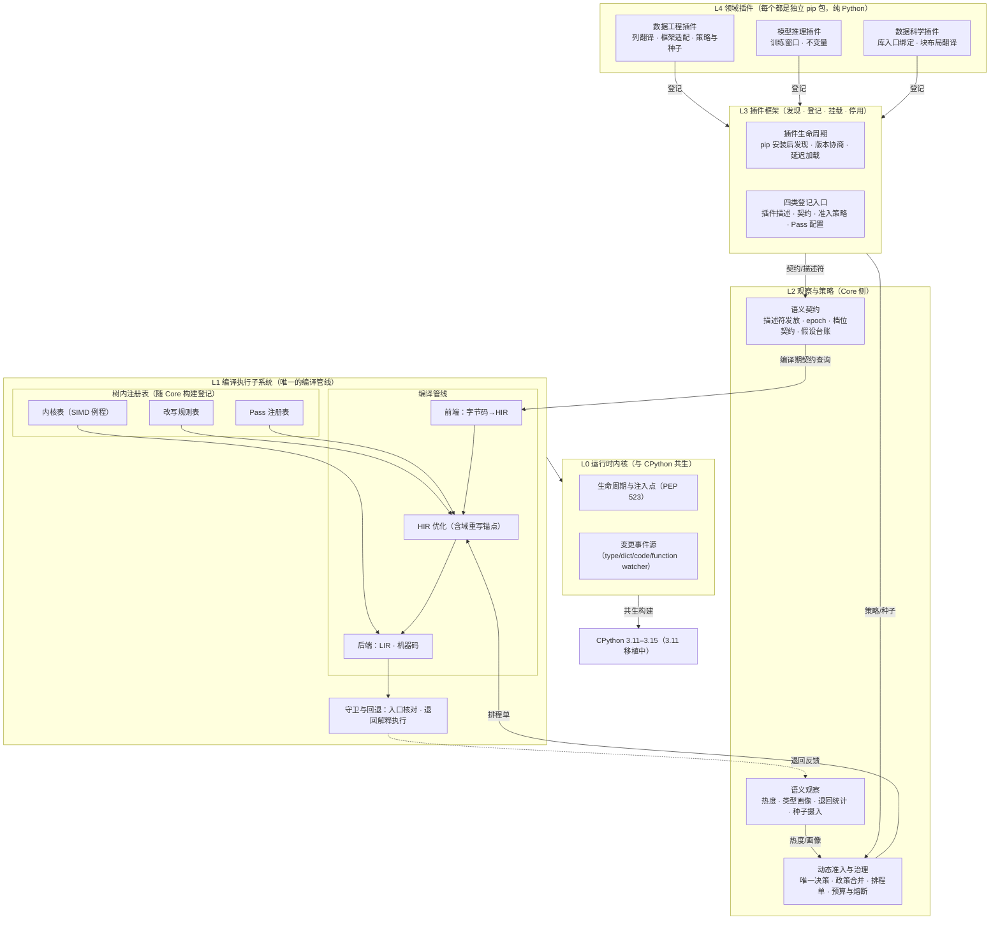
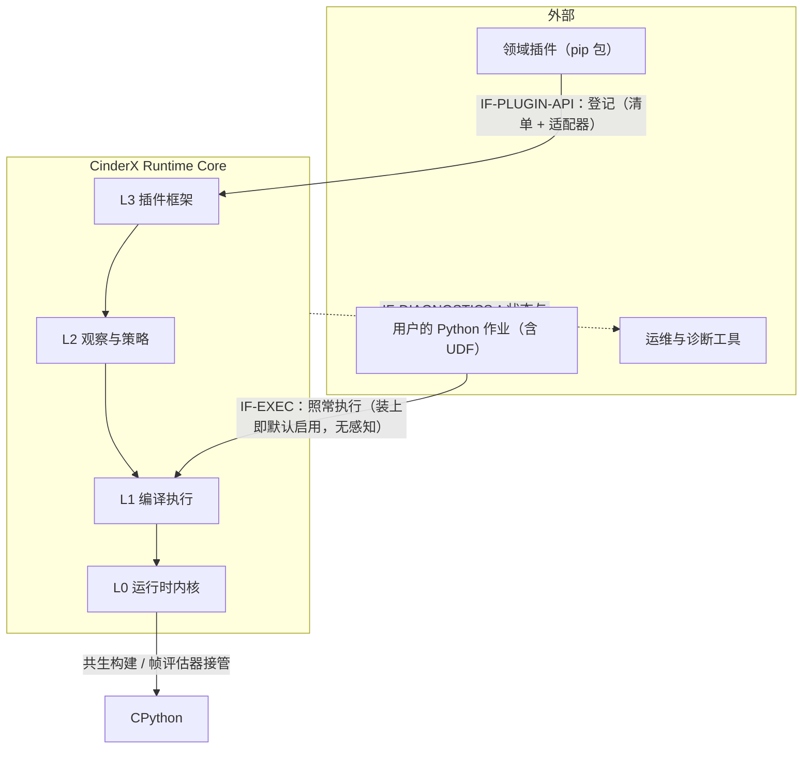
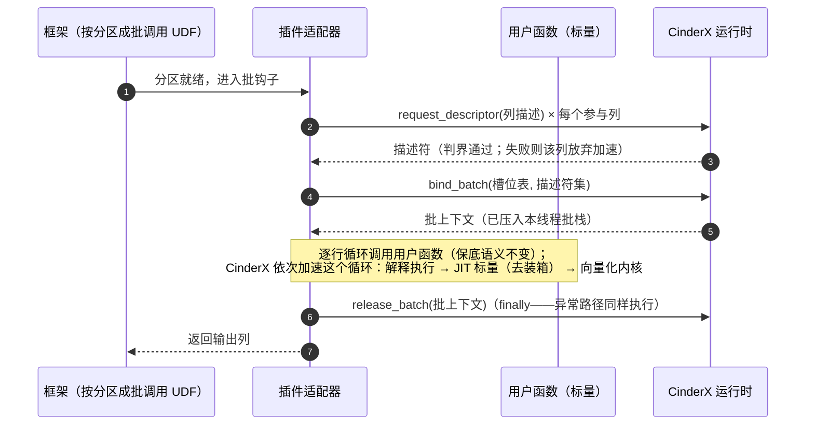
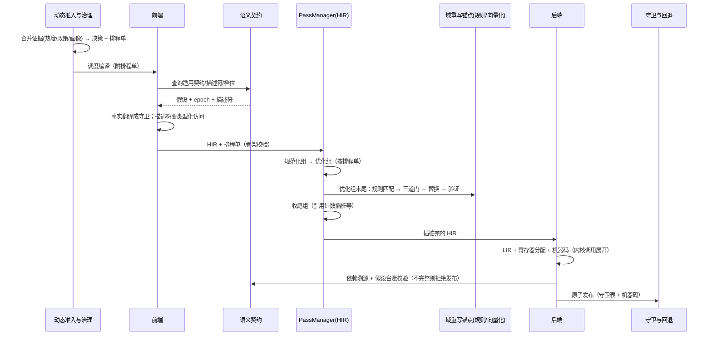
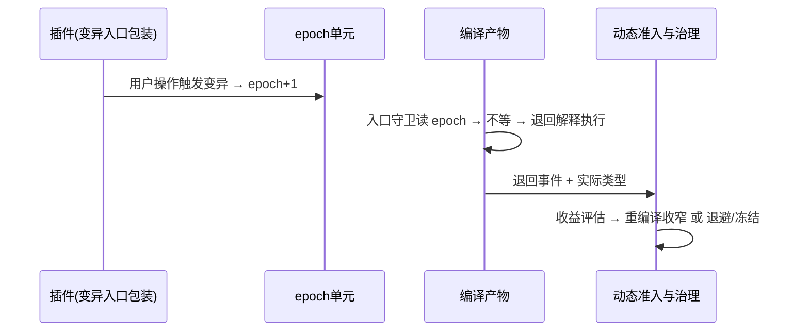

# 【架构设计】CinderX 增强运行时

## 产品版本&密级

| 项目 | 内容 |
| --- | --- |
| 产品/方案 | CinderX Runtime Core（增强型 CPython 运行时）+ 领域插件 |
| 文档版本 | 2.1 |
| 方案阶段 | 目标架构基线，分阶段实现（见"迁移路线"） |
| 密级 | 内部技术设计 |
| 适用范围 | CinderX 全部子系统（L0–L3）与领域插件（L4） |
| 事实基线 | CinderX 主线 `ba5ecb4d`（本文 file:line 锚点按该版本） |
| 下游文档 | 《【功能设计】CinderX 支持插件化》《【功能设计】CinderX 支持数据工程领域插件》（`docs/design/`） |

## 拟制信息

| 项目 | 内容 |
| --- | --- |
| 拟制日期 | 2026-08-20（V2.0 重写于 2026-08-27） |
| 拟制方式 | 基于 CinderX 主线代码与目标架构评审形成 |
| 文档状态 | 待评审 |

## 修订记录

| 日期 | 版本 | 修改描述 |
|------|------|---------|
| 2026-08-20 | V1.0 | 初始版本 |
| 2026-08-24 | V1.2 | 评审增补：版本矩阵与 3.11 移植方法论、外部库向量入口桥接裁决、批级运行期绑定与安全退役状态机 |
| 2026-08-27 | V2.0 | 全文重写：术语与叙述口径全文统一；把使用实例中的机制剖析（批闭环、三阶段晋升、回退、描述符判界）吸收为本文机制章节；安装与交付面收敛为 pip（`cinderx` / `cinderx[udf]`），供应链信任按"pip 安装即可信"口径（签名等强化列为后续版本增强）；删除对下游文档的一切正文引用 |
| 2026-08-28 | V2.1 | 移除能力申请相关内容（该通道已否决：不为插件提供"申请新内核进树内"的通道，树内注册表演进由 Core 仓库治理）；数据模型树同步 |

## Keywords 关键词

增强型 CPython 运行时、执行者/观察者、声明面/适配面、描述符（登记/发放）、批栈、版本阶梯（解释执行→JIT 标量→向量化）、回退、树内注册表、向量化三道门、档位契约、域重写锚点、PassManager、排程单、先验权重、epoch（失效时钟）、假设台账

## Abstract 摘要

CinderX 是一个用 pip 安装的 CPython 增强运行时：装上之后，同一个 Python 解释器会把热点代码自动编译成机器码。本文定义它从"CPython JIT 插件"重组为"增强型 CPython 运行时"的目标架构，定位收敛为：**只有一条编译管线（CinderX 自己的前端/HIR/LIR/代码生成），优化对象只有 Python 代码**；领域插件不改编译器，只供给知识和数据——但允许把用户 Python 代码里的标量调用循环**桥接到外部库公开的向量入口**（见裁决 8）。

六条核心主张，每条先用一句话说清：

1. **执行者与观察者分开**。执行者（L1 编译执行子系统）只有一个、封闭，独占所有分析、调度、寄存器分配、代码生成、退回（deopt）等"不可判定"的机械；观察者按领域分化，供给"可判定"的知识。领域不再以"改编译器"的方式进入，而是以**数据**的方式进入。
2. **插件零原生代码，声明与适配分两条通道**。插件包是纯 Python，一个二进制都不带。声明面（准入策略、契约、画像种子——纯数据，校验后登记，全程不执行插件代码）与适配面（列登记、失效递增、入口包装——少量挂钩代码，只经三类窄接口进入）。一切可执行的优化能力（SIMD 内核、改写规则）都是 Core 仓库里的注册表条目。
3. **正确性输入统一记账**。编译依赖的每条假设（外部事实、内核效果、改写前提）走同一条闭环：声明 → 假设台账（记录所有者、核对机制、失效动作）→ 装守卫 → 发布；台账不完整就拒绝发布。策略与种子只影响"编不编、多早编"，不进入正确性闭环。
4. **编译管线机制化**。管线按 Stage（阶段）/ Pass（通道）/ 锚点组 / 规则四个粒度描述；PassManager 只负责"照单执行"，"跑哪些 pass"永远由治理侧的排程单决定——编排归机制，取舍归策略。
5. **域重写锚点**。领域向量化/模式改写统一挂在 HIR 优化段末尾、收尾段之前；标量→向量的数值等价按档位契约分档约束（Tier 1 位精确 / Tier 2 末位误差 / Tier 3 归约不重排，默认保守）。
6. **多版本共生**。版本矩阵固定为 CPython 3.11/3.12/3.14/3.15，每版本一条共生构建线；版本差异收敛在前端/内核/执行侧边界，管线机制与锚点契约跨版本不变。

## List of abbreviations 缩略语清单

| 缩略语 | 英文全称 | 中文名 |
| --- | --- | --- |
| AutoJIT | Automatic JIT Admission | 动态准入（热度够不够、值不值得编译的唯一决策者） |
| deopt | Deoptimization | 退回（机器码退回解释执行） |
| epoch | — | 失效时钟（只会递增的整数，变了就代表假设过期） |
| HIR | High-level Intermediate Representation | 高层中间表示 |
| IC | Inline Cache | 内联缓存 |
| IR | Intermediate Representation | 中间表示 |
| JIT | Just-in-Time Compilation | 即时编译 |
| LIR | Low-level Intermediate Representation | 低层中间表示 |
| OSR | On-stack Replacement | 栈上替换（热点循环不退出函数就换机器码） |
| PassManager | — | Pass 编排器（机制层，只照排程单执行） |
| PEP 523 | Adding a frame evaluation API to CPython | CPython 帧评估器接管 API |
| SIMD | Single Instruction Multiple Data | 单指令多数据 |
| SOABI | Shared Object ABI | 扩展模块 ABI 后缀标签 |
| SPI | Service Provider Interface | 插件接口（L3 对插件暴露的服务接口版本） |
| UDF | User-Defined Function | 用户自定义函数 |

# 简介

## 目的

1. 冻结增强型 CPython 运行时的分层、模块划分与职责边界。
2. 定义领域插件接入 Core 的唯一机制（清单登记 + 适配器窄接口）与扩展红线。
3. 定义观察者（知识供给）与执行者（编译执行）的分工和正确性归属。
4. 定义数据面（列缓冲）向量化并入 Core 原流程的路径（描述符 + 三道门 + 档位契约 + V0/V1′/V1″/V2）。
5. 固定编译管线词汇（Stage/Pass/锚点组/规则）与 PassManager 的机制/策略边界。
6. 给出基线代码到目标架构的映射与分阶段迁移路线。

## 范围与非目标

本文覆盖 Runtime Core L0–L3 与领域插件 L4 的结构、行为与数据模型；插件 API；守卫与失效归属；治理与安全；迁移路线。

非目标（明确不做）：

- 引入 CinderX 之外的编译后端（torch.compile、LLVM、独立向量化引擎等）。
- 优化非 Python 代码（外部库 C/C++ 内核、CUDA 图）。注意：把 Python 循环**桥接**到外部库公开向量入口是 Python 代码优化，属于本文范围（裁决 8）。
- 具体领域插件的实现细节（契约内容、守卫清单、落地切片）——由各领域功能设计承载。
- 开放"插件提供任意 IR→IR 变换代码"的接口——原则性拒绝（裁决 6/8）。
- 插件分发原生代码（外部 SIMD 内核 `.so`）——原则性拒绝（裁决 4）。
- GPU/异构执行域。

## 读者与阅读顺序

本文面向需要理解机制与边界的读者："核心概念 → 总体架构 → 关键机制"为主线，实现者再读"实现架构/迁移路线/裁决"。L3 与 L4 的功能级展开由下游功能设计承载（见元信息），本文不依据其内容。

## 贯穿全文的例子

本文所有机制尽量锚定同一个例子：nightly 订单清洗作业，Daft 0.7.2 + Ray + Arrow，用户用最自然的标量写法定义 UDF：

```python
@daft.func(return_dtype=daft.DataType.string())
def tag(status: str, note: str) -> str:      # 一行进，一行出
    if status is None or note is None:
        return None
    return classify_prefix(status)           # 按前缀分类状态码
```

`pip install cinderx[udf]` 之后，这个函数被**无感地**升级为向量化执行——用户一行代码都不改，甚至不需要知道"批"的存在。本文要讲清楚这背后的每一步机制。

# 核心概念

## 执行者与观察者

系统里只有两种角色：

| 角色 | 是谁 | 做什么 | 不做什么 |
|------|------|--------|---------|
| 执行者 | L1 编译执行子系统 | 分析、调度、生成机器码、装守卫、退回恢复——一切"不可判定"的机械 | 不问"这是谁的业务" |
| 观察者 | Core 侧的观察与策略子系统（L2）+ 领域插件（L4） | 供给知识：这列数据在哪、多长、什么类型；这类循环通常值不值得早编译 | 不生成机器码，不提供变换代码 |

领域扩展的唯一进入方式是**当观察者**：把框架私有布局翻译成登记请求、把变异路径接到失效时钟上、供给策略与种子。执行者只有一个，永远是 Core。

## 插件的两条供给通道

| 通道 | 载体 | 内容 | 需要执行插件代码吗 |
|------|------|------|------------------|
| 声明面 | 插件包 `.dist-info` 里的静态清单 `cinderx_plugin.json` + 数据文件 | 准入策略（先验权重、作业窗口、阈值）、契约（槽位声明、档位申请）、画像种子、诊断参数 | 否——启动期读文件登记即可 |
| 适配面 | 清单 `adapter` 字段声明的适配器模块（按需加载） | 列登记（`request_descriptor`）、失效递增（`bump`）、入口包装（`wrap_entry`） | 是——但只经三类窄接口调用 Core |

适配器是同进程 Python 代码，与用户作业代码同级信任（详见"治理与安全"）。

## 树内与树外

| 维度 | 树内（in-tree） | 树外（插件） |
|------|----------------|-------------|
| 代码位置 | Core 仓库 | 插件仓库（独立 pip 包） |
| 构建产物 | 编译进 `_cinderx.so` | 纯 Python 包，零原生代码 |
| 进入方式 | 构建期静态登记进注册表 | 运行期经 L3 登记接口进入 |
| 正确性义务 | Core 拥有（同测试、同 CI） | 声明面只供数据、Core 校验；适配面按受信代码管理 |
| 演进速度 | 随 Core 发版 | 自由 |
| 例子 | pass 注册条目、SIMD 内核表、改写规则条目 | 列翻译器、框架适配器、策略、种子 |

要点：**树内不等于特权路径**。树内代码同样必须经统一注册表登记，没有第二条通道；树内/树外只是"构建期登记"与"运行期登记"之别。

## 信息分两类：正确性输入与性能建议

| 类别 | 典型内容 | 生产方 | 消费规则 | 决定正确性吗 |
|------|---------|--------|---------|------------|
| 结构事实 | 字节码、控制流、常量、类型注解 | Core 前端自给 | 直接消费 | 是 |
| 受护事实 | 精确类型先验、不可变约定、描述符、档位授权 | 观察者 | 装上守卫后消费；假设台账记账 | 是 |
| 外部假设 | 依赖库版本、schema epoch、框架全局状态 | 插件/框架 | epoch 守卫覆盖，否则拒绝编译 | 是 |
| 性能建议 | 热度、调用次数、批大小、值分布、先验权重 | 观察与遥测 | 只影响准入与特化选择 | **否** |
| 效果声明 | 树内内核的行为类别 | Core 构建期登记 | 分析与调度依据 | 是 |

四条不变量：

1. 性能建议缺失、错误或过期，只允许影响快慢，不允许改变任何输出结果。
2. 假设只有台账记录完整后才能进入编译产物。
3. 插件不是"变换者"也不是"供码者"——Core 是全部变换与机器码的唯一持有者。
4. 观察者无法亲自核实的事实必须放弃，不能因为来源可信就默认为真。插件声称"这个函数很纯、可以向量化"至多是建议；向量化合法性由 Core 的语义门自行判定。

# 架构目标和关键需求

## 架构目标

1. **执行者唯一**：全系统只有一条编译管线，任何垂直优化最终都经它落地。
2. **插件零原生代码、能力全树内**：一切可执行能力（内核、规则、pass）是 Core 注册表条目；Core 发版是内核演进的唯一节奏。
3. **观察者可领域分化**：插件作者不需要 C++ 或 IR 知识就能供给领域知识。
4. **准入动态自治**：AutoJIT 是生产环境"编不编"的唯一决策者；插件只提供倾向。
5. **正确性单一归属**：每条假设有唯一所有者与失效动作；守卫/退回机械只在 Core。
6. **可退化**：插件缺失、登记失败、守卫失败、退回、规则被门拒绝，都回到原始语义路径。
7. **零默认负担**：诊断默认关闭，不产生 dump 与采样。

## 关键架构需求（验收口径）

| 编号 | 需求 | 验收口径 |
|------|------|---------|
| AR-01 | 扩展边界零原生代码 | 插件分发物零原生代码；适配器只经登记、epoch、入口包装三类窄接口进入 |
| AR-02 | 登记接口完备 | 插件描述/契约/准入策略/Pass 配置四类入口均可登记且互相隔离 |
| AR-03 | 假设台账门禁 | 没有台账记录的假设进入产物即测试失败 |
| AR-04 | 建议只影响快慢 | 删除或篡改任意策略/种子/画像数据，不改变任何正确性测试结果 |
| AR-05 | 树内注册表可用 | 新增 SIMD 内核或改写规则 = 注册表条目 + 效果/前提声明，不散改多文件 |
| AR-06 | 向量化三道门 | 不过布局/语义/异常门的循环一律不向量化；描述符判界以缓冲协议为容量权威（禁裸指针）；档位未授权的数值重排一律不做；出错元素回退逐行重放，异常时机与标量一致 |
| AR-07 | 准入动态性 | 生产配置无静态名单；运行反馈可推翻种子结论 |
| AR-08 | 效果声明驱动调度 | 树内内核按效果类被正确调度/消除/内联 |
| AR-09 | 编译时间可控 | 规则匹配与向量化分析有预算与廉价预过滤；编译时间无回归 |
| AR-10 | 零插件等价 | 不安装任何插件时，Core 行为与基线可 A/B 对照一致 |
| AR-11 | 排程单可下发 | PassManager 接受外部排程单（全局配置是其特例）；正确性骨架步骤不可关闭，缺失骨架的排程单被整单拒绝 |
| AR-12 | 锚点不变量 | 引用计数插桩之后不允许任何结构性改写，由 PassManager 机制保证（约束求解），不是口头约定 |
| AR-13 | 版本矩阵可维护 | 新 CPython 版本按标准方法论纳入，不新增特权路径；管线机制与锚点契约跨版本不变 |

## 假设和约束

- 与 CPython 小版本共生构建（解释器 fork、watcher 深度依赖），插件在清单里声明精确 Python 版本 + SOABI + Core 构建标识。
- 单一全局解释器状态，不支持 subinterpreter；x86-64/aarch64 only。
- 版本矩阵：Python 3.11（移植进行中）/ 3.12 / 3.14 / 3.15；每版本独立构建与发行 wheel。
- 改写与向量化分析只在域重写锚点、预算内运行。
- 外部库桥接路径钉库大版本，由 epoch 承载失效。
- 编译产物进程内有效；epoch 变化、代码变化、插件停用、ABI 变化必须失效关联产物；回收走安全退役（见关键机制）。

# 总体架构（分层与模块划分）

布局语义（本文所有架构图通用）：**水平为并列，垂直为依赖（上层依赖/供给下层），内外为包含**。



分层律条：**L1 永远不问"这是谁的业务"；L2/L4 永远不生成机器码；插件分发物永远不含原生代码；PassManager 永远不做取舍。**

各层职责：

- **L0 运行时内核**：与 CPython 共生的底层。生命周期管理（分阶段初始化）、watcher 基座（type/dict/code/function 四类变更事件源——"什么东西变了"从这里发出）、对象服务（Immortalize、缓存属性等）、运行时集成（解释器 fork、PEP 523 帧评估器接管）。领域接入对 L0 零改动——一次向量调用对 JIT 来说只是一次普通函数调用。
- **L1 编译执行子系统**：唯一的编译管线。前端把字节码翻成 HIR 并把事实翻译成守卫；HIR 优化段按锚点组跑 pass（领域改写在专用锚点处发生）；后端做 LIR、寄存器分配、机器码生成（含 SIMD 内核调用与向量指令的延迟展开）；守卫与回退负责入口核对和退回恢复。树内注册表（内核/规则/pass 三类条目）是它的数据源，构建期静态登记，无特权路径。
- **L2 观察与策略子系统**：Core 侧的观察者。语义观察（热度、类型画像、退回统计、种子摄入）；语义契约（描述符发放与判界、epoch、档位契约、假设台账记账）；动态准入与治理（AutoJIT 唯一决策、政策合并、排程单生成、预算/负缓存/熔断）。
- **L3 插件框架**：插件进入 Core 的闸口。pip 安装后发现（读清单，不执行插件代码）、版本协商、两阶段加载（先登记数据，框架导入后再加载适配器）、停用与撤销。
- **L4 领域插件**：按场景分化——数据工程（列翻译 + 框架适配）、模型推理（训练窗口 + 不变量）、数据科学（库入口绑定 + 块布局翻译）。插件的差异全部体现在观察者层。

# 系统用例模型

## 上下文图



## 外部接口描述

| 聚合接口 | 外部方 | 内容 | 边界 |
| --- | --- | --- | --- |
| `IF-EXEC` | 用户作业 | 照常执行 Python 代码 | 装上即默认启用；任何不确定都退回原语义 |
| `IF-PLUGIN-API` | 领域插件 | 清单登记（描述/契约/策略/种子/Pass 配置）+ 适配器三类窄接口 | 声明面纯数据；适配面受信窄接口；Core 校验、装守卫、发布 |
| `IF-DIAGNOSTICS` | 运维与性能工具 | 状态、计数、HIR/汇编 dump、命中率、退回率 | 只读旁路；默认关闭零产物 |
| `IF-CPYTHON-CO-BUILD` | CPython | 帧评估器、watcher、解释器 fork | Core 独立闭环 |

## 关键用例

- **UC-01 供给不变量**：插件把目标对象的必经变异入口包装起来并递增 epoch（"该状态在这个时钟值内不变"）；Core 编译时消费该事实并装守卫；用户触发变异 → epoch 递增 → 产物退回。语义无损。
- **UC-02 列向量化**：插件把框架列布局翻译成登记请求，Core 判界后发放描述符；向量化 pass 在域重写锚点过三道门后把循环改写为树内内核调用（V1′）或外部库公开向量入口调用（V1″）；守卫失败退回原循环。插件全程只供给数据与登记请求。
- **UC-03 政策叠加**：插件登记先验权重、作业窗口（框架初始化期不编译）、阈值与种子；AutoJIT 合并证据做决策；运行后退回风暴可推翻种子结论。

# 关键机制

## 描述符：把数据"指给"运行时

Core 数据面只认识一件事：**类型化的缓冲区布局**。它不认识任何框架的私有对象（Daft 的 Series、Arrow 的 Array、别的引擎的列），那些翻译留在插件侧的列翻译器里。

描述符不是插件可以自造的结构，而是 **Core 登记通过后发放的有界句柄**。插件提交一份**登记请求**（`request_descriptor` 的参数），字段如下（以订单作业的 status 列为例，完整例子见数据工程功能设计）：

| 字段 | 含义 | 例 |
|------|------|----|
| `data_exporter` | 数据缓冲本体（必须支持 Python 缓冲协议） | status 列的 utf8 字节流缓冲 |
| `element_offset` / `element_count` | 行号区间（非负、缓冲内绝对行号） | 0 / 65536 |
| `dtype` | 元素类型，只收白名单：utf8/f8/i8/i4/bool | utf8 |
| `utf8_layout` | 变长（带偏移索引）或字节流，仅 utf8 有效 | varlen |
| `layout` | byte（定宽）/ bitpacked（bool 按位打包） | byte |
| `offsets_exporter` | 变长列的偏移索引缓冲（每行首字节位置） | [0,4,8,8,14,…] |
| `validity_exporter` + `validity_bit_offset` | 空值位图（全有效列可省略） | status 列的位图 |
| `null_polarity` | 显式二值：1_is_null 或 0_is_null——Arrow 是"位=1 有效" | 0_is_null |
| `access` | read 或 write | read |
| `binding` | 列对象只读属性快照 + 期望值（防错列绑定） | {类型: string, 长度: 65536} |

三条硬规则：**不接受裸指针**（只收支持缓冲协议的对象，不支持的直接拒绝，没有兜底路径）；**三块缓冲（数据/偏移/位图）必须在同一次请求里原子提交**，不允许分次拼装；**插件报的行号区间只是待验证的申请，不是权威**——容量权威来自 Core 自己通过缓冲协议取得的内存长度。

Core 收到请求后的核对（判界），全部是算术检查：

```text
# 定宽列（如 float64）
起始字节 + 行数 × 元素宽度 <= 数据缓冲长度
# 变长 utf8 列
偏移索引[起始行] >= 0
偏移索引[起始行 + 行数] <= 数据缓冲长度        # 首末两项卡住，中间单调不减
# 位图（空值位图 / bool 按位打包）
位偏移 + 行数 <= 位图字节数 × 8
# 位偏移与行号绑定（防"判界通过却读错行"）
data 位偏移 == data 基准位 + 起始行
validity 位偏移 == validity 基准位 + 起始行
```

乘加全程做溢出检查；任一不过 → 拒绝发放描述符，该列放弃加速（进程继续跑）。除判界外还有三件事：

- **别名检测**：Core 记录每个已固定视图的指针区间；读写不相容的两个视图区间重叠（比如输出缓冲与输入缓冲是同一块内存）→ 拒绝向量化。Python 层的对象身份比较不是别名的充分条件，只能在 Core 侧按指针区间做。
- **固定（pin）**：发放的描述符持有缓冲引用，防止"还在读，缓冲先没了"；pin 期间可搬迁内存的可调整对象一律排除。
- **绑定校验**：边界合法不等于绑得对（错列会稳定地产出错误结果）。Core 能亲自验证的部分（属性快照与自己取到的缓冲元数据交叉一致）必须通过；验证不了的部分（这三块缓冲确实属于这一列）由适配器的受信地位承载，另以差分抽查兜底（详见数据工程功能设计）。

描述符带失效代号（generation/epoch）：结构变了就作废，正在用旧描述符的机器码当场退回。

## 批处理闭环：登记 → 绑定 → 执行 → 解除绑定

框架把数据按分区成批，每批走一次闭环。时序（框架中立版；具体框架的挂接与实例由下游功能设计展开）：



设计要点（每一批的开销必须是常数，重活全部前移）：

- **编译期只登记槽位表**（形参序号、dtype、布局、访问模式），机器码按"形参 → 槽位"编译，**不捕获任何一批的具体数据**。数据每批都换，结构不换就直接复用，不用重编译。
- **每批的绑定是压栈**：`bind_batch` 把"槽位 → 描述符"记进**本线程**的批栈（多线程各自有栈，互不可见；嵌套调用压栈弹栈，内层读内层）。
- **机器码入口每次核对**：UDF 每次被调、机器码启动前，读批栈顶，逐槽比对类型/布局/列结构指纹与编译时的假设——不符当场退回解释执行。这是"用户零改动、结果永远一致"的保障点。
- **解除绑定走 finally**：批结束（正常或异常）都弹栈、释放缓冲引用。
- **输出列先写进预分配缓冲，整批成功后一次性构造发布**；中途失败（比如第 k 行抛业务异常），这批缓冲直接丢弃，按原始方式重跑。

## 版本阶梯：代码怎么一步步变快

同一个 UDF 不是一上来就全速，而是沿阶梯晋升——先观察再投入，阈值来自插件声明的策略数据：

| 阶段 | 状态 | 什么时候到下一级 |
|------|------|----------------|
| ① 解释执行 | 作业刚启动（框架初始化、注册 UDF 阶段刻意不编译，免得白白浪费预算） | 热度够（循环跑了一定批次） |
| ② JIT 标量版（V0） | 循环编译成机器码，去掉装箱拆箱、空值判断、调用派发的开销 | 批量够大 + 循环模式匹配 + 类型稳定 |
| ③ 向量化版（V1′/V1″） | 整段循环换成少数几次整块内核调用（前缀比较、字节分类、掩码生成） | —（当前最高档；V2 通用向量化后续） |

四种向量化落地形态（内核来源不同，锚点、门禁、治理同一套）：

| 形态 | 做什么 | 内核来源 |
|------|--------|---------|
| V0 去装箱 | 描述符 + 类型化标量访问指令，循环内不再装拆箱 | 无（纯标量） |
| V1′ 树内内核 | 识别惯用循环形状（分类/过滤/前缀比较），整段改写为树内 SIMD 内核调用 | 树内内核表 |
| V1″ 库向量入口 | 标量调用循环整段改写为对**外部库公开向量入口**的普通调用 | 外部库（限受信目录条目，见裁决 8） |
| V2 通用向量化 | 向量指令 + 通用循环向量化（掩码、尾部处理），后端延迟展开 | 树内（晚展开） |

V1″ 不写任何数值内核：Core 优化的是 Python 代码，调用的是库的公开接口——向量调用对 JIT 只是一次普通函数调用。

## 回退：任何不确定都走原路

所有"不确定"的情况都走同一条路：**放弃加速，按原始方式执行**，作业结果不受任何影响：

| 情形 | 发生什么 |
|------|---------|
| 某列类型不在白名单（如 object、decimal） | 该 UDF 一直按原样执行 |
| 批之间列结构变了（换了数据源） | 机器码入口核对不一致 → 本轮退回原样；结构稳定后自动重新晋升 |
| 某行抛业务异常 | 向量化执行中途退回逐行执行，从出错行继续——异常的内容和时机与原代码一致 |
| 插件自己出 bug | 挂钩层把异常接住，整批按原样重跑 |
| 整个插件不可用/被停用 | 行为等同于没装插件 |

反向的楼梯也存在：编译时的假设反复不成立（比如列类型老在变），会自动退回解释执行，并且多次失败后停止再尝试这个函数——**宁可慢，不能错**。

## 向量化三道门

一个循环能不能向量化，由三道门依次判定（全部树内，插件说了不算）：

1. **布局门**：数据必须是 Core 发放的描述符所描述的形态——连续、对齐、类型已知、空值位图齐全。object 类型、跨步布局一律拒绝。
2. **语义门**：循环体必须能完全分解为可向量化的操作集合（类型化算术/比较/选择、Unicode 类操作、min/max/sum）；副作用调用、对象身份比较、跨迭代依赖一律拒绝。**数值等价范围由档位契约显式授权**（见下节），插件声称的纯度至多是建议。
3. **异常门**：向量化执行中遇到"将抛异常"的元素怎么办。树内内核（V1′/V2）：先推测执行，遇到出错元素回退标量循环从该元素逐行重放（输出缓冲可丢弃重写由描述符所有权保证）。外部库入口（V1″）：普通调用拿不到"第一个失败元素在哪"，逐行重放做不了——只允许受信目录里声明了"不会抛异常的输入域"的条目；受限域条目必须先对整批做一次写前预检（一次 O(n) 廉价扫描），预检不过就不发起向量调用、整段回原循环，异常由原循环按原时机抛出。

## 数值档位契约

标量与向量的数值语义等价必须分档承诺，不能笼统说"等价"：

| 档位 | 操作类 | 语义差异 | 默认策略 |
|------|--------|---------|---------|
| Tier 1 位精确 | `+ - * /` 等 IEEE754 逐元素确定的算术 | 向量与标量逐元素结果一致 | 默认允许 |
| Tier 2 末位误差 | `sin/cos/exp/sqrt` 等超越函数 | 向量核与标量库可能差最后一位 | 需部署方显式开启（插件只能申请） |
| Tier 3 归约重排 | `s += ...` 归约 | 顺序累加与分段累加浮点结果不同 | 默认不重排：逐元素部分向量化，归约保持顺序标量循环 |

档位授权主体是部署方，不是插件；授权状态进假设台账，语义门消费。

## 假设、守卫与失效

**语义怎么获取**——观察者不依赖静态分析，用两种模式：

- **打赌 + 验证**（类型恒定类）：不需要证明类型不变。编译期依据观察证据（内联缓存、退回统计、种子）下注"类型是 X"，机器码入口装守卫逐次验证，赌错当场退回并记录实际类型，下次编译收窄。回答的问题是"本周期赌什么、错了多快知道、错了多便宜恢复"。
- **构造式不变量**（阶段不变类）：不判断"变没变"，而是让"变"必经之路都过包装入口——插件包装框架结构性保证必经的变异 API（addColumn/alterType 等），入口递增 epoch。机器码守卫读 epoch，不等就退回。"声明者（插件）+ 验证者（守卫）+ 失效动作（退回/重编译）"三方闭环。普通 dict 场景 Core 自带 dict watcher，是零成本版本。

**假设台账（GuardCoverage）**：每条被编译消费的假设产生一条记录 `{假设 ID, 所有者, 核对机制, 检查时机, 失效动作}`；产物发布前校验台账完整，不完整拒绝发布。这是 AR-03 的落地，也是"不存在错误假设悄悄进入机器码"的机制保证。

**现有失效兜底（三层漏斗，基线已有）**：

1. **不改码层**：内联缓存/全局缓存未命中走慢路径重填——最廉价。
2. **改码层**：类型变化 → 7 字节补丁点跳转退回（约束仍满足时只刷新版本号）——运行中的帧下个补丁点自然退出。
3. **重构层**：整函数退回/取消编译/重编译（含投入产出退避：反复失败则预算翻倍、直至冻结）——最重。

epoch 递增受速率上限与失效合并约束（防高频递增触发编译风暴），超限按命名空间熔断。

## 安全退役：资源何时才能放

三层漏斗回答"产物错了怎么退"，退役状态机回答"资源何时才能放"。每个生命周期对象（epoch 单元、编译产物、补丁队列项）带原子状态（active → retiring → retired）与代号（generation），六步固定顺序、不可跳步：

1. **登记**：对象进生命周期表，建立强引用，分配代号。
2. **失效触发**：epoch 递增 / 插件停用 / 代码死亡 / 注册集版本变化 → 状态原子迁移为 retiring。
3. **入口切换**：间接入口切回解释器或保守版本；新进入者必须先取"generation 租约"（取到后复核状态仍是 active 且代号未变，复核失败就走解释器）——防住"退役进行中又有人引用上"的竞态。
4. **执行排空**：以活动执行计数判定（进入产物递增、退出递减），不靠超时。挂起的 generator/coroutine 也是持有点——先枚举持有者、把恢复入口转为解释器形态，各自递减。宽限期内排不空 → 对长寿帧注入强制退回检查；再超期 → 进入保守持有态（不释放、内存有界）并上报"该 worker 需要重启"——**绝不带着活引用释放**。
5. **补丁注销**：从补丁队列移除该产物全部待落补丁，杜绝"补丁命中已回收代码"。
6. **最后释放**：引用归零后按依赖序释放。epoch 单元按"（地址, 代号）"双元组比较防复用误判——内存正常回收、地址可复用，但新单元必有新代号，旧机器码读旧代号一律失效。

插件停用是该状态机的实例：先失效其全部关联产物（走 2–5），再撤销登记数据，最后释放。

## 编译管线与编排

**四粒度词汇（全管线统一）**：

- **Stage（阶段）**：按 IR 层级划分的大段——前端（字节码→HIR）、HIR、后端降低（HIR→LIR+寄存器分配）、机器码生成。
- **Pass（通道）**：Stage 内的调度单元（HIR 进、HIR 出）。
- **锚点组**：Stage 内的排序约束分组——HIR Stage 内为"规范化组 → 优化组 → 收尾组"。
- **规则**：Pass 内部的变换单元。

**域重写锚点**：领域向量化/模式改写统一挂在 HIR 优化组末尾、收尾组之前。硬理由：收尾组里的引用计数插桩按**最终** HIR 形态计算每一处的引用增减，**它之后任何结构性改写都会使已插入的增减失效**；而它必须在后端降低之前，因为后端吃的正是这份插桩完的 HIR。该不变量由 PassManager 的构建期校验保证（AR-12）。

**机制/策略分界**：PassManager 是从现有 `Compiler::runPasses`（`Jit/compiler.cpp:75-157`）抽取的编排机制——pass 登记、实例化执行、排序约束求解、分析缓存共享、横切服务（计时/dump/校验）。它**只执行一份排程单**（本次编译跑哪些 pass、用什么参数），自己不做任何取舍；排程单由动态准入与治理生成（今天的全局配置是其特例）。PassManager 里出现"根据收益决定跳过某 pass"的逻辑即架构违规。排程单 = 基线模板 + 覆盖层：覆盖层只能开关**可选优化**步骤，正确性骨架（SSA 化、引用计数插桩、退回状态维护）被关闭即整单拒绝——取舍只影响快慢，不影响对错。

## 多版本共生（版本矩阵）

| 版本 | JIT 状态 | 要点 |
|------|---------|------|
| 3.11 | 移植进行中 | vendored 3.11.6 评估器 + 观察（Observe）模式已落地，编译入口尚未放开；watcher 基座（3.12+ 才有的 API）须由 fork 内挂钩替代；StaticPython 链接闭包待解（`CMakeLists.txt:578-598`） |
| 3.12 | 全量 | 解释器 fork；原生 watcher API |
| 3.14 | 全量 | 首版插件目标运行时（当前主线产品与 CI 支持集） |
| 3.15 | 全量 | 同 3.14 |

每版本一条共生构建线（解释器 fork + UpstreamBorrow 版本模板 + 独立 wheel）；版本差异收敛在前端/L0/执行侧三处边界；**管线机制与锚点契约（三锚点组、PassManager、域重写锚点、排程单语义）跨版本不变**，指令与 pass 实现内允许登记受控版本分支并以逐版本差分验证背书。

版本移植标准方法论（由 3.11 移植确立）：

```text
vendored 评估器接管（PEP 523，偏离表成文）
→ 观察/调度仿真（帧入口热计数 → 调度请求 → 拒绝记录落盘）
→ 差分引擎 + 验收门禁入 CI（对拍原版解释器行为）
→ JIT 源集纳入该版本构建（watcher 基座替代等移植必做项完成）
→ 放开编译入口
```

先用观察与差分证明"接管无害"，再放开执行；该方法论对 3.16+ 同样适用。

# 逻辑架构

## 逻辑接口设计

| 接口 | 提供方 | 使用方 | 内容 |
| --- | --- | --- | --- |
| 登记请求族 `request_descriptor` / `bind_batch` / `release_batch` | 语义契约 | 适配器 | 列登记、批绑定/解除（批栈语义见关键机制） |
| epoch 族 `register_epoch` / `bump` | 语义契约 | 适配器 | 失效时钟的获取与递增（原子、速率受限） |
| 入口包装 `wrap_entry` | 语义契约 | 适配器 | 变异入口引流，返回可撤销句柄 |
| `IF-ADMISSION-OVERLAY` | 动态准入与治理 | 插件声明面 | 先验权重、窗口、阈值偏置、种子 |
| `IF-OBSERVATION` | 语义观察 | 准入/重编译决策 | 热度、类型画像、退回统计、事件 |
| `IF-SCHEDULE`（Core 内部） | 动态准入与治理 | PassManager | 排程单（基线模板 + 覆盖层） |
| `IF-PLUGIN-API` | L3 | L4 插件 | 四类登记入口聚合 + 适配器生命周期（activate/deactivate） |
| `IF-DIAGNOSTICS` | Core | 运维 | 状态、计数、dump、命中率（默认关闭） |

## 行为模型

### 用例设计1：编译流



### 用例设计2：失效流



# 数据模型

## 架构模式

注册条目不可变、版本化；守卫表随产物原子发布；原始观察事件只追加且有界（环形缓冲/落盘），派生画像与统计可重算、可淘汰。

## 静态数据结构模型

```text
PluginManifest（插件静态清单 cinderx_plugin.json，随 .dist-info 分发）
  ├─ id / spi_version / runtime_abi / target_capabilities
  ├─ provides
  │    ├─ contracts[]（槽位声明 · epoch 声明 · 档位申请 · 运行时绑定对）
  │    ├─ policies[]（先验权重 · 作业窗口 · 阈值偏置 · 命名空间配额）
  │    ├─ seeds[]（画像种子文件引用）
  │    ├─ diagnostics（诊断参数）
  │    └─ pass（树内 pass 启用与配置——治理输入，非排程单）
  └─ adapter（适配器入口与适配目标模块——可选，纯声明插件缺省）

DescriptorRequest（登记请求，进程内，插件构造）
  ├─ data_exporter / element_offset / element_count / dtype
  ├─ utf8_layout / layout / data_bit_offset / access
  ├─ offsets_exporter / validity_exporter + validity_bit_offset / bit_order / null_polarity
  └─ binding{ column_snapshot, expected{dtype, length, column_identity} }

NeutralDescriptor（描述符，Core 发放的有界句柄，进程内）
  ├─ dtype / 布局 / utf8 形态 / 行号区间 / 字节长（容量权威）/ 连续性
  ├─ offsets 视图 / validity（位偏移 · LSB0 · 显式极性二值）
  ├─ 访问权限 / 别名检测记录 / 所有者固定（pin）
  └─ 绑定 id / generation / epoch（失效代号）

树内注册表（构建期随 Core 登记，运行期只读）
  ├─ PassDescriptor[]（锚点组 / 依赖 / 门控位 / 骨架位 / 插件可配置资格）
  ├─ IntrinsicEntry[]（SIMD 内核：id / 签名 / 效果类 / arch 展开例程）
  ├─ RewriteRule[]（模式 / 前提（契约引用） / 替换体 / 优先级）
  └─ BridgeContractEntry[]（外部库入口：制品摘要 / 输入域 / 语义承诺 / 对照证据）

Schedule（排程单，治理侧生成）
  ├─ template（基线模板引用：显式步骤实例表，版本化）
  ├─ overlay{}（可选优化步骤实例的开关/参数）
  ├─ rule_set / budget / 诊断策略
  └─ fingerprint（指纹——贯穿编译缓存键、产物元数据、孪生去重、命中校验）

CompiledVariant（编译产物）
  ├─ 假设台账记录[]（假设 ID / 所有者 / 核对机制 / 检查时机 / 失效动作）
  ├─ 守卫表 + 机器码 + 退回元数据
  ├─ 消费的 epoch/描述符/内核集/规则集 + 排程单指纹 + 归属命名空间
  └─ 失效订阅（watcher / epoch / 注册集版本）
```

## 数据所有权模型

| 数据 | 创建 | 失效 | 禁止行为 |
| --- | --- | --- | --- |
| 清单/契约/政策/种子 | 插件登记 | 按声明方式（epoch/结构签名/版本） | Core 信任未经验证的声明内容；插件携带原生代码 |
| 树内内核/规则/pass | Core 构建期登记 | Core 版本变更 | 散落硬编码特权路径；业务命名 |
| 观察数据（热度/画像/退回统计） | Core 运行时 | 原始事件有界；派生统计可重算 | 进入正确性判定路径 |
| 描述符/批上下文 | Core（应插件登记请求） | 批结束/结构变更 | 跨批捕获；裸指针 |
| 编译产物 | Core | epoch/代码/注册集版本变化 | 台账不完整即发布 |

# 实现架构

## 代码模型

目标目录（示意）：`Jit/admission/`（准入与治理）、`Jit/contracts/`（契约、描述符、epoch、假设台账、退役）、`Jit/observation/`（观察与画像）、`Jit/hir/pipeline/`（PassManager 与 pass 注册表）、`Jit/capability/`（树内注册表）、`Jit/dataplane/`（域重写锚点执行器与向量化 pass）、`codegen/arch/`（树内内核库）、`PythonLib/cinderx/plugins/`（L3 框架）。

## 构建与交付模型

- 构建：单 `_cinderx` 扩展保留，内部按 L0–L3 分阶段初始化；树内 pass/内核/规则随 Core 构建静态登记，无运行时原生代码加载。
- 交付：**用户感知的安装单元只有 cinderx**——

| 交付物 | 安装方式 | 内容 |
|--------|---------|------|
| `cinderx` wheel | `pip install cinderx` | `_cinderx` 扩展 + `cinderx` 包（含 L3 框架） |
| `cinderx[udf]` extras | `pip install cinderx[udf]` | 在上者之上带入数据工程插件包（`cinderx-plugin-dataeng`，普通 pip 依赖） |
| 领域插件 wheel | 经 extras 自动带入 | 纯 Python：静态清单 + 数据文件 + 适配器 |

装完即默认启用，无必配参数；保留的开关只有退出用途（`CINDERX_DISABLE` / `CINDERX_JIT_DISABLE`，用于对比测试与故障止损）。Core 不提供任何命令行工具——作业提交走用户自己的框架。

## 部署模型

无中心编译服务；机器码进程内。应用/worker 进程 = Core + 按需插件集（pip 装入 site-packages，随镜像分发）；诊断按授权开启。跑在分布式框架（如 Ray）上不需要额外配置：每个 worker 是独立进程，各自完成同样的启动初始化与批闭环，互不依赖。

# 治理与安全

**信任口径（首版）**：通过 pip 从受信源安装的插件即视为可信。Core 仍然不信任插件**声明的内容**——判界、三道门、假设台账、差分测试对"可信插件写错了"照样兜底；插件无法伪称越界容量（容量权威在缓冲协议）、无法绕过准入（政策只偏置）、无法自带原生代码或变换逻辑。

**适配器的信任边界**：适配器与用户作业代码同进程同权限。窄接口是**职责边界**而不是权限隔离——它保证"插件只能做这三类事，Core 对这三类事逐一校验"，不承诺防恶意代码（那是 pip 供应链的职责）。插件停用的撤销范围：登记数据与关联产物可完整撤销；适配器导入的进程内副作用不在撤销范围。

**预算与熔断**：规则匹配与向量化分析按编译限定预算；确定性失败进有界负缓存；退回风暴与 epoch 风暴触发退避/合并/熔断；诊断默认关闭、零产物。

**可观测**：低基数指标（准入决策、描述符登记成败、三道门通过率、内核/规则命中、退回率、编译耗时）按插件命名空间聚合，经 `cinderx.plugins` 库接口查询。

# 与基线代码的映射

| 目标模块 | 基线来源（`cinderx/`） | 动作 |
| --- | --- | --- |
| L0 生命周期/注入点 | `_cinderx-lib.cpp` init 序列、`module_state.h` + `*_iface.h` | 复用；重构为分阶段 init |
| L0 watcher 基座 | `Common/watchers.cpp`（3.11 无原生对应，fork 内挂钩替代） | 复用；开放注册回调 |
| L0 3.11 vendored 评估器 | `Interpreter/3.11/`（接管 + 观察）、`Jit/pyjit_stub_311.cpp` | 移植进行中 |
| L1 前端 | `Jit/bytecode.cpp`、`Jit/hir/builder.cpp`、preload | 复用；增契约消费点与类型化访问指令 |
| L1 HIR Stage | `Jit/hir/pass.h` + pass 文件族 | 抽取为 PassManager（无行为漂移）；历史特化逆特化为规则条目 |
| L1 域重写锚点 | `runPasses` 优化组末尾（新增挂载位） | 新建 |
| L1 数据面 | 无（基线零 SIMD，已审计：`Jit/` 全树无 simd/vectoriz 命中） | 新建：描述符登记 API + 类型化访问指令族 + 向量化 pass + V1″ 桥接规则 |
| L1 后端 | `Jit/lir/`、`Jit/codegen/`（含 `arch/`） | 复用；arch 层挂树内内核表 |
| L1 守卫与回退 | `Jit/deopt.cpp`、`type_deopt_patchers.*`、`code_patcher.*` | 复用；扩 epoch/档位守卫；软化三处硬失败点（watch 注册失败即中止、回调吞错、onUnpatch 直接 abort） |
| 树内注册表 | `jit_rt.cpp` 调用翻译表；`RuntimeTests/main.cpp` 测试注册表 | 改造为构建期统一注册表 |
| 语义观察 | IC 统计、`DeoptStat + FixedTypeProfiler`（`context.cpp:244-267`） | 重组为统一观察模型；补类型画像回流 |
| 语义契约 | 散落十类隐式契约（类型/守卫/内联缓存/调用约定/引用/失效通知/静态语义/公开 API/生命周期/OSR） | 描述符化新建（含描述符 schema、档位契约） |
| 准入与治理 | `behavior_classifier.cpp`、`autojit_import.cpp`、ROI backoff（`config.h`） | 从 `pyjit.cpp` 拆出重组；硬编码启发式外部化 |
| L3 插件框架 | `cinderx.pth` + `_cinderx_auto.py` | 升级为通用发现/登记/挂载 |

# 迁移路线

1. **Phase A 底座定型**：剔除历史私有接口；init 分阶段化；准入治理子系统拆出成形；StaticPython 延迟初始化。
2. **Phase B0 PassManager 抽取**：`runPasses` 职责迁出为 `Jit/hir/pipeline/`；pass 注册表（含骨架位）；验收 = 无行为漂移（golden-file 测试 + dump 前后对照）。
3. **Phase B1 契约与登记最小闭环**：契约描述符化 schema + 假设台账与发布门禁；观察统一模型（退回类型画像回流重特化）；L3 登记接口最小面；最小退役状态机。
4. **Phase B2 可丢弃数据面探针（不进 release）**：最小类型化读取路径、描述符登记、一个硬编码 V1″ 桥接样例、一个 V1′ 内核探针（内核集按收益排序取前 1–2 个）。全部挂在测试开关后，验证结论后由 Phase F 正式实现替换——目的是消除 Phase C 对 Phase F 的前向依赖。
5. **Phase C 垂直切片证伪**：选数据工程插件以最小闭环重接（声明面纯数据 + 适配面受信代码），证伪登记接口/契约/停用回滚/退役的边界。预注册指标（切片前冻结）：探针路径几何平均加速 ≥ 1.5×；端到端作业几何平均 ≥ 1.10×、P95 不回归；插件侧接入 ≤ 2 人周且 Core 正式机制零改动；差分对照 0 失败；退回率 ≤ 1‰；编译时间增幅 ≤ 5%。不成立输出接口修订清单后重跑。
6. **Phase D 树内注册表**：调用翻译表迁移为构建期统一注册表（内核表 + 规则表骨架 + 效果类枚举）。
7. **Phase E 树内改写机制**：匹配器 + 验证器 + 锚点挂载。**试金石**：把树内历史特化（TreeIter、array 特化、Unicode classify）逆特化为首批规则条目——不能表达则机制有误。
8. **Phase F 数据面四阶段**：V0 类型化访问 → V1′ 三道门 + 内核表 → V1″ 库入口桥接 → V2（按 V1′/V1″ 收益证据启动）；正式实现替换 B2 探针，并以 Phase C 同一语料同门槛做 parity 复验——未通过不得进入泛化。
9. **Phase G 领域插件泛化**：其余插件按登记接口重接。
10. **Phase V311 版本移植**（与 A–G 并行）：按"接管 → 观察 → 差分 → 入构 → 放开"方法论推进。
11. **Phase H 收敛**：通用能力按毕业门禁上游。

# 开放问题

1. epoch 单元载体：稳定地址整数单元（建议）还是复用 watcher 通道。
2. 画像种子分发：随插件静态携带还是遥测下发（合规待定）。
3. 描述符 schema 首版范围：utf8 与 float64 之外（int 带空值、decimal、嵌套）何时纳入。
4. V2 启动判据（V1′/V1″ 命中率与收益阈值）。
5. 树内内核表首批模式集与扩展节奏（filter-mask/utf8-classify/prefix-compare 之外）。
6. StaticPython 是否最终拆为静态类型插件。
7. 档位默认值与授权粒度（Tier 2 默认关还是部署方全局开；能否按函数细化）。
8. 三处硬失败点（watch 注册失败/回调吞错/onUnpatch abort）软化为降级路径的实现代价。
9. 供应链强化（签名清单、防回滚水位、受控加载）作为后续版本的引入时机与形态——首版按"pip 安装即可信"口径运行，接口已为校验留位。
10. 退役保守持有态的内存上界与 worker 重启控制面协议。

# 附录A 关键架构裁决

1. **基线与废弃接口**：存量代码里的历史私有接口（`compile_typed_region`、`__udf_jit_*` 属性协议、`JITRT_Udf*`）整体视为废弃代码，迁移期内允许以废弃状态共存；其验证方法论（语义哈希一致、HIR 指令计数作能力证明）继承。
2. **范围裁决**：不引入其它编译后端；定位为增强型 CPython 运行时，优化目标只有 Python 代码。信息分类、假设台账、治理模型是本架构的基础机制。
3. **准入裁决**：静态名单（JITList）不用于生产；生产准入唯一决策者是 AutoJIT，插件只做政策叠加（先验/窗口/阈值/种子/配额）。
4. **数据面裁决**：向量化机制（pass、规则、治理）全部树内；内核来源可为树内 SIMD 例程或外部库公开向量入口（见裁决 8）。插件不注册外部 SIMD 内核，不提供插件侧改写规则；插件边界是零原生代码的"声明 + 适配"双通道。
5. **管线词汇裁决**：编译管线词汇固定为四个粒度（Stage/Pass/锚点组/规则）；"pass"一词只用于 Stage 内调度单元。
6. **PassManager 裁决**：PassManager 是**抽取**而非新造——现有 `Compiler::runPasses` + `runPass<T>()` + `PassConfig` 就是一个退化硬编码的 PassManager（已承担编排、门控、横切服务），目标态只是把这些职责拆出为显式模块并加注册表。机制/策略分界：PassManager 内出现"根据收益决定跳过某 pass"即架构违规。
7. **域重写锚点裁决**：领域改写统一挂在 HIR 优化组末尾、收尾组之前。硬理由：引用计数插桩按最终 HIR 形态计算三态引用，**它之后的结构性改写都会使已插入的增减失效**。
8. **外部库向量入口桥接裁决**：把用户代码里的标量调用循环自动路由到外部库公开向量入口，定位是"契约保障下的域改写 + 守卫 + 退回兜底 + 收益治理"，不是通用编译器向量化。三条边界：(a) 不自研数值内核——向量调用就是一次普通函数调用；(b) 改写规则树内、语义承诺在受信目录——可桥接入口的"不会抛异常的输入域、无副作用、等价档位上限"由受信目录条目（随 Core 构建或部署方签发）承载并绑定库制品摘要与独立对照证据，插件只能引用条目并供给运行时绑定，不能自证语义；(c) 数值等价分档——Tier 1 默认可做，Tier 2 需显式开启，Tier 3 默认不做。
9. **多版本支持裁决**：3.11 移植的目标态是全量 JIT 能力（当前主线上的"入口 stub 化 + 观察模式"是中间态）。版本矩阵固定 3.11/3.12/3.14/3.15，每版本一条共生构建线；管线机制与锚点契约不因版本改变；"接管 → 观察 → 差分 → 入构 → 放开"为版本移植标准方法论。

# 参考资料清单

1. CinderX 主线仓库 `ba5ecb4d`（`cinderx/Jit/`、`cinderx/PythonLib/`、`_cinderx-lib.cpp` 等）。
2. CinderX 域内规范：`Jit/deoptimization.md`、`Jit/hir/refcount_insertion.md`、`Jit/hir/type.md`、`docs/design/hot-loop-osr/`。
3. `docs/guide/HIR指令指南.md`、`docs/guide/LIR指令指南.md`。
4. Daft v0.7.2 源码（github.com/Eventual-Inc/Daft，`daft/udf/__init__.py`、`daft/udf/udf_v2.py`）——本文示例引用的外部框架锚定版本。
